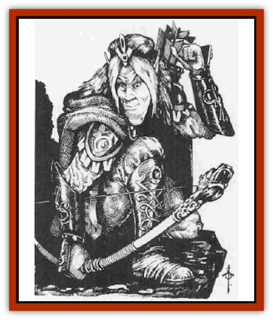

# Elf - Rockseer

| Statistic | **Elf, Rockseer** |
| --- | --- |
| **Activity Cycle:** | Any (night) |
| **Alignment:** | Neutral |
| **Armor Class:** | 4 (10) |
| **Climate/Terrain:** | Subterranean |
| **Damage/Attack:** | By weapon |
| **Diet:** | Omnivore |
| **Frequency:** | Very rare |
| **Hit Dice:** | 1+1 and up |
| **Intelligence:** | High to Supra-genius (14-20) |
| **Magic Resistance:** | 50% vs. Earth magic |
| **Morale:** | Champion (15-16) |
| **Movement:** | 12 |
| **No. Appearing:** | 5-20 (100 in lair) |
| **No. of Attacks:** | 1 |
| **Organization:** | Tribal |
| **Size:** | M (7') |
| **Special Attacks:** | +1 with long sword |
| **Special Defenses:** | <i>Meld into stone</i>, immune to petrification, 90% resistance to <i>sleep</i>, <i>charm</i>, <i>hold</i>, and <i>web</i>, communal powers |
| **THAC0:** | 19 or better |
| **Treasure:** | M + 1 jewelry (U,W) |
| **XP Value:** | Variable (420+) |

Rockseer elves are the rarest of all elvenkind. They are far taller than most of their kin, with a few reaching almost eight feet in height. An average weight for a Rockseer is between 120 and 140 pounds, with little gender difference. Rockseers are very pale-skinned, and they have no body hair. Head hair is extraordinarily fine, always worn long, with the appearance and texture of exquisitely fine silk. The hair is silver, and eye color is invariant: a pale, almost ice-blue. They are androgynous in appearance, making it difficult for outsiders to tell males and females apart.

Rockseers have been separated from the rest of elvenkind sin� mythic times. Their own history tells that they were cowards at the great battle of Corellon Larethian and Lolth, fleeing the combat and taking refuge far below ground. They have no knowledge of surface elves. They know of the [[Elf_Drow|drow]] and hate them, avoiding them whenever possible. They are extremly seclusive and shun the company of all other races, including the [[Gnome|svirfneblin]]. The only exception to this are [[Elemental_Earth_Kin|pech]], with whom Rockseers sometimes form friendships.

Rockseers dress very plainly in cloaks and garments which blend in with their surroundings, brown and gray being the favored colors. These garments are woven from tough fungal fibers, but such is their craftsmanship that they appear almost to be normal clothing. Treatment with plant extracts renders them waterproof and relatively fire resistant. In contrast with this plain garb, they wear rich jewelry, usually of gold and silver and always set with gems.

**Combat:** Rockseers eschew fighting whenever possible. They are too few in number to risk pointless deaths. Their underground special skills are so great that they can generally escape combat when they wish to; they are rarely even seen by potential aggressors. If forced to fight, Rockseers are unflinching. They always fight to the death to defend others of their own kind. They rarely possess bows (suitable bowstrings are difficult to come by in the Underdark) and prize such items, but they employ swords, spears, and stone quarterstaves which are hard as any steel.

The special attacks and defenses of these elves are formidable. They gain a +1 bonus to attack rolls with long swords (but not with bows). They are 90% resistant to *sleep*, *charm*, *hold*, and *web* spells and wholly immune to petrification. They have 50% magic resistance against all Elemental Earth spells but suffer a -1 penalty on saving throws against Elemental Air spells.

Rockseers are armed with long swords (50%), long sword and dagger (25%), or long sword and short sword (25%). Weapon possession is also variable depending on class type. Missile weapons, save for the rarely employed staff-sling or bow, are not favored by Rockseers. If they have enough distance to use missile attacks, they have enough distance to use spells or simply to *meld into stone* and escape.

Every Rockseer has the ability to *meld into stone* from childhood. This talent is usable thrice per day until the Rockseer reaches maturity (at the age of 60 to 70 years), after which time it is usable at will. Rockseers who are of 3rd or higher level can *stone walk* (walking through stone as if through air) for a total distance of 100 yards once per day; this distance increases by 100 yards for eech additional level gained. A Rockseer of 9th level can take one additional human-sized creature with him or her on such a *stone walk*; this number increases at the rate of one passenger per level beyond 9th (thus at 10th level the Rockseer could take two companions). Rockseers intuitively sense distances between passages and caverns separated by walls, so that they always know whether a *stone walk* can take them to a safe place or whether they might be trapped in solid stone at the end of the walk. Rockseers of 5th and higher levels can *stone shape* once per day, and those of 9th or higher level can employ *stone tell* once per day.

Rockseers also have communal powers. A group of three or more Rockseers with a total of 10 or more experience levels can create a *wall of stone* at will, and a group of five or more with a total of 20 or more experience levels can conjure a huge [[Elemental_Air_Earth|earth elemental]] once per day (that is, any Rockseer who participates in such a conjuration cannot do so again until the next day). This elemental has 20 HD and at least 5 hp per die, and it cannot be turned back against its summoners. Spell effects are considered to be at the aggregate experience level of the Rockseer group for the purposes of dispelling the elemental.

Rockseer can be warriors, wizards, thieves, warrior-thieves, or warrior-wizards. There is no priest class (the elves believe themselves to be shunned by the elven Powers for their cowardice, and tales of the Powers are all but forgotten by these people. As warriors, they can attain 11th experience level maximum. As thieves, they can attain 13th level maximum. As wizards, Rockseers can attain 18th level maximum.

Rockseer wizards (single-classed only) gain special bonus spells as they gain experience levels. At 5th level, they can memorize Melf's acid arrow as an additional spell. At 9th level, Maximilian's stony grasp* is the bonus spell. At 15th level, a Rockseer wizard gains a bonus acid storm* spell (these latter two spells are found in the Tome of Magic book). Rockseer wizards also add 1% per level to their magic resistance against Elemental Earth spells, and if they cast such spells at others not of their own kind, the target incurs a saving throw penalty of -1 per five levels of the Rockseer (round fractions above one-half upwards). Rockseer wizards can cast all priest Elemental Earth spells as if wizard spells of the same level.

Rockseer wizards of 11th and higher level know the secrets of creating magical "familiars" (more correctly, golem-like constructs) called stone dragonets. These incrdibly intricate slender stone statuettes are 12 inches long plus an additional 9 inches to 12 inches of tail; they move as if perfectly articulated, and the finest of them have gems of extraordinary kind as eyes. A stone dragonet has AC -2. HD 2, hp 16, and attacks three times per round for 1d3/1d3/1d4 (claw/claw/bite). It has 25% general magic resistance, 75% resistance to Elemental Earth spells, and complete immunity to petrification (obviously), illusions, gaseous attacks, poison, paralyzation, and spells which affect corporeal bodies generally. A wizard with such a familiar gains a -2 bonus to his or her own Armor Clas and cannot be surprised. If the gem-eyes of the statuette are each of value not less than 5,000 gp, the eyes of the dragonet can cast a brilliant eyebite glare once per day if the correct spells are cast during the creation of the familiar.

Rockseer elves have 240-foot infravision. They do not, as a rule, possess many magical items. Nonwizards have but a 5% chance per level of owning a magical weapon. Wizards have a 10% chance p+r level of owning a magical item of appropriate kind, but these are often powerful indeed. The greatest wizards are reputed to possess special wands of steam and vapor which create acrid clouds of burning, blinding acid (6d6 points of damage the first round, 4d6 the second, and 2d6 the third and final).

On account of their longevity (they have a natural lifespan of over 1,400 years), groups of Rockseers are almost alw3ys led by an experienced veteran, a warrior or warrior-wizard of at least 5th (or 4th/4th) level. A sizeable group (30 or more) will have at least one warrior of 7th to 10th level (6+1d4) and also a wizard of 7th to 12th level (6+1d6). In the central lair of a Rockseer clan, where up to a hundred may be gathered together, thc clan chieftain is usually a wizard of surpassing skill (level 12+1d6) and hass 1d3+2 advisers/bodyguards who are either (50%) warriors of 10th to 11th level or wizards of 11th to 14th level (but not of higher level than the chieftain).

Rockseer elves have a -1 penalty to their initial Strength, Constitution, and Charirma scores, but they gain +1 bonuses to Wisdom, Intelligence, and Dexterity.

**Habitat/Society:** Rockseers believe that all they have is themselves and the riches of the earth. They are powerfully cohesive socially. Chieftains are generally elected by a conclave of the most powerful warriors and wizards on the death of the previous Ieader. A wise Rockseer leader does not give orders without consulting his or her advisors. Rockseers do not tolerate tyrannical leadership, nor do they suffer fools.

The lairs of Rockseers are supremely well disguised and warded. Multiple spells are always cunningly placed to prevent other creatnres even suspecting the existence of such a network of caverns and passages, let alone entering them. Spies (usually thieves melding into stone) are always placed to watch out over areas close to the entry points of caverns. Some Rockseers live in caverns accessible only by *stone walking* or similar magic, where hundreds of feet of solid rock separate them from the outside world, with only small fissures to provide air.

Rockseers are highly unusual among elves in that they have little curiosity. Few among them have any desire to learn the ways of other folk. This is largely the legacy of a long historical sense of shame at their mythic history; they consider themselves tainted and instinctively avoid those who they think would condemn them. Once awakened, however, their curiosity can lead them to act in uncharacteristic ways, as those who stumble upon them will soon discover.

Rockseers are gem cutters and craftsmen almost without equal; even gnomes and dwarves would hesitate to claim they could better Rockseer work. They can almost scent gemlodes deep in the Underdark and think nothing of spending ten years crafting and sculpting a single gem. The truly great Rockseer wizard-artisans are able to sculpt a gem with magic into forms of almost painfully exquisite beauty, generating fractal patterns of brilliant color and radiance within the heart of the gem as it grows. A handful of such perfectly crafted gems can be used to create a helm of brilliance (divide all gem numbers required by five, and each gem can fulfil its function five times before becoming nomagical).

Rockseers are strange, alien, and fey people even by the standards of elvenkind. They are a serious people with little of the light-hearted, frolicking, bantering ways of most elves. They speak their own dialect of elvish, which high or grey elves can understand 50% of the time and drow 30% of the time. They also know fragments of svirfneblin, and most can speak pech. A few have a smattering of underdark-dwarven and can communicate with derro or duergar (not that they would wish to do so, but it is useful for intelligence-gathering). Above all, they are totally isolated. They know nothing of what has transpired above ground for thousands of years. Their attitudes to surface elves are very ambivalent. All Rockseers feel a deep sense of shame for the deeds of their far-distant ancestors and assume that any surface elf they meet would automatically despise them; it will be very difficult for a visitor to convince them otherwise. On the other hand, they long to know what their brethren lost for so many lifetimes do, how they live, what they believe in, what they consider beautiful.

**Ecology:** Rockseers hardly interact with anyone else in the Underdark. They eat fungi, moss, lichens, and cave creatures such as lizards and eels. They avoid violence and the endless struggle between different factions in the Underdark and keep to themselves. They are calm, enigmatic, and extraordinarily hard for outsiders to understand.

---
## Discovery & Documentation

**Source Publication:** Monstrous Compendium, 1996 Annual, Volume 3 (1995)
**Campaign Setting:** Advanced Dungeons & Dragons 2nd Edition
**Author(s):** Jon Pickens

### Other Creatures Found in This Source Book
   * [[Alaghi|Alaghi]]
   * [[Alhoon|Alhoon]]
   * [[Aranea_Savage_Coast|Aranea (Savage Coast)]]
   * [[Arcane_Head|Arcane Head]]
   * [[Banedead|Banedead]]
   * [[Banelich|Banelich]]
   * [[Bat_Bonebat|Bat, Bonebat]]
   * [[Beetle|Beetle]]
   * [[Belgoi|Belgoi]]
   * [[Bladeling|Bladeling]]
   * [[Braxat|Braxat]]
   * [[Bunyip|Bunyip]]
   * [[Burbur|Burbur]]
   * [[Bvanen|Bvanen]]
   * [[Cat_Great_Snow_Tiger|Cat, Great, Snow Tiger]]
   * [[Chosen_One|Chosen One]]
   * [[Chronovoid|Chronovoid]]
   * [[Cildabrin|Cildabrin]]
   * [[Coffer_Corpse|Coffer Corpse]]
   * [[Disenchanter|Disenchanter]]
   * [[Dog_Temporal|Dog, Temporal]]
   * [[Dragon_Cerilia|Dragon (Cerilia)]]
   * [[Dragon_Ghost|Dragon, Ghost]]
   * [[Dragon_Lesser_Undead|Dragon, Lesser Undead]]
   * [[Dragon_Neutral_Amber|Dragon, Neutral, Amber]]
   * [[Dread_Warrior|Dread Warrior]]
   * [[Dreamweaver|Dreamweaver]]
   * [[Dream_Spawn_Greater_Ennui|Dream Spawn, Greater, Ennui]]
   * [[Dream_Spawn_Lesser_Morph|Dream Spawn, Lesser, Morph]]
   * [[Dwarf_Arctic|Dwarf, Arctic]]
   * [[Dwarf_Urdunnir|Dwarf, Urdunnir]]
   * [[Eel_Giant_Moray|Eel, Giant Moray]]
   * [[Elemental_Fire_Kin_Tome_Guardian|Elemental, Fire Kin, Tome Guardian]]
   * [[Ethyk|Ethyk]]
   * [[Faerie_Faerie_Fiddler|Faerie, Faerie Fiddler]]
   * [[Faerie_Petty_Bramble|Faerie, Petty, Bramble]]
   * [[Faerie_Petty_Gorse|Faerie, Petty, Gorse]]
   * [[Faerie_Petty|Faerie, Petty]]
   * [[Firenewt|Firenewt]]
   * [[Formian|Formian]]
   * [[Gargoyle_II|Gargoyle II]]
   * [[Giant_Cerilia|Giant (Cerilia)]]
   * [[Goblin_Cerilia|Goblin (Cerilia)]]
   * [[Golem_Magic|Golem, Magic]]
   * [[Golem_Shaboath|Golem, Shaboath]]
   * [[Hag_Bheur|Hag, Bheur]]
   * [[Hamadryad|Hamadryad]]
   * [[Hound_of_Ill-Omen|Hound of Ill-Omen]]
   * [[Human_Cerilia|Human (Cerilia)]]
   * [[Hybsil|Hybsil]]
   * [[Ibrandlin|Ibrandlin]]
   * [[Imp_Chaos|Imp, Chaos]]
   * [[Ixitxachitl_Ixzan|Ixitxachitl, Ixzan]]
   * [[Jabberwock|Jabberwock]]
   * [[Kyton|Kyton]]
   * [[Kyuss_Son_of|Kyuss, Son of]]
   * [[Lillend|Lillend]]
   * [[Life-Shaped_Creation_Guardian|Life-Shaped Creation, Guardian]]
   * [[Life-Shaped_Creation_Transport|Life-Shaped Creation, Transport]]
   * [[Lycanthrope_Werecrocodile|Lycanthrope, Werecrocodile]]
   * [[Lycanthrope_Werespider|Lycanthrope, Werespider]]
   * [[Magedoom|Magedoom]]
   * [[Manotaur|Manotaur]]
   * [[Mastiff_Shadow|Mastiff, Shadow]]
   * [[Meazel|Meazel]]
   * [[Mist_Scarlet_Dancer|Mist, Scarlet Dancer]]
   * [[Needleman|Needleman]]
   * [[Orc_Neo-Orog|Orc, Neo-Orog]]
   * [[Orc_Ondonti|Orc, Ondonti]]
   * [[Owlbear_II|Owlbear II]]
   * [[Pegataur|Pegataur]]
   * [[Phaerimm|Phaerimm]]
   * [[Reggelid|Reggelid]]
   * [[Render|Render]]
   * [[Saurial|Saurial]]
   * [[Scalamagdrion|Scalamagdrion]]
   * [[Sharn|Sharn]]
   * [[Snake_Messenger|Snake, Messenger]]
   * [[Spirit_Forest_Uthraki|Spirit, Forest, Uthraki]]
   * [[Spirit_Forest_Wood_Man|Spirit, Forest, Wood Man]]
   * [[Spirit_Ice_Orglash|Spirit, Ice, Orglash]]
   * [[Spirit_Rock_Thomil|Spirit, Rock, Thomil]]
   * [[Strider_Giant|Strider, Giant]]
   * [[Tembo|Tembo]]
   * [[Temporal_Glider|Temporal Glider]]
   * [[Temporal_Stalker|Temporal Stalker]]
   * [[Tether_Beast|Tether Beast]]
   * [[Thessalmonster|Thessalmonster]]
   * [[Time_Dimensional|Time Dimensional]]
   * [[Tomb_Tapper|Tomb Tapper]]
   * [[Undead_Dragon_Slayer|Undead Dragon Slayer]]
   * [[Unicorn_Black_Toril|Unicorn, Black (Toril)]]
   * [[Vaath|Vaath]]
   * [[Vortex_Spider|Vortex Spider]]
   * [[Weredragon|Weredragon]]
   * [[Zhentarim_Spirit|Zhentarim Spirit]]
