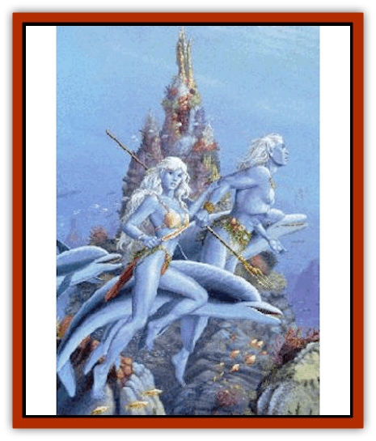

# Elf - Sea - Dargonesti

| Statistic | **Elf, Sea, Dargonesti** |
| --- | --- |
| **Activity Cycle:** | Any |
| **Alignment:** | Varies, but usually chaotic or lawful good |
| **Armor Class:** | 8 (10) |
| **Climate/Terrain:** | Tropical, subtropical, and temperate/Ocean |
| **Damage/Attack:** | 1-10 (weapon) |
| **Diet:** | Omnivore |
| **Frequency:** | Very rare |
| **Hit Dice:** | 1+1 |
| **Intelligence:** | Varies (7-18) |
| **Magic Resistance:** | See below |
| **Morale:** | Elite (13) |
| **Movement:** | 9, Sw 15 (or 30 as dolphin) |
| **No. Appearing:** | 10-40 |
| **No. of Attacks:** | 1 |
| **Organization:** | Clan |
| **Size:** | M (5' tall) |
| **Special Attacks:** | See below |
| **Special Defenses:** | See below |
| **THAC0:** | 19 (18) |
| **Treasure:** | F, S in lair |
| **XP Value:** | Varies |

Dargonesti are a race of shy and reclusive sea elves, also known as Deep Elves.

Dargonesti have slender bodies with long, webbed fingers and toes. They have large violet eyes, dark blue skin, and hair the color of seaweed. They wear diaphanous gowns and adorn themselves with jewelry made of sea shells. They can breathe both air and water.

Dargonesti avoid all contact with other races, finding them vulgar and violent. Dargonesti are cordial but wary. Those who befriend them find Dargonesti to be loyal companions.

**Combat:** Dargonesti are repulsed by the violence of war and engage in combat only when absolutely necessary.

Dargonesti have the ability to shapechange at will into [[Dolphin|dolphin]] form. They use their dolphin form to investigate potential combat situations and to escape from danger. Dargonesti can shape-change three times per day, the transformation takes one round. Though a Dargonesti loses his spellcasting abilities when shape-changed, he gains the movement rate and special abilities of a dolphin.

Magic-using Dargonesti use spells to confuse or weaken their opponents before engaging in melee combat. All Dargonesti gain two 1st-level and one 2nd-level wizard spells when they reach the 10th level; if the Dargonesti is already a wizard, these spells are in addition to those he already knows. The most commonly received spells are *color spray*, *dancing lights*, *blur*, *darkness 15' radius*, and *mirror image*. The gained spells are innate, not memorized.

Dargonesti wear leather-like armor which does not impede their ability to swim. Preferred weapons include daggers, lances, and tridents.

**Habitat/Society:** Dargonesti were originally elven mariners with a great love of the sea. They eventually became dwellers in the ocean. Just as the [[Elf_High_Qualinesti|Qualinesti]] separated from the [[Elf_High_Silvanesti|Silvanesti]] over a disagreement about their rigid social system, so did the Dargonesti break from their cousins, the [[Elf_Sea_Dimernesti|Dimernesti]], to form their own society. The Dargonesti have cut all ties with the surface world.

Dargonesti make their lairs in underwater caves, sunken cities, and in huge, seashell citadels. Their numbers are few, and most prefer to live alone with their families instead of in large cities. A typical group of 20 Dargonesti includes a mix of all available classes and levels, with about 50% being females and children, and including at least one 5th-level or higher fighter, and two 2nd- to 4th-level fighters.

Dargonesti clans make decisions by consensus. The leader of all the clans is called the Speaker of the Moon, but no Dargonesti has yet risen to claim the position.

**Ecology:** Dargonesti are on good terms with all sea creatures. The sole exceptions are [[Shark|sharks]] and [[Sahuagin|sahuagin]], which the Dargonesti go out of their way to destroy. Dargonesti are cool toward the Dimernesti.

---
## Discovery & Documentation

**Source Publication:** MC4 Dragonlance Appendix (w/binder #2) (1989)
**Campaign Setting:** Dragonlance
**Author(s):** Rick Swan

### Other Creatures Found in This Source Book
   * [[Anemone_Giant_Sea|Anemone, Giant Sea]]
   * [[Bear_Ice|Bear, Ice]]
   * [[Beast_Undead|Beast, Undead]]
   * [[Bird_Krynn|Bird (Krynn)]]
   * [[Disir|Disir]]
   * [[Draconian_Aurak|Draconian, Aurak]]
   * [[Draconian_Baaz|Draconian, Baaz]]
   * [[Draconian_Bozak|Draconian, Bozak]]
   * [[Draconian_Kapak|Draconian, Kapak]]
   * [[Draconian_General_Information|Draconian, General Information]]
   * [[Draconian_Sivak|Draconian, Sivak]]
   * [[Draconian_Proto-_Traag|Draconian, Proto-, Traag]]
   * [[Dragon_Amphi|Dragon, Amphi]]
   * [[Dragon_Astral|Dragon, Astral]]
   * [[Dragon_Kodragon|Dragon, Kodragon]]
   * [[Dragon_Krynn_Othlorx_General_Information|Dragon (Krynn), Othlorx, General Information]]
   * [[Dragon_Krynn_General_Information|Dragon (Krynn), General Information]]
   * [[Dragon_Sea|Dragon, Sea]]
   * [[Dreamshadow|Dreamshadow]]
   * [[Dreamwraith|Dreamwraith]]
   * [[Dwarf_Daergar|Dwarf, Daergar]]
   * [[Dwarf_Hill_Neidar|Dwarf, Hill, Neidar]]
   * [[Dwarf_Mountain_Hylar|Dwarf, Mountain, Hylar]]
   * [[Dwarf_Theiwar|Dwarf, Theiwar]]
   * [[Dwarf_Zakhar|Dwarf, Zakhar]]
   * [[Elf_Half-|Elf, Half-]]
   * [[Elf_High_Qualinesti|Elf, High, Qualinesti]]
   * [[Elf_High_Silvanesti|Elf, High, Silvanesti]]
   * [[Elf_Sea_Dimernesti|Elf, Sea, Dimernesti]]
   * [[Elf_Wild_Kagonesti|Elf, Wild, Kagonesti]]
   * [[Eyewing|Eyewing]]
   * [[Fetch|Fetch]]
   * [[Fire_Minion|Fire Minion]]
   * [[Fireshadow|Fireshadow]]
   * [[Gnome_Tinker|Gnome, Tinker]]
   * [[Gurik_Cha'ahl|Gurik Cha'ahl]]
   * [[Haunt_Knight|Haunt, Knight]]
   * [[Horax|Horax]]
   * [[Human_Krynn|Human (Krynn)]]
   * [[Imp_Blood_Sea|Imp, Blood Sea]]
   * [[Kalothagh|Kalothagh]]
   * [[Kani_Doll|Kani Doll]]
   * [[Kender|Kender]]
   * [[Kyrie|Kyrie]]
   * [[Lizard_Man_Krynn|Lizard Man (Krynn)]]
   * [[Minotaur_Krynn|Minotaur, Krynn]]
   * [[Ogre_High|Ogre, High]]
   * [[Ogre_Krynn|Ogre (Krynn)]]
   * [[Phaethon|Phaethon]]
   * [[Saqualaminoi|Saqualaminoi]]
   * [[Shadowperson|Shadowperson]]
   * [[Shimmerweed|Shimmerweed]]
   * [[Skrit|Skrit]]
   * [[Spectral_Minion|Spectral Minion]]
   * [[Spider_Krynn|Spider (Krynn)]]
   * [[Stag|Stag]]
   * [[Tayling|Tayling]]
   * [[Thanoi|Thanoi]]
   * [[Tylor|Tylor]]
   * [[Wichtlin|Wichtlin]]
   * [[Wyndlass|Wyndlass]]
   * [[Yaggol|Yaggol]]
