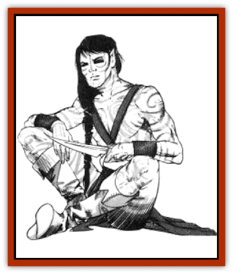

# Elf - Wild - Kagonesti

| Statistic | **Elf, Wild, Kagonesti** |
| --- | --- |
| **Activity Cycle:** | Any |
| **Alignment:** | Varies, but usually chaotic or neutral good |
| **Armor Class:** | 8 (10) |
| **Climate/Terrain:** | Tropical, subtropical, and temperate/Forests and plains |
| **Damage/Attack:** | 1-10 (weapon) |
| **Diet:** | Omnivore |
| **Frequency:** | Very rare |
| **Hit Dice:** | 1+1 |
| **Intelligence:** | Varies (3-12) |
| **Magic Resistance:** | See below |
| **Morale:** | Elite (12) |
| **Movement:** | 12 (or 15 if sprinting) |
| **No. Appearing:** | 20-200 |
| **No. of Attacks:** | 1 |
| **Organization:** | Tribe |
| **Size:** | M (5' tall) |
| **Special Attacks:** | See below |
| **Special Defenses:** | See below |
| **THAC0:** | 19 (18) |
| **Treasure:** | R, (S) |
| **XP Value:** | Varies |

Kagonesti (Wild Elves) rejected the civilized trappings of their cousins, the [[Elf_High_Qualinesti|Qualinesti]] and [[Elf_High_Silvanesti|Silvanesti]], to establish their own wilderness settlements.

Kagonesti are about the same size as the Qualinesti and Silvanesti, but they are much more muscular. Their skin is dark brown, and they draw designs on their faces and exposed skin with clay and paints. Their hair is dark, ranging from black to light brown, and occasionally silvery white. Their eyes are hazel. They wear fringed leather clothes decorated with feathers; they proudly display beautiful necklaces and bracelets made of silver and turquoise.

Kagonesti believe that harmony with nature is the key to a full and happy life. They are fiercely proud of their heritage. Compared to the stoic Silvanesti, Kagonesti are hot-tempered and passionate.

**Combat:** While Kagonesti do not initiate wars or attack strangers, they are by no means pacifists.

The Kagonesti's movement rate increases to 15 when they sprint in a straight line. Among their favorite weapons are war hammers, slings, and bows of all sizes. They wear leather armor and have been known to ride bareback on tame stags (in any given group of Kagonesti, 20% are riding stags).

**Habitat/Society:** Kagonesti have no permanent settlements. Their villages are temporary structures of animal hide and light wood, using the boughs of living trees to aid in construction and camouflage. Each village is home to a tribe of several interrelated families. About 70% of the tribe are fighters of various levels, the remainder are 0-level workers and children. The tribe centers around the chief - the oldest and wisest member - and his family. The chief makes all decisions for the tribe.

Kagonesti have a more animistic view of the cosmos than most other races. To honor their dead, Kagonesti float the bodies in canoes, sending them to the open sea. These beliefs have led outsiders to regard the Kagonesti as savages; in fact, their traditions have ancient, sacred roots.

**Ecology:** In spite of the wild elves' peaceful acceptance of most other races, their animosity toward the Silvanesti and Qualinesti runs deep. During the War of the Lance, the displaced Silvanesti invaded the Kagonesti homelands, eventually subjugating them as slaves. The coming of the Qualinesti initiated further destruction of the Kagonesti's lands

Kagonesti have cordial relationships with many human villages. They keep deer and dogs for pets, and eat a variety of fruits, vegetables, and wild game.

---
## Discovery & Documentation

**Source Publication:** MC4 Dragonlance Appendix (w/binder #2) (1989)
**Campaign Setting:** Dragonlance
**Author(s):** Rick Swan

### Other Creatures Found in This Source Book
   * [[Anemone_Giant_Sea|Anemone, Giant Sea]]
   * [[Bear_Ice|Bear, Ice]]
   * [[Beast_Undead|Beast, Undead]]
   * [[Bird_Krynn|Bird (Krynn)]]
   * [[Disir|Disir]]
   * [[Draconian_Aurak|Draconian, Aurak]]
   * [[Draconian_Baaz|Draconian, Baaz]]
   * [[Draconian_Bozak|Draconian, Bozak]]
   * [[Draconian_Kapak|Draconian, Kapak]]
   * [[Draconian_General_Information|Draconian, General Information]]
   * [[Draconian_Sivak|Draconian, Sivak]]
   * [[Draconian_Proto-_Traag|Draconian, Proto-, Traag]]
   * [[Dragon_Amphi|Dragon, Amphi]]
   * [[Dragon_Astral|Dragon, Astral]]
   * [[Dragon_Kodragon|Dragon, Kodragon]]
   * [[Dragon_Krynn_Othlorx_General_Information|Dragon (Krynn), Othlorx, General Information]]
   * [[Dragon_Krynn_General_Information|Dragon (Krynn), General Information]]
   * [[Dragon_Sea|Dragon, Sea]]
   * [[Dreamshadow|Dreamshadow]]
   * [[Dreamwraith|Dreamwraith]]
   * [[Dwarf_Daergar|Dwarf, Daergar]]
   * [[Dwarf_Hill_Neidar|Dwarf, Hill, Neidar]]
   * [[Dwarf_Mountain_Hylar|Dwarf, Mountain, Hylar]]
   * [[Dwarf_Theiwar|Dwarf, Theiwar]]
   * [[Dwarf_Zakhar|Dwarf, Zakhar]]
   * [[Elf_Half-|Elf, Half-]]
   * [[Elf_High_Qualinesti|Elf, High, Qualinesti]]
   * [[Elf_High_Silvanesti|Elf, High, Silvanesti]]
   * [[Elf_Sea_Dargonesti|Elf, Sea, Dargonesti]]
   * [[Elf_Sea_Dimernesti|Elf, Sea, Dimernesti]]
   * [[Eyewing|Eyewing]]
   * [[Fetch|Fetch]]
   * [[Fire_Minion|Fire Minion]]
   * [[Fireshadow|Fireshadow]]
   * [[Gnome_Tinker|Gnome, Tinker]]
   * [[Gurik_Cha'ahl|Gurik Cha'ahl]]
   * [[Haunt_Knight|Haunt, Knight]]
   * [[Horax|Horax]]
   * [[Human_Krynn|Human (Krynn)]]
   * [[Imp_Blood_Sea|Imp, Blood Sea]]
   * [[Kalothagh|Kalothagh]]
   * [[Kani_Doll|Kani Doll]]
   * [[Kender|Kender]]
   * [[Kyrie|Kyrie]]
   * [[Lizard_Man_Krynn|Lizard Man (Krynn)]]
   * [[Minotaur_Krynn|Minotaur, Krynn]]
   * [[Ogre_High|Ogre, High]]
   * [[Ogre_Krynn|Ogre (Krynn)]]
   * [[Phaethon|Phaethon]]
   * [[Saqualaminoi|Saqualaminoi]]
   * [[Shadowperson|Shadowperson]]
   * [[Shimmerweed|Shimmerweed]]
   * [[Skrit|Skrit]]
   * [[Spectral_Minion|Spectral Minion]]
   * [[Spider_Krynn|Spider (Krynn)]]
   * [[Stag|Stag]]
   * [[Tayling|Tayling]]
   * [[Thanoi|Thanoi]]
   * [[Tylor|Tylor]]
   * [[Wichtlin|Wichtlin]]
   * [[Wyndlass|Wyndlass]]
   * [[Yaggol|Yaggol]]
