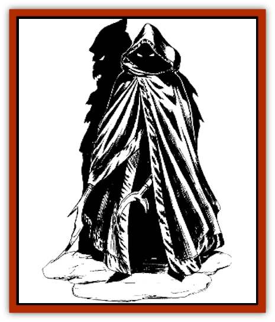
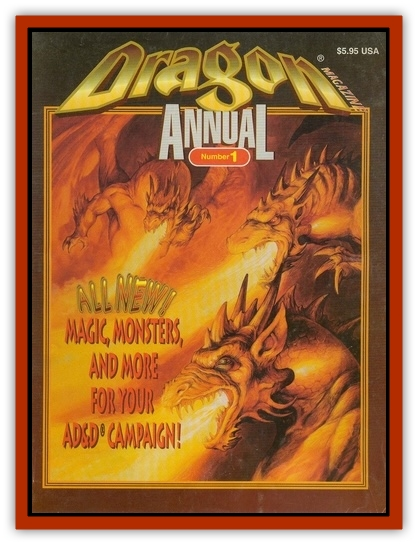

# Elghonn

| Statistic | **Elghonn** |
| --- | --- |
| **Activity Cycle:** | Any |
| **Alignment:** | Chaotic evil |
| **Armor Class:** | 1 |
| **Climate/Terrain:** | Underdark |
| **Damage/Attack:** | By weapon type |
| **Diet:** | Unknown |
| **Frequency:** | Unique |
| **Hit Dice:** | 15 (125 hit points) |
| **Intelligence:** | Genius (17-18) |
| **Magic Resistance:** | 65% |
| **Morale:** | Fanatic (18) |
| **Movement:** | 16 |
| **No. Appearing:** | 1 |
| **No. of Attacks:** | 4 |
| **Organization:** | Solitary |
| **Size:** | M (7' tall) |
| **Special Attacks:** | Use poisons, rogue skills, see below |
| **Special Defenses:** | Regeneration, +2 or greater weapons to hit |
| **THAC0:** | 5 |
| **Treasure:** | Incidental |
| **XP Value:** | 15,000 |

The elghonn is one of the most powerful predators of the Underdark. Not much is known about this legendary creature. Its name stems from the [[Elf_Drow|drow]] word elghinn, meaning death, for this is surely what the hunter leaves in its wake. Some scholars dismiss the elghonn as nothing more than a mythological construct. Those actually living in the Underdark, however, know that this creature is death personified; even the drow matriarchs of Menzoberranzan fearfully whisper its name.

Those who claim to have caught a glimpse of the creature can describe only a mysterious being wrapped in dark, voluminous robes. These robes hide almost all of its horrifying features, though one overly boastful fool claimed to have looked the creature in its cold red eyes. The elghonn caries a terrifying arsenal of weapons designed to inflict great pain and, ultimately, to kill.

**Combat:** The elghonn is a relentless hunter, using all of its heightened senses to track prey. These almost supernatural senses allow the predator to "see" invisible and astral objects and persons. In addition, the elghonn suffers no penalty when fighting in normal or magical darkness.

The elghonn is a creature of the shadows; as such, it has a 75% chance to Move Silently and an 85% chance to Hide in Shadows. It uses these almost constantly when hunting. Often, the elghinn trails its prey for several days, revealing itself briefly to its victim before melting back into the shadows.

As the elghonn enjoys sensing fear in its prey, it often employs a debilitating poison brewed from several Underdark fungi. This poison gradually weakens the prey, reducing Strength, Dexterity, and Constitution scores by 2 points every hour. The victim must make a saving throw vs. poison to resist the effects of the elghonn's debilitating concoction when it is first injected (usually by means of a crossbow bolt or other missile weapon). Poisoned prey eventually fall to the ground, paralyzed but fully conscious, when any one of their three ability scores falls to 0.

The Elghonn is a deadly fighter, and it employs a wide variety of weapons (left up to the DM) in combat; these weapons are usually magical in nature. One of the elghonn's favorites is blackadder, a long sword +2, lifestealer. The Elghonn can strike up to four times In a single combat round and can wield a different weapon in each hand.

In addition to its offensive capability, the creature also possesses a number of special defenses. The Elghonn may only be struck by weapons of +2 or greater enchantment; normal swords and lesser magical weapons have absolutely no effect on the creature. Furthermore, the elghonn regenerates 1 d6 hp every round.

**Habitat/Society:** The elghonn constantly wanders the caverns of the Underdark in search of prey. It is not known whether the creature has a central lair from which it sets out. If such a lair exists, it is surely a place of unspeakable evil.

**Ecology:** All living creatures of the Underdark exist as prey for the elghonn. So far, it has never exhibited any preference as to who or what it stalks. Curiously enough, the elghonn never consumes its prey after the kill; however, dead victims of the predator are always found with expressions of horror on their faces. Some scholars suggest that the elghonn may be an agent of some dark deity or perhaps even an avatar of some forgotten god. Unfortunately, no one has been able to substantiate this theory; the last several sages who entered the Underdark to unearth some information on this creature have never returned.

---
## Discovery & Documentation

**Source Publication:** Dragon Magazine Annual 1 - 1996 (1996)
**Campaign Setting:** Dragon Magazine
**Author(s):** Keith Strohm, James Holloway

### Other Creatures Found in This Source Book
   * [[Bulette_Gohlbrorn|Bulette, Gohlbrorn]]
   * [[Mold_Chromatic|Mold, Chromatic]]
   * [[Varkha|Varkha]]
   * [[Worm_Lukhorn|Worm, Lukhorn]]
