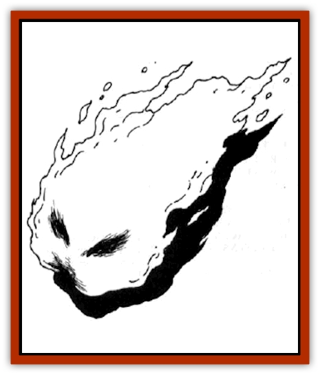

# Elmarin

| Statistic | **Elmarin** |
| --- | --- |
| **Activity Cycle:** | Any |
| **Alignment:** | Neutral |
| **Armor Class:** | 4 |
| **Climate/Terrain:** | Wildspace only |
| **Damage/Attack:** | 1-8 |
| **Diet:** | Warmth |
| **Frequency:** | Rare |
| **Hit Dice:** | 5, 7, or 9 |
| **Intelligence:** | Animal (1) |
| **Magic Resistance:** | Nil |
| **Morale:** | Unreliable (3) |
| **Movement:** | 18 |
| **No. Appearing:** | 1-10 |
| **No. of Attacks:** | 1 |
| **Organization:** | Pack |
| **Size:** | S (4' across) |
| **Special Attacks:** | Burns |
| **Special Defenses:** | Nil |
| **THAC0:** | 5 HD: 15 / 7 HD: 13 / 9 HD: 11 |
| **Treasure:** | None |
| **XP Value:** | 5 HD: 175 / 7 HD: 420 / 9 HD: 975 |

The creatures called elmarin resemble living St. Elmo's fire. They are semisentient fire beings that live in wildspace, usually in close proximity to fire-based celestial bodies. They appear as naturally glowing balls of fire in a number of colors, ranging from deep red to light violet. Two darker spots toward the front of the orb resemble eyes.

**Combat:** The elmarin are drawn by warmth and energy. The activity of a spelljamming ship is such to attract a pack of them to investigate. They are often more curious than harmful, zipping about the rigging and through open hatchways, bouncing off the walls and leaving large scorch marks.

Once in contact with flammables, however, they start inflicting damage. Each round, an elmarin can cause flammables within 5 feet of it to burst into flame, starting fires throughout the ship. This is unintentional on the elmarin's part, but no less damaging. If attacked, the elmarin will attempt to escape, burning through decks and wails as it can. The elmarin's fire has no effect on stone or metal.

If trapped, the elmarin will turn on its attacker and try to burn it. It will inflict 1-8 points of damage per round, and cause all burnable items (cloaks, scrolls, etc.) on the body to make a saving throw vs. fire or be destroyed.

If reduced to 0 hit points, the elmarin fades into nothingness and dies. There is a 1 in 20 chance that the death of an elmarin will leave behind an *ioun stone*.

**Habitat/Society:** Elmarin are elemental creatures of fire, with little intelligence above the animal level. They enjoy the relative coolness of space above the surface of fire-based celestial bodies (such as suns) and can often be found here dancing, bobbing, and weaving about. Ships that are attacked and damaged by the elmarin are usually the victims of the creatures' curiosity rather than maliciousness.

The size and color of an elmarin seems unrelated to its power or whether an *ioun stone* will be found after its death. Profiteering [[Gnome|gnomes]] in their steel ships sometimes cruise the upper reaches of stars looking for elmarin, willing to slay many to gain a few *ioun stones*. The sudden appearance of elmarin is a good sign to sailors trapped with a furnace drive and no magic to feed into it.

**Ecology:** The elmarin are natives of the elemental plane of fire, and as such will not leave the wildspace that they are in. Attempts to take them into the phlogiston will result in their immediate detonation, unless they are in a completely sealed box or extradimensional space. Such detonation will result in 1d8 fire damage for each hit die of the elmarin to all within 20 feet of the creature, and all flammable items in that area immediately catch fire (subject to saving throws), causing more detonations in the Flow.

Elmarin produce by fission and are sexless. They lack the ability to move at the high speeds generated by spelljamming craft, but will drop into the air envelopes and tag a ride with passing craft.

Attempts to domesticate the elmarin have failed, save for certain mages, who use special variations of spells that conjure and command elemental creatures. They are generally useless minions, and are feared even by the explosion-loving [[Giff|giff]], who at least recognize their potential for causing damage.

A legend involving elmarin goes as follows: A mage thought he had discovered a method to domesticate the elmarin and fit them into a special harness they would not burn through. He hooked the harness to a sled and commanded the elmarin to fly. This they did, on a direct course for the surface of the sun. Whether the tale is true or intended as a cautionary legend is unknown.

---
## Discovery & Documentation

**Source Publication:** AD&D Adventures In Space (1989)
**Campaign Setting:** Spelljammer
**Author(s):** Jeff Grub

### Other Creatures Found in This Source Book
   * [[Arcane|Arcane]]
   * [[Beholder_and_Beholder-kin_I|Beholder and Beholder-kin I]]
   * [[Beholder_and_Beholder-kin_II|Beholder and Beholder-kin II]]
   * [[Dracon|Dracon]]
   * [[Dragon_Radiant|Dragon, Radiant]]
   * [[Ephemeral|Ephemeral]]
   * [[Giff|Giff]]
   * [[Kindori|Kindori]]
   * [[Krajen|Krajen]]
   * [[Neogi|Neogi]]
   * [[Scavver|Scavver]]
