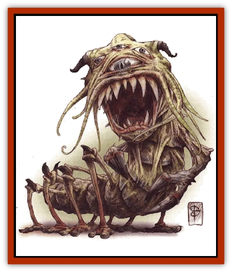

# Entrope

| Statistic | **Entrope** |
| --- | --- |
| **Activity Cycle:** | Any |
| **Alignment:** | Chaotic neutral |
| **Armor Class:** | 3 |
| **Climate/Terrain:** | Inner Planes |
| **Damage/Attack:** | 1d8/1d8/1d12 |
| **Diet:** | Planar boundaries |
| **Frequency:** | Very rare |
| **Hit Dice:** | 11+6 |
| **Intelligence:** | Low to average (7-10) |
| **Magic Resistance:** | Nil |
| **Morale:** | Fanatic (17-18) |
| **Movement:** | 12 |
| **No. Appearing:** | 1 |
| **No. of Attacks:** | 3 |
| **Organization:** | None |
| **Size:** | H (20' long) |
| **Special Attacks:** | Sunder space |
| **Special Defenses:** | Struck only by +2 or better weapons, immune to elements |
| **THAC0:** | 9 |
| **Treasure:** | Nil |
| **XP Value:** | 10,000 |

There are holes throughout the multiverse. Call them conduits, portals or any other name, they're still holes. The Inner Planes are no exception. In fact, these planes in particular are full of tiny leaks where bits of one element seep into another plane. Some graybeards theorize that one day, in the far distant reaches of the future, the borders of the Elemental Planes will completely break down and all the elements will combine. Such a thing could signal the end of the multiverse, if it's true.

The Doomguard - ever interested in entropy - decided to make sure that it *is* true and to help the process along. Hence, their magicians and alchemists began devising a means to dissolve the barriers between the Elemental Planes. Hundreds of years of research, trials, and errors took place, but eventually they succeeded. They constructed magical creatures the Sinkers named entropes. Entropes feed on whatever makes up the borders separating the various Inner Planes. As they feed, the elements of the two planes blend and "bubbles" of foreign elements are introduced into alien planes. Eventually, the Doomguard hopes, the barriers will weaken enough so that the planes constantly bleed into each other, eventually becoming indistinguishable.

The first batch of these beasts escaped Doomguard control and now wander about the Inner Planes on their own, chewing away at the fabric of reality wherever they see fit. The second group is more closely controlled.

The entropes weren't designed with aesthetics in mind: the elongated, wormlike creatures have multiple arms, eyes, and mouths. At least one set of arms is equipped with claws, and one large mouth among the rest bears a set of viciously pointed teeth.

The Doomguard saw no reason to grant their creations the power of speech or communication. Entropes do understand planar common, however, the better to follow Sinker commands.

**Combat:** Because the entrope can literally break down the fabric of reality, it's nothing to fool around with. Anywhere within the Inner Planes, the beast can "eat" through elermental borders, creating a small, temporary hole in space leading to any other Inner Plane. The rent results in a mass of the foreign element bursting into the plane with great power. While the entrope itself isn't harmed by this action, anyone within 25 feet is subject to the elemental explosion. The results depend on which plane the hole leads to (a decision made by the entrope):

<ul><li>*Air*, *Earth*, *Mineral*, *Ooze*, *Salt*, *Water*: Matter or air explodes through the hole with great force, inflicting 3d10 points of impact damage (save versus breath weapon for half). Victims must save versus breath weapon or be knocked down and/or back 10 feet; they're also stunned for 1 round afterward.</li><li>*Ash*, *Dust*, *Smoke*, *Steam*: Particulate matter bursts through the tear, inflicting 2d6 points of impact damage (save versus breath weapons for half). What's more, all victims must save versus poison or cough and choke for 1d6 rounds, incapacitated.</li><li>*Fire*, *Lightning*, *Positive Energy*, *Radiance*: Raw energy gushes through the rent, inflicting 8d6 points of damage (save versus breath weapon for half).</li><li>*Ice*, *Magma*: Energy (along with varying amounts of matter) erupts through the tear, inflicting 6d6 points of heat or cold damage (save versus breath weapon for half). Victims must save versus breath weapon or be knocked down and/or back 10 feet.</li><li>*Negative Energy*: This hole sucks the life energy from all victims, draining one experience level from each.</li><li>*Vacuum*: Matter and energy is drawn into this rent. The implosion inflicts 3d6 points of damage (save versus breath weapon for half) on victims and requires them to make a save versus death magic to avoid being pulled into the plane of Vacuum before the hole closes.</li></ul>The entrope can open these holes once every three rounds. The rest of the time, it defends itself with two huge claws (1d8 points of damage each) and a gigantic tooth-filled maw (1d12 points of damage).

The strange creature is also immune to the effects of all elements, even ignoring impact damage from thrown boulders or similar attacks. Graybeards know of only two ways to harm an entropy: strike it with a magical weapon of +2 or greater enchantment, or subject it to nonelemtntal-based spells such as *cause light wounds*, *magic missile*, and so on.

**Habitat/Society:** These petulant engines of destruction hate everything. Even the very space that they occupy annoys them. Entropes seek the annihilation of all things. Needless to say, these creatures haven't developed anything but antagonistic relations with anything that they've ever encountered, including one another. The Doomguard are able to control them only through judicious use of powerful magic.

Since the entropes can literally eat their way through to other planes and are immune to all harmful elemental effects, they can be found on any of the Inner Planes. They attempt to destroy any creature that they meet.

Fortunately, the powers of these beasts are entirely limited to the Inner Planes. Since the Outer Planes have no real "borders" as such, the entropes can't affect the planes of the Great Wheel.

**Ecology:** It's no secret that Sinkers like to watch things fall apart. More than most factions, the Doomguard has always had an interest in the Elemental Planes. Why? Probably because it's where the building blocks of the multiverse originated. What better place to watch things disintegrate?

Better yet, why not hasten things a bit?

So they did.

The creation of the entrope was a great achievement for the Doomguard. The Sinkers carried out the creatures' production and development in the faction foretress on the plane of Salt. The plan was conceived by the lord of that castle, and its completion is said to have been overseen by his great-granddaughter.

Some speculate that if the Sinkers have the knowledge and resources to create such unstoppable monstrosities, what other sorts of horrors might they have ready to unleash upon the multiverse? The dark is, though, that the creation and maintenance of the entropes is as much as the Doomguard can presently handle. It's unlikely that anyone need fear the faction producing more creatures of this sort of power and destructive capability anytime soon - though certainly, the entrope is bad enough.

---
## Discovery & Documentation

**Source Publication:** Planescape III (1996)
**Campaign Setting:** Planescape
**Author(s):** Monte Cook

### Other Creatures Found in This Source Book
   * [[Animental|Animental]]
   * [[Archomental_Evil|Archomental, Evil]]
   * [[Archomental_Good|Archomental, Good]]
   * [[Belker|Belker]]
   * [[Bzastra|Bzastra]]
   * [[Chososion|Chososion]]
   * [[Darklight|Darklight]]
   * [[Devete|Devete]]
   * [[Devourer_Planescape|Devourer (Planescape)]]
   * [[Dharum_Suhn|Dharum Suhn]]
   * [[Egarus|Egarus]]
   * [[Elemental_Athas_Lesser_Air_Earth|Elemental (Athas), Lesser, Air/Earth]]
   * [[Elemental_Athas_Lesser_Fire_Water|Elemental (Athas), Lesser, Fire/Water]]
   * [[Elemental_Fire_Kin_Salamander_II|Elemental, Fire Kin, Salamander II]]
   * [[Facet|Facet]]
   * [[Frost_Salamander|Frost Salamander]]
   * [[Fundamental_Air_Earth|Fundamental, Air/Earth]]
   * [[Fundamental_Fire_Water|Fundamental, Fire/Water]]
   * [[Fundamental_All_Elements|Fundamental, All Elements]]
   * [[Garmorm|Garmorm]]
   * [[Homunculus_Elemental|Homunculus, Elemental]]
   * [[Immoth|Immoth]]
   * [[Khargra|Khargra]]
   * [[Klyndes|Klyndes]]
   * [[Magran|Magran]]
   * [[Menglis|Menglis]]
   * [[Nathri|Nathri]]
   * [[Ooze_Sprite|Ooze Sprite]]
   * [[Paraelemental|Paraelemental]]
   * [[Phirblas|Phirblas]]
   * [[Psurlon|Psurlon]]
   * [[Quasielemental_Negative|Quasielemental, Negative]]
   * [[Quasielemental_Positive|Quasielemental, Positive]]
   * [[Rast|Rast]]
   * [[Ravid|Ravid]]
   * [[Ruvoka|Ruvoka]]
   * [[Scile|Scile]]
   * [[Shad|Shad]]
   * [[Shocker|Shocker]]
   * [[Sislan|Sislan]]
   * [[Suisseen|Suisseen]]
   * [[Terithran|Terithran]]
   * [[Thoqqua|Thoqqua]]
   * [[Trilloch|Trilloch]]
   * [[Tsnng|Tsnng]]
   * [[Ungulosin|Ungulosin]]
   * [[Vacuous|Vacuous]]
   * [[Wavefire|Wavefire]]
   * [[Xag-Ya_Xeg-Yi|Xag-Ya/Xeg-Yi]]
   * [[Xill|Xill]]
