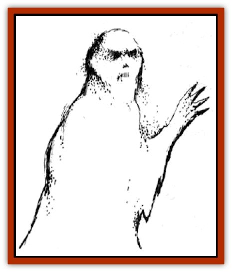

# Ephemeral

| Statistic | **Ephemeral** |
| --- | --- |
| **Activity Cycle:** | Any |
| **Alignment:** | Neutral evil |
| **Armor Class:** | 2 |
| **Climate/Terrain:** | Phlogiston only |
| **Damage/Attack:** | 1-4 |
| **Diet:** | Living beings |
| **Frequency:** | Rare |
| **Hit Dice:** | 5 |
| **Intelligence:** | Very (11) |
| **Magic Resistance:** | Nil |
| **Morale:** | Average (9) |
| **Movement:** | 18 |
| **No. Appearing:** | 1-8 |
| **No. of Attacks:** | 1 |
| **Organization:** | Solitary |
| **Size:** | M (6') |
| **Special Attacks:** | Drain Intelligence |
| **Special Defenses:** | Hit by +1 or better magical weapons, regeneration |
| **THAC0:** | 15 |
| **Treasure:** | Nil |
| **XP Value:** | 975 |

Ephemerals are noncorporeal undead believed to be the spirits of individuals who have died in the phlogiston. They appear as dusty gray humanoids, and it is thought that their forms are not only linked to the negative material plane, but also impregnated with the essence of the phlogiston itself. This makes them vulnerable to fire, but also gives them the ability to regenerate their unliving status. Ephemerals are attracted by use of magical energy, and a passing spelljammer helm might attract a group of them.

**Combat:** The touch of the ephemeral inflicts 1-4 points of damage and reduces the victim's Intelligence by 1-2 points. Should the damage inflicted by an ephemeral kill a sentient humanoid, the latter will become an ephemeral in 2-8 days. Should an ephemeral drain all the Intelligence from a sentient humanoid, the body will then become the host of the ephemeral (see below).

In hand-to-hand combat, only magical weapons have any effect on ephemerals. As undead, they are immune to *sleep*, *charm*, and *hold* spells, as well as cold-based attacks. They are vulnerable to fire, and always take maximum possible damage from a fire-based attack. However, since ephemerals are only found in the Flow, this type of attack is very risky. Ephemerals can regenerate 1 hit point every melee round by pulling the surrounding phlogiston into their bodies. If sealed off in some fashion from the Flow, they will be unable to regenerate. When an ephemeral reaches 0 hit points, it dissipates permanently.

Generally, ephemerals cannot be turned, but this is the result of the inability of clerics in the Flow to contact their patron's powers. If a priest has some form of contact with his or her power, an attempt to turn ephemerals can be made, and in this case ephemerals can be turned as spectres.

Ephemerals will attack as a pack, if possible, seeking to drain as many humanoids as possible to use as bodies. The others will be slain and cast overboard. If seriously damaged, they will break off, trailing behind the ship, and attack again when they have regained their hit points.

**Habitat/Society:** Ephemerals packs wander the phlogiston, the disembodied spirits of the dead or cursed who have perished in the Flow. Unable to reach their home and the rewards (or punishments) of their afterlife, they tend to be mean, petty spirits who exist only to eventually return to a final resting place.

The living are their vessels of return, and an ephemeral will attempt to drain the mind of a single character in order to provide itself with passage to a safe sphere. Ephemerals cannot enter the crystal spheres except when controlling a living body and, if forced to do so, they will be randomly teleported deeper into the Flow.

**Ecology:** The origin of the ephemerals is a mystery. They might be the remains of a race of beings who managed to crack their crystal shell, letting the phlogiston into their sphere. Whatever their origin, they have propagated by preying on intelligent creatures that pass through the Flow. Men, [[Mind_Flayer|mind flayers]], and [[Neogi|neogi]] have all had to battle ephemerals in their transit between the spheres.

**Ephemeral Host**

  The physical characteristics of an ephemeral host are those of the host body. Thus, a host body vulnerable to normal weapons remains so while the ephemeral is present, and does not acquire the ephemeral's special vulnerability to fire or its ability to regenerate using phlogiston. If the host body is killed, the ephemeral can't use it. Magic that counters the *magic jar* spell is also effective against ephemeral occupation.

An ephemeral within its host immediately sets about returning to a crystal sphere. This often, but not necessarily, involves slaying anyone who would stop it, including former allies. The ephemeral will use the physical abilities of the individual it takes overs but cannot use any magical or special abilities. An ephemeral could take over a mind flayer, but could not use its mental blast.

When the host enters a crystal sphere, the ephemeral will immediately flee the body, leaving it a living, mindless shell of 0 Intelligence. The body can be restored to normal Intelligence by a full wish spell, but in the meantime, it may be inhabited by other bodiless spirits unless protected by means of a protection from evil (good) spell or similar wards.

---
## Discovery & Documentation

**Source Publication:** AD&D Adventures In Space (1989)
**Campaign Setting:** Spelljammer
**Author(s):** Jeff Grub

### Other Creatures Found in This Source Book
   * [[Arcane|Arcane]]
   * [[Beholder_and_Beholder-kin_I|Beholder and Beholder-kin I]]
   * [[Beholder_and_Beholder-kin_II|Beholder and Beholder-kin II]]
   * [[Dracon|Dracon]]
   * [[Dragon_Radiant|Dragon, Radiant]]
   * [[Elmarin|Elmarin]]
   * [[Giff|Giff]]
   * [[Kindori|Kindori]]
   * [[Krajen|Krajen]]
   * [[Neogi|Neogi]]
   * [[Scavver|Scavver]]
