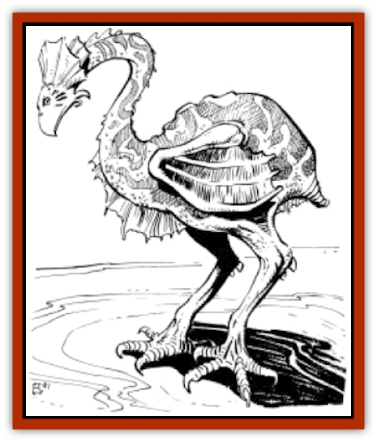

# Erdland

| Statistic | **Erdland** |
| --- | --- |
| **Activity Cycle:** | Day |
| **Alignment:** | Neutral |
| **Armor Class:** | 7 (9) |
| **Climate/Terrain:** | Any |
| **Damage/Attack:** | 1-8/1-8 |
| **Diet:** | Omnivore |
| **Frequency:** | Common |
| **Hit Dice:** | 3 |
| **Intelligence:** | Animal (1) |
| **Magic Resistance:** | Nil |
| **Morale:** | Steady (11-12) |
| **Movement:** | 12 |
| **No. Appearing:** | 10-30 |
| **No. of Attacks:** | 2 |
| **Organization:** | Herd |
| **Size:** | L (10' long) |
| **Special Attacks:** | Nil |
| **Special Defenses:** | Nil |
| **THAC0:** | 17 |
| **Treasure:** | Nil |
| **XP Value:** | Average erdland: 120 / Psionic erdland: 175 |

**Psionics Summary**

| Level | Dis/Sci/Dev | Attack/Defense | Score | PSPs |
| --- | --- | --- | --- | --- |
| 1 | 1/1/5 | PsC/M- | 10 | 50 |

**Telepathy -** *Science:* domination; *Devotions:* psionic crush, life detection, mind blank, conceal thoughts, contact.

Note: It is very rare (5%) that an encountered erdland will possess psionic abilities.

Erdlands are a large variant of the <a href= "/appendix/animdoa1">erdlus</a> and are commonly encountered in herds in the Athasian plains. Used as mounts or to pull caravans, erdland are a common sight along the trader routes through the deserts of Athas.

Erdlands, like their smaller cousins, are flightless, featherless birds which are covered with red to grey scales. Erdlands can weigh up to 2,000 pounds and often stand nearly 15 feet tall. The legs of an erdland are powerful and strong, sporting large four-clawed feet. Unlike erdlus, erdlands are not capable of fast speeds and are used more for their endurance than their speed. Aside from the difference in size and speed, erdlands very closely resemble the smaller and quicker erdlus.

**Combat:** Erdlands do not initiate combat often, but when attacked are capable of defending themselves. When erdlands do engage in combat, they make two attacks per round with their large wedge shaped beak, which inflicts 1-8 points of damage per successful attack. The scaly hide of the erdland provides it with adequate protection (AC 7), though the underside of an erdland is softer and more susceptible to attack (AC 9).

**Habitat/Society:** Erdlands live in the low-lying vegetation areas found in the tablelands of Athas. They often make their shelter of some of the larger bushes and trees that grow near the edge of the Ringing Mountains, where the tablelands reach the mountains' base.

Erdlands gather in much smaller groups than erdlus, usually varying from 10 to 30 in number. Erdlands are omnivorous, eating both animals and vegetables, usually whichever is more readily available. Erdlands rarely hunt for food and so most often eat vegetation for survival, enjoying meat when another animal or creature is found dead. On occasion, erdlands will hunt; they are fairly competent when doing so.

Erdland greatly enjoy eating [[Esperweed|esperweed]], a flowering plant that causes an increase in the psionic powers of those who eat it. Though they normally possess no psionic ability, when they eat esperweed, erdlands gain the psionic abilities described above. This ability lasts only for a short time, just one turn, and thus, it is very rare that adventurers will encounter a psionic erdland.

Erdlands, like erdlus, produce young by laying eggs, the size of which can often be as large as 3 feet in diameter. Erdland eggs are somewhat less tasty than erdlu eggs, but can provide food for as many as three adult human or demi-humans. Erdland eggs are incubated underground, in small wells dug by the egg bearer. During the day, the dirt and mud walls of these wells grow very moist and hot, due to the searing heat of the Athasian sun.

Egg bearing erdlands will often dig three or four of these wells, all within an area approximately 30 feet in diameter. Whenever one of these egg wells is threatened by another creature (man or otherwise), the egg bearer will attack the threat viciously in order to protect its young.

**Ecology:** Erdlands do not provide much in terms of usable material for such things as weapons or magical components. The one resource they do provide is food for some of the savage [[Halfling_Athas|halfling]] tribes that inhabit the jungles of Athas. An average erdland can provide up to 700 pounds of meat.

---
## Discovery & Documentation

**Source Publication:** MC12 Dark Sun Appendix I - Terrors of the Desert (1991)
**Campaign Setting:** Dark Sun
**Author(s):** Tom Prusa, Louis J. Prosperi, Walter M. Baas

### Other Creatures Found in This Source Book
   * [[Animal_Herd_Athas|Animal, Herd (Athas)]]
   * [[Animal_Household_Athas|Animal, Household (Athas)]]
   * [[Antloid_Desert|Antloid, Desert]]
   * [[Banshee_Dwarf|Banshee, Dwarf]]
   * [[Beetle_Agony|Beetle, Agony]]
   * [[Bog_Wader|Bog Wader]]
   * [[Brambleweed|Brambleweed]]
   * [[B'rohg|B'rohg]]
   * [[Burnflower|Burnflower]]
   * [[Cat_Psionic|Cat, Psionic]]
   * [[Cha'thrang|Cha'thrang]]
   * [[Cistern_Fiend|Cistern Fiend]]
   * [[Clam_Giant|Clam, Giant]]
   * [[Cloud_Ray|Cloud Ray]]
   * [[Drake_Athas_Air|Drake (Athas), Air]]
   * [[Drake_Athas_Earth|Drake (Athas), Earth]]
   * [[Drake_Athas_Fire|Drake (Athas), Fire]]
   * [[Drake_Athas_Water|Drake (Athas), Water]]
   * [[Dune_Runner|Dune Runner]]
   * [[Dune_Trapper|Dune Trapper]]
   * [[Elemental_Athas_Greater_Air|Elemental (Athas), Greater, Air]]
   * [[Elemental_Athas_Greater_Earth|Elemental (Athas), Greater, Earth]]
   * [[Elemental_Athas_Greater_Fire|Elemental (Athas), Greater, Fire]]
   * [[Elemental_Athas_Greater_Water|Elemental (Athas), Greater, Water]]
   * [[Elemental_Athas_Lesser_Air_Earth|Elemental (Athas), Lesser, Air/Earth]]
   * [[Elemental_Athas_Lesser_Fire_Water|Elemental (Athas), Lesser, Fire/Water]]
   * [[Elemental_Athas_General_Information|Elemental (Athas), General Information]]
   * [[Esperweed|Esperweed]]
   * [[Flailer|Flailer]]
   * [[Floater|Floater]]
   * [[Giant_Athas|Giant (Athas)]]
   * [[Golem_Athas_I|Golem (Athas) I]]
   * [[Golem_Athas_II|Golem (Athas) II]]
   * [[Golem_Athas_III|Golem (Athas) III]]
   * [[Golem_Athas_General_Information|Golem (Athas), General Information]]
   * [[Halfling_Renegade|Halfling, Renegade]]
   * [[Hej-kin|Hej-kin]]
   * [[Id_Fiend|Id Fiend]]
   * [[Insect_Swarm_Athas|Insect Swarm (Athas)]]
   * [[Kank_Wild|Kank, Wild]]
   * [[Kirre|Kirre]]
   * [[Megapede|Megapede]]
   * [[Mul_Wild|Mul, Wild]]
   * [[Nightmare_Beast|Nightmare Beast]]
   * [[Plant_Carnivorous_Athas|Plant, Carnivorous (Athas)]]
   * [[Pterran|Pterran]]
   * [[Pterrax|Pterrax]]
   * [[Pulp_Bee|Pulp Bee]]
   * [[Pyreen|Pyreen]]
   * [[Rasclinn|Rasclinn]]
   * [[Razorwing|Razorwing]]
   * [[Roc_Athas|Roc (Athas)]]
   * [[Sand_Bride|Sand Bride]]
   * [[Sand_Cactus|Sand Cactus]]
   * [[Sand_Vortex|Sand Vortex]]
   * [[Scrab|Scrab]]
   * [[Silt_Horror|Silt Horror]]
   * [[Silt_Runner|Silt Runner]]
   * [[Sink_Worm|Sink Worm]]
   * [[Sloth_Athas|Sloth (Athas)]]
   * [[So-ut|So-ut]]
   * [[Spider_Cactus|Spider Cactus]]
   * [[Spider_Crystal|Spider, Crystal]]
   * [[Spirit_of_the_Land|Spirit of the Land]]
   * [[T'Chowb|T'Chowb]]
   * [[Thrax|Thrax]]
   * [[Tohr-kreen_I|Tohr-kreen I]]
   * [[Villichi|Villichi]]
   * [[Zhackal|Zhackal]]
   * [[Zombie_Plant|Zombie Plant]]
