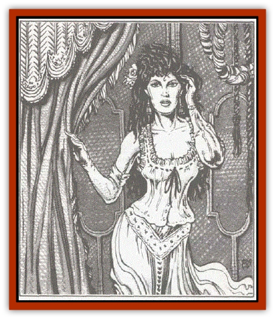

# Ermordenung

| Statistic | **Ermordenung** |
| --- | --- |
| **Activity Cycle:** | Any |
| **Alignment:** | Lawful evil |
| **Armor Class:** | 10 |
| **Climate/Terrain:** | Any Borca |
| **Damage/Attack:** | Special |
| **Diet:** | Omnivore |
| **Frequency:** | Rare |
| **Hit Dice:** | 4 |
| **Intelligence:** | Very (11-12) |
| **Magic Resistance:** | Ni1 |
| **Morale:** | Champion (15-16) |
| **Movement:** | 15 |
| **No. Appearing:** | 1 |
| **No. of Attacks:** | 1 |
| **Organization:** | Solitary |
| **Size:** | M (6' tall) |
| **Special Attacks:** | See below |
| **Special Defenses:** | See below |
| **THAC0:** | 17 |
| **Treasure:** | W (I) |
| **XP Value:** | 650 |

The ermordenung are a dark and evil people found almost exclusively in the domain of Borca. Here, they act as elite agents who serve Ivana Boritsi, the ruler of that dread domain. On rare occasions, they are sent on missions outside of Borca to further the interests of their mistress.

Ermordenung appear as normal human beings of surpassing beauty. The men are tall, normally no less than six feet in height, and smoothly muscled. They seem to radiate an inner power from their finely set classical features. The women are tall, often only an inch or two shorter than the men, and have the perfect features that every artist tries to create. Both sexes are marked by raven hair and penetrating dark eyes that, it is said, are almost hypnotic. Their complexion, however, is rather more pale than that common to most of the people in Borca and contrasts greatly with their dark hair and eyes.

The ermordenung speak the common language of the people of Borca. Their dialect, however, is marked by an aristocratic manner and they carry themselves with a noble bearing that sets them apart from all but the ruling family.

**Combat:** In combat, an ermordenung will attempt to grasp an exposed area of flesh on an opponent's body so that their deadly touch can do its work. Any successful attack roll indicates that the target has been touched and must save vs. poison (with a +4 bonus on their roll). The effects of the ermordenung toxins are felt within seconds - those who fail their saves are instantly slain, while those who succeed suffer 10 points of damage.

If the attack roll is a natural 20, the ermordenung has managed to get a firm grip on his enemy. In such cases, the victim must make a saving throw vs. poison (with no modifiers). While failure to save still results in death, success indicates that 20 points of damage are inflicted. If the target is unable to pull free of the grip (see below), they will be subject to the same saving throw each round until they are slain or they escape.

In non-combat situations, the ermordenung will often use their great physical beauty and overwhelming charisma to lure would-be victims of the opposite sex close. Once their victims are at ease, they draw them into a deadly embrace and slay the hapless souls with their toxic kiss. Victims of this "kiss of death" are entitled to a saving throw vs. poison (with a -4 penalty to their die roll). As usual, failure indicates instant death. Success, on the other hand, indicates that the victim suffers 30 points of damage. Those who survive this horrid attack may attempt to break free of the embrace (see below), but will be kissed again on the next round if they fail to do so.

Breaking the grasp or embrace of an ermordenung is very difficult. for they are considered to have an 18/90 strength if male or an 18/50 strength if female. Weaker enemies must make a saving throw versus paralysis (with a -4 penalty to their roll) in order to pull away from their attackers. Those of equal strength need only make the saving throw itself, while those who are stronger than the ermordenung must save with a +4 bonus to their roll.

Ermordenung are immune to nearly all forms of toxins themselves. The only variety to which they have no natural resistance is that of their peers - any ermordenung is as vulnerable to the deadly touch of their kind as a normal man.

**Habitat/Society:** The ermordenung live as members of the ruling elite in Borca. They seldom mix with "the common folk" unless acting on behalf of their mistress, Ivana Boritsi.

The fact that the ermordenung cannot touch another living creature without causing it to whither and die causes them endless heartache. They have been forever denied the physical pleasures - the caress of a lover's hand, the embrace of a close friend, the affectionate hug of a child - that mean so much to mortal men. Their inner suffering and agony has been marshalled to make them cruel and heartless agents who carry out the orders of Ivana Boritsi without question.

**Ecology:** The ermordenung are normal humans who have been transformed, at the command of Ivana Boritsi, mistress of Borca, into nightmarish creatures. The process by which these creatures are created is dark and mysterious, but is believed to be so brutal to its subjects that only the most physically fit can survive it. Because of her own passionate nature, Ivana Boritsi selects only the most physically beautiful of her people for the "honor" of transformation.

---
## Discovery & Documentation

**Source Publication:** MC10 Ravenloft Appendix I (1989)
**Campaign Setting:** Planescape
**Author(s):** William W. Connors

### Other Creatures Found in This Source Book
   * [[Bastellus|Bastellus]]
   * [[Bat_Ravenloft|Bat (Ravenloft)]]
   * [[Bowlyn|Bowlyn]]
   * [[Broken_One|Broken One]]
   * [[Bussengeist|Bussengeist]]
   * [[Darkling|Darkling]]
   * [[Doom_Guard|Doom Guard]]
   * [[Doppelganger_Plant|Doppelganger Plant]]
   * [[Elemental_Ravenloft|Elemental (Ravenloft)]]
   * [[Ghoul_Lord|Ghoul Lord]]
   * [[Goblyn|Goblyn]]
   * [[Golem_III|Golem III]]
   * [[Golem_IV|Golem IV]]
   * [[Golem_Ravenloft|Golem (Ravenloft)]]
   * [[Grim_Reaper|Grim Reaper]]
   * [[Human_Abber_Nomad|Human, Abber Nomad]]
   * [[Human_Ravenloft|Human (Ravenloft)]]
   * [[Imp_Assassin|Imp, Assassin]]
   * [[Impersonator|Impersonator]]
   * [[Lycanthrope_Werebat|Lycanthrope, Werebat]]
   * [[Lycanthrope_Wereraven|Lycanthrope, Wereraven]]
   * [[Mist_Horror|Mist Horror]]
   * [[Mummy_Greater|Mummy, Greater]]
   * [[Quevari|Quevari]]
   * [[Quickwood|Quickwood]]
   * [[Ravenkin|Ravenkin]]
   * [[Reaver|Reaver]]
   * [[Scarecrow_Ravenloft|Scarecrow (Ravenloft)]]
   * [[Shadow_Fiend|Shadow Fiend]]
   * [[Skeleton_Giant|Skeleton, Giant]]
   * [[Strahd's_Skeletal_Steed|Strahd's Skeletal Steed]]
   * [[Treant_Evil|Treant, Evil]]
   * [[Treant_Undead|Treant, Undead]]
   * [[Valpurgeist|Valpurgeist]]
   * [[Vampire_Dwarf|Vampire, Dwarf]]
   * [[Vampire_Elf|Vampire, Elf]]
   * [[Vampire_Gnome|Vampire, Gnome]]
   * [[Vampire_Halfling|Vampire, Halfling]]
   * [[Vampire_General_Information|Vampire, General Information]]
   * [[Vampire_Kender|Vampire, Kender]]
   * [[Vampyre|Vampyre]]
   * [[Widow_Red|Widow, Red]]
   * [[Wolfwere_Greater|Wolfwere, Greater]]
   * [[Zombie_Lord|Zombie Lord]]
