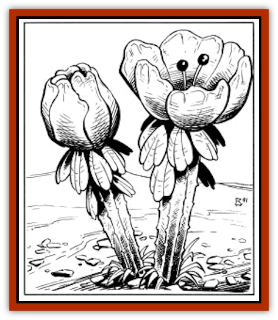

# Esperweed

| Statistic | **Esperweed** |
| --- | --- |
| **Activity Cycle:** | Nil |
| **Alignment:** | Nil |
| **Armor Class:** | 10 |
| **Climate/Terrain:** | Forest/Jungle (Forest Ridge)/Mudflats |
| **Damage/Attack:** | Nil |
| **Diet:** | Nil |
| **Frequency:** | Rare |
| **Hit Dice:** | � (1-2 hit points) |
| **Intelligence:** | Nil |
| **Magic Resistance:** | Nil |
| **Morale:** | Nil |
| **Movement:** | 0 |
| **No. Appearing:** | 1-4 or 1 |
| **No. of Attacks:** | Nil |
| **Organization:** | Nil |
| **Size:** | Small (3' tall) |
| **Special Attacks:** | Nil |
| **Special Defenses:** | Nil |
| **THAC0:** | Nil |
| **Treasure:** | Nil |
| **XP Value:** | Nil |

Esperweed is a plant that grows in the few remaining tropical areas of Athas, as well as on some of the mudflats surrounding the Sea of Silt. A fairly rare plant by nature, esperweed is sought after by many for its psionic boosting powers.

Esperweed does not look like a weed of any kind, but instead is a flowering plant that grows up to three feet in height. The esperweed stalk is brownish-green in color near the ground, but becomes bright green as it nears its leaves and flowers. The leaves are roughly oval shaped and anywhere from three to four inches in length. The esperweed flowers are perhaps the most unusual characteristic of the plant. They are large and sport six petals, each nearly six inches in length. In the center of the petals is a small circular stamen colored bright red. The petals are of this same color at their base, but fade to a reddish-orange at the petal's outer edge.

**Combat:** Being a plant, esperweed is completely defenseless against any attacks or attempts to uproot it. An esperweed plant has only 1 or 2 hit points and can very easily be cut down.

**Habitat/Society:** As stated above, esperweed grows in two distinct areas on Athas. It is most commonly found in the tropical jungles of the Forest Ridge in the Ringing Mountains. It is found in small areas where one to four plants will grow in the immediate vicinity.

The other spot where esperweed can be found is on the mudflats near the Sea of Silt. The moist soil and desert heat provide the correct climate for esperweed growth. When found on the mudflats, an esperweed plant is most often the only one of its kind for a great distance because the soil found on the mudflats offers just enough moisture for one of these unique plants to survive. When a sandstorm blows across the Sea, the seeds are often carried by the wind, thus creating the great distances between specimens of this rare plant.

**Ecology:** Natives of Athas have discovered that, when eaten, the roots of esperweed can boost psionic powers to very high levels. This boost is fairly short-lived, lasting for only 1 turn.

When the esperweed root is eaten, psionicists (single and multi-/dual-classed) have their psionic powers boosted the equivalent of 5 experience levels. The player should calculate the number of additional psionic strength points the character gains and determine which new sciences and devotions are gained (roll on the Wild Talent Tables on pages 20 and 21 of the Complete Psionics Handbook.) The character does not gain any additional disciplines. Eating esperweed also gives a psionicist character more control of his powers. All power scores are increased by +3 for the same duration as the psionic power boost (1 turn).

Wild talents who eat esperweed also gain a boost in their psionic power. Their power score is increased by +2, and the character receives an additional 20 psionic strength points.

**Repeated Use of Esperweed**

  While esperweed is very useful to psionic creatures and characters, repeated use can also be detrimental. Creatures can eat esperweed and enjoy its psionic boosting capabilities a number of times equal to their Hit Dice (or current experience level) without any ill effects. For each use beyond that, however, the creature's or character's psionic ability rapidly fades. Each excess use reduces the creature's psionic ability by the equivalent of two experience levels. This reduction is permanent, but each reduction can be reversed by use of a *restoration* spell. Once a creature's psionic ability is reduced to 0 level, the creature permanently loses its psionics.

It should be noted, however, that esperweed only retains its psionic boosting properties for a limited time. A root will retain its effectiveness for one week after being picked, after which time its potency fades quickly into nothingness.

---
## Discovery & Documentation

**Source Publication:** MC12 Dark Sun Appendix I - Terrors of the Desert (1991)
**Campaign Setting:** Dark Sun
**Author(s):** Tom Prusa, Louis J. Prosperi, Walter M. Baas

### Other Creatures Found in This Source Book
   * [[Animal_Herd_Athas|Animal, Herd (Athas)]]
   * [[Animal_Household_Athas|Animal, Household (Athas)]]
   * [[Antloid_Desert|Antloid, Desert]]
   * [[Banshee_Dwarf|Banshee, Dwarf]]
   * [[Beetle_Agony|Beetle, Agony]]
   * [[Bog_Wader|Bog Wader]]
   * [[Brambleweed|Brambleweed]]
   * [[B'rohg|B'rohg]]
   * [[Burnflower|Burnflower]]
   * [[Cat_Psionic|Cat, Psionic]]
   * [[Cha'thrang|Cha'thrang]]
   * [[Cistern_Fiend|Cistern Fiend]]
   * [[Clam_Giant|Clam, Giant]]
   * [[Cloud_Ray|Cloud Ray]]
   * [[Drake_Athas_Air|Drake (Athas), Air]]
   * [[Drake_Athas_Earth|Drake (Athas), Earth]]
   * [[Drake_Athas_Fire|Drake (Athas), Fire]]
   * [[Drake_Athas_Water|Drake (Athas), Water]]
   * [[Dune_Runner|Dune Runner]]
   * [[Dune_Trapper|Dune Trapper]]
   * [[Elemental_Athas_Greater_Air|Elemental (Athas), Greater, Air]]
   * [[Elemental_Athas_Greater_Earth|Elemental (Athas), Greater, Earth]]
   * [[Elemental_Athas_Greater_Fire|Elemental (Athas), Greater, Fire]]
   * [[Elemental_Athas_Greater_Water|Elemental (Athas), Greater, Water]]
   * [[Elemental_Athas_Lesser_Air_Earth|Elemental (Athas), Lesser, Air/Earth]]
   * [[Elemental_Athas_Lesser_Fire_Water|Elemental (Athas), Lesser, Fire/Water]]
   * [[Elemental_Athas_General_Information|Elemental (Athas), General Information]]
   * [[Erdland|Erdland]]
   * [[Flailer|Flailer]]
   * [[Floater|Floater]]
   * [[Giant_Athas|Giant (Athas)]]
   * [[Golem_Athas_I|Golem (Athas) I]]
   * [[Golem_Athas_II|Golem (Athas) II]]
   * [[Golem_Athas_III|Golem (Athas) III]]
   * [[Golem_Athas_General_Information|Golem (Athas), General Information]]
   * [[Halfling_Renegade|Halfling, Renegade]]
   * [[Hej-kin|Hej-kin]]
   * [[Id_Fiend|Id Fiend]]
   * [[Insect_Swarm_Athas|Insect Swarm (Athas)]]
   * [[Kank_Wild|Kank, Wild]]
   * [[Kirre|Kirre]]
   * [[Megapede|Megapede]]
   * [[Mul_Wild|Mul, Wild]]
   * [[Nightmare_Beast|Nightmare Beast]]
   * [[Plant_Carnivorous_Athas|Plant, Carnivorous (Athas)]]
   * [[Pterran|Pterran]]
   * [[Pterrax|Pterrax]]
   * [[Pulp_Bee|Pulp Bee]]
   * [[Pyreen|Pyreen]]
   * [[Rasclinn|Rasclinn]]
   * [[Razorwing|Razorwing]]
   * [[Roc_Athas|Roc (Athas)]]
   * [[Sand_Bride|Sand Bride]]
   * [[Sand_Cactus|Sand Cactus]]
   * [[Sand_Vortex|Sand Vortex]]
   * [[Scrab|Scrab]]
   * [[Silt_Horror|Silt Horror]]
   * [[Silt_Runner|Silt Runner]]
   * [[Sink_Worm|Sink Worm]]
   * [[Sloth_Athas|Sloth (Athas)]]
   * [[So-ut|So-ut]]
   * [[Spider_Cactus|Spider Cactus]]
   * [[Spider_Crystal|Spider, Crystal]]
   * [[Spirit_of_the_Land|Spirit of the Land]]
   * [[T'Chowb|T'Chowb]]
   * [[Thrax|Thrax]]
   * [[Tohr-kreen_I|Tohr-kreen I]]
   * [[Villichi|Villichi]]
   * [[Zhackal|Zhackal]]
   * [[Zombie_Plant|Zombie Plant]]
