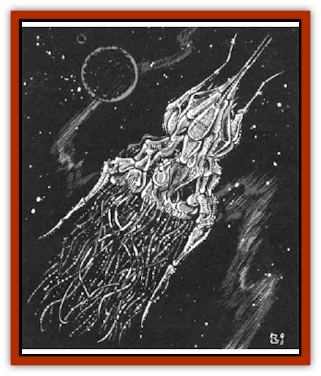

# Esthetic

| Statistic | **Esthetic** |
| --- | --- |
| **Activity Cycle:** | Any |
| **Alignment:** | Neutral |
| **Armor Class:** | 0 |
| **Climate/Terrain:** | Any space |
| **Damage/Attack:** | See below |
| **Diet:** | Special |
| **Frequency:** | Very rare |
| **Hit Dice:** | 20-100 hull points |
| **Intelligence:** | None (symbiont) |
| **Magic Resistance:** | Nil |
| **Morale:** | Elite (13-14) |
| **Movement:** | Fl 50 (B) |
| **No. Appearing:** | 1 |
| **No. of Attacks:** | 2 |
| **Organization:** | Solitary (symbiont with <a href="reigar.html">reigar</a>) |
| **Size:** | G |
| **Special Attacks:** | <i>Jammerscream</i>, grappling |
| **Special Defenses:** | None |
| **THAC0:** | 5 |
| **Treasure:** | Nil |
| **XP Value:** | 10.000 max |

An esthetic is a biological, symbiotic creation of the [[Reigar|reigar]]; it is used for transportation. It is essentially a living craft, capable of self-sustenance for unlimited time. It has no intelligence of its own, being totally reliant on its host, the reigar who created it.

Each esthetic is different from all the others - a direct result of the personality of the creator. The only common thread is the extremely ornate nature of the vessels. Esthetics may be bilaterally symmetrical (two halves matching, like a human body divided from head to feet), radially symmetrical (like a starfish), or they may have no discernible symmetry.

**Combat:** Tactics vary because of the individual nature of each esthetic, but the basic attack is to immobilize the prey, generally using a *jammerscream* attack (a spell-like ability innate to each esthetic). The creature then closes with the victim, grapples, and then drives a hollow boarding spike (6d10 points of damage due to size) into the hapless victim. In the case of animal victims, the spike can be used to inject a digestive enzyme (full damage 2d12 per round, successful saving throw vs. breath weapon for half damage) that breaks down the opponent's tissues for use by the esthetic. This attack can also be used against ships, in which case the spike opens to disgorge boarding parties of helots and lakshu attack troops. (See entry on [[Lakshu|Lakshu]] for more detail.)

A *jammerscream* attack has a range of 2,500 yards; it affects one spelljammer. This attack form seeks out and neutralizes the energy flow necessary for spelljamming. In the case of spacegoing animals and humanoid spelliammers, the effects range from a temporary cessation of spelljamming ability (similar to a migraine, spelljamming ability lost for 3d6 turns) to cerebral hemorrhage (the latter in the case of a failed saving throw vs. spell) leading to death or at least permanent brain damage. In the case of dwarven forges, a successful strike causes forge flames to expire and shovelers to writhe on the floor, grasping their heads in pain. (Note that the *jammerscream* is not a spell and is not available to characters.)

**Habitat/Society:** Esthetics have been the reigar's homes since the destruction of the reigar's planet in the Master Stroke. When the loss of their homeworld necessitated a new habitat, the reigar leaped at the opportunity to combine their pursuits of artistic perfection. their desire for ultimate personal expression, and their need for new homes. Centuries of experimentation led eventually to the birth of the esthetics.

The esthetic protects itself from boarding action by not making obvious doors or hatches. Entry is granted by means of permeable membrane in and around the esthetic's body. Since the reigar and its creation are in a symbiotic relationship, the reigar can always enter or leave at will. However, non-reigar accompanying the creator may not be allowed this freedom, unless the reigar specifically grants it. If the reigar is off-ship for long periods, the esthetic operates according to a set of instructions given to it by its creator. Normal instructions include things like "Don't let in any strangers" and "Stay within 100 yards of this dock".

Should a reigar die, go insane, sink into a depression, or otherwise lose its normal mental acuity, the esthetic reflects this change in mental state by physically altering its appearance (e.g., rotting, developing spiked flanges, blades, etc.) and quite often acquiring a stronger personality of its own.

An esthetic can travel as fast as the fastest vessel known in space (SR 7) - some say even faster. The motive force is unknown, but it is thought to be at least partially provided by the conscious actions of the esthetic itself.

**Ecology:** Esthetics neither take from nor contribute to their surroundings, being totally self-sufficient creations. One theory states that esthetics absorb energy via photosynthesis. Another proposes that they are able to absorb particles from the atmosphere surrounding them and convert these into nutrients.

Esthetics cannot move into the phlogiston, thereby effectively stranding the reigar inside a crystal sphere (and providing a reason for that reigar to approach a likely party for aid). How, then, do they get from one crystal sphere to another? Again, the legends take over. It is said that there are bases - giant, floating. and ornate, geometric in an alien sense (i.e., completely asymmetrical) that can hold groups of reigar and their esthetics. These are purpoted to be able to teleport from sphere to sphere, carrying their contents with them.

---
## Discovery & Documentation

**Source Publication:** MC7 Spelljammer Appendix I (1990)
**Campaign Setting:** Advanced Dungeons & Dragons 2nd Edition
**Author(s):** various

### Other Creatures Found in This Source Book
   * [[Aartuk|Aartuk]]
   * [[Albari|Albari]]
   * [[Ancient_Mariner|Ancient Mariner]]
   * [[Argos|Argos]]
   * [[Beholder_Abomination_Astereater|Beholder (Abomination), Astereater]]
   * [[Blazozoid|Blazozoid]]
   * [[Chattur|Chattur]]
   * [[Chevall|Chevall]]
   * [[Clockwork_Horror|Clockwork Horror]]
   * [[Colossus|Colossus]]
   * [[Delphinid|Delphinid]]
   * [[Dizantar|Dizantar]]
   * [[Dog|Dog]]
   * [[Dog_Bog_Hound|Dog, Bog Hound]]
   * [[Focoid|Focoid]]
   * [[Fractine|Fractine]]
   * [[Giant_Spacesea|Giant, Spacesea]]
   * [[Golem_Furnace|Golem, Furnace]]
   * [[Golem_Radiant|Golem, Radiant]]
   * [[Gravislayer|Gravislayer]]
   * [[Grommam|Grommam]]
   * [[Hadozee|Hadozee]]
   * [[Hamster_Giant_Space|Hamster, Giant Space]]
   * [[Jammer_Leech|Jammer Leech]]
   * [[Lakshu|Lakshu]]
   * [[Lumineaux|Lumineaux]]
   * [[Lutum|Lutum]]
   * [[Mimic_Space|Mimic, Space]]
   * [[Misi|Misi]]
   * [[Moon_Rogue|Moon, Rogue]]
   * [[Mortiss|Mortiss]]
   * [[Murderoid|Murderoid]]
   * [[Nay-Churr|Nay-Churr]]
   * [[Phlog-Crawler|Phlog-Crawler]]
   * [[Plasman|Plasman]]
   * [[Plasmoid_DeGleash|Plasmoid, DeGleash]]
   * [[Plasmoid_DelNoric|Plasmoid, DelNoric]]
   * [[Plasmoid_General_Information|Plasmoid, General Information]]
   * [[Plasmoid_Ontalak|Plasmoid, Ontalak]]
   * [[Puffer|Puffer]]
   * [[Q'nidar|Q'nidar]]
   * [[Rastipede|Rastipede]]
   * [[Reigar|Reigar]]
   * [[Rock_Hopper|Rock Hopper]]
   * [[Slinker|Slinker]]
   * [[Spider_Asteroid|Spider, Asteroid]]
   * [[Spiritjam|Spiritjam]]
   * [[Survivor|Survivor]]
   * [[Syllix|Syllix]]
   * [[Symbiont_Power|Symbiont, Power]]
   * [[Vine_Infinity|Vine, Infinity]]
   * [[Wiggle|Wiggle]]
   * [[Wizshade|Wizshade]]
   * [[Wryback|Wryback]]
   * [[Zard|Zard]]
   * [[Zodar|Zodar]]
