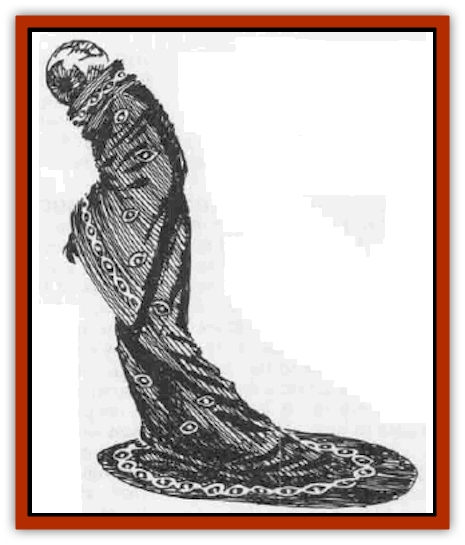

# Eye - The

| Statistic | **Eye, The** |
| --- | --- |
| **Activity Cycle:** | Any |
| **Alignment:** | Lawful evil |
| **Armor Class:** | 2 |
| **Climate/Terrain:** | Any |
| **Damage/Attack:** | 1-10 (weapon)/gaze |
| **Diet:** | Souls |
| **Frequency:** | Unique |
| **Hit Dice:** | 12 |
| **Intelligence:** | Exceptional (16) |
| **Magic Resistance:** | Nil |
| **Morale:** | Champion (15) |
| **Movement:** | 12 |
| **No. Appearing:** | 1 |
| **No. of Attacks:** | 2 |
| **Organization:** | Solitary/cult |
| **Size:** | M (7' tall) |
| **Special Attacks:** | Gaze |
| **Special Defenses:** | Immune to surprise, -1 to initiative |
| **THAC0:** | 9 |
| **Treasure:** | W |
| **XP Value:** | 6,000 |

The Eye is one of the chief lieutenants of the Cult of Vecna. Although only one has ever been seen, it is impossible to be certain that there is only one of these creatures. The Eye is a creation of Vecna's and, thus, it is entirely possible that more than one exists.

The Eye stands seven feet tall. Once it was human, but to become the Eye it has been transformed. Its head has been replaced by a giant eyeball. Its body is slender and moves with a quick, light grace. The Eye normally dresses in long green robes, trimmed with red. Eyes, embroidered in golden thread, decorate the hems. In public, it covers its robes with a gray cloak, and its head is concealed by a deep hood.

**Combat:** The Eye's main purpose is not to fight, but to gain information. It is not, however, without combat ability. The Eye normally fights with a two-handed sword. It also keeps two dirks hidden, one strapped, hilt down, to each arm. In situations in which it cannot use the sword, it crosses its arms, then whips out the two daggers to fight two-handed. It is lightning quick (19 Dexterity) and astoundingly graceful.

The Eye has several powers derived from its transformation. The least of these is that it cannot be surprised, as long as it is awake. It gains a -1 bonus to all initiative rolls, from a limited form of clairvoyance.

It is the gaze power of the Eye that is most fearsome. The Eye no longer eats in the normal sense, but it feeds on the souls of others drawn in by its gaze. Each round, the Eye can use its gaze attack on one target. Unless previously said to be avoiding the Eye's gaze, the victim must roll a saving throw vs. death. Those who succeed suffer no ill effect that round: those who fail are claimed by the Eye. Their life force is drawn into the Eye and held there. (This is seen by others as a ghostly form being sucked into the Eye.) The victim's body falls inert. The Eye cannot consume its metaphysical prey until the body is destroyed, but once that is done, the trapped life-force is devoured and can never be recovered by any means short of divine power.

If the Eye is slain, those life forces it has trapped but not devoured instantly return to their proper bodies. The Eye can voluntarily release any undevoured life forces. As a side effect, the Eye gains access to all the memories of those it traps.

**Habitat/Society:** The Eye is a creation of the wizard-priests of the Cult of Vecna. possibly through the intercession of Vecna himself. The process of creating the Eye is unknown to all but the highest ranking members of the cult, but it involves *wish* and other high-level spells. Because the process is difficult, time-consuming, and dangerous, there is believed to be only one Eye at a time.

Whatever the process is, it strips the Eye of all humanity. The Eye feels no emotional bonds or noble virtues, and it displays several peculiar mannerisms. Limited precognition causes the Eye to finish the sentences of others before they have a chance to say them. The Eye surrounds itself by mirrors and is fascinated by reflections. Sadistically cruel, the Eye purges its own pain and frustrations on helpless victims.

According to the cult priests, the Eye's purpose is to be Vecna's senses on the Prime Material plane. The Eye has a limited precognition (as described in the combat section) that is constantly in effect. It can use *clairvoyance*, *detect magic*, and *find traps* at will. The Eye automatically detects all illusions.

The Eye's primary purpose is as psychic tracker for the priests of Vecna. Once the Eye has seen an intelligent being - either directly or through scrying - it can sense that creature's aura over large distances. The range depends on the abilities of the player character. Those with no spellcasting ability can be detected only within a one-mile radius. Those with any spellcasting abilities are detectable at a radius in miles equal to their spell level. Thus a 12th level wizard (who is able to cast spells up to 6th level) is detectable within a six-mile radius.

The Eye's tracking ability is not infallible. Large concentrations of magical energy can shield a target�s aura. Artifacts, stockpiles of magical items, or even areas with a high preponderance of spellcasters all have this effect. For example, simply entering the Guild of Wizardry is enough to block the Eye's tracking sense. In doubtful cases, the Eye must roll a successful saving throw vs. spell to retain the "scent".

The Eye is able to communicate telepathically with whomever it wishes.

**Ecology:** The Eye is only one part of the Cult of Vecna. Because of its peculiar properties and specialized creation, it is regarded with awe by the rank and file. It is not a priest or part of that priesthood, but rather a tool they created. It is utterly loyal to the high priests of the cult and will take commands only from them.

---
## Discovery & Documentation

**Source Publication:** WGA4 Vecna Lives! (1990)
**Campaign Setting:** Greyhawk
**Author(s):** David "Zeb" Cook

### Other Creatures Found in This Source Book
   * [[Hand_The|Hand, The]]
