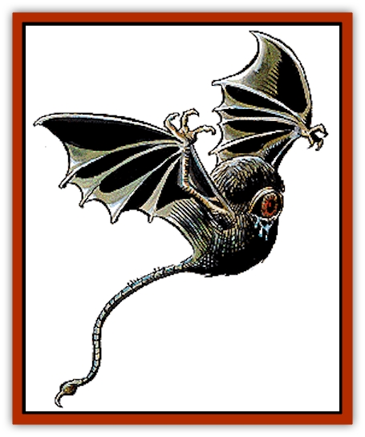

# Eyewing

| Statistic | **Eyewing** |
| --- | --- |
| **Activity Cycle:** | Any |
| **Alignment:** | Lawful evil |
| **Armor Class:** | 4 |
| **Climate/Terrain:** | The Abyss (preferred) |
| **Damage/Attack:** | 1-6/1-6/1-4 or eyewing tears |
| **Diet:** | None known |
| **Frequency:** | Rare |
| **Hit Dice:** | 3 |
| **Intelligence:** | Low (5-7) |
| **Magic Resistance:** | Nil |
| **Morale:** | Steady (12) |
| **Movement:** | Fl 24 (B) |
| **No. Appearing:** | 1-20 |
| **No. of Attacks:** | 3 or 1 |
| **Organization:** | Band |
| **Size:** | L (15' wingspan) |
| **Special Attacks:** | Tears |
| **Special Defenses:** | See below |
| **THAC0:** | 17 |
| **Treasure:** | Nil |
| **XP Value:** | 650 |

Eyewings are loathsome inhabitants of the Abyss. They are obedient, loyal, and dumb - perfect servitors for the dark gods and their more powerful minions.

An eyewing's body is a fat, egg-shaped ball covered with matted black fur. The 5-foot-wide body is supported by a pair of five-foot-long leathery bat wings. Each wing is tipped with a set of three razor-sharp talons. An 8-foot-long rat's tail dangles from the back of the body. The tail ends in a small, sharp spur. It has no feet and has never been known to land.

The body is dominated by the single, bulging, 4-foot-wide eyeball. The eyeball is black with a blood-red pupil. A vile blue fluid continuously leaks from the eye, soiling its fur. Great leathery eyelids squeeze this fluid out and away from the creature. The stench is unbelievable. It gives off an acidic smell that scorches the sensitive tissues in other creatures' noses and mouths.

**Combat:** An eyewing has two main forms of attack. The most common form is to use its claws and tail to strike its opponents. It can either swoop down on them, or hover and slash. Its second form of attack is to bomb its enemies with a large eyewing tear that is squeezed out of the large eyeball by the leathery eyelid. It has amazing control over the release of the tear -- it has the same chance to hit with a tear as with its melee attacks. It releases a tear when it is within 100 feet of its target. It can deliver this attack while hovering or diving.

An eyewing tear is a one-foot-diameter ball of poisonous blue fluid. The attack roll determines if the target dodged the tear. If the tear hits, the victim must roll a successful saving throw vs. poison or suffer 2d6 points of damage (success means only 1d6 points of damage). The tears may also splash onto anyone within ten feet of the target. The attack roll for the splash attack is made with a -2 penalty. If someone is splashed, a saving throw vs. poison must be rolled; those who fail suffer 2d4 points of damage, while those who succeed suffer 1d4 points of damage.

A tear hardens into a rubbery lump within 2d6 hours after being shed. The exact time depends upon the humidity, temperature, etc. Anybody handling a hardened tear must roll a successful saving throw vs. poison or suffer 1 point of damage.

Eyewings have extremely acute vision that enables them to see with perfect accuracy for up to 25 miles. They also have infravision out to 120 feet. They are immune to all cold-based attack forms, as are their tears.

**Habitat/Society:** Eyewings are supernatural creatures that exist only to serve their dark masters. When left without orders they become sluggish and listless. This should not be taken to mean that they are any less dangerous. This listlessness is their expression of boredom, but nothing relieves eyewing boredom quite like tearing apart innocent creatures.

Eyewings have no society as such. They do not have a culture. Their simple language consists of shrill squeaks. They understand other spoken languages, but cannot speak them. When in the Abyss they are found only on layers that allow for flying. Their immunity to cold makes them at home on any of the icy layers as well.

**Ecology:** Eyewings are sexless creatures that are not a part of nature. They kill even when they're not ordered to, just for the pleasure of it. Eyewings have been encountered on the moon, where there is no air to breathe and no water to drink. It is assumed that they do not need air or water. They have never been seen to eat; it is assumed by most who have studied them that they are sustained by magic. The more powerful creatures of the Abyss have no qualms about an eyewing snack should one be nearby, but they are not the natural prey of any creature.

---
## Discovery & Documentation

**Source Publication:** MC4 Dragonlance Appendix (w/binder #2) (1989)
**Campaign Setting:** Dragonlance
**Author(s):** Rick Swan

### Other Creatures Found in This Source Book
   * [[Anemone_Giant_Sea|Anemone, Giant Sea]]
   * [[Bear_Ice|Bear, Ice]]
   * [[Beast_Undead|Beast, Undead]]
   * [[Bird_Krynn|Bird (Krynn)]]
   * [[Disir|Disir]]
   * [[Draconian_Aurak|Draconian, Aurak]]
   * [[Draconian_Baaz|Draconian, Baaz]]
   * [[Draconian_Bozak|Draconian, Bozak]]
   * [[Draconian_Kapak|Draconian, Kapak]]
   * [[Draconian_General_Information|Draconian, General Information]]
   * [[Draconian_Sivak|Draconian, Sivak]]
   * [[Draconian_Proto-_Traag|Draconian, Proto-, Traag]]
   * [[Dragon_Amphi|Dragon, Amphi]]
   * [[Dragon_Astral|Dragon, Astral]]
   * [[Dragon_Kodragon|Dragon, Kodragon]]
   * [[Dragon_Krynn_Othlorx_General_Information|Dragon (Krynn), Othlorx, General Information]]
   * [[Dragon_Krynn_General_Information|Dragon (Krynn), General Information]]
   * [[Dragon_Sea|Dragon, Sea]]
   * [[Dreamshadow|Dreamshadow]]
   * [[Dreamwraith|Dreamwraith]]
   * [[Dwarf_Daergar|Dwarf, Daergar]]
   * [[Dwarf_Hill_Neidar|Dwarf, Hill, Neidar]]
   * [[Dwarf_Mountain_Hylar|Dwarf, Mountain, Hylar]]
   * [[Dwarf_Theiwar|Dwarf, Theiwar]]
   * [[Dwarf_Zakhar|Dwarf, Zakhar]]
   * [[Elf_Half-|Elf, Half-]]
   * [[Elf_High_Qualinesti|Elf, High, Qualinesti]]
   * [[Elf_High_Silvanesti|Elf, High, Silvanesti]]
   * [[Elf_Sea_Dargonesti|Elf, Sea, Dargonesti]]
   * [[Elf_Sea_Dimernesti|Elf, Sea, Dimernesti]]
   * [[Elf_Wild_Kagonesti|Elf, Wild, Kagonesti]]
   * [[Fetch|Fetch]]
   * [[Fire_Minion|Fire Minion]]
   * [[Fireshadow|Fireshadow]]
   * [[Gnome_Tinker|Gnome, Tinker]]
   * [[Gurik_Cha'ahl|Gurik Cha'ahl]]
   * [[Haunt_Knight|Haunt, Knight]]
   * [[Horax|Horax]]
   * [[Human_Krynn|Human (Krynn)]]
   * [[Imp_Blood_Sea|Imp, Blood Sea]]
   * [[Kalothagh|Kalothagh]]
   * [[Kani_Doll|Kani Doll]]
   * [[Kender|Kender]]
   * [[Kyrie|Kyrie]]
   * [[Lizard_Man_Krynn|Lizard Man (Krynn)]]
   * [[Minotaur_Krynn|Minotaur, Krynn]]
   * [[Ogre_High|Ogre, High]]
   * [[Ogre_Krynn|Ogre (Krynn)]]
   * [[Phaethon|Phaethon]]
   * [[Saqualaminoi|Saqualaminoi]]
   * [[Shadowperson|Shadowperson]]
   * [[Shimmerweed|Shimmerweed]]
   * [[Skrit|Skrit]]
   * [[Spectral_Minion|Spectral Minion]]
   * [[Spider_Krynn|Spider (Krynn)]]
   * [[Stag|Stag]]
   * [[Tayling|Tayling]]
   * [[Thanoi|Thanoi]]
   * [[Tylor|Tylor]]
   * [[Wichtlin|Wichtlin]]
   * [[Wyndlass|Wyndlass]]
   * [[Yaggol|Yaggol]]
