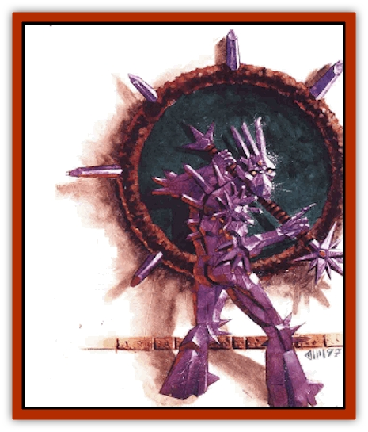

# Facet

| Statistic | **Facet** |
| --- | --- |
| **Activity Cycle:** | Any |
| **Alignment:** | Neutral |
| **Armor Class:** | 4 |
| **Climate/Terrain:** | Quasiplane of Salt |
| **Damage/Attack:** | 1d4/1d4 (see below) |
| **Diet:** | Water |
| **Frequency:** | Uncommon |
| **Hit Dice:** | 3 (see below) |
| **Intelligence:** | Average (8-10) |
| **Magic Resistance:** | Nil |
| **Morale:** | Average (8-10) |
| **Movement:** | 9 |
| **No. Appearing:** | 2d6 |
| **No. of Attacks:** | 2 |
| **Organization:** | Army |
| **Size:** | M (5' tall) (see below) |
| **Special Attacks:** | Dehydration |
| **Special Defenses:** | Nil |
| **THAC0:** | 17 (see below) |
| **Treasure:** | Nil |
| **XP Value:** | 175 / Combined facet (2 member): 420 / Combined facet (3 member): 1,400 / Combined facet (4 member): 3,000 / Combined facet (5 member): 6,000 |

War is imminent on the Inner Planes, but most folks don't know it yet. A force of great power grows within the Quasielemental Plane of Salt. The vast army or beings known as facets is preparing a massive invasion of the Elemental Plane of Water.

Facets are multiple creatures of salt with a single intellence. Rather than individual organisms, the facets essentially comprise a singular creature with many detachable appendages. All facets are part of all other facets. THey work together the way the different portions of a singular individual do, never communicating but always in sync.

The oncoming conflict could happen only on the Inner Planes. It's a war that'll be waged by the facets from the plane of Salt against the very plane of Water itself. The strange thing is, it's a battle that may go on for quite some time before the creatures of Water even know it's happening.

See, the facets want to absorb all moisture, or so the chant says, and they've targeted the plane of Water as the perfect place to begin. When Water and Salt meet, the essences of these planes converge in a sea of extremely salty water. The facets wage their war there, leeching moisture away from the border-sea. As the facets absorb the liquids, ever more flows in from the plane of Water itself to replenish the border. Although the quantities involved (the amount of water and space) are infinity or nearly so, the potential exists for a great deal of Water's power and essence to be drawn slowly away. Further, because the absorption of water allows the facets to reproduce, the threat will only magnify as time passes.

Facets appear as 5-foot-tall, nearly featureless humanoids seemingly drawn of angular lines and composed entirely of salt crystals. They do not communicate with other creatures, nor seemingly with one another.

**Combat:** A single facet is dangerous enough to most living, organic creatures. Unfortunately, they are rarely encountered alone. Singly or collectively, the danger lies in the facet's ability to drain moisture from any source.

In combat, a facet strikes with two spindly limbs, each inflicting only 1d4 points of damage. However, the attack also leeches some moisture from any creature comprised partially of water (virtually any living thing except for elemental creatures of stone, fire, or air). The next round, creatures struck by the facet automatically lose an additional 1d4 points of damage as they suffer the wound's desiccating effect. The wounds from combat with a facet are known for the dry, chapped welts left behind.

If a bark who encounters a facet has already been injured from other attacks that opened bleeding wounds, he suffers 1d6 points of damage from the creature's salty strike, rather than 1d4. This is because the salt in the open wounds inflicts even more pain. However, the secondary damage of 1d4 points the following round does not increase.

Obviously, creatures made of water (such as water elementals) are particularly susceptible to a facet's attack. Against beings made solely or mostly of water, the blow inflicts 2d4 points of damage, and the secondary loss is likewise doubled to 2d4 points.

It's the secondary damage that sustains the facet as it draws water from an opponent's body into its own. When the total damage inflicted from the secondary attack equals the facet's own maximum hit points, it immediatly splits in two. Absorbing that amount of water allows it to create a new facet. This splitting process takes a full round in which neither facet can act. Once spilt, the two facets each have half the Hit Dice of the original, and it takes about a week for each facet to regain its full Hit Die potential.

After splitting, the original facet can continue to attack, but it usually cannot split again (see <q>Ecology</q> for details). The newly produced facet can split, but not until it reaches its full growth a week later. Thus, in a given conflict with moisture-laden foes, a group of facets may double, but their number generally won't grow any larger than that.

A spell like *create water*, cast upon a facet, allows it to split immediately (if the creature is able). *Transmute water to dust* instantly slays a facet, even a combined facet (see below), if it falls a saving throw.

**Habitat/Society:** It's easiest to think of all facets as a singular being. Only then can a body truly tumble to the utter lack of interaction and communication among the otherwise separate individuals, yet understand the total efficiency with which they work together.

About one-third of the total number of extant facets can be found inching their way through the border with the Elemental Plane of Water. Absolving the liquids in an ever-expanding horde. The rest are found in more centrally located portions of their own plane. Eventually, it seems, they will all march toward their goal.

Chant has it that a master facet somewhere in the plane (perhaps the original creature) controls the actions of all other facets. Such an idea gives hope that there might be a way to stop the legions of facets that threaten the plane of Water. It's probably too good to be true, however, for the facts seem to suggest otherwise. It's more likely that all facets are equal to one another, each sharing a collective consciousness and each performing as a mere extension of that consciousness.

**Ecology:** Thc facet is comprised entirely of salt crystals. Its sole motivation entails absorbing water. Water alone sustains and nourishes the creature, and the element's absence drives it with an all-consuming thirst. Water also enables it to reproduce, splitting in two to create another fully formed facet (see above). Most facets can split just once in their entire lives. However, one in five facets is able to reproduce twice, and one in 20 can reproduce three times - so the population always has the potential to continue to expand in greater and greater amounts.

As the facets march like an army toward the border with the Elemental Plane of Water, encountering larger and larger quantities of the life-sustaining liquid, folks calculate that their total number doubles every three weeks. Somewhere, sometime, this potential threat to the plane or Water (and possibly the rest of the multiverse) should be adressed by the powers that be - before it's too late.

## Combined Facet

Facets have the ability to join their bodies together to become larger, composite entities. Up to five facets can assemble themselves into one gigantic creature. It takes 1d3 rounds to complete this action (and the same amount or time to separate again).

A combined facet has as many Hit Dice as its respective parts (so five facets can join to become a 15 HD creature). The new monster has the THAC0 commensurate with its new form, and damage inflicted is equal to the combined total of all the members (so a five-facet beast has a THAC0 of 5 and inflicts 5d4 points or damage with each of its attacks). Combined facets made of two or three members are size L, while those made of four or five members are size H. All other stats remain the same.

| Number of facets | HD | THAC0 | Dam/Att | Size |
| --- | --- | --- | --- | --- |
| l member | 3 | 17 | 1d4/1d4 | M (5') |
| 2 member | 6 | 15 | 2d4/2d4 | L (8') |
| 3 member | 9 | 11 | 3d4/3d4 | L (12') |
| 4 member | 12 | 9 | 4d4/4d4 | H (15') |
| 5 member | 15 | 5 | 5d4/5d4 | H (18') |

---
## Discovery & Documentation

**Source Publication:** Planescape III (1996)
**Campaign Setting:** Planescape
**Author(s):** Monte Cook

### Other Creatures Found in This Source Book
   * [[Animental|Animental]]
   * [[Archomental_Evil|Archomental, Evil]]
   * [[Archomental_Good|Archomental, Good]]
   * [[Belker|Belker]]
   * [[Bzastra|Bzastra]]
   * [[Chososion|Chososion]]
   * [[Darklight|Darklight]]
   * [[Devete|Devete]]
   * [[Devourer_Planescape|Devourer (Planescape)]]
   * [[Dharum_Suhn|Dharum Suhn]]
   * [[Egarus|Egarus]]
   * [[Elemental_Athas_Lesser_Air_Earth|Elemental (Athas), Lesser, Air/Earth]]
   * [[Elemental_Athas_Lesser_Fire_Water|Elemental (Athas), Lesser, Fire/Water]]
   * [[Elemental_Fire_Kin_Salamander_II|Elemental, Fire Kin, Salamander II]]
   * [[Entrope|Entrope]]
   * [[Frost_Salamander|Frost Salamander]]
   * [[Fundamental_Air_Earth|Fundamental, Air/Earth]]
   * [[Fundamental_Fire_Water|Fundamental, Fire/Water]]
   * [[Fundamental_All_Elements|Fundamental, All Elements]]
   * [[Garmorm|Garmorm]]
   * [[Homunculus_Elemental|Homunculus, Elemental]]
   * [[Immoth|Immoth]]
   * [[Khargra|Khargra]]
   * [[Klyndes|Klyndes]]
   * [[Magran|Magran]]
   * [[Menglis|Menglis]]
   * [[Nathri|Nathri]]
   * [[Ooze_Sprite|Ooze Sprite]]
   * [[Paraelemental|Paraelemental]]
   * [[Phirblas|Phirblas]]
   * [[Psurlon|Psurlon]]
   * [[Quasielemental_Negative|Quasielemental, Negative]]
   * [[Quasielemental_Positive|Quasielemental, Positive]]
   * [[Rast|Rast]]
   * [[Ravid|Ravid]]
   * [[Ruvoka|Ruvoka]]
   * [[Scile|Scile]]
   * [[Shad|Shad]]
   * [[Shocker|Shocker]]
   * [[Sislan|Sislan]]
   * [[Suisseen|Suisseen]]
   * [[Terithran|Terithran]]
   * [[Thoqqua|Thoqqua]]
   * [[Trilloch|Trilloch]]
   * [[Tsnng|Tsnng]]
   * [[Ungulosin|Ungulosin]]
   * [[Vacuous|Vacuous]]
   * [[Wavefire|Wavefire]]
   * [[Xag-Ya_Xeg-Yi|Xag-Ya/Xeg-Yi]]
   * [[Xill|Xill]]
