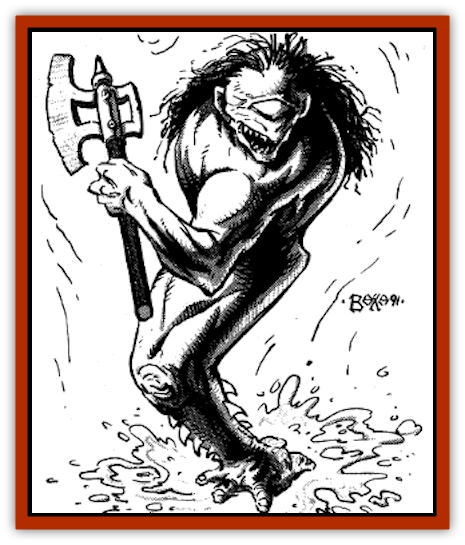

# Fachan - Toril

| Statistic | **Fachan (Toril)** |
| --- | --- |
| **Activity Cycle:** | Any |
| **Alignment:** | Neutral evil |
| **Armor Class:** | 5 (Head AC 2) |
| **Climate/Terrain:** | Swamps |
| **Damage/Attack:** | 1-4 bite, or by weapon type |
| **Diet:** | Omnivore |
| **Frequency:** | Very rare |
| **Hit Dice:** | 4+2 |
| **Intelligence:** | Low (5-7) |
| **Magic Resistance:** | Nil |
| **Morale:** | Steady (12) |
| **Movement:** | 90 (150 Sw) |
| **No. Appearing:** | 2-12 (4-48) |
| **No. of Attacks:** | 1 or 2 (bite and weapon) |
| **Organization:** | Tribal |
| **Size:** | S (2-4' tall) |
| **Special Attacks:** | Head butt, paralytic bite |
| **Special Defenses:** | Surprised on a 1 |
| **THAC0:** | 17 |
| **Treasure:** | K |
| **XP Value:** | 650 |

The fachan is physically one of the Realms. most unusual creatures. The fachan has one leg, one foot, one arm protruding from the center of its chest, and one eye in the center of its face. Fachan skin varies from a dark gray-brown hue to a mottled green, but the hair of the fachan is always blue-black. Despite these changes, they also share many physical attributes with [[Ogre|ogres]] and [[Orc|orcs]].

A fachan moves with a hopping gait upon his foot, its six toes spread equidistantly around the round foot pad for balance. Despite initial appearances of an ungainly and awkward body, fachan are quite agile and fast. They can leap a 10-foot span easily and can hurtle a 6-foot barrier from a standstill. All fachan can leap upright and stand erect from a prone position in one segment.

**Combat:** Fachan prefer to take enemies by surprise to put immediate fear into their opponents. Fachan are only surprised on a roll of 1 (1d6) because of fantastically keen hearing. This usually gives them the opportunity to prepare ambushes and surprises for their opponents.

A fachan can wield a weapon with his arm except for twohanded weapons, bow weapons, or pole arms. A fachan generally wields clubs and flails, though axes and swords are becoming more common.

Fachan often lay in ambush partially submerged in marshes and swamps. When an opponent is within 7 feet of the fachan's location, it launches itself at its target by its strong, powerful leg. The fachan has an exceptionally hard skull, and its "head-butt" attack causes 1-6 points of damage to opponents with Armor Classes less than 2. In addition, the victim must successfully save vs. petrification or be *stunned* each round until a save is successful.

Fachan can wield weapons against their foes, or simply bite opponents with their rotting, muck-encrusted teeth. The teeth alone cause 1d3 points of damage, but they can generate a paralytic poison (save vs. poison at +2, or be *paralyzed* for 1d4 rounds). Once an opponent is downed, the fachan push him under any available water surface to quickly drown their prey.

**Habitat/Society:** The fachan are shunned by most civilized races because of their penchant for human and demihuman flesh. The fachan are cruel beings, more apt to toy with their prey than kill it quickly and cleanly.

The fachan live in swamps, marshes, and wetlands, their lairs equivalent to the partially-submerged beaver lodges. Lodges are constructed in circular patterns. Each clutch has as many as six lodges. An average tribe contains 30 fachan with approximately 6 lodges for that tribe. The chieftain.s lodge is always at the center of the circle, and is the largest of the lodges for that tribe. Though they average 20 feet in diameter, the fachan lodges are difficult to locate. The chance of locating a lodge is 10% per lodge within 50 feet. Rangers have a 15% chance per lodge of locating one.

**Ecology:** Fachan have never been found further north than the swamps west of the Osraun mountains of Turmish, but they are becoming more common in the swamps near Halruaa and Durpar. The largest collection of fachan in the Known Realms is a group of tribes in the Spider Swamps of Calimshan. There are rumors of even larger numbers and greater varieties of fachan in Chult or the lands further south across the Great Sea.

The fachan's legendary leaping ability and dexterity can be magically rejuvenated from its footpad. Properly treated and enchanted, the footpads of two fachan can be made into *boots of striding and springing*. The hearing organs of a fachan can be instrumental in creating *potions of clairaudience*.

The orcs have a legend that Gruumsh "blessed" the orc races so they would bear certain offspring that were "half the beings their parents were yet more than they were as well". The fachan's faces bear striking similarities to depictions of Gruumsh, supporting the legend. To this end, fachan are sometimes known as "Gruumsh-kin".

---
## Discovery & Documentation

**Source Publication:** MC11 Forgotten Realms Appendix II (1991)
**Campaign Setting:** Advanced Dungeons & Dragons 2nd Edition
**Author(s):** Tim Beach, Tim Brown, William W. Connors, Dale Donovan, Ed Greenwood, Jeff Grubb, Bruce Heard, Slade Henson, Rob King, Colin McComb, Roger E. Moore, Bruce Nesmith, Jon Pickens, Jean Rabe, Dori Watry, Skip Williams

### Other Creatures Found in This Source Book
   * [[Alaghi|Alaghi]]
   * [[Alguduir|Alguduir]]
   * [[Beguiler|Beguiler]]
   * [[Bird_Toril|Bird (Toril)]]
   * [[Cantobele|Cantobele]]
   * [[Carapace|Carapace]]
   * [[Cat_Toril|Cat (Toril)]]
   * [[Chitine|Chitine]]
   * [[Cildabrin|Cildabrin]]
   * [[Dimensional_Warper|Dimensional Warper]]
   * [[Dragon_Deep|Dragon, Deep]]
   * [[Fael|Fael]]
   * [[Feyr|Feyr]]
   * [[Firetail|Firetail]]
   * [[Frost|Frost]]
   * [[Gaund|Gaund]]
   * [[Gloomwing|Gloomwing]]
   * [[Golden_Ammonite|Golden Ammonite]]
   * [[Golem_Lightning|Golem, Lightning]]
   * [[Hamadryad|Hamadryad]]
   * [[Harrier|Harrier]]
   * [[Harrla|Harrla]]
   * [[Haun|Haun]]
   * [[Haundar|Haundar]]
   * [[Hendar|Hendar]]
   * [[Inquisitor|Inquisitor]]
   * [[Lhiannan_Shee|Lhiannan Shee]]
   * [[Loxo|Loxo]]
   * [[Manni|Manni]]
   * [[Manscorpion|Manscorpion]]
   * [[Mara|Mara]]
   * [[Morin|Morin]]
   * [[Naga_Dark|Naga, Dark]]
   * [[Orpsu|Orpsu]]
   * [[Plant_Carnivorous_Black_Willow|Plant, Carnivorous, Black Willow]]
   * [[Plant_Carnivorous_Toril|Plant, Carnivorous (Toril)]]
   * [[Plant_Dangerous_I|Plant, Dangerous I]]
   * [[Ring-Worm|Ring-Worm]]
   * [[Rohch|Rohch]]
   * [[Sand_Cat|Sand Cat]]
   * [[Saurial|Saurial]]
   * [[Sha'az|Sha'az]]
   * [[Silver_Dog|Silver Dog]]
   * [[Simpathetic|Simpathetic]]
   * [[Skuz|Skuz]]
   * [[Spider_Monkey|Spider, Monkey]]
   * [[Tren|Tren]]
