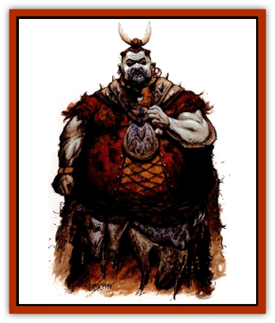

# Fael

| Statistic | **Fael** |
| --- | --- |
| **Activity Cycle:** | Any |
| **Alignment:** | Chaotic evil |
| **Armor Class:** | As in life, or 6 |
| **Climate/Terrain:** | Anywhere there is food |
| **Damage/Attack:** | 1d3/1d3/2d6 |
| **Diet:** | Omnivore |
| **Frequency:** | Very rare |
| **Hit Dice:** | As in life, minimum 6+3 |
| **Intelligence:** | Very (11-12) |
| **Magic Resistance:** | Nil |
| **Morale:** | Champion (15-16) |
| **Movement:** | 9 |
| **No. Appearing:** | 1 |
| **No. of Attacks:** | As in life, or 3 |
| **Organization:** | Solitary |
| **Size:** | M (6' tall) |
| **Special Attacks:** | See below |
| **Special Defenses:** | +1 or better weapon to hit |
| **THAC0:** | As in life, or 15 |
| **Treasure:** | R |
| **XP Value:** | 975 + 200 per HD over 7 |

Faels are ravenous [[Undead_Athas_General_Information|undead]] beings who never quenched their need for material consumption during life. They are animated in undeath to continue their feeding. They seek out parties, feasts, and other social gatherings so they can quietly sneak in and begin feeding on the food present. They never get full, and eventually people notice, either by watching a fael eat endlessly or when the fael demands more food after consuming all food present.

Faels appear much as they did in life. In fact, the only way to tell they are undead is by their insatiable appetites, or by attempting to turn one. Occasionally, faels' clothing is stained and unsightly from food that has fallen as they eat. Rich humans and demihumans are often subject to this form of undeath. Most human faels are extremely obese, but all are recognizable by their never-ending appetites and the hungry look in their eyes. They are crude creatures with few manners.

While they can speak whatever languages they knew in life, they are usually too busy eating or demanding food for someone to have a conversation with them.

**Combat:** A fael can attack with its fists for 1-3 points of damage each. It can extend its incredibly strong jaw as much as 1 foot, allowing it to bite for 1-12 (1d12) points of damage. If the fael causes 6 or more points of damage, there is a 25% chance it has bitten off a portion of its victim the size of a hand. If the fael causes 9 or more points of damage, there is a 25% chance it has bitten off a portion of the victim the size of an arm or leg. If the fael causes 12 points of damage, there is a 25% chance it has bitten off the head of its victim, automatically killing him.

The DM might choose to use the charts provided in the [[Undead_Athas_General_Information|Undead section]] to create faels. The following collection of modifiers will influence the creation of the undead.

<ul><li>Race of the undead:-20%</li><li>Length of time as an undead:-20%</li><li>Undead character classes: No modifier</li><li>Undead experience level: Use low level subtable</li><li>Number of special undead powers: -3 to roll</li><li>Type of undead powers: -20% to roll</li><li>Number of special undead weaknesses: -5 to roll</li><li>Type of undead weaknesses: No modifier</li></ul>**Habitat/Society:** Faels eat whatever they can find, but love well-cooked meals and especially desire their favorite meals from life. As they eat they get even more and more hungry, so feeding them produces an endless cycle.

Eventually faels must be destroyed or forced to leave. Faels never leave willingly and become angry when living beings refuse to feed them.

**Ecology:** Faels have no place in the natural world. They exist only to consume food meant for the living. They can sometimes be bartered with large quantities of food in exchange for their services or valuable information.

---
## Discovery & Documentation

**Source Publication:** MC11 Forgotten Realms Appendix II (1991)
**Campaign Setting:** Advanced Dungeons & Dragons 2nd Edition
**Author(s):** Tim Beach, Tim Brown, William W. Connors, Dale Donovan, Ed Greenwood, Jeff Grubb, Bruce Heard, Slade Henson, Rob King, Colin McComb, Roger E. Moore, Bruce Nesmith, Jon Pickens, Jean Rabe, Dori Watry, Skip Williams

### Other Creatures Found in This Source Book
   * [[Alaghi|Alaghi]]
   * [[Alguduir|Alguduir]]
   * [[Beguiler|Beguiler]]
   * [[Bird_Toril|Bird (Toril)]]
   * [[Cantobele|Cantobele]]
   * [[Carapace|Carapace]]
   * [[Cat_Toril|Cat (Toril)]]
   * [[Chitine|Chitine]]
   * [[Cildabrin|Cildabrin]]
   * [[Dimensional_Warper|Dimensional Warper]]
   * [[Dragon_Deep|Dragon, Deep]]
   * [[Fachan_Toril|Fachan (Toril)]]
   * [[Feyr|Feyr]]
   * [[Firetail|Firetail]]
   * [[Frost|Frost]]
   * [[Gaund|Gaund]]
   * [[Gloomwing|Gloomwing]]
   * [[Golden_Ammonite|Golden Ammonite]]
   * [[Golem_Lightning|Golem, Lightning]]
   * [[Hamadryad|Hamadryad]]
   * [[Harrier|Harrier]]
   * [[Harrla|Harrla]]
   * [[Haun|Haun]]
   * [[Haundar|Haundar]]
   * [[Hendar|Hendar]]
   * [[Inquisitor|Inquisitor]]
   * [[Lhiannan_Shee|Lhiannan Shee]]
   * [[Loxo|Loxo]]
   * [[Manni|Manni]]
   * [[Manscorpion|Manscorpion]]
   * [[Mara|Mara]]
   * [[Morin|Morin]]
   * [[Naga_Dark|Naga, Dark]]
   * [[Orpsu|Orpsu]]
   * [[Plant_Carnivorous_Black_Willow|Plant, Carnivorous, Black Willow]]
   * [[Plant_Carnivorous_Toril|Plant, Carnivorous (Toril)]]
   * [[Plant_Dangerous_I|Plant, Dangerous I]]
   * [[Ring-Worm|Ring-Worm]]
   * [[Rohch|Rohch]]
   * [[Sand_Cat|Sand Cat]]
   * [[Saurial|Saurial]]
   * [[Sha'az|Sha'az]]
   * [[Silver_Dog|Silver Dog]]
   * [[Simpathetic|Simpathetic]]
   * [[Skuz|Skuz]]
   * [[Spider_Monkey|Spider, Monkey]]
   * [[Tren|Tren]]
