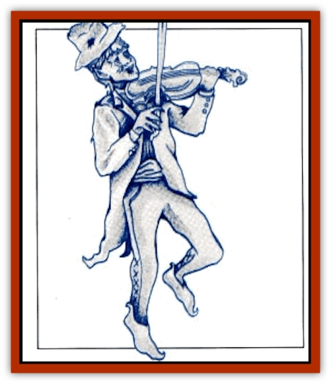

# Faerie - Faerie Fiddler

| Statistic | **Faerie, Faerie Fiddler** |
| --- | --- |
| **Activity Cycle:** | Night |
| **Alignment:** | Neutral good |
| **Armor Class:** | 0 |
| **Climate/Terrain:** | Any inhabited by other faeries |
| **Damage/Attack:** | Nil |
| **Diet:** | Nil |
| **Frequency:** | Uncommon |
| **Hit Dice:** | 1 |
| **Intelligence:** | Average (10) |
| **Magic Resistance:** | 25% |
| **Morale:** | Elite (13) |
| **Movement:** | 12 |
| **No. Appearing:** | 1 |
| **No. of Attacks:** | 0 |
| **Organization:** | Solitary |
| **Size:** | T (2' tall) |
| **Special Attacks:** | Fiddling |
| **Special Defenses:** | Immunz to enchantment/charm magic |
| **THAC0:** | 19 |
| **Treasure:** | Nil |
| **XP Value:** | 270 |

The faerie fiddler is a strange icon of faerie society. Always found in a community of faeries, there is never more than one faerie fiddler per community. This faerie's motivations are to protect other members of the society and to make the world more pleasant, according to its understanding of the term.

Faerie fiddlers are among the most human-looking of faeries. They resemble old, diminutive human males, dressed in somber, archaic clothes (such as a battered black top hat and tails), and playing a most exquisite, tiny fiddle. For all of their age, they are in good spirits, and while so skinny that it is a wonder they can keep the front and back of their coats apart, they are apparently spry and lively. Naturally, they speak the languages of every type of faerie folk, and those of any nearby human or demihuman community

**Combat:** Faerie fiddlers never begin a fight, but are quite able to defend themselves. The fiddler's primary defense is a high armor class, the result of his small size and constant, capering dance. The fiddler is naturally resistant to most forms of magic, and completely immune all enchantment/charm spells.

The faerie fiddler can play magical tunes on his fiddle, both for enjoyment and in combat. Any of these effects can be resisted with a saving throw vs. spell, but the intention must be clearly stated, for the tunes can be subtle.

The least tune negates hunger, thirst, and fatigue for those hearing while dancing; it is a tune that is woven through the melodies of common dancing songs. This tune allows an individual with the dancing nonweapon proficiency to fight without fatigue by altering the steps of the dance to allow fighting at the same time. All faeries in a community with a faerie fiddler can receive this benefit when the fiddler plays: In combat, they will spin and whirl as if dancing and not tire from their efforts.

The fiddler can also target one creature per round with an *Otto's ivresistible dance spell*. This has a range of 30 feet, and a saving throw vs. spell negates the tune's effects. As the spell lasts only five rounds, the fiddler may have to renew the spell if he faces many opponents. The fiddler will use this spell to assist his faerie friends when they fight intruders, to cover the escape of those who are unable or unwilling to fight, and to cover ius own escape. The fiddler will depart only after all other faeries are secure.

The most powerful tune used when someone offends faerie sensibilities without overtly attacking them; for example, refusing to dance with them, claiming not to believe in the existence of faeries or - especially - someone who tries to cheat a faerie in some way. The tune has the same fatigue-banishing effects of the first tune, but combines with it a powerful time-distorting effect. For every hour spent dancing, a year will pass in the outside world (if a human dances for four hours, four years will have passed in the real world when he returns to his home, probably to find it long-sold after his mysterious disappearance). Again, a saving throw vs. spell will negate all effects of the spell, but the hearer must consciously desire to resist or receive no saving throw at all.

This tune can be played only once per month, on the night of a full moon, and an offender at some other time must be lured back to the faerie circle. The common method is for the fiddler to pretend that he failed to notice the offense, and then to invite the offender back a few days hence for a once-in-a-lifetime celebration. Other ruses are tailored to the offender, such as "accidentally" letting slip that a preaous faerie treasure will be on display during the full moon, or challenging the offender to return ("You wouldn't dare come back here and do that again on the night of the full moon") if he is belligerent.

**Ecology:** Faerie fiddlers dwell among communities of faerie creatures, and provide a number of services for them, most espedally fiddling at their convocations, parties, and gatherings.

The fiddle of a faerie fiddler isn't magical (its effects are the natural magic of the fiddler channeled through the instrument), but it still has a resale value of 3 to 60 gp for its fine quality and miniature size.

---
## Discovery & Documentation

**Source Publication:** Monstrous Compendium, 1996 Annual, Volume 3 (1995)
**Campaign Setting:** Advanced Dungeons & Dragons 2nd Edition
**Author(s):** Jon Pickens

### Other Creatures Found in This Source Book
   * [[Alaghi|Alaghi]]
   * [[Alhoon|Alhoon]]
   * [[Aranea_Savage_Coast|Aranea (Savage Coast)]]
   * [[Arcane_Head|Arcane Head]]
   * [[Banedead|Banedead]]
   * [[Banelich|Banelich]]
   * [[Bat_Bonebat|Bat, Bonebat]]
   * [[Beetle|Beetle]]
   * [[Belgoi|Belgoi]]
   * [[Bladeling|Bladeling]]
   * [[Braxat|Braxat]]
   * [[Bunyip|Bunyip]]
   * [[Burbur|Burbur]]
   * [[Bvanen|Bvanen]]
   * [[Cat_Great_Snow_Tiger|Cat, Great, Snow Tiger]]
   * [[Chosen_One|Chosen One]]
   * [[Chronovoid|Chronovoid]]
   * [[Cildabrin|Cildabrin]]
   * [[Coffer_Corpse|Coffer Corpse]]
   * [[Disenchanter|Disenchanter]]
   * [[Dog_Temporal|Dog, Temporal]]
   * [[Dragon_Cerilia|Dragon (Cerilia)]]
   * [[Dragon_Ghost|Dragon, Ghost]]
   * [[Dragon_Lesser_Undead|Dragon, Lesser Undead]]
   * [[Dragon_Neutral_Amber|Dragon, Neutral, Amber]]
   * [[Dread_Warrior|Dread Warrior]]
   * [[Dreamweaver|Dreamweaver]]
   * [[Dream_Spawn_Greater_Ennui|Dream Spawn, Greater, Ennui]]
   * [[Dream_Spawn_Lesser_Morph|Dream Spawn, Lesser, Morph]]
   * [[Dwarf_Arctic|Dwarf, Arctic]]
   * [[Dwarf_Urdunnir|Dwarf, Urdunnir]]
   * [[Eel_Giant_Moray|Eel, Giant Moray]]
   * [[Elemental_Fire_Kin_Tome_Guardian|Elemental, Fire Kin, Tome Guardian]]
   * [[Elf_Rockseer|Elf, Rockseer]]
   * [[Ethyk|Ethyk]]
   * [[Faerie_Petty_Bramble|Faerie, Petty, Bramble]]
   * [[Faerie_Petty_Gorse|Faerie, Petty, Gorse]]
   * [[Faerie_Petty|Faerie, Petty]]
   * [[Firenewt|Firenewt]]
   * [[Formian|Formian]]
   * [[Gargoyle_II|Gargoyle II]]
   * [[Giant_Cerilia|Giant (Cerilia)]]
   * [[Goblin_Cerilia|Goblin (Cerilia)]]
   * [[Golem_Magic|Golem, Magic]]
   * [[Golem_Shaboath|Golem, Shaboath]]
   * [[Hag_Bheur|Hag, Bheur]]
   * [[Hamadryad|Hamadryad]]
   * [[Hound_of_Ill-Omen|Hound of Ill-Omen]]
   * [[Human_Cerilia|Human (Cerilia)]]
   * [[Hybsil|Hybsil]]
   * [[Ibrandlin|Ibrandlin]]
   * [[Imp_Chaos|Imp, Chaos]]
   * [[Ixitxachitl_Ixzan|Ixitxachitl, Ixzan]]
   * [[Jabberwock|Jabberwock]]
   * [[Kyton|Kyton]]
   * [[Kyuss_Son_of|Kyuss, Son of]]
   * [[Lillend|Lillend]]
   * [[Life-Shaped_Creation_Guardian|Life-Shaped Creation, Guardian]]
   * [[Life-Shaped_Creation_Transport|Life-Shaped Creation, Transport]]
   * [[Lycanthrope_Werecrocodile|Lycanthrope, Werecrocodile]]
   * [[Lycanthrope_Werespider|Lycanthrope, Werespider]]
   * [[Magedoom|Magedoom]]
   * [[Manotaur|Manotaur]]
   * [[Mastiff_Shadow|Mastiff, Shadow]]
   * [[Meazel|Meazel]]
   * [[Mist_Scarlet_Dancer|Mist, Scarlet Dancer]]
   * [[Needleman|Needleman]]
   * [[Orc_Neo-Orog|Orc, Neo-Orog]]
   * [[Orc_Ondonti|Orc, Ondonti]]
   * [[Owlbear_II|Owlbear II]]
   * [[Pegataur|Pegataur]]
   * [[Phaerimm|Phaerimm]]
   * [[Reggelid|Reggelid]]
   * [[Render|Render]]
   * [[Saurial|Saurial]]
   * [[Scalamagdrion|Scalamagdrion]]
   * [[Sharn|Sharn]]
   * [[Snake_Messenger|Snake, Messenger]]
   * [[Spirit_Forest_Uthraki|Spirit, Forest, Uthraki]]
   * [[Spirit_Forest_Wood_Man|Spirit, Forest, Wood Man]]
   * [[Spirit_Ice_Orglash|Spirit, Ice, Orglash]]
   * [[Spirit_Rock_Thomil|Spirit, Rock, Thomil]]
   * [[Strider_Giant|Strider, Giant]]
   * [[Tembo|Tembo]]
   * [[Temporal_Glider|Temporal Glider]]
   * [[Temporal_Stalker|Temporal Stalker]]
   * [[Tether_Beast|Tether Beast]]
   * [[Thessalmonster|Thessalmonster]]
   * [[Time_Dimensional|Time Dimensional]]
   * [[Tomb_Tapper|Tomb Tapper]]
   * [[Undead_Dragon_Slayer|Undead Dragon Slayer]]
   * [[Unicorn_Black_Toril|Unicorn, Black (Toril)]]
   * [[Vaath|Vaath]]
   * [[Vortex_Spider|Vortex Spider]]
   * [[Weredragon|Weredragon]]
   * [[Zhentarim_Spirit|Zhentarim Spirit]]
