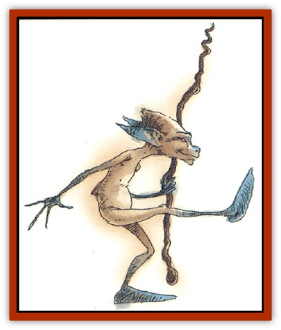

# Faerie - Petty

| Statistic | **Squeaker** | **Stwinger** |
| --- | --- | --- |
| **Activity Cycle:** | Any | Night |
| **Alignment:** | Chaotic (any) | Chaotic neutral |
| **Armor Class:** | 10 | 7 |
| **Climate/Terrain:** | Any land | Any temperate |
| **Damage/Attack:** | 1d4 | Special |
| **Diet:** | Nil | Herbivore |
| **Frequency:** | Common | Common (rare) |
| **Hit Dice:** | ½ | ½ (3 hp) |
| **Intelligence:** | Low (5-7) | High (13-14) |
| **Magic Resistance:** | Nil | Nil |
| **Morale:** | Average (8-10) | Steady (11-12) |
| **Movement:** | 12 | 6 |
| **No. Appearing:** | 2d20 | 1 (2-4) |
| **No. of Attacks:** | 1 | 2 |
| **Organization:** | Tribe | Solitary |
| **Size:** | Small (1' tall) | T (1½-2' tall) |
| **Special Attacks:** | Nil | Nil |
| **Special Defenses:** | Nil | See below |
| **THAC0:** | 20 | 20 |
| **Treasure:** | Nil | Nil |
| **XP Value:** | 15 | 15 |

## Squeakers

It is believed that squeakers were created by a wizard spell gone bad. These humanoids have disproportionately large heads and spindly bodies. They look vaguely pixielike, but they wear no clothes and display no gender.

Squeakers speak their own language and no other. Their language consists of tiny grunts, squeaks, and whistles that seem random to any but those listening through magic.

**Combat:** Squeakers attack only to annoy and aggravate their prey. Their standard tactic is to stand several yards away and throw stones, rocks, branches, etc., gaining a +2 attack bonus due to their familiarity with such weapons. When chased they lead the target into an ambush of the same nature. Squeakers rarely stand in the open when attempting to annoy their targets, but use their missile weapons from behind cover.

Squeakers attack with no apparent strategy, aiming at those who are closest to them. They do not concentrate on a single adversary, seeking to bring it down, but spread their missile over a large area.

**Habitat/Society:** The squeakers have been encountered in every comer of the globe; they do not appear to be affected by temperatures, although they shun more extreme climates. Squeakers group together with no apparent leader and work together with almost ant-like organization to irritate those who pass through what they regard as their territory. This territory is usually no larger than 1 mile on a side, but the squeakers patrol it vigilantly and harass those who enter too far into it.

**Ecology:** Since squeakers don't eat and do not appear to want anything of any real value from the environment, they have little impact on the local ecology. However, they reproduce rapidly, replenishing numbers lost to marauding animals, vengeful humanoids, and monsters.

## Stwingers

These tiny humanoids are nauseatingly cute. They speak pixie, brownie, elvish, dwarfish, and gnomish.

**Combat:** [[Stwinger|Stwingers]] do not fight; their sole purpose in life is to have fun. The most fun one can have is to swing from a beard, so dwarves are favored targets.

In "combat", a stringer exudes a pheromone that charms all within a 40-foot radius (save vs. breath weapon to negate). It then begins to swing from the beards and long hair of charmed "playmates", inflicting 1 point of damage every two rounds from swinging too hard. If a character's hit-point total falls below 50% during the encounter, a second save is allowed with a -4 penalty. Those who fail to save allow the faerie to continue to swing until the victims reach 0 hp, at which time they fall unconscious. Since stringers can't swing on a prone body, victims never fall below 0 hp.

Those who wish to attack stwingers must first make successful Charisma and Constitution checks. However, if they only wish to extract the faeries from their hair, they need not check. If a playmate's companions attack a stwinger, it casts *mirror image* (up to three times per day) and attempts to escape. If the stwinger can be convinced that it is causing harm, it will stop swinging from its playmate's hair.

**Habitat/Society:** Once every three years, all stwingers gather for a 10-day "Great Meet", where they trade and choose mates.

Stwingers can fly short distances, but only do so to leap from one playmate to the next.

**Ecology:** Stwingers have no need for treasure. If a stwinger's "charm glands" are milked while it lives or within one hour of its death, the extract can be used in a *philter of love*.

---
## Discovery & Documentation

**Source Publication:** Monstrous Compendium, 1996 Annual, Volume 3 (1995)
**Campaign Setting:** Advanced Dungeons & Dragons 2nd Edition
**Author(s):** Jon Pickens

### Other Creatures Found in This Source Book
   * [[Alaghi|Alaghi]]
   * [[Alhoon|Alhoon]]
   * [[Aranea_Savage_Coast|Aranea (Savage Coast)]]
   * [[Arcane_Head|Arcane Head]]
   * [[Banedead|Banedead]]
   * [[Banelich|Banelich]]
   * [[Bat_Bonebat|Bat, Bonebat]]
   * [[Beetle|Beetle]]
   * [[Belgoi|Belgoi]]
   * [[Bladeling|Bladeling]]
   * [[Braxat|Braxat]]
   * [[Bunyip|Bunyip]]
   * [[Burbur|Burbur]]
   * [[Bvanen|Bvanen]]
   * [[Cat_Great_Snow_Tiger|Cat, Great, Snow Tiger]]
   * [[Chosen_One|Chosen One]]
   * [[Chronovoid|Chronovoid]]
   * [[Cildabrin|Cildabrin]]
   * [[Coffer_Corpse|Coffer Corpse]]
   * [[Disenchanter|Disenchanter]]
   * [[Dog_Temporal|Dog, Temporal]]
   * [[Dragon_Cerilia|Dragon (Cerilia)]]
   * [[Dragon_Ghost|Dragon, Ghost]]
   * [[Dragon_Lesser_Undead|Dragon, Lesser Undead]]
   * [[Dragon_Neutral_Amber|Dragon, Neutral, Amber]]
   * [[Dread_Warrior|Dread Warrior]]
   * [[Dreamweaver|Dreamweaver]]
   * [[Dream_Spawn_Greater_Ennui|Dream Spawn, Greater, Ennui]]
   * [[Dream_Spawn_Lesser_Morph|Dream Spawn, Lesser, Morph]]
   * [[Dwarf_Arctic|Dwarf, Arctic]]
   * [[Dwarf_Urdunnir|Dwarf, Urdunnir]]
   * [[Eel_Giant_Moray|Eel, Giant Moray]]
   * [[Elemental_Fire_Kin_Tome_Guardian|Elemental, Fire Kin, Tome Guardian]]
   * [[Elf_Rockseer|Elf, Rockseer]]
   * [[Ethyk|Ethyk]]
   * [[Faerie_Faerie_Fiddler|Faerie, Faerie Fiddler]]
   * [[Faerie_Petty_Bramble|Faerie, Petty, Bramble]]
   * [[Faerie_Petty_Gorse|Faerie, Petty, Gorse]]
   * [[Firenewt|Firenewt]]
   * [[Formian|Formian]]
   * [[Gargoyle_II|Gargoyle II]]
   * [[Giant_Cerilia|Giant (Cerilia)]]
   * [[Goblin_Cerilia|Goblin (Cerilia)]]
   * [[Golem_Magic|Golem, Magic]]
   * [[Golem_Shaboath|Golem, Shaboath]]
   * [[Hag_Bheur|Hag, Bheur]]
   * [[Hamadryad|Hamadryad]]
   * [[Hound_of_Ill-Omen|Hound of Ill-Omen]]
   * [[Human_Cerilia|Human (Cerilia)]]
   * [[Hybsil|Hybsil]]
   * [[Ibrandlin|Ibrandlin]]
   * [[Imp_Chaos|Imp, Chaos]]
   * [[Ixitxachitl_Ixzan|Ixitxachitl, Ixzan]]
   * [[Jabberwock|Jabberwock]]
   * [[Kyton|Kyton]]
   * [[Kyuss_Son_of|Kyuss, Son of]]
   * [[Lillend|Lillend]]
   * [[Life-Shaped_Creation_Guardian|Life-Shaped Creation, Guardian]]
   * [[Life-Shaped_Creation_Transport|Life-Shaped Creation, Transport]]
   * [[Lycanthrope_Werecrocodile|Lycanthrope, Werecrocodile]]
   * [[Lycanthrope_Werespider|Lycanthrope, Werespider]]
   * [[Magedoom|Magedoom]]
   * [[Manotaur|Manotaur]]
   * [[Mastiff_Shadow|Mastiff, Shadow]]
   * [[Meazel|Meazel]]
   * [[Mist_Scarlet_Dancer|Mist, Scarlet Dancer]]
   * [[Needleman|Needleman]]
   * [[Orc_Neo-Orog|Orc, Neo-Orog]]
   * [[Orc_Ondonti|Orc, Ondonti]]
   * [[Owlbear_II|Owlbear II]]
   * [[Pegataur|Pegataur]]
   * [[Phaerimm|Phaerimm]]
   * [[Reggelid|Reggelid]]
   * [[Render|Render]]
   * [[Saurial|Saurial]]
   * [[Scalamagdrion|Scalamagdrion]]
   * [[Sharn|Sharn]]
   * [[Snake_Messenger|Snake, Messenger]]
   * [[Spirit_Forest_Uthraki|Spirit, Forest, Uthraki]]
   * [[Spirit_Forest_Wood_Man|Spirit, Forest, Wood Man]]
   * [[Spirit_Ice_Orglash|Spirit, Ice, Orglash]]
   * [[Spirit_Rock_Thomil|Spirit, Rock, Thomil]]
   * [[Strider_Giant|Strider, Giant]]
   * [[Tembo|Tembo]]
   * [[Temporal_Glider|Temporal Glider]]
   * [[Temporal_Stalker|Temporal Stalker]]
   * [[Tether_Beast|Tether Beast]]
   * [[Thessalmonster|Thessalmonster]]
   * [[Time_Dimensional|Time Dimensional]]
   * [[Tomb_Tapper|Tomb Tapper]]
   * [[Undead_Dragon_Slayer|Undead Dragon Slayer]]
   * [[Unicorn_Black_Toril|Unicorn, Black (Toril)]]
   * [[Vaath|Vaath]]
   * [[Vortex_Spider|Vortex Spider]]
   * [[Weredragon|Weredragon]]
   * [[Zhentarim_Spirit|Zhentarim Spirit]]
