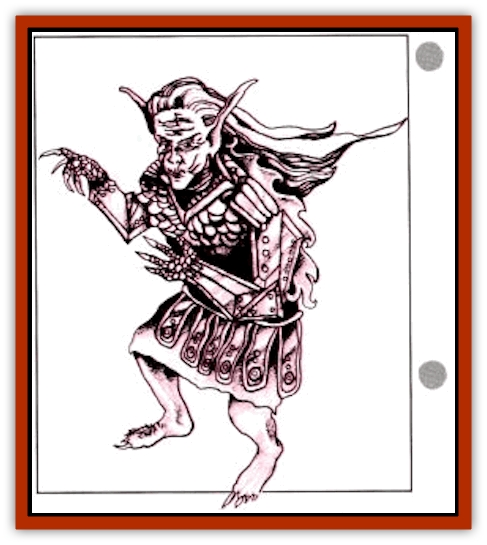

# Faerie - Petty - Bramble

| Statistic | **Faerie, Petty, Bramble** |
| --- | --- |
| **Activity Cycle:** | Day |
| **Alignment:** | Neutral evil |
| **Armor Class:** | 2 (8 without armor) |
| **Climate/Terrain:** | Subarctic to temperate grasslands, hills, and plains |
| **Damage/Attack:** | 1d6 |
| **Diet:** | Omnivore |
| **Frequency:** | Rare |
| **Hit Dice:** | 2 hp |
| **Intelligence:** | Very (11-12) |
| **Magic Resistance:** | 5% |
| **Morale:** | Steady (12) |
| **Movement:** | 3 |
| **No. Appearing:** | 2-16 |
| **No. of Attacks:** | 1 |
| **Organization:** | Nomadic band |
| **Size:** | T (3' tall) |
| **Special Attacks:** | Poison |
| **Special Defenses:** | Minor spell use |
| **THAC0:** | 20 |
| **Treasure:** | O,Q |
| **XP Value:** | 65 (175 with poison) |

The tiny bramble among the most aggressive and vicious of all faeries. Rumor has it that the first brambles were individual outcasts from "polite" faerie society (their size, name, and fixation with pointy things makes the [[Faerie_Petty_Gorse|gorse]] their likely ancestor).

Brambles look like tiny, dried-out people, with dark, wrinkled skin, long, pointed fingers and toe nails, ears with much sharper points than elves', and - sticking out of their backs - a brace of spines that look like they should support miniature dragon wings, but which are bare. Under normal circumstances brambles wear small suits of spiked plate mail armor; the wing spines that come out of holes in the armor's backplate are often mistaken for longer versions of the artificial spines covering the rest of the bramble's armor.

They speak their own language, as well as the languages of most other faerie creatures.

**Combat:** The spine-covered armor of a bramble is both its best defense and its strongest attack. The armor provides AC 2 protection, and the barbs on its surface prevent other creatures from coming too close to the wearer; any animal that attempts to bite or eat a bramble suffers an automatic 1d4 damage, as would any humanoid trying to pick up a bramble with bare hands. Protected attackers must roll above the AC value of the armor covering their hands on 1d12 to avoid injury; Dexterity and shield bonuses do not apply.

To attack with its spines, a bramble merely hurls itself against a foe; using normal attack and damage rolls. A bramble will wrestle opponents close to its own height (1 foot or less), causing 1d2 points of damage per round in addition to the wrestling results.

One bramble in ten wields poison. The wing spines of these brambles secrete a strong poison that causes a painful burning sensation (-2 on attack and damage rolls for 2d10 rounds, with additional doses having cumulative effects). A successful saving throw vs. poison with a -3 penalty halves both the effect and duration. As these brambles are perfectly willing to use this poison on dissenting members of their own bands, these special brambles are generally the leader in any group.

Finally, brambles are often found riding an odd selection of animals. It is not uncommon to come upon a band riding a collection of porcupines, hengehogs, [[Al-Mi'raj|al'mirajs]], and other creatures, looking like bizarre [[Sprite|pixie]] knights in their nomadic wan

---
## Discovery & Documentation

**Source Publication:** Monstrous Compendium, 1996 Annual, Volume 3 (1995)
**Campaign Setting:** Advanced Dungeons & Dragons 2nd Edition
**Author(s):** Jon Pickens

### Other Creatures Found in This Source Book
   * [[Alaghi|Alaghi]]
   * [[Alhoon|Alhoon]]
   * [[Aranea_Savage_Coast|Aranea (Savage Coast)]]
   * [[Arcane_Head|Arcane Head]]
   * [[Banedead|Banedead]]
   * [[Banelich|Banelich]]
   * [[Bat_Bonebat|Bat, Bonebat]]
   * [[Beetle|Beetle]]
   * [[Belgoi|Belgoi]]
   * [[Bladeling|Bladeling]]
   * [[Braxat|Braxat]]
   * [[Bunyip|Bunyip]]
   * [[Burbur|Burbur]]
   * [[Bvanen|Bvanen]]
   * [[Cat_Great_Snow_Tiger|Cat, Great, Snow Tiger]]
   * [[Chosen_One|Chosen One]]
   * [[Chronovoid|Chronovoid]]
   * [[Cildabrin|Cildabrin]]
   * [[Coffer_Corpse|Coffer Corpse]]
   * [[Disenchanter|Disenchanter]]
   * [[Dog_Temporal|Dog, Temporal]]
   * [[Dragon_Cerilia|Dragon (Cerilia)]]
   * [[Dragon_Ghost|Dragon, Ghost]]
   * [[Dragon_Lesser_Undead|Dragon, Lesser Undead]]
   * [[Dragon_Neutral_Amber|Dragon, Neutral, Amber]]
   * [[Dread_Warrior|Dread Warrior]]
   * [[Dreamweaver|Dreamweaver]]
   * [[Dream_Spawn_Greater_Ennui|Dream Spawn, Greater, Ennui]]
   * [[Dream_Spawn_Lesser_Morph|Dream Spawn, Lesser, Morph]]
   * [[Dwarf_Arctic|Dwarf, Arctic]]
   * [[Dwarf_Urdunnir|Dwarf, Urdunnir]]
   * [[Eel_Giant_Moray|Eel, Giant Moray]]
   * [[Elemental_Fire_Kin_Tome_Guardian|Elemental, Fire Kin, Tome Guardian]]
   * [[Elf_Rockseer|Elf, Rockseer]]
   * [[Ethyk|Ethyk]]
   * [[Faerie_Faerie_Fiddler|Faerie, Faerie Fiddler]]
   * [[Faerie_Petty_Gorse|Faerie, Petty, Gorse]]
   * [[Faerie_Petty|Faerie, Petty]]
   * [[Firenewt|Firenewt]]
   * [[Formian|Formian]]
   * [[Gargoyle_II|Gargoyle II]]
   * [[Giant_Cerilia|Giant (Cerilia)]]
   * [[Goblin_Cerilia|Goblin (Cerilia)]]
   * [[Golem_Magic|Golem, Magic]]
   * [[Golem_Shaboath|Golem, Shaboath]]
   * [[Hag_Bheur|Hag, Bheur]]
   * [[Hamadryad|Hamadryad]]
   * [[Hound_of_Ill-Omen|Hound of Ill-Omen]]
   * [[Human_Cerilia|Human (Cerilia)]]
   * [[Hybsil|Hybsil]]
   * [[Ibrandlin|Ibrandlin]]
   * [[Imp_Chaos|Imp, Chaos]]
   * [[Ixitxachitl_Ixzan|Ixitxachitl, Ixzan]]
   * [[Jabberwock|Jabberwock]]
   * [[Kyton|Kyton]]
   * [[Kyuss_Son_of|Kyuss, Son of]]
   * [[Lillend|Lillend]]
   * [[Life-Shaped_Creation_Guardian|Life-Shaped Creation, Guardian]]
   * [[Life-Shaped_Creation_Transport|Life-Shaped Creation, Transport]]
   * [[Lycanthrope_Werecrocodile|Lycanthrope, Werecrocodile]]
   * [[Lycanthrope_Werespider|Lycanthrope, Werespider]]
   * [[Magedoom|Magedoom]]
   * [[Manotaur|Manotaur]]
   * [[Mastiff_Shadow|Mastiff, Shadow]]
   * [[Meazel|Meazel]]
   * [[Mist_Scarlet_Dancer|Mist, Scarlet Dancer]]
   * [[Needleman|Needleman]]
   * [[Orc_Neo-Orog|Orc, Neo-Orog]]
   * [[Orc_Ondonti|Orc, Ondonti]]
   * [[Owlbear_II|Owlbear II]]
   * [[Pegataur|Pegataur]]
   * [[Phaerimm|Phaerimm]]
   * [[Reggelid|Reggelid]]
   * [[Render|Render]]
   * [[Saurial|Saurial]]
   * [[Scalamagdrion|Scalamagdrion]]
   * [[Sharn|Sharn]]
   * [[Snake_Messenger|Snake, Messenger]]
   * [[Spirit_Forest_Uthraki|Spirit, Forest, Uthraki]]
   * [[Spirit_Forest_Wood_Man|Spirit, Forest, Wood Man]]
   * [[Spirit_Ice_Orglash|Spirit, Ice, Orglash]]
   * [[Spirit_Rock_Thomil|Spirit, Rock, Thomil]]
   * [[Strider_Giant|Strider, Giant]]
   * [[Tembo|Tembo]]
   * [[Temporal_Glider|Temporal Glider]]
   * [[Temporal_Stalker|Temporal Stalker]]
   * [[Tether_Beast|Tether Beast]]
   * [[Thessalmonster|Thessalmonster]]
   * [[Time_Dimensional|Time Dimensional]]
   * [[Tomb_Tapper|Tomb Tapper]]
   * [[Undead_Dragon_Slayer|Undead Dragon Slayer]]
   * [[Unicorn_Black_Toril|Unicorn, Black (Toril)]]
   * [[Vaath|Vaath]]
   * [[Vortex_Spider|Vortex Spider]]
   * [[Weredragon|Weredragon]]
   * [[Zhentarim_Spirit|Zhentarim Spirit]]
