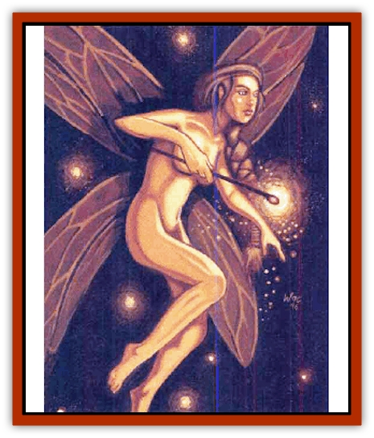

# Faerie - Petty - Gorse

| Statistic | **Faerie, Petty, Gorse** |
| --- | --- |
| **Activity Cycle:** | Day |
| **Alignment:** | Neutral |
| **Armor Class:** | 6 (2 if flying) |
| **Climate/Terrain:** | Subarctic to temperate grasslands, hills, and prairies |
| **Damage/Attack:** | 1 point (weapon) |
| **Diet:** | Herbivore |
| **Frequency:** | Uncommon |
| **Hit Dice:** | 1 hp |
| **Intelligence:** | Very (11-12) |
| **Magic Resistance:** | 5% |
| **Morale:** | Average (8) |
| **Movement:** | 3, Fl 12 (A) |
| **No. Appearing:** | 5-40 |
| **No. of Attacks:** | 1 at +2 |
| **Organization:** | Tribe |
| **Size:** | T (3&rdquo; tall) |
| **Special Attacks:** | Poison |
| **Special Defenses:** | Cantrips, lair trap |
| **THAC0:** | 20 |
| **Treasure:** | Nil (O,P,Q,S) |
| **XP Value:** | 270 |

The smallest of the faerie folk, and in some respects the most beautiful, are the gorse. Averaging one-quarter of the height of a full-grown atomic, the gorse must be secretive and unobtrusive to survive.

Gorse have the proportions and physical attributes of human children, though they are fully mature, with the only differences being their height, their delicate wings, and their slightly pointed ears. They have no antennae, and their simple clothing is no different in appearance than that of most humans or elves. They prefer dressing in shades of green and yellow to blend in with their surroundings, which are most often gorse, a prickly evergreen shrub with yellow flowers.

Gorse have their own language, hut are willing and able to speak the tongues of sprites or pixies.

**Combat:** Aside from using the defenses of their thorny homes, gorse use a number of weapons, all of which they manufacture from the bushes they tend. They have minute bows with a 30-foot range, tiny spears (1O-foot range) and minuscule swords, all of which inflict 1 point of damage. The weapons' fine points and the skill with which the gorse use them give these tiny creatures a +2 bonus to theu attack rolls. Also, 10% of gorse arrows will be coated with a weak poison that causes *confusion* for 2d4 rounds if the victim fails a saving throw vs. poison.

In addition to their weapons, gorse have limited magical abilities and defenses available. Each day, a gorse can cast one *mirror image*, as the 2nd-level wizard spell, and three minor magical effects. Each of minor effect occurs if performed with the 1st-level wizard spell *cantrip*, and each takes place in its entirety within the round it is cast. Typical uses include:

<ul><li>*Distract:* Causes anyone watching the gorse to look at an area of the caster's choice within 10 feet, those of average intelligence or better receive a saving throw;</li><li>*Exterminate:* Kills a single creature no larger than a field mouse, or all insect-sized creatures in a ½ cubic foot area, magical or enchanted creatures receive a saving throw vs. death magic;</li><li>*Sprout:* Causes thornbushes in a 1 cubic yard area to add an inch of new growth (good for blocking a minature path).</li></ul>One gorse in ten can cast one *spike growth* and one *goodberry* spell each day These are used either to defend the lair or to bribe intelligent creatures not to attack them.

**Habitat/Society:** Gorse dwell in the green, thorny flower bushes from which they take their name; their lairs are forbidding to most predators too large to maneuver through the thorns as the gorse do.

Creatures larger than twice gorse size trying to enter their bushes take damage equal to 1 hit point per round if Armor Class 6 to 10, or 1 point every other round if Armor Class 4 to 5. Movement rates through gorse bushes of beings of size S to L are slowed to one-quarter normal; larger and smaller beings are unhampered. If threatened, gorse will retreat deeper into their bushes, luring attackers through the most thickly thorned regions and possibly over logs, pits, and other hard-to-see natural obstacles.

**Ecology:** Although they must he wary of bigger folk - and almost all creatures are big to them - gorse can be persuaded to deal with woodland dwellers ([[Dryad|dryads]], [[Satyr|satyrs]], [[Centaur|centaurs]], etc.), humans, and demihumans who bring them gifts of fresh fruit bread, honey, or milk. They become protective of any who do them favors, such as druids who defeat menacing beasts or elves who stop forest fires. Often a gorse tribe will send a few members to accompany its larger allies for the duration of the latter's stay near their lair.

Some gorse tribes have magical potions in their lairs. Because of their small size, one potion can affect 20 gorse. Thus, it is not uncommon to find a large group of these faeries who can *polymorph* themselves, *resist fire*, or turn *rainbow hues* at will for short periods of time. Potions that affect others, such as various *control* potions, work only if all the gorse who drank part of it concentrate on the potion effect at once. Consequently, these potions often lie undisturbed in their hoards and will often he traded for more useful ones or used as bribes or rewards for bigger folk.

---
## Discovery & Documentation

**Source Publication:** Monstrous Compendium, 1996 Annual, Volume 3 (1995)
**Campaign Setting:** Advanced Dungeons & Dragons 2nd Edition
**Author(s):** Jon Pickens

### Other Creatures Found in This Source Book
   * [[Alaghi|Alaghi]]
   * [[Alhoon|Alhoon]]
   * [[Aranea_Savage_Coast|Aranea (Savage Coast)]]
   * [[Arcane_Head|Arcane Head]]
   * [[Banedead|Banedead]]
   * [[Banelich|Banelich]]
   * [[Bat_Bonebat|Bat, Bonebat]]
   * [[Beetle|Beetle]]
   * [[Belgoi|Belgoi]]
   * [[Bladeling|Bladeling]]
   * [[Braxat|Braxat]]
   * [[Bunyip|Bunyip]]
   * [[Burbur|Burbur]]
   * [[Bvanen|Bvanen]]
   * [[Cat_Great_Snow_Tiger|Cat, Great, Snow Tiger]]
   * [[Chosen_One|Chosen One]]
   * [[Chronovoid|Chronovoid]]
   * [[Cildabrin|Cildabrin]]
   * [[Coffer_Corpse|Coffer Corpse]]
   * [[Disenchanter|Disenchanter]]
   * [[Dog_Temporal|Dog, Temporal]]
   * [[Dragon_Cerilia|Dragon (Cerilia)]]
   * [[Dragon_Ghost|Dragon, Ghost]]
   * [[Dragon_Lesser_Undead|Dragon, Lesser Undead]]
   * [[Dragon_Neutral_Amber|Dragon, Neutral, Amber]]
   * [[Dread_Warrior|Dread Warrior]]
   * [[Dreamweaver|Dreamweaver]]
   * [[Dream_Spawn_Greater_Ennui|Dream Spawn, Greater, Ennui]]
   * [[Dream_Spawn_Lesser_Morph|Dream Spawn, Lesser, Morph]]
   * [[Dwarf_Arctic|Dwarf, Arctic]]
   * [[Dwarf_Urdunnir|Dwarf, Urdunnir]]
   * [[Eel_Giant_Moray|Eel, Giant Moray]]
   * [[Elemental_Fire_Kin_Tome_Guardian|Elemental, Fire Kin, Tome Guardian]]
   * [[Elf_Rockseer|Elf, Rockseer]]
   * [[Ethyk|Ethyk]]
   * [[Faerie_Faerie_Fiddler|Faerie, Faerie Fiddler]]
   * [[Faerie_Petty_Bramble|Faerie, Petty, Bramble]]
   * [[Faerie_Petty|Faerie, Petty]]
   * [[Firenewt|Firenewt]]
   * [[Formian|Formian]]
   * [[Gargoyle_II|Gargoyle II]]
   * [[Giant_Cerilia|Giant (Cerilia)]]
   * [[Goblin_Cerilia|Goblin (Cerilia)]]
   * [[Golem_Magic|Golem, Magic]]
   * [[Golem_Shaboath|Golem, Shaboath]]
   * [[Hag_Bheur|Hag, Bheur]]
   * [[Hamadryad|Hamadryad]]
   * [[Hound_of_Ill-Omen|Hound of Ill-Omen]]
   * [[Human_Cerilia|Human (Cerilia)]]
   * [[Hybsil|Hybsil]]
   * [[Ibrandlin|Ibrandlin]]
   * [[Imp_Chaos|Imp, Chaos]]
   * [[Ixitxachitl_Ixzan|Ixitxachitl, Ixzan]]
   * [[Jabberwock|Jabberwock]]
   * [[Kyton|Kyton]]
   * [[Kyuss_Son_of|Kyuss, Son of]]
   * [[Lillend|Lillend]]
   * [[Life-Shaped_Creation_Guardian|Life-Shaped Creation, Guardian]]
   * [[Life-Shaped_Creation_Transport|Life-Shaped Creation, Transport]]
   * [[Lycanthrope_Werecrocodile|Lycanthrope, Werecrocodile]]
   * [[Lycanthrope_Werespider|Lycanthrope, Werespider]]
   * [[Magedoom|Magedoom]]
   * [[Manotaur|Manotaur]]
   * [[Mastiff_Shadow|Mastiff, Shadow]]
   * [[Meazel|Meazel]]
   * [[Mist_Scarlet_Dancer|Mist, Scarlet Dancer]]
   * [[Needleman|Needleman]]
   * [[Orc_Neo-Orog|Orc, Neo-Orog]]
   * [[Orc_Ondonti|Orc, Ondonti]]
   * [[Owlbear_II|Owlbear II]]
   * [[Pegataur|Pegataur]]
   * [[Phaerimm|Phaerimm]]
   * [[Reggelid|Reggelid]]
   * [[Render|Render]]
   * [[Saurial|Saurial]]
   * [[Scalamagdrion|Scalamagdrion]]
   * [[Sharn|Sharn]]
   * [[Snake_Messenger|Snake, Messenger]]
   * [[Spirit_Forest_Uthraki|Spirit, Forest, Uthraki]]
   * [[Spirit_Forest_Wood_Man|Spirit, Forest, Wood Man]]
   * [[Spirit_Ice_Orglash|Spirit, Ice, Orglash]]
   * [[Spirit_Rock_Thomil|Spirit, Rock, Thomil]]
   * [[Strider_Giant|Strider, Giant]]
   * [[Tembo|Tembo]]
   * [[Temporal_Glider|Temporal Glider]]
   * [[Temporal_Stalker|Temporal Stalker]]
   * [[Tether_Beast|Tether Beast]]
   * [[Thessalmonster|Thessalmonster]]
   * [[Time_Dimensional|Time Dimensional]]
   * [[Tomb_Tapper|Tomb Tapper]]
   * [[Undead_Dragon_Slayer|Undead Dragon Slayer]]
   * [[Unicorn_Black_Toril|Unicorn, Black (Toril)]]
   * [[Vaath|Vaath]]
   * [[Vortex_Spider|Vortex Spider]]
   * [[Weredragon|Weredragon]]
   * [[Zhentarim_Spirit|Zhentarim Spirit]]
