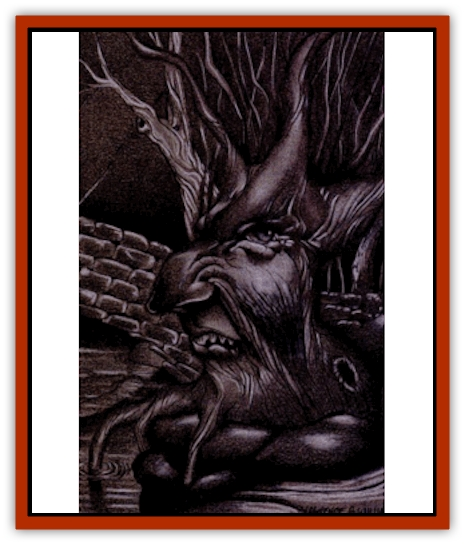
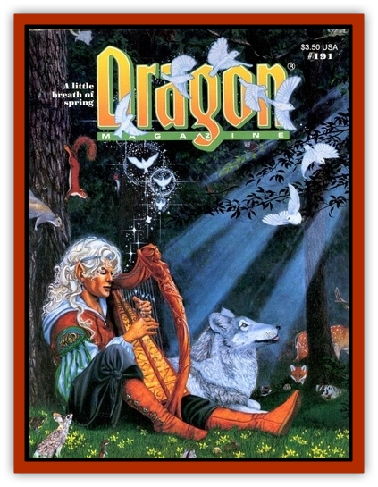

# Faerie Phiz

| Statistic | **Faerie Phiz** |
| --- | --- |
| **Activity Cycle:** | Any |
| **Alignment:** | Any |
| **Armor Class:** | 0 |
| **Climate/Terrain:** | Sylvan settings |
| **Damage/Attack:** | 2-24 (bite) |
| **Diet:** | Omnivore |
| **Frequency:** | Very rare |
| **Hit Dice:** | 10-12 |
| **Intelligence:** | Very to godlike (11-21+) |
| **Magic Resistance:** | 5% per hit dice |
| **Morale:** | Fearless (19-20) |
| **Movement:** | 0 |
| **No. Appearing:** | 1 |
| **No. of Attacks:** | 1 |
| **Organization:** | Solitary |
| **Size:** | S to L |
| **Special Attacks:** | Spell use |
| **Special Defenses:** | Camouflage, spit |
| **THAC0:** | Variable (as wizard) |
| **Treasure:** | Q,T |
| **XP Value:** | Leafling: 7,000 / Woodmaster: 8,000 / Treelord: 9,000 |

The faerie phiz is a mystical entity similar in nature to a [[Treant|treant]] or [[Galeb_Duhr|galeb duhr]]. The faerie phiz is a magical being found exclusively in sylvan woods and faerie settings, or in the kingdoms of [[Elf|elves]]. The fey phiz, as it is sometimes called, is simply a face (the old elven word for "face" being "phiz") found on magically enchanted wooden surfaces. The faerie phiz appears for the most part on trees of the woodland, although it has been seen on old, large wooden doors, enchanted houses, bridges, drawbridges, and other old, large, wooden structures. The phiz is detectable only 25% of the time (50% for druids and elves) when its eyes and mouth are closed; thus, it is effectively camouflaged. The phiz may appear on any sort of wood, although oak is most common.

The visage of the faerie phiz and its features range anywhere in size from that of the smallest pixie to the visage of hill giant size. The phiz is usually quite striking, and no two are alike in personality or looks, although it is said that once in a thousand years twins may occur. Sages who study the lost and rare philosophy of phizonomie (the arcane study of judging character from facial features and sometimes the art of divination based on such) agree that the phiz are created through the vicissitude of great and potent overflows of faerie magic. Sages also believe that the destruction of a powerful wizard may cause the transference of his power to the area at the moment of his death, resulting in the magical growth of the fey phiz later. The phiz may be dour and ugly or simply bear a visage similar to that of a treant. It may also bear the characteristics of elven faces or other faerie creatures, but these sort are not as common, although these are the most advertised sort in city taverns and gossip haunts.

**Combat:** The phiz, like the treant, abhors fire, but it does not fear it as most treants do. The phiz spits on any fire within range and often on anyone bearing a torch or lighting a campfire. The spit, a magical acidic resin secreted by the faerie phiz, causes all fires smaller than 2½' in diameter to be completely extinguished. The saliva of the phiz also affects any live target as if an *irritation* spell had been cast on it, with the effects of both itching and rash occurring. The phiz may spit at any point within a distance of up to 100 yards within a clear line of sight.

The faerie phiz's attack form is spell use. The phiz is capable of casting spells as a wizard and druid at a level equal to its hit dice. The phiz gains spells by merely observing someone cast them, then remembering them. Any spells appropriate to its type so witnessed are transferred to its memory, which serves as a spell book. The Phiz must still take time to study the spells in its mind, attempting to recall them from its extensive memory. The lowest hit-die phiz will have spells available as a 10th-level wizard or druid; for every additional hit die, it gains one level of spell-casting ability to a maximum of 12th level. The spells are converted to verbal components, and no memorized spells are ever fire-based. The phiz may not specialize in specific schools of magic as a character would.

**Habitat/Society:** The phiz has a very long life span. It may often live to be over 1,500 years old if left undisturbed. An individual phiz increases in hit dice every 100-500 years that it lives, increasing its magic resistance and spell-casting ability as well. The phiz grows in magical glades and in places where [[Sprite|pixies]], [[Sprite|sprites]], and other sorts of faeries frolic; it is on excellent terms with treants. The phiz always has an extensive knowledge of an area's history and memories of anyone who has ever passed before its eyes. It is capable of remembering entire conversations that may have occurred throughout the span of its life. It is also prone to know volumes of lore and speak many languages that no human or elf can even hope to find nowadays, much less remember.

**Ecology:** The phiz is not disposed to give its sagelike knowledge to anyone because it does not wish to be haunted by every philosopher and sage in the realm. A phiz is rarely senile despite its great age, although to fool some seekers it pretends to be. The phiz is reclusive and often acts old and weary or irritated with the intrusion of its privacy. The phiz is not afraid of death (a few even welcome it) and cannot be tricked or forced to reveal knowledge and information by threats or coercion, It would rather die by the axe than give information to those arrogant enough to threaten it. The phiz is disinterested in wealth and often laughs at those foolish enough to promise gold and riches. The only way to receive any information from a faerie phiz, other than its possible willingness to divulge it anyhow, is to offer it powerful magical items or rich faerie food � a very dangerous proposition.

This faerie food may only be found through a few very dangerous methods. One such method is to seek out and join a faerie ring. A faerie ring is a circle of mushrooms where tiny faeries, such as [[Sprite|atomies]], [[Sprite|grigs]], [[Brownie|brownies]], pixies, and sprites commonly dance. The seeker has only to enter the circle, then dance or sing for a few minutes in hopes of being offered some food. The food appears to be bread, cheese, fowl, beef, or vegetable dishes of the normal kind, only made by faerie hands. It is harmless and very delicious. The dance seems to last for but a few moments, but thanks to the magic of the faerie ring has a 40% chance of taking seven years in human time. The seeker may also look for a faerie hill, entering only by the graceful invitation of its tiny inhabitants. Once inside, the seeker should be careful not to eat or drink any of the delicious food or wine of the faeries. The seeker is faced with inescapable imprisonment if he so much as tastes one morsel of the heavenly food. The taster is usually polymorphed into a faerie or serves as a slave to the more evil and vile faeries, such as the [[Elf_Drow|drow]] or the [[Brownie_Quickling|quickling]]. [[Dryad|Dryads]] sometimes lure seekers with such foods, but the danger of capture still remains.

In any event, the phiz is only hungry once a human year. A year to a human is only a single day for the phiz, so it does not hunger often. The phiz is usually hungry during a season particularly pleasing to it such as spring, for those of good alignment, or winter, for those of evil alignment. The food is not actually eaten all at once but is stored (like a squirrel's trove of nuts) inside the phiz in its extra-dimensional stomach. The phiz nibbles on this supply for an entire year. This and the fact that the correct food is hard to attain without dire consequences keeps most adventurers away from the phiz, much to its delight. The phiz is fed by sprites and other fey folk and as a result never goes hungry, despite the lack of seekers.

---
## Discovery & Documentation

**Source Publication:** Dragon191 (1993)
**Campaign Setting:** Dragon Magazine
**Author(s):** Richard A. Hunt, L.A. Williams
