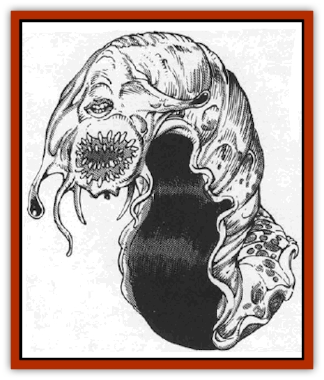

# Fal

| Statistic | **Fal** |
| --- | --- |
| **Activity Cycle:** | Any |
| **Alignment:** | Lawful neutral |
| **Armor Class:** | 1 |
| **Climate/Terrain:** | Wildspace |
| **Damage/Attack:** | 4d8 |
| **Diet:** | Herbivore |
| **Frequency:** | Very rare |
| **Hit Dice:** | 15 |
| **Intelligence:** | Supra-genius (19) |
| **Magic Resistance:** | Nil |
| **Morale:** | Elite (15) |
| **Movement:** | 9, Fl 3 (E), Br 6 |
| **No. Appearing:** | 1 |
| **No. of Attacks:** | 1 |
| **Organization:** | Solitary |
| **Size:** | G (50'+ long) |
| **Special Attacks:** | Nil |
| **Special Defenses:** | Nil |
| **THAC0:** | 6 |
| **Treasure:** | F,T |
| **XP Value:** | 6,000 |

The Falmadaraatha (or "Fal" for short) are huge, slug-like creatures that dwell inside hollow, lifeless asteroids. They are among several races that share the title "scholars of wildspace".

The Fal have large, soft, pulpy bodies that change from light tan at birth to jet black at the end of life. At the fore end of their bodies, they have a pair of small sensory antennae, bulbous eyes, a massive mouth filled with sharp teeth ideal for burrowing, and a smaller mouth above it, use for speech.

These gentle, brilliant, inoffensive giants burrow through small planets that contain no sentient life and make their lairs inside. They speak their own tongue, as well as Common and most human, demi-human and humanoid languages.

**Combat:** Although the Fal find combat offensive, considering it the final refuge of the incompetent, they are perfectly capable of defending themselves with a ferocious bite that inflicts 4d8 damage.

On an unmodified to-hit roll of 20, the Fal catches its opponent in its mouth. The Fal does not swallow, until it tries to persuade the foe to surrender in a peaceful manner. Should the foe agree to surrender, then renege on its word, the Fal attacks with no quarter. To the Fal a promise is sacred.

All Fal are telekinesic. A Fal can lift 1,000 pounds in this way and, if it arts first, tries to neutralize an opponent by simply lifting and holding it about 30' off the floor until the opponent stops fighting. A successful hit on the Fal breaks its concentration, and the victim falls hard.

**Habitat/Society:** The Fal are solitary, though there is a 5% chance of encountering 1d3 of these massive beings inside one asteroid. chatting away about philosophy, metaphysics, or the state of the multiverse. As a rule, the Fal are peaceful, honest, hospitable geniuses.

Despite this solitude, the Fal enjoy polite company, provided it does not visit of ten. (To a Fal more than once a year is "often".) Any alignment may visit, though the Fal are wary around chaotic evil and lawful good beings. The Fal consider these two alignments too extreme in their philosophies.

The Fal have a well-deserved reputation as some of the best sages in the multiverse. They answer questions in exchange for gifts worth more than 100 gp, anything from a bottle of fine wine to a book or a painting. Unlike normal sages, however, the Fal do not limit themselves to one or two subjects. This, they say, denies the opportunity to learn all the multiverse has to offer. Hence, any question asked of a Fal may be answered immediately (30% chance), within 1d10 days (30% chance), in 1d10 months (30%), or 1d10 years (10%) - but, if answerable, it will be answered.

The Fal lair (called a *tcha*) is surprisingly comfortable. Most Fal decorate the tcha with accurate maps of planets and regions of space, massive bookshelves, and little trinkets that grateful visitors exchange for the answer to a question. Two types of plants usually grow inside a tcha: a phosphorescent fungus for illumination, and hardy greens that make up the Fal's diet. Many Fal also enjoy fine wine and keep a well-stocked "cellar". Predominant in the tcha are books - lots of books, old and new, in different languages.

The Fal live at least 2000 years. To them, a year is like a day, so they take things slowly. Many peple mistakenly think the Fal stupid, since the slugs talk so slowly. They believe hasty words bring bad results.

The Fal often associate with the [[Gonn|Gonn]] for discourse and the [[Arcane|Arcane]] for research material and books. The Fal are suspicious of [[Aperusa|Aperusa]], but they delight in [[Gnome_Tinker|tinker gnomes]].

The Fal venerate three gods above all others: Deneir, Thoth, and Oghma.

**Ecology:** There is no romance in the Fal society. The Fal are hermaphroditic, each Fal responsible for creating a "pupil" at some point, tutoring it, and sending it on its way. No one has ever seen a Fal pupil, however. It is possible that the Fal do not take questions when they are training a pupil.

---
## Discovery & Documentation

**Source Publication:** MC9 Spelljammer Appendix II (1991)
**Campaign Setting:** Planescape
**Author(s):** Scott Davis, Newton Ewell, John Terra

### Other Creatures Found in This Source Book
   * [[Alchemy_Plant|Alchemy Plant]]
   * [[Allura|Allura]]
   * [[Aperusa|Aperusa]]
   * [[Autognome|Autognome]]
   * [[Bionoid|Bionoid]]
   * [[Bloodsac|Bloodsac]]
   * [[Buzzjewel|Buzzjewel]]
   * [[Constellate|Constellate]]
   * [[Contemplator|Contemplator]]
   * [[Dohwar|Dohwar]]
   * [[Dragon_Moon|Dragon, Moon]]
   * [[Dragon_Stellar|Dragon, Stellar]]
   * [[Dragon_Sun|Dragon, Sun]]
   * [[Dreamslayer|Dreamslayer]]
   * [[Dweomerborn|Dweomerborn]]
   * [[Feesu|Feesu]]
   * [[Fire_Bat|Fire Bat]]
   * [[Firebird|Firebird]]
   * [[Firelich|Firelich]]
   * [[Flowfiend|Flowfiend]]
   * [[Gadabout|Gadabout]]
   * [[Gammaroid|Gammaroid]]
   * [[Gonn|Gonn]]
   * [[Gossamer|Gossamer]]
   * [[Grav|Grav]]
   * [[Great_Dreamer|Great Dreamer]]
   * [[Greatswan|Greatswan]]
   * [[Grell_Colonial|Grell, Colonial]]
   * [[Gullion|Gullion]]
   * [[Insectare|Insectare]]
   * [[Lhee|Lhee]]
   * [[Mercurial_Slime|Mercurial Slime]]
   * [[Meteorspawn|Meteorspawn]]
   * [[Monitor|Monitor]]
   * [[Owl_Space|Owl, Space]]
   * [[Pristatic|Pristatic]]
   * [[Scro|Scro]]
   * [[Selkie_Star|Selkie, Star]]
   * [[Silatic|Silatic]]
   * [[Skullbird|Skullbird]]
   * [[Sleek|Sleek]]
   * [[Sluk|Sluk]]
   * [[Space_Swine|Space Swine]]
   * [[Sphinx_Astro-|Sphinx, Astro-]]
   * [[Spirit_Warrior|Spirit Warrior]]
   * [[Starfly_Plant|Starfly Plant]]
   * [[Stargazer|Stargazer]]
   * [[Undead_Stellar|Undead, Stellar]]
   * [[Witchlight_Marauder|Witchlight Marauder]]
   * [[Xixchil|Xixchil]]
   * [[Yitsan|Yitsan]]
   * [[Zurchin|Zurchin]]
