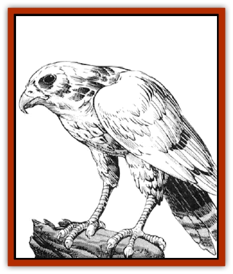

# Falcon - Fire

| Statistic | **Falcon, Fire** |
| --- | --- |
| **Activity Cycle:** | Day |
| **Alignment:** | Neutral |
| **Armor Class:** | 4 |
| **Climate/Terrain:** | Any desert, mountain or tundra |
| **Damage/Attack:** | 1-3/1-3/1-2/1-2/1-2 |
| **Diet:** | Carnivore |
| **Frequency:** | Uncommon |
| **Hit Dice:** | 1 |
| **Intelligence:** | Animal (1) |
| **Magic Resistance:** | Nil |
| **Morale:** | Steady (11), Fanatic (18) when guarding young |
| **Movement:** | 3, Fl 36 (C) |
| **No. Appearing:** | 2-6 |
| **No. of Attacks:** | 5 |
| **Organization:** | Family |
| **Size:** | S (2'6&rdquo; wingspan, 8&rdquo; body) |
| **Special Attacks:** | Fire |
| **Special Defenses:** | Immune to fire-based attacks |
| **THAC0:** | 20 |
| **Treasure:** | Q |
| **XP Value:** | 270 |

The fire falcon is a small russet-colored raptor, found in areas well away from those settled by man. It seeks only to be left in peace by large creatures, including man.

**Combat:** Fire falcons determine their tactics in combat depending on the size of their opponent. Normal prey, such as rabbits and small birds, are simply grabbed in their talons and attacked with the beak. Larger creatures, like men or horses, are generally attacked first at long range, in an attempt to drive them off. The ranged attack of a fire falcon is to discharge two highly flammable spheres from its wingtips in the general area of the intruder. They explode on contact with anything, doing 1-6 points of damage (no save, but magical fire resistance halves the damage) to all in a 10' radius. Thus, it is not necessary for the fire falcon to make a successful attack roll in order to damage a party. Each fire falcon can make this attack four times per day. If the sphere actually hits an adventurer, or their mount, the burning substance sticks to them, doing an additional 1-6 points of damage in the next round, and 1-3 the round after that, before going out.

Only if it cannot drive off the intruders will the fire falcon attack physically. Even then, it will only attack if there are young in the nest and the intruders are approaching. If it must use physical means, it will attack first with the talons, which rake for 1-3 points of damage each. This is followed by a beak attack, for 1-2 points of damage, and buffeting from the creature's wings, which causes a further 1-2 points of damage per wing, In addition, any mounted opponent which is buffeted must make a Dexterity check with a -4 penalty or fall from his/her mount. This can be fatal if the mount is airborne. The fire falcon's talon attacks will be directed at the face or hair of its target, so armor will not help unless a full face helmet is being worn. Mounted targets get no Dexterity bonus to their Armor Class during these attacks. The fire falcon will pick a target with long, flowing hair in preference to one fully clad in metal. Fire falcons cannot be harmed by any form of fire, magical or otherwise. They are also immune to *magic missile*.

**Habitat/Society:** Fire falcons tend to form small flocks of 3 or 4 families. They build their nests high up on mountains if possible, or else well hidden among tufts of tundra grass. When encountered in deserts, they will always have their nest in a nearby mesa. Fire falcons like to line their nests with shiny objects, and that is where any treasure they have will be found. The normal food for a fire falcon is small rodents, and they consume about half their body weight each day in mice, rabbits, shrews, and other such creatures. The normal flight range of a fire falcon is up to forty miles in a single day. Fire falcons can soar on thermals for hours without moving their wings, and can see a fieldmouse moving from 4 miles away.

While their normal flying speed is around 12 miles per hour, fire falcons can reach speeds in excess of 130 miles per hour in a dive on their prey.

The normal lifespan of a Fire falcon is 28 years. For the first six months of its life, it will remain in the nest, being fed by its parents. Afrer this time, it is taught to fly and to hunt, and to become a contributing member of the flock.

Fire falcons only lay one, or rarely two, eggs in a season. They are only able to breed from the age of 3 years until 27 years. All the birds in a flock will protect the young, whether their own or another pair's.

Fire falcons mate for life. To avoid inbreeding, females will leave the nest at two years of age to seek out a mate in another area. Males will stay in the area where they were hatched, waiting for female to come from another eyrie.

**Ecology:** The fire falcon is a raptor, with no natural enemy, save mankind. Hatchlings can be trained by falconers, and a few wizards have been known to have fire falcons as familiars. They can prove useful in keeping unwanted rodent populations at manageable levels.

---
## Discovery & Documentation

**Source Publication:** MC14 Fiend Folio Appendix (1992)
**Campaign Setting:** Fiends Folio
**Author(s):** Don Bingle, John Terra, Wes Nicholson, Tim Beach, Steve Hardinger, Kris Hardinger, Rob Nicholls, Greg Swedberg, Al Boyce, Vince Garcia, Norm Ritchie

### Other Creatures Found in This Source Book
   * [[Aballin|Aballin]]
   * [[Achaierai|Achaierai]]
   * [[Adherer|Adherer]]
   * [[Algoid|Algoid]]
   * [[Al-Mi'raj|Al-Mi'raj]]
   * [[Apparition|Apparition]]
   * [[Caterwaul|Caterwaul]]
   * [[Coffer_Corpse|Coffer Corpse]]
   * [[Crabman|Crabman]]
   * [[Dark_Creeper|Dark Creeper]]
   * [[Dark_Stalker|Dark Stalker]]
   * [[Darter|Darter]]
   * [[Denzelian|Denzelian]]
   * [[Dune_Stalker|Dune Stalker]]
   * [[Dwarf_Urdunnir|Dwarf, Urdunnir]]
   * [[Faux_Faerie|Faux Faerie]]
   * [[Flawder|Flawder]]
   * [[Fyrefly|Fyrefly]]
   * [[Gambado|Gambado]]
   * [[Garbug|Garbug]]
   * [[Giant_Fhoimorien|Giant, Fhoimorien]]
   * [[Gibberling|Gibberling]]
   * [[Gorbel|Gorbel]]
   * [[Grimlock|Grimlock]]
   * [[Hellcat|Hellcat]]
   * [[Ice_Lizard|Ice Lizard]]
   * [[Iron_Cobra|Iron Cobra]]
   * [[Khargra|Khargra]]
   * [[Mantari|Mantari]]
   * [[Penanggalan|Penanggalan]]
   * [[Pernicon|Pernicon]]
   * [[Phantom_Stalker|Phantom Stalker]]
   * [[Retriever|Retriever]]
   * [[Ruve|Ruve]]
   * [[Scathe|Scathe]]
   * [[Sheet_Ghoul_Sheet_Phantom|Sheet Ghoul/Sheet Phantom]]
   * [[Shocker|Shocker]]
   * [[Spanner|Spanner]]
   * [[Stwinger|Stwinger]]
   * [[Sussurus|Sussurus]]
   * [[Symbiotic_Jelly|Symbiotic Jelly]]
   * [[Terithran|Terithran]]
   * [[Thunder_Children|Thunder Children]]
   * [[Troll_Ice|Troll, Ice]]
   * [[Tween|Tween]]
   * [[Umpleby|Umpleby]]
   * [[Volt|Volt]]
   * [[Xill|Xill]]
   * [[Xvart|Xvart]]
   * [[Zygraat|Zygraat]]
