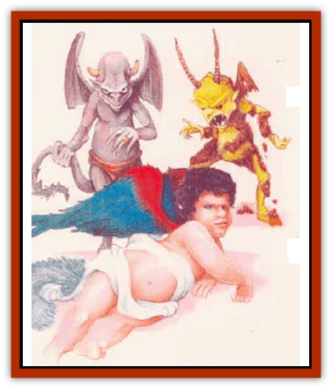

# Familiar - Mystara

| Statistic | **Aryth** | **Bogan** | **Fylgar** | **Gretch** | **Ulzaq** |
| --- | --- | --- | --- | --- | --- |
| **Activity Cycle:** | Day | Any | Day | Day | Night |
| **Alignment:** | Any good | Any evil | Any lawful | Any neutral | Any chaotic |
| **Armor Class:** | 0 | 0 | 0 | 0 | 0 |
| **Climate/Terrain:** | Any | Any | Any | Any | Any |
| **Damage/Attack:** | 1d4 (tail) | 1d4 (bite) or 1d3 (tail) | 1d4 (bite) or 1d4 (tail) | 1d4 (bite) or 1d4 (tail) | 1d2 (claw)/1d2 (claw)/1d4 (bite) or 1d4 (tail) |
| **Diet:** | Omnivore | Omnivore | Omnivore | Omnivore | Omnivore |
| **Frequency:** | Very rare | Very rare | Very rare | Very rare | Very rare |
| **Hit Dice:** | 3 | 3 | 3 | 3 | 3 |
| **Intelligence:** | High (13) | Very (11) | Very (11) | Very (12) | Low (6) |
| **Magic Resistance:** | Nil | Nil | Nil | Nil | Nil |
| **Morale:** | Steady (11) | Average (10) | Elite (i3) | Steady (11) | Average (10) |
| **Movement:** | 9, Fl 18 (B) | 12, Fl 30 (A) | 6, Fl 24 (A) | 15, Fl 18 (C) | 6 |
| **No. Appearing:** | 1 | 1 | 1 | 1 | 1 |
| **No. of Attacks:** | 1 | 1 | 1 | 1 | 3 or 1 |
| **Organization:** | Solitary | Solitary | Solitary | Solitary | Solitary |
| **Size:** | T (1' tall) | T (1' tall) | T (2' tall) | T (2' tall) | T (2' tall) |
| **Special Attacks:** | Sleep | Charm, poison | Nil | Dexterity drain, slow | Strength drain, confusion |
| **Special Defenses:** | See below | See below | See below | See below | See below |
| **THAC0:** | 17 | 17 | 17 | 17 | 17 |
| **Treasure:** | Q | Q | Q | Q | Q |
| **XP Value:** | 2,000 | 2,000 | 975 | 1,400 | 2,000 |

Although the unique familiars of Mystara look like tiny humanoid creatures, these are actually the normal forms Immortals take when they visit the Prime Material Plane on special missions or to perform acts of penance. As a familiar, the Immortal serves a mortal master: a wizard of similar alignment. *Note that text in this entry refers only to the five special familiars listed here, not to regular wizard familiars.*

The five types of familiar correspond to the five spheres of the Immortals. Each of these spheres corresponds roughly to a particular alignment. The chart below shows the familiar type that represents each sphere/alignment.

| Familiar | Sphere | Alignment |
| --- | --- | --- |
| ulzaq | energy | chaos |
| bogan | entropy | evil |
| fylgar | matter | law |
| aryth | thought | good |
| gretch | time | neutral |

Immortals do not follow these classifications exclusively; for example, an Immortal of thought might choose to take the form of a fylgar. As a familiar, then, it would possess connections to both law (for fylgars) and good (for its thought sphere), making it a fylgar of lawful good alignment.

The tiny humanoids all have small wings and an assortment of powers, but each type of familiar boasts its own unique strengths, weaknesses, and physical features.

While it remains a willing (and magically bound) servant, a familiar can communicate telepathically with its master for up to 1 mile. In addition, a master within that range can use all the familiar's senses (including infravision) and gains a +3 bonus to all saving throws while in physical contact with it.

**Combat:** In battle, a familiar attacks with its tail and bite. (The ulzaq may use its claws as well.) Damage varies with the type of familiar, and each type has special combat abilities.

All familiars are immune to nonmagical weapons, as well as cold- and fire-based attacks. They can become invisible (per the spell *invisibility*) and can cast *detect evil* and *detect magic* at will. These creatures all have infravision with a 60-foot range. Each can regenerate 1 hit point of damage per round (as with the *regenerate* spell) and pass this ability on to their masters no more than 10 feet away. Familiars all use their magical abilities as they were 21st-level wizards.

If a familiar ever falls to 0 hit points, its body on the Prime Material Plane is destroyed, and its life-force returns to its home plane. The character whom the creature served will not be granted another familiar for at least one year and suffers the permanent loss of 1d4+1 hit points due to the shattering of the mystic connection upon the familiar's death.

**Habitat/Society:** The familiars of Mystara serve their masters out of either choice or duty, depending on the reason they were sent to the Prime Material Plane. In most cases, a familiar allows a wizard to bind it into service with a *find familiar* spell. Unlike most such creatures, however, Immortal familiars often choose their masters carefully, either searching out a wizard of the proper alignment who is trying to summon a familiar, or even presenting themselves to a chosen wizard and telling this character to cast the spell. A completed spell binds Immortal familiars just as it would any other familiar.

Certain high-level wizards have been known to bind an unwilling familiar to their service; only a few know the exact method to perform such a binding. This very risky procedure involves long, dangerous, and costly magical opera1ions and produces a weaker bond than if the candidate were willing. If such a familiar ever escapes its magical bindings, it will focus all of its abilities on punishing its former captor.

Once per week, a familiar may use its special Immortal knowledge and insight to help its master make an important decision. The aid it gives equates to that of a *commune* spell.

**Ecology:** Although in their Immortal forms, familiars do not need sustenance, while on the Prime Material Plane they need rest, food, and drink to survive, just like nonmagical creatures.

Familiars can speak, but rarely choose to communicate with anyone except their masters. They normally assist their masters in all manner of tasks, from magical experiments to epic quests. Their special abilities make them adept at spying and scouting enemy camps. Because of the harm a familiar's death inflicts on its master, wizards seldom use them as guards or warriors.

Familiars make their homes wherever their masters live, and the two seldom stray far from each other.

**Aryth**

  Aryths have the most unassuming appearance of any familiar. These tiny humanoids (1 foot tall) have bright green eyes and translucent skin the color of black pearl. The aryth's long tail and delicate wings seem thin almost to the point of invisibility.

An aryth can polymorph into either a spider monkey or a sparrow (per the spell *polymorph self*). In combat, the familiar attacks with its tail, which contains hundreds of tiny soporific stingers in its tip. Anyone struck by the tail suffers 1d4 points of damage and must make a successful saving throw vs. spell or fall asleep for 2d4 rounds.

The amazingly perceptive aryth can cast *detect lie* at will. In addition, it can use a *protection from evil 10-foot radius* spell three times per day. An aryth never willingly serves a master not of good alignment.

**Bogan**

  The tiny bogan has sharp, humanoid features. Its skin and four petite wings bear the mottled blue-green hue of the [[Dragonfly|dragonfly]], while its short, scaly tail is either bright blue or green. Its eyes, large and blue, help make this creature remarkably attractive. In fact, many mortals have met their doom after becoming infatuated with - then betrayed by - one of these beauties.

A bogan can polymorph into a [[Snake|garter snake]] and a macaw. In combat, it either lashes out with a tail that boasts a knife-sharp edge along two-thirds of its length or it bites with envenomed teeth. Anyone the bogan bites must make a saving throw vs. paralyzation or shake uncontrollably for 1d4 rounds (-2 penalty to attack). Bogans themselves are immune to poison.

These cunning familiars can cast *charm person* three times a day. They will talk to anyone they feel they can manipulate or hurt, occasionally even allowing themselves to be bound to good-aligned wizards in the hopes of eventually bringing about their master's downfall.

**Fylgar**

  Fylgars, the most attractive familiars, have large, brightly colored wings and rounded, childlike features framed by curly hair. Their long catlike tails bear a coat of pastel, soft, feathery fur. Even in harsh conditions, they wear light, gauzy garments.

Fylgars can polymorph themselves to either black [[Cat_Small|cats]] or [[Hawk|hawks]]. They have extremely quick reflexes (improving all their initiative rolls by +1), and are extraordinarily agile fliers. When attacking with their long, whiplike tails (natural form only), these familiars gain a +4 to attack rolls.

Three times a day, fylars can cast *invisibility, 10-foot radius*, and they can use *detect invisibility* at will. They only willingly serve lawful masters; in fact, some have fallen deathly ill when forced to serve one of chaotic alignment. Fylgars despair over the vicious acts of the ulzaqs and attempt to send such creatures back to their home plane whenever possible.

**Gretch**

  The lumpy, grayish gretch bears small, pointed horns, oversized hands, and a barbed tail. Its short but powerful leathery wings, though functional, do not permit it to fly well.Gretches can polymorph at will into either [[Raven_Crow|ravens]] or giant [[Rat|rats]]. If not polymorphed, the creature attacks with its poisonous tail. Victims hit by the tail must make a saving throw vs. poison: Failing means losing 1 point of Dexterity per hit. They can regain lost Dexterity at a rate of 1 point per turn, starting one turn after the loss of the last point. A victim whose dexterity drops to 3 falls unconscious and remains so until the ability score returns to at least 4. The gretch is immune to mind-affecting spells. Once a day it may cast *slow* on foes.

These familiars feel less choosy about the alignment of their masters than the other Immortal familiars do. Although they prefer to serve one of neutral alignment, a gretch will become bound to the master it thinks will make the fewest demands of it. Gretches enjoy practical jokes, so any wizard who forcible binds one into service is well advised to keep alert, lest one of the familiar's jokes "accidentally" harms (or kills) the master.

**Ulzaq**

  By far the ugliest of the familiars, ulzaqs possess hideous, misshapen features, scaly yellow-brown skin, and gnarled horns sprouting from their tiny heads. Their vestigial leathery wings do not permit them to fly. Ulzaqs perpetually cover themselves in mud and filth, as one of their main pastimes is diving into dirt, trash, and other forms of refuse.

An ulzaq can polymorph itself at will into a [[Bat|bat]] or [[Frog|frog]]. In normal form, the creature attacks with filthy talons and vicious fangs. Whatever the ulzaq's form, its bite wounds drain 1 point of the victim's Strength per hit (negated by a successful saving throw vs. poison). Characters can regain lost Strength at a rate of 1 point per turn, starting one turn after the loss of the last point. A victim whose Strength drops to 3 falls unconscious and cannot be awakened until the ability score rises to 4.

These familiars are immune to electrical attacks. Once per day, an ulzaq can cause confusion (per the spell *confusion*).

Petty and venal creatures, ulzaqs wallow in the misery of others. Many search out weak masters, who often fall prey to their manipulations and end up doing the familiar's sinister bidding. Ulzaqs love to torture or plague a target for weeks before causing this victim's disgrace and violent death.

Ulzaqs hate fylgars as much as fylgars detest them. An ulzaq attacks this enemy on sight, taking the time to torture the fylgar, if possible; the vicious creatures especially like to pluck the feathers from the wings of a fylgar captive. In general, they destroy the beauty in anything they see.

---
## Discovery & Documentation

**Source Publication:** Mystara Appendix (1994)
**Campaign Setting:** Mystara
**Author(s):** John Nephew, Teeuwynn Woodruff, John Terra, Skip Williams

### Other Creatures Found in This Source Book
   * [[Actaeon|Actaeon]]
   * [[Agarat|Agarat]]
   * [[Ash_Crawler|Ash Crawler]]
   * [[Baldandar|Baldandar]]
   * [[Bargda|Bargda]]
   * [[Bhut|Bhut]]
   * [[Bird_Mystara|Bird (Mystara)]]
   * [[Blackball|Blackball]]
   * [[Choker|Choker]]
   * [[Coltpixie|Coltpixie]]
   * [[Crone_of_Chaos|Crone of Chaos]]
   * [[Darkhood|Darkhood]]
   * [[Darkwing|Darkwing]]
   * [[Decapus|Decapus]]
   * [[Deep_Glaurant|Deep Glaurant]]
   * [[Diabolus|Diabolus]]
   * [[Dimensional_Warper|Dimensional Warper]]
   * [[Dragon_Mystara_Crystalline|Dragon (Mystara), Crystalline]]
   * [[Dragon_Mystara_Jade|Dragon (Mystara), Jade]]
   * [[Dragon_Mystara_Onyx|Dragon (Mystara), Onyx]]
   * [[Dragon_Mystara_Ruby|Dragon (Mystara), Ruby]]
   * [[Drake_Mystara|Drake (Mystara)]]
   * [[Dragonfly|Dragonfly]]
   * [[Dusanu|Dusanu]]
   * [[Elemental_of_Chaos_Air_Earth|Elemental of Chaos, Air/Earth]]
   * [[Elemental_of_Chaos_Fire_Water|Elemental of Chaos, Fire/Water]]
   * [[Elemental_of_Law_Air_Earth|Elemental of Law, Air/Earth]]
   * [[Elemental_of_Law_Fire_Water|Elemental of Law, Fire/Water]]
   * [[Frost_Salamander|Frost Salamander]]
   * [[Fundamental_Air_Earth|Fundamental, Air/Earth]]
   * [[Fundamental_Fire_Water|Fundamental, Fire/Water]]
   * [[Gargantua_Mystara|Gargantua (Mystara)]]
   * [[Geonid|Geonid]]
   * [[Ghostly_Horde|Ghostly Horde]]
   * [[Giant_Athach|Giant, Athach]]
   * [[Giant_Hephaeston|Giant, Hephaeston]]
   * [[Golem_Drolem|Golem, Drolem]]
   * [[Golem_Mystara_I|Golem (Mystara) I]]
   * [[Golem_Mystara_II|Golem (Mystara) II]]
   * [[Golem_Mystara_III|Golem (Mystara) III]]
   * [[Gray_Philosopher|Gray Philosopher]]
   * [[Guardian_Warrior|Guardian Warrior]]
   * [[Gyerian|Gyerian]]
   * [[Herex|Herex]]
   * [[Hivebrood|Hivebrood]]
   * [[Horde|Horde]]
   * [[Hsiao|Hsiao]]
   * [[Huptzeen|Huptzeen]]
   * [[Hutaakan|Hutaakan]]
   * [[Imp_Mystara|Imp (Mystara)]]
   * [[Jellyfish_Giant_Mystara|Jellyfish, Giant (Mystara)]]
   * [[Kna|Kna]]
   * [[Kopru|Kopru]]
   * [[Lizard_Mystara|Lizard (Mystara)]]
   * [[Lizard-kin_Mystara|Lizard-kin (Mystara)]]
   * [[Lupin|Lupin]]
   * [[Lycanthrope_Werejaguar_Mystara|Lycanthrope, Werejaguar (Mystara)]]
   * [[Lycanthrope_Wereswine|Lycanthrope, Wereswine]]
   * [[Magen|Magen]]
   * [[Manikin|Manikin]]
   * [[Mek|Mek]]
   * [[Mujina|Mujina]]
   * [[Nagpa|Nagpa]]
   * [[Neh-thalggu|Neh-thalggu]]
   * [[Nightshade_Mystara|Nightshade (Mystara)]]
   * [[Nuckalavee|Nuckalavee]]
   * [[Pegataur|Pegataur]]
   * [[Phanaton|Phanaton]]
   * [[Plant_Dangerous_Mystara|Plant, Dangerous (Mystara)]]
   * [[Plasm|Plasm]]
   * [[Rakasta|Rakasta]]
   * [[Rock_Man|Rock Man]]
   * [[Sabreclaw|Sabreclaw]]
   * [[Sacrol|Sacrol]]
   * [[Scamille|Scamille]]
   * [[Shapeshifter|Shapeshifter]]
   * [[Shargugh|Shargugh]]
   * [[Shark-kin|Shark-kin]]
   * [[Sollux|Sollux]]
   * [[Spectral_Death|Spectral Death]]
   * [[Spectral_Hound|Spectral Hound]]
   * [[Spider-kin|Spider-kin]]
   * [[Spirit_Mystara|Spirit (Mystara)]]
   * [[Statue_Living|Statue, Living]]
   * [[Surtaki|Surtaki]]
   * [[Tabi|Tabi]]
   * [[Thoul|Thoul]]
   * [[Thunderhead|Thunderhead]]
   * [[Tiger_Ebon|Tiger, Ebon]]
   * [[Topi|Topi]]
   * [[Tortle|Tortle]]
   * [[Vampire_Velya|Vampire, Velya]]
   * [[White_Fang|White Fang]]
   * [[Worm_Mystara|Worm (Mystara)]]
   * [[Wyrd|Wyrd]]
   * [[Yowler|Yowler]]
   * [[Zombie_Lightning|Zombie, Lightning]]
