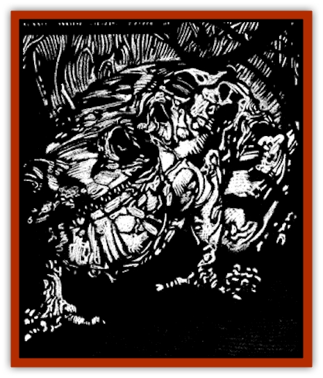

# Familiar - Undead

| Statistic | **Familiar, Undead** |
| --- | --- |
| **Activity Cycle:** | Night |
| **Alignment:** | Chaotic Evil |
| **Armor Class:** | 7 |
| **Climate/Terrain:** | Ravenloft |
| **Damage/Attack:** | 1-4 |
| **Diet:** | Carnivore |
| **Frequency:** | Very rare |
| **Hit Dice:** | 1+1 |
| **Intelligence:** | Low (5-7) |
| **Magic Resistance:** | See below |
| **Morale:** | Elite (13-14) |
| **Movement:** | 9 |
| **No. Appearing:** | 1 |
| **No. of Attacks:** | 1 |
| **Organization:** | Solitary |
| **Size:** | T (2' or less) |
| **Special Attacks:** | See below |
| **Special Defenses:** | See below |
| **THAC0:** | 19 |
| **Treasure:** | Nil |
| **XP Value:** | 1,400 |

An undead familiar is a sinister being that is created whenever a wizard is directly responsible for the death of his own familiar. By betraying the mystical bonds that link the spellcaster to his companion, the wizard brings into existence a vile creature that seeks only to destroy him.

Undead familiars appear as horridly bloated, rotting versions of their living forms. They may be missing eyes, ears, or other parts, and any wounds that they sustained in death are agape and infected. They move stiffly, as if rigid with death, and the stink of corruption hangs about them. Their eyes gleam with a feral light and evil hangs in an almost palpable aura about them.

The creature's only form of communication is a telepathic cry that constantly invades its former master's mind. So unnerving is this sound that it prevents sleep, disrupts spellcasting, and has driven more than one wizard over the brink of madness.

**Combat:** Undead familiars avoid combat with any creature other than their former master. If prevented from reaching their preferred target or forced to defend themselves, these foul creatures will employ the attacks that they did in life. In addition to the damage caused by the creature's normal forms of attack, anyone injured by the undead familiar must make a saving throw vs. poison or contract a debilitating disease (as described in the *cure disease* spell). The former master of this terrible creature suffers a -4 penalty on this save.

Once the undead familiar reaches its master, it will attempt to meets his gaze. If this happens, the agony that the creature felt when it died and the shock of its betrayal bombard the wizard's mind through the mystic link they once shared. At this point, the mage must attempt a saving throw vs. spell. A successful save requires the character to make a fear check while failure indicates that the wizard must make a horror check. If the roll not only fails but is a natural "1", the wizard must make a madness check. The power works only against the undead familiar's former master.

Undead familiars cannot be turned by a priest and are immune to the effects of holy water, holy symbols or other forces that normally harm undead. The power that animates them is the guilt and remorse of the wizard, not the negative material plane or any related region. As such, they are not undead in the traditional sense of the word and have few of the vulnerabilities normally associated with such creatures.

Undead familiars are immune to all *sleep*, *charm*, *hold*, and cold-based spells. They cannot be affected by poisons, paralyzation, or disease and are immune to damage inflicted by non-magical weapons.

Any wound that causes an unread familiar to fall to 0 or fewer hit points seems to kill it. The creature is as relentless as a [[Revenant|revenant]], however, and even incineration or other means of destroying the body will not rid the wizard of this enemy. Within a fortnight, the creature will return from the mists to seek vengeance for the betrayal it suffered.

If the mage is slain by his undead familiar he will rise again as a [[Ghoul|ghoul]] and the familiar will die, finally being freed of its undead existence.

**Habitat/Society:** Undead familiars exist only to wreak vengeance on their former masters. The bond that tied the pair together has been twisted into a corrupt union that neither can escape - except through death.

Only the death of the wizard will satisfy the creature's hunger for retaliation. If the creature's master manages to escape from Ravenloft, it will lose its obsession with him and begin stalking the nearest wizard. That wizard need not fear the familiar's gaze and can rid himself of the thing simply by killing it. At that point, the familiar will not reappear. Should the creature's former master ever return to the Demiplane of Dread, however, the wronged animal will rise again.

**Ecology:** Undead familiars are not natural creatures. They consume nothing to sustain themselves and produce no useful products.

---
## Discovery & Documentation

**Source Publication:** Ravenloft Appendix III (1991)
**Campaign Setting:** Ravenloft
**Author(s):** Kirk Botulla

### Other Creatures Found in This Source Book
   * [[Akikage|Akikage]]
   * [[Animator_Common|Animator, Common]]
   * [[Animator_Greater|Animator, Greater]]
   * [[Animator_Minor|Animator, Minor]]
   * [[Animator_General_Information|Animator, General Information]]
   * [[Bakhna_Rakhna|Bakhna Rakhna]]
   * [[Baobhan_Sith|Baobhan Sith]]
   * [[Beetle_Scarab|Beetle, Scarab]]
   * [[Boneless|Boneless]]
   * [[Boowray|Boowray]]
   * [[Bruja|Bruja]]
   * [[Carrionette|Carrionette]]
   * [[Carrion_Stalker|Carrion Stalker]]
   * [[Cat_Midnight|Cat, Midnight]]
   * [[Cat_Skeletal|Cat, Skeletal]]
   * [[Cloaker_Resplendent|Cloaker, Resplendent]]
   * [[Cloaker_Shadow|Cloaker, Shadow]]
   * [[Cloaker_Undead|Cloaker, Undead]]
   * [[Corpse_Candle|Corpse Candle]]
   * [[Death's_Head_Tree|Death's Head Tree]]
   * [[Doppelganger_Ravenloft|Doppelganger (Ravenloft)]]
   * [[Familiar_Pseudo-|Familiar, Pseudo-]]
   * [[Feathered_Serpent|Feathered Serpent]]
   * [[Fenhound|Fenhound]]
   * [[Figurine_Ceramic|Figurine, Ceramic]]
   * [[Figurine_Crystal|Figurine, Crystal]]
   * [[Figurine_Ivory|Figurine, Ivory]]
   * [[Figurine_Obsidian|Figurine, Obsidian]]
   * [[Figurine_Porcelain|Figurine, Porcelain]]
   * [[Figurine_General_Information|Figurine, General Information]]
   * [[Fleas_of_Madness|Fleas of Madness]]
   * [[Furies|Furies]]
   * [[Geist|Geist]]
   * [[Ghost_Animal|Ghost, Animal]]
   * [[Golem_Flesh_Ravenloft|Golem, Flesh (Ravenloft)]]
   * [[Golem_Mist_Ravenloft|Golem, Mist (Ravenloft)]]
   * [[Golem_Wax_Ravenloft|Golem, Wax (Ravenloft)]]
   * [[Gremishka|Gremishka]]
   * [[Hag_Spectral|Hag, Spectral]]
   * [[Head_Hunter|Head Hunter]]
   * [[Hearth_Fiend|Hearth Fiend]]
   * [[Hebi-No-Onna|Hebi-No-Onna]]
   * [[Hound_Phantom|Hound, Phantom]]
   * [[Hound_Skeletal|Hound, Skeletal]]
   * [[Imp_Wishing|Imp, Wishing]]
   * [[Ivy_Crawling|Ivy, Crawling]]
   * [[Jack_Frost|Jack Frost]]
   * [[Jolly_Roger|Jolly Roger]]
   * [[Kizoku|Kizoku]]
   * [[Lashweed|Lashweed]]
   * [[Leech_Magical|Leech, Magical]]
   * [[Leech_Psionic|Leech, Psionic]]
   * [[Lich_Defiler|Lich, Defiler]]
   * [[Lich_Drow|Lich, Drow]]
   * [[Lich_Elemental|Lich, Elemental]]
   * [[Lich_Psionic|Lich, Psionic]]
   * [[Living_Tattoo|Living Tattoo]]
   * [[Lycanthrope_Loup-garou|Lycanthrope, Loup-garou]]
   * [[Lycanthrope_Werejackal|Lycanthrope, Werejackal]]
   * [[Lycanthrope_Werejaguar_Ravenloft|Lycanthrope, Werejaguar (Ravenloft)]]
   * [[Lycanthrope_Wereleopard|Lycanthrope, Wereleopard]]
   * [[Lycanthrope_Wereray|Lycanthrope, Wereray]]
   * [[Mist_Ferryman|Mist Ferryman]]
   * [[Moor_Man|Moor Man]]
   * [[Obedient|Obedient]]
   * [[Odem|Odem]]
   * [[Paka|Paka]]
   * [[Plant_Blood_Rose|Plant, Blood Rose]]
   * [[Plant_Fearweed|Plant, Fearweed]]
   * [[Radiant_Spirit|Radiant Spirit]]
   * [[Recluse|Recluse]]
   * [[Remnant_Aquatic|Remnant, Aquatic]]
   * [[Rushlight|Rushlight]]
   * [[Sea_Spawn_Master|Sea Spawn, Master]]
   * [[Sea_Spawn_Minion|Sea Spawn, Minion]]
   * [[Shadow_Asp|Shadow Asp]]
   * [[Shattered_Brethren|Shattered Brethren]]
   * [[Skeleton_Archer|Skeleton, Archer]]
   * [[Skeleton_Insectoid|Skeleton, Insectoid]]
   * [[Skin_Thief|Skin Thief]]
   * [[Spirit_Psionic|Spirit, Psionic]]
   * [[Strahd_Skeleton|Strahd Skeleton]]
   * [[Strahd_Zombie|Strahd Zombie]]
   * [[Unicorn_Shadow|Unicorn, Shadow]]
   * [[Vampire_Drow|Vampire, Drow]]
   * [[Vampire_Nosferatu|Vampire, Nosferatu]]
   * [[Vampire_Oriental|Vampire, Oriental]]
   * [[Virus_General_Information|Virus, General Information]]
   * [[Virus_I|Virus I]]
   * [[Virus_II|Virus II]]
   * [[Virus_III|Virus III]]
   * [[Vorlog|Vorlog]]
   * [[Will_O'Dawn|Will O'Dawn]]
   * [[Will_O'Deep|Will O'Deep]]
   * [[Will_O'Mist|Will O'Mist]]
   * [[Will_O'Sea|Will O'Sea]]
   * [[Zombie_Cannibal|Zombie, Cannibal]]
   * [[Zombie_Desert|Zombie, Desert]]
   * [[Zombie_Wolf|Zombie Wolf]]
   * [[Zombie_Fog|Zombie Fog]]
