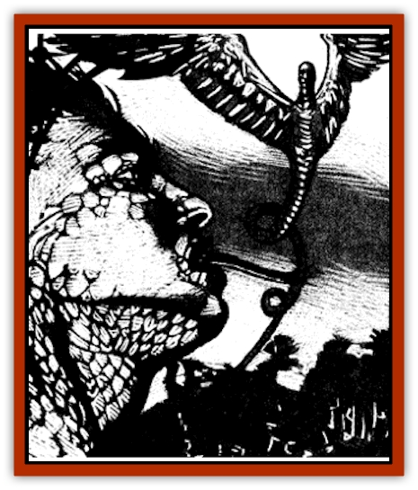

# Feathered Serpent

| Statistic | **Feathered Serpent** |
| --- | --- |
| **Activity Cycle:** | Night |
| **Alignment:** | Chaotic evil |
| **Armor Class:** | 7 |
| **Climate/Terrain:** | Tropical lands and subterranean |
| **Damage/Attack:** | 1-3 |
| **Diet:** | Carnivore |
| **Frequency:** | Rare |
| **Hit Dice:** | 2+2 |
| **Intelligence:** | Highly (13-14) |
| **Magic Resistance:** | Nil |
| **Morale:** | Steady (11-12) |
| **Movement:** | 12, Fl 24 (C) |
| **No. Appearing:** | 1-3 |
| **No. of Attacks:** | 1 |
| **Organization:** | Solitary |
| **Size:** | H (15' long) |
| **Special Attacks:** | See below |
| **Special Defenses:** | Nil |
| **THAC0:** | 19 |
| **Treasure:** | X (E) |
| **XP Value:** | 650 |

Feathered serpents are evil creatures with a snakelike, winged body and a human head. These scaled, feathered predators prefer warmer climates and favor underground lairs. They have been encountered in such disparate locales as Har'Akir and Sri Raji.

Feathered serpents grow to an adult length of 15 feet, with a wingspan that may reach 25 feet. Their otherwise human-looking faces feature bright, compelling, lidless eyes of a luminous bluegreen or gold. Their serpentlike bodies are covered with glittering scales that vary in color from azure to emerald green. Their wings and tails are covered with brilliant, graceful plumage similar in color to their scales. Unlike normal [[Snake|snakes]], they secrete an oil that makes them slick to the touch but has a pleasant, delicate odor to it. Their voices are seductive and euphonious. In addition to their own language, they speak the common language of the domain in which they live and can communicate with all manner of serpents.

**Combat:** Feathered serpents delight in setting clever traps and alarms about their lairs. These are intended to slow those entering the serpent's den and to give warning of their approach, but not to kill or seriously injure the intruder. That is a delight that the creature reserves for itself.

Feathered serpents fight only when they feel they have no chance of capturing or charming opponents to make into slaves. They are not stupid, and will not remain in a losing battle if provided with a way to escape.

Whenever possible, feathered serpents will attempt to use their mesmeric gaze on newly encountered prey. By slowly weaving back and forth while staring into the eyes of their victims these terrible creatures are able to charm a potential enemy. The feathered serpent cannot attack or cast spells in any round that it employs this power, but it may attempt to mesmerize as many as three enemies, provided they are fairly close together.

Should combat become necessary, these creatures will generally seek to use their magical abilities to disable dangerous foes before moving in for the kill. They can memorize any two first level spells from the illusion/phantasm school, but favor the *audible glamer*, *change self*, and *phantasmal force* spells.

When they finally close for combat, feathered serpents attempt to bite their enemies. The needlelike fangs of the creature inflict 1d3 points of damage. In addition, anyone bitten by the snake is injected with a poison that requires the victim to make a saving throw vs. poison or fall asleep for 2d4 rounds. When the effects of the toxin wear off, victims are off-balance and woozy for two rounds, suffering a -2 penalty on their Attack, Damage, and saving throws during that time.

**Habitat/Society:** Though feathered serpents are solitary creatures, a mated pair will sometimes occupy a large lair. If three are found together, they will be a mated pair and an offspring who has half the normal number of Hit Dice and no special abilities except a poisonous bite.

Though they prefer to dwell underground, they may also be encountered in old ruins or even shallow caves. In some places, they have managed to make their way into the cities of men and assemble a cult of followers who believe them to be divine in nature.

They take great delight in keeping a few charmed slaves to build their traps and use as food when times are lean. These slaves will come to the defense of their master if it is threatened. The followers of a feathered serpent are usually normal humans. unskilled in fighting or the use of weapons, but will occasionally include an adventurer or spellcaster.

Feathered serpents may also cooperate with a [[Hebi-No-Onna|hebi-no-onna]] (snake woman), acting as favored servants or guardians for her and receiving choice treasure, food, and a protected lair in return. Though not usually the instigators of the cults that hebi-no-onna build around themselves, they are instrumental in helping gain recruits and dissuading authorities from looking into the cult's activities too closely.

**Ecology:** The scent glands of a feathered serpent can be used to make a rare, exotic perfume. Those who adorn themselves with this cologne effectively increase their Charisma score by 1 point for 24 hours or until it is washed off with water.

---
## Discovery & Documentation

**Source Publication:** Ravenloft Appendix III (1991)
**Campaign Setting:** Ravenloft
**Author(s):** Kirk Botulla

### Other Creatures Found in This Source Book
   * [[Akikage|Akikage]]
   * [[Animator_Common|Animator, Common]]
   * [[Animator_Greater|Animator, Greater]]
   * [[Animator_Minor|Animator, Minor]]
   * [[Animator_General_Information|Animator, General Information]]
   * [[Bakhna_Rakhna|Bakhna Rakhna]]
   * [[Baobhan_Sith|Baobhan Sith]]
   * [[Beetle_Scarab|Beetle, Scarab]]
   * [[Boneless|Boneless]]
   * [[Boowray|Boowray]]
   * [[Bruja|Bruja]]
   * [[Carrionette|Carrionette]]
   * [[Carrion_Stalker|Carrion Stalker]]
   * [[Cat_Midnight|Cat, Midnight]]
   * [[Cat_Skeletal|Cat, Skeletal]]
   * [[Cloaker_Resplendent|Cloaker, Resplendent]]
   * [[Cloaker_Shadow|Cloaker, Shadow]]
   * [[Cloaker_Undead|Cloaker, Undead]]
   * [[Corpse_Candle|Corpse Candle]]
   * [[Death's_Head_Tree|Death's Head Tree]]
   * [[Doppelganger_Ravenloft|Doppelganger (Ravenloft)]]
   * [[Familiar_Pseudo-|Familiar, Pseudo-]]
   * [[Familiar_Undead|Familiar, Undead]]
   * [[Fenhound|Fenhound]]
   * [[Figurine_Ceramic|Figurine, Ceramic]]
   * [[Figurine_Crystal|Figurine, Crystal]]
   * [[Figurine_Ivory|Figurine, Ivory]]
   * [[Figurine_Obsidian|Figurine, Obsidian]]
   * [[Figurine_Porcelain|Figurine, Porcelain]]
   * [[Figurine_General_Information|Figurine, General Information]]
   * [[Fleas_of_Madness|Fleas of Madness]]
   * [[Furies|Furies]]
   * [[Geist|Geist]]
   * [[Ghost_Animal|Ghost, Animal]]
   * [[Golem_Flesh_Ravenloft|Golem, Flesh (Ravenloft)]]
   * [[Golem_Mist_Ravenloft|Golem, Mist (Ravenloft)]]
   * [[Golem_Wax_Ravenloft|Golem, Wax (Ravenloft)]]
   * [[Gremishka|Gremishka]]
   * [[Hag_Spectral|Hag, Spectral]]
   * [[Head_Hunter|Head Hunter]]
   * [[Hearth_Fiend|Hearth Fiend]]
   * [[Hebi-No-Onna|Hebi-No-Onna]]
   * [[Hound_Phantom|Hound, Phantom]]
   * [[Hound_Skeletal|Hound, Skeletal]]
   * [[Imp_Wishing|Imp, Wishing]]
   * [[Ivy_Crawling|Ivy, Crawling]]
   * [[Jack_Frost|Jack Frost]]
   * [[Jolly_Roger|Jolly Roger]]
   * [[Kizoku|Kizoku]]
   * [[Lashweed|Lashweed]]
   * [[Leech_Magical|Leech, Magical]]
   * [[Leech_Psionic|Leech, Psionic]]
   * [[Lich_Defiler|Lich, Defiler]]
   * [[Lich_Drow|Lich, Drow]]
   * [[Lich_Elemental|Lich, Elemental]]
   * [[Lich_Psionic|Lich, Psionic]]
   * [[Living_Tattoo|Living Tattoo]]
   * [[Lycanthrope_Loup-garou|Lycanthrope, Loup-garou]]
   * [[Lycanthrope_Werejackal|Lycanthrope, Werejackal]]
   * [[Lycanthrope_Werejaguar_Ravenloft|Lycanthrope, Werejaguar (Ravenloft)]]
   * [[Lycanthrope_Wereleopard|Lycanthrope, Wereleopard]]
   * [[Lycanthrope_Wereray|Lycanthrope, Wereray]]
   * [[Mist_Ferryman|Mist Ferryman]]
   * [[Moor_Man|Moor Man]]
   * [[Obedient|Obedient]]
   * [[Odem|Odem]]
   * [[Paka|Paka]]
   * [[Plant_Blood_Rose|Plant, Blood Rose]]
   * [[Plant_Fearweed|Plant, Fearweed]]
   * [[Radiant_Spirit|Radiant Spirit]]
   * [[Recluse|Recluse]]
   * [[Remnant_Aquatic|Remnant, Aquatic]]
   * [[Rushlight|Rushlight]]
   * [[Sea_Spawn_Master|Sea Spawn, Master]]
   * [[Sea_Spawn_Minion|Sea Spawn, Minion]]
   * [[Shadow_Asp|Shadow Asp]]
   * [[Shattered_Brethren|Shattered Brethren]]
   * [[Skeleton_Archer|Skeleton, Archer]]
   * [[Skeleton_Insectoid|Skeleton, Insectoid]]
   * [[Skin_Thief|Skin Thief]]
   * [[Spirit_Psionic|Spirit, Psionic]]
   * [[Strahd_Skeleton|Strahd Skeleton]]
   * [[Strahd_Zombie|Strahd Zombie]]
   * [[Unicorn_Shadow|Unicorn, Shadow]]
   * [[Vampire_Drow|Vampire, Drow]]
   * [[Vampire_Nosferatu|Vampire, Nosferatu]]
   * [[Vampire_Oriental|Vampire, Oriental]]
   * [[Virus_General_Information|Virus, General Information]]
   * [[Virus_I|Virus I]]
   * [[Virus_II|Virus II]]
   * [[Virus_III|Virus III]]
   * [[Vorlog|Vorlog]]
   * [[Will_O'Dawn|Will O'Dawn]]
   * [[Will_O'Deep|Will O'Deep]]
   * [[Will_O'Mist|Will O'Mist]]
   * [[Will_O'Sea|Will O'Sea]]
   * [[Zombie_Cannibal|Zombie, Cannibal]]
   * [[Zombie_Desert|Zombie, Desert]]
   * [[Zombie_Wolf|Zombie Wolf]]
   * [[Zombie_Fog|Zombie Fog]]
