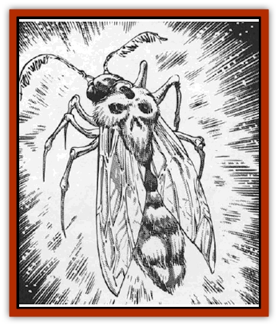

# Feesu

| Statistic | **Feesu** |
| --- | --- |
| **Activity Cycle:** | Any |
| **Alignment:** | Neutral |
| **Armor Class:** | 7 |
| **Climate/Terrain:** | Wildspace |
| **Damage/Attack:** | 1 hp |
| **Diet:** | Herbivore |
| **Frequency:** | Common |
| **Hit Dice:** | 2+2 |
| **Intelligence:** | Non- (0) |
| **Magic Resistance:** | Nil |
| **Morale:** | Unreliable (3) + special |
| **Movement:** | 3, Fl 12 (C) |
| **No. Appearing:** | 6-48 |
| **No. of Attacks:** | 1 |
| **Organization:** | Swarm |
| **Size:** | S (2' long) |
| **Special Attacks:** | Air deprivation |
| **Special Defenses:** | Nil |
| **THAC0:** | 18 |
| **Treasure:** | Nil |
| **XP Value:** | 270 |

Feesu are large, space-going moths that travel in swarms that are a great nuisance to space travellers. Many spelljamming sailors consider them bad luck, with good reason.

A flock of feesu appear as a mass of giant moths bathed in a sphere of soft phosphorescent green light. Individual feesu look like groundling moths. Like all moths, feesu are attracted to light.

**Combat:** Feesu are not known for combat, though as explained below, combat seems to follow them! However, if provoked by repeated attacks against the swarm, a moth attacks with tiny jaws that cause 1 hp damage. Since the feesu's bodily fluids are phosphorescent, the wound glows eerie green for 2d12 hours.

Feesu save at -2 vs. fire attacks. Due to their soft bodies, blunt weapons are ineffective against them, but edged weapons do +1 hp damage.

The feesu's most insidious attack is unconscious. Since they require air to survive, their wings trap and store air. Thus, when feesu leave a spelljamming ship, they inadvertently pull away one day's worth of air per feesu that escapes.

**Habitat/Society:** The feesu travel in tight swarms that hold a thick globe of air, enough to allow survival for 1d10 weeks. They refresh this air by swooping down on spelljamming ships and flying off.

The feesu instinctively seek sources of bright light, perhaps to recharge the phosphorescent glow in their bodily fluids. Hence they fly headlong toward any major light source, including blazing suns. After one turn within 5' of a bright light source such as any form of *light* spell, lantern, or light-producing magical item, the feesu is "recharged" for 24 hours.

During this recharging period, the air around the feesu swarm in a 10' radius is glowing with the intensity of bright sunlight. If a character tries to drive off the swarm by waving a weapon or shouting, the swarm makes a single morale check. Failure makes the swarm take wing, but they hover within 120' of the light with the patience of the single-minded, lingering for days until recharging.

The problem with the feesu swarm is that its glowing cloud near the ship creates a signal beacon for monsters and raiders. The likelihood of an encounter in this situation increases to 10%. For this reason, [[Gith_Pirate_of|Pirates of Gith]] and other raiders find the feesu useful, since their tell-tale recharging glow often means a ship is nearby. This may contribute to the superstition that feesu bring bad luck. Curiously, the [[Aperusa|Aperusa]] consider the feesu good luck.

After 24 hours, the feesu's glow slowly fades to a dim flicker inside its translucent, sickly-green body. Feesu do not suffer if they cannot get recharged. But in this condition, the swarm insists on getting light, and their morale increases to Fanatic (18).

Feesu cannot be trained, though communication is possible via magical spells. From there, the caster's negotiating skills determine whether the feesu cooperate.

**Ecology:** Feesu lair in the shattered hulks of space wrecks. The gravity of planets makes them uncomfortable, for it inhibits their flight. Feesu do not collect treasure.

Feesu lay 10d10 eggs every three months. Though most of these egg-laying activities occur in the safety of their lairs, feesu are not particular, occasionally laying eggs in out-of-the-way corners of smelljamming ships.

The feesu's bodily fluids are sometimes used to create a phosphorescent pigment. When exposed to a strong light source, the paint glows with the strength of a normal *light* spell for one hour. Spelljammers find this useful for travel in the phlogiston. [[Gnome_Tinker|Tinker gnomes]], never known for doing things the easy way, trap feesu in elaborate cages and use the moths themselves for light while in the phlogiston.

---
## Discovery & Documentation

**Source Publication:** MC9 Spelljammer Appendix II (1991)
**Campaign Setting:** Planescape
**Author(s):** Scott Davis, Newton Ewell, John Terra

### Other Creatures Found in This Source Book
   * [[Alchemy_Plant|Alchemy Plant]]
   * [[Allura|Allura]]
   * [[Aperusa|Aperusa]]
   * [[Autognome|Autognome]]
   * [[Bionoid|Bionoid]]
   * [[Bloodsac|Bloodsac]]
   * [[Buzzjewel|Buzzjewel]]
   * [[Constellate|Constellate]]
   * [[Contemplator|Contemplator]]
   * [[Dohwar|Dohwar]]
   * [[Dragon_Moon|Dragon, Moon]]
   * [[Dragon_Stellar|Dragon, Stellar]]
   * [[Dragon_Sun|Dragon, Sun]]
   * [[Dreamslayer|Dreamslayer]]
   * [[Dweomerborn|Dweomerborn]]
   * [[Fal|Fal]]
   * [[Fire_Bat|Fire Bat]]
   * [[Firebird|Firebird]]
   * [[Firelich|Firelich]]
   * [[Flowfiend|Flowfiend]]
   * [[Gadabout|Gadabout]]
   * [[Gammaroid|Gammaroid]]
   * [[Gonn|Gonn]]
   * [[Gossamer|Gossamer]]
   * [[Grav|Grav]]
   * [[Great_Dreamer|Great Dreamer]]
   * [[Greatswan|Greatswan]]
   * [[Grell_Colonial|Grell, Colonial]]
   * [[Gullion|Gullion]]
   * [[Insectare|Insectare]]
   * [[Lhee|Lhee]]
   * [[Mercurial_Slime|Mercurial Slime]]
   * [[Meteorspawn|Meteorspawn]]
   * [[Monitor|Monitor]]
   * [[Owl_Space|Owl, Space]]
   * [[Pristatic|Pristatic]]
   * [[Scro|Scro]]
   * [[Selkie_Star|Selkie, Star]]
   * [[Silatic|Silatic]]
   * [[Skullbird|Skullbird]]
   * [[Sleek|Sleek]]
   * [[Sluk|Sluk]]
   * [[Space_Swine|Space Swine]]
   * [[Sphinx_Astro-|Sphinx, Astro-]]
   * [[Spirit_Warrior|Spirit Warrior]]
   * [[Starfly_Plant|Starfly Plant]]
   * [[Stargazer|Stargazer]]
   * [[Undead_Stellar|Undead, Stellar]]
   * [[Witchlight_Marauder|Witchlight Marauder]]
   * [[Xixchil|Xixchil]]
   * [[Yitsan|Yitsan]]
   * [[Zurchin|Zurchin]]
