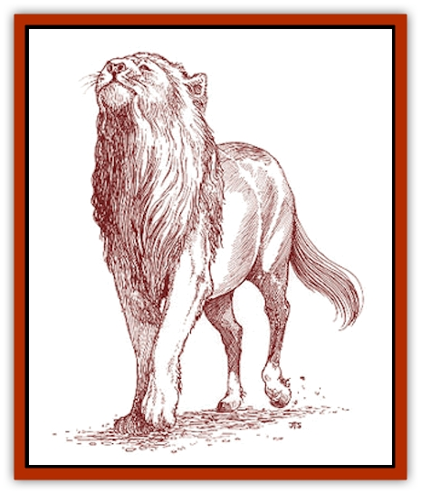

# Feliquine

| Statistic | **Feliquine** |
| --- | --- |
| **Activity Cycle:** | Any |
| **Alignment:** | Neutral |
| **Armor Class:** | 5 |
| **Climate/Terrain:** | Temperate steppes |
| **Damage/Attack:** | 1d6/1d6/1d10 |
| **Diet:** | Carnivore |
| **Frequency:** | Uncommon |
| **Hit Dice:** | 4+4 |
| **Intelligence:** | Semi- (2-4) |
| **Magic Resistance:** | Nil |
| **Morale:** | Steady (11-12) |
| **Movement:** | 18 |
| **No. Appearing:** | 3d4 |
| **No. of Attacks:** | 3 |
| **Organization:** | Pride |
| **Size:** | L (10' long) |
| **Special Attacks:** | Kick |
| **Special Defenses:** | +1 bonus on surprise rolls |
| **THAC0:** | 15 |
| **Treasure:** | Nil |
| **XP Value:** | 270 |

These half-feline and half-equine creatures have the head and front claws of a [[Cat_Great|lion]] and the hindquarters of a [[Horse|horse]]. Most are colored like lions, though spotted specimens (appaloosas) are not unknown. Some even have equine markings such as a white mane and paws or a blaze down the nose. Completely black specimens are rare, but not impossible to find.

Feliquines are intelligent enough to understand commands, though they do not always choose to follow them. Often, a feliquine's strong independent streak will cause it to ignore orders. The only truly "tame" feliquines are those bonded to Beast Riders. Feliquines communicate through growls, purrs, hisses, and body language.

**Combat:** Wild feliquines hunt in prides, groups that consist of one or two males and several females. Generally, the females herd prey toward a waiting male, who attacks with fang and claw. Females are quite capable of bringing down their prey, and sometimes they simply attack if the prey refuses to be herded.

A bonded feliquine mount usually protects its rider, though it seldom attacks with its claws while being ridden. A feliquine mount fiercely attacks with both claw and bite when its rider is down. Bonded mounts have even been known to gently lift severely wounded riders and carry them to safety.

Feliquines can also kick with their rear legs, inflicting 2d6 points of damage. Wild specimens attempt this only when cornered, but bonded mounts are usually trained to do so in combat. If stationary, a feliquine can kick out with its rear legs, but not in the same round that it uses its front claws.

Feliquines are rarely surprised, able to sense the approach of almost any danger. They gain a +1 bonus on all surprise rolls.

**Habitat/Society:** In the wild, feliquines roam the steppes in prides, hunting mammalian prey. Horses have become a favorite quarry since their introduction to the Savage Coast, but other herd animals are also commonly hunted. Feliquines have been known to attack goblinoid villages in times of famine, but they seldom attack humans or demihumans and never [[Rakasta|rakastas]].

Bonded feliquines are usually born in the wild and live there about a year before a prospective Beast Rider will approach, seeking to form a bond. Some feliquines are receptive to these attempts, while others are not. In any case, the creatures will bond only with rakastas and, occasionally, elves.

Once bonded, a feliquine goes to live with the Beast Rider and his nomadic tribe. These animals are treated very well, hunting with the tribe and sharing its food. Beast Riders periodically release their bonded feliquines back into the wild to hunt and mate. If they do not do this, the feliquines become uncontrollable.

Wild feliquines mate within the pride, producing one or two cubs each time. Bonded feliquines must attract a mate from a pride, which often entails fighting. Cubs born to bonded feliquines are released to be raised by wild prides.

**Ecology:** The feliquine is a dreaded predator, powerful enough to earn a place near the top of the food chain. Because of their Intelligence, feliquines have sense enough to move on when prey becomes scarce.

---
## Discovery & Documentation

**Source Publication:** Monstrous Compendium Savage Coast Appendix (Online Exclusive) (1995)
**Campaign Setting:** Mystara
**Author(s):** Loren L Coleman, Ted James, Thomas Zuvich, Cindi M. Rice

### Other Creatures Found in This Source Book
   * [[Aranea_Savage_Coast|Aranea (Savage Coast)]]
   * [[Arashaeem|Arashaeem]]
   * [[Batracine|Batracine]]
   * [[Cat_Marine|Cat, Marine]]
   * [[Cinnavixen|Cinnavixen]]
   * [[Clockwork_Swordsman|Clockwork Swordsman]]
   * [[Critter_Temple|Critter, Temple]]
   * [[Cursed_One|Cursed One]]
   * [[Deathmare|Deathmare]]
   * [[Dragon_Savage_Coast_Crimson|Dragon (Savage Coast), Crimson]]
   * [[Dragon_Savage_Coast_Red_Hawk|Dragon (Savage Coast), Red Hawk]]
   * [[Echyan|Echyan]]
   * [[Ee'aar|Ee'aar]]
   * [[Enduk|Enduk]]
   * [[Fachan_Savage_Coast|Fachan (Savage Coast)]]
   * [[Fiend_Narvaezan|Fiend, Narvaezan]]
   * [[Frelôn|Frelôn]]
   * [[Ghriest|Ghriest]]
   * [[Glutton_Sea|Glutton, Sea]]
   * [[Goatman|Goatman]]
   * [[Golem_Naâruk|Golem, Naâruk]]
   * [[Golem_Savage_Coast|Golem (Savage Coast)]]
   * [[Grudgling|Grudgling]]
   * [[Heraldic_Servant_I|Heraldic Servant I]]
   * [[Heraldic_Servant_II|Heraldic Servant II]]
   * [[Heraldic_Servant_III|Heraldic Servant III]]
   * [[Heraldic_Servant_IV|Heraldic Servant IV]]
   * [[Heraldic_Servant_V|Heraldic Servant V]]
   * [[Heraldic_Servant_General_Information|Heraldic Servant, General Information]]
   * [[Hermit_Sea|Hermit, Sea]]
   * [[Jorri|Jorri]]
   * [[Juhrion|Juhrion]]
   * [[Kla'a-tah|Kla'a-tah]]
   * [[Leech_Legacy|Leech, Legacy]]
   * [[Lich_Inheritor|Lich, Inheritor]]
   * [[Lizard_Kin_Savage_Coast|Lizard Kin (Savage Coast)]]
   * [[Lupasus|Lupasus]]
   * [[Lupin|Lupin]]
   * [[Lyra_Bird_Saragón|Lyra Bird, Saragón]]
   * [[Malfera|Malfera]]
   * [[Manscorpion_Nimmurian|Manscorpion, Nimmurian]]
   * [[Mythuínn_Folk|Mythuínn Folk]]
   * [[Neshezu|Neshezu]]
   * [[Nikt'oo|Nikt'oo]]
   * [[Nosferatu|Nosferatu]]
   * [[Omm-wa|Omm-wa]]
   * [[Omshirim|Omshirim]]
   * [[Parasite_Savage_Coast|Parasite (Savage Coast)]]
   * [[Phanaton|Phanaton]]
   * [[Plant_Savage_Coast|Plant (Savage Coast)]]
   * [[Pudding_Vermilion|Pudding, Vermilion]]
   * [[Rakasta|Rakasta]]
   * [[Ray_Forest|Ray, Forest]]
   * [[Shedu_Greater_Savage_Coast|Shedu, Greater (Savage Coast)]]
   * [[Shimmerfish|Shimmerfish]]
   * [[Skinwing|Skinwing]]
   * [[Spawn_of_Nimmur|Spawn of Nimmur]]
   * [[Spider-spy|Spider-spy]]
   * [[Spirit_Heroic|Spirit, Heroic]]
   * [[Spirit_Walleran|Spirit, Walleran]]
   * [[Succulus|Succulus]]
   * [[Swampmare|Swampmare]]
   * [[Symbiont_Shadow|Symbiont, Shadow]]
   * [[Tortle|Tortle]]
   * [[Troll_Legacy|Troll, Legacy]]
   * [[Trosip|Trosip]]
   * [[Tyminid|Tyminid]]
   * [[Utukku|Utukku]]
   * [[Voat|Voat]]
   * [[Voat_Herathian|Voat, Herathian]]
   * [[Vulturehound|Vulturehound]]
   * [[Wallara|Wallara]]
   * [[Wurmling|Wurmling]]
   * [[Wynzet|Wynzet]]
   * [[Yeshom|Yeshom]]
   * [[Zombie_Red|Zombie, Red]]
