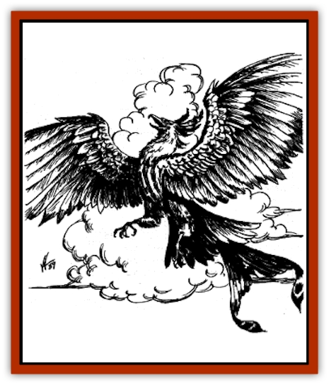
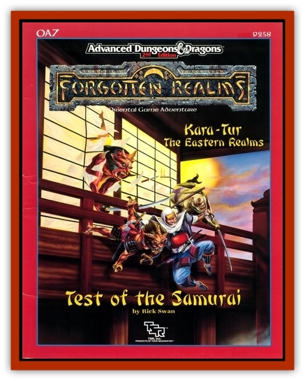

# Feng Huang

| Statistic | **Feng Huang** |
| --- | --- |
| **Activity Cycle:** | Any |
| **Alignment:** | Chaotic neutral |
| **Armor Class:** | -4 |
| **Climate/Terrain:** | Any land |
| **Damage/Attack:** | 1-10/1-10/3-18 |
| **Diet:** | Herbivore |
| **Frequency:** | Very rare |
| **Hit Dice:** | 22 |
| **Intelligence:** | Exceptional (16) |
| **Magic Resistance:** | See below |
| **Morale:** | Fanatic (17) |
| **Movement:** | 12, Fl 48 |
| **No. Appearing:** | 1 |
| **No. of Attacks:** | 3 |
| **Organization:** | Solitary |
| **Size:** | G (100') |
| **Special Attacks:** | See below |
| **Special Defenses:** | See below |
| **THAC0:** | 7 |
| **Treasure:** | B,H,U,Z |
| **XP Value:** | 24,000 |

The feng huang, also known as the oriental [[Phoenix|phoenix]], is perhaps the most magnificent of all feathered creatures. It is aloof, arrogant, and self-absorbed, fully cognizant of its own great beauty and awesome power.

The feng huang resembles a normal phoenix, but it has a shorter bill and neck, and larger wings. It averages 100 feet long from bill to tail, with a wingspan nearly twice the length of its body. It has a finned tail like that of a fish and a multi-colored crown. Its feathers are blue, red, green, yellow, and orange. Black and white stripes run the length of its belly. Feng huang can speak all human languages as well as those of all feathered creatures. Their voices sound like flutes.

**Combat:** Feng huang prefer to avoid combat, but are extremely aggressive if attacked. Though they can attack with their beak and front claws in the same round, feng huang prefer to attack with spells. They can cast *fireballs* twice per round and *flame lightning* once per round, but must make successful "to hit" rolls. The *fireballs* cause 2d10 hit points of damage and are +4 to hit. *Flame lighting* is a bolt of fire 50 feet long that inflicts 3d10 hit points of damage. The feng huang's most destructive attack is *fire storm*, which it can cast twice per day. The *fire storm* affects an area 1 mile square and 100 yards high, as if cast by a 20th level wizard. It can also cast *fire quench* twice per day affecting an area twice the size of its fire storm. It can cast *affect normal fires*, c*ontrol temperature in a 100-foot radius*, *animate fire* once per round; *fire shield*, *fire seeds*, *heat metal*, *produce fire*, *pyrotechnics*, *fire rain*, all three times per day; *wall of fire*, *melt metal*, *incendiary cloud*, all once per day. All spells are cast at 20th level. It can *plane shift* and *turn invisible* at will.

It automatically *detects charms*, *evil*, *magic* and *alignment* an dcontinually radiates *protection from evil in a 100-foot radius*. The feng huang can spread its wings to *dispel illusion* or *dispel magic*. It can be hit only by + 3 or better weapons. Its dance expels and drives away evil spirits as a 40th level caster, and this is effective against all but the most powerful of entities, such as one contained in an artifact or relic. If reduced to 0 hit points or less, its remains convert to a jade-like egg from which a new feng huang arises in 3d10 days.

**Habitat/Society:** Feng huang rarely appear in the Prime Material plane, making their lairs in alternate planes of existence, usually far away from other creatures. They build elaborate nests of spun gold and silver in the tops of gigantic wu t'ung, ornamental trees with bell-shaped white and brown flowers. Feng huang love treasure, especially gem stones of all kinds. Female feng huang lay one egg annually, but there is only a 1% chance that any given egg will hatch.

The appearance of a feng huang is variously associated with good fortune and disaster, owing to the creature's unpredictable nature. Tales are told of feng huang guiding lost ships to safe ports, then setting the ports afire before returning to their home planes. In the Prime Material plane, feng huang are equally at home in any climate, since they are unaffected by changes in temperature or weather.

**Ecology:** Feng huang are strict herbivores. They especially enjoy the seeds of wu t'ung flowers as well as stalks of ripe bamboo. They prefer to drink sweet water, such as fruit juices or streams flavored with honey. Their feathers are used in religious ceremonies of primitive cultures, though they are also coveted by collectors. Their eggs are the favorite food of certain spirit folk. Feng huang are also sought by the desperately ill, as they can cure diseases of any type with a touch of their wings. However, this effect is only produced if the feng huang so wills it, and they are usually reluctant to do so unless first offered a great treasure (at least 50,000 ch'ien in gold or gems).

---
## Discovery & Documentation

**Source Publication:** OA7 Test of the Samurai (1990)
**Campaign Setting:** Kara-Tur (Forgotten Realms)
**Author(s):** Rick Swan

### Other Creatures Found in This Source Book
   * [[Duruch'i-lin|Duruch'i-lin]]
   * [[Krakentua|Krakentua]]
