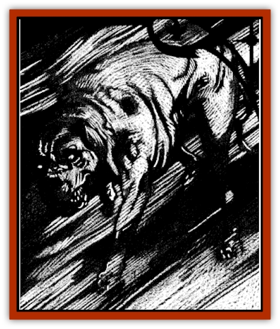

# Fenhound

| Statistic | **Fenhound** |
| --- | --- |
| **Activity Cycle:** | Three nights of the full moon |
| **Alignment:** | Chaotic good |
| **Armor Class:** | 4 |
| **Climate/Terrain:** | Moors and swamps of Ravenloft |
| **Damage/Attack:** | 1d10 |
| **Diet:** | Carnivore |
| **Frequency:** | Very rare |
| **Hit Dice:** | 5 |
| **Intelligence:** | Animal (1) |
| **Magic Resistance:** | 65% |
| **Morale:** | Fearless (19-20) |
| **Movement:** | 15 |
| **No. Appearing:** | 2d4 |
| **No. of Attacks:** | 1 |
| **Organization:** | Pack |
| **Size:** | L (8' long) |
| **Special Attacks:** | Baying |
| **Special Defenses:** | +2 or better weapon to hit, spell immunity |
| **THAC0:** | 15 |
| **Treasure:** | Nil |
| **XP Value:** | 2,000 |

Misty moors and steaming peat bogs have always been places where men feared to tread at night. Obviously, such places can be treacherous and deadly. But in quiet whispers, some who live near these macabre wetlands also tell tales of the dreaded fenhounds.

A fenhound appears only in the grim, veiled light of a full moon. It looks much like a large mastiff, being muscular of build and covered in short, coarse brown fur. Although a fenhound's physical form is not unusual, the aura that surrounds it is. Because fenhounds are able to tap into the ambient supernatural power that accompanies the full moon, each is suffused with an eerie, pale yellow light.

Like most breeds of canine, fenhounds cannot speak. Because of their nature as pack hunters, they are able to communicate basic concepts among themselves with barks, yips, and growls.

**Combat:** Fenhounds are able to sense and flawlessly track those who have been forced to make a powers check while on the moors near their home.

The first sign that victims have of the fenhounds' approach is the sound of their baying. Although this howl has a chilling effect on all who hear it, most people suffer no ill effects from it. However, the person being tracked by the hounds must make a fear check the first time he hears it.

When fenhounds reach their victim, they charge directly into melee combat. Each round, they are able to attack with their powerful jaws for 1d10 points of damage. Although they will do all that they can to reach the object of their hunt, those who try to block their way or protect their chosen victim are quickly attacked as well.

The aura of moonlight that surrounds a fenhound gives it special protection against attacks. This is reflected both in the creature's innate magic resistance and the fact that it cannot be harmed by weapons of less than +2 magical enchantment. Further, no spell from the priestly Sun sphere can harm or hinder fenhounds. Spells employed by any priest who worships a god of the moon, moors, revenge, or a similar aspect will also not harm the fenhound.

If slain in combat, the body of the fenhound breaks up into a cloud of shimmering vapor that quickly fades away. The person delivering the death blow to the creature becomes marked, however, and will find himself hunted by a pack of fenhounds each time there is a full moon. Only an *atonement* or similar spell can lift this curse from the character. If a character slays all of the hounds stalking him, he is free from their curse until the next full moon, when another pack of hounds will be released from the moors to hunt him anew.

**Habitat/Society:** Fenhounds are not creatures of the Prime Material plane. Rather, they seem to be some manifestation of the mists of Ravenloft itself. Their curious role as avenging spirits in this land of evil has puzzled many sages and experts on the occult. It may well be that there is some darker purpose to their existence that none have yet guessed.

Fenhounds are not creatures of evil disposition, despite their frightening countenance. Rather, they act against those who have done evil on the moors, swamps, and bogs of Ravenloft. Any person who is forced to make a powers check (success or failure not withstanding) while in a region inhabited by fenhounds will instantly draw their attention. When the next full moon occurs, two or more hounds will appear from the swirling mists on the wetlands to hunt down and destroy the fiends who have earned their wrath. Once the creatures arrive on the Prime Material plane, they will remain until dawn of until they or their victims have been slain.

**Ecology:** Fenhounds seem to serve a role as guardians of the darkest moors and bogs. Because the mists of Ravenloft both punish and reward those who do evil, it is impossible to guess at their ultimate purpose in creating fenhounds. Whatever else they might do, these beasts serve to torment those evil individuals who have not yet been condemned to the eternal tortures accorded to the lords of Ravenloft's various domains.

---
## Discovery & Documentation

**Source Publication:** Ravenloft Appendix III (1991)
**Campaign Setting:** Ravenloft
**Author(s):** Kirk Botulla

### Other Creatures Found in This Source Book
   * [[Akikage|Akikage]]
   * [[Animator_Common|Animator, Common]]
   * [[Animator_Greater|Animator, Greater]]
   * [[Animator_Minor|Animator, Minor]]
   * [[Animator_General_Information|Animator, General Information]]
   * [[Bakhna_Rakhna|Bakhna Rakhna]]
   * [[Baobhan_Sith|Baobhan Sith]]
   * [[Beetle_Scarab|Beetle, Scarab]]
   * [[Boneless|Boneless]]
   * [[Boowray|Boowray]]
   * [[Bruja|Bruja]]
   * [[Carrionette|Carrionette]]
   * [[Carrion_Stalker|Carrion Stalker]]
   * [[Cat_Midnight|Cat, Midnight]]
   * [[Cat_Skeletal|Cat, Skeletal]]
   * [[Cloaker_Resplendent|Cloaker, Resplendent]]
   * [[Cloaker_Shadow|Cloaker, Shadow]]
   * [[Cloaker_Undead|Cloaker, Undead]]
   * [[Corpse_Candle|Corpse Candle]]
   * [[Death's_Head_Tree|Death's Head Tree]]
   * [[Doppelganger_Ravenloft|Doppelganger (Ravenloft)]]
   * [[Familiar_Pseudo-|Familiar, Pseudo-]]
   * [[Familiar_Undead|Familiar, Undead]]
   * [[Feathered_Serpent|Feathered Serpent]]
   * [[Figurine_Ceramic|Figurine, Ceramic]]
   * [[Figurine_Crystal|Figurine, Crystal]]
   * [[Figurine_Ivory|Figurine, Ivory]]
   * [[Figurine_Obsidian|Figurine, Obsidian]]
   * [[Figurine_Porcelain|Figurine, Porcelain]]
   * [[Figurine_General_Information|Figurine, General Information]]
   * [[Fleas_of_Madness|Fleas of Madness]]
   * [[Furies|Furies]]
   * [[Geist|Geist]]
   * [[Ghost_Animal|Ghost, Animal]]
   * [[Golem_Flesh_Ravenloft|Golem, Flesh (Ravenloft)]]
   * [[Golem_Mist_Ravenloft|Golem, Mist (Ravenloft)]]
   * [[Golem_Wax_Ravenloft|Golem, Wax (Ravenloft)]]
   * [[Gremishka|Gremishka]]
   * [[Hag_Spectral|Hag, Spectral]]
   * [[Head_Hunter|Head Hunter]]
   * [[Hearth_Fiend|Hearth Fiend]]
   * [[Hebi-No-Onna|Hebi-No-Onna]]
   * [[Hound_Phantom|Hound, Phantom]]
   * [[Hound_Skeletal|Hound, Skeletal]]
   * [[Imp_Wishing|Imp, Wishing]]
   * [[Ivy_Crawling|Ivy, Crawling]]
   * [[Jack_Frost|Jack Frost]]
   * [[Jolly_Roger|Jolly Roger]]
   * [[Kizoku|Kizoku]]
   * [[Lashweed|Lashweed]]
   * [[Leech_Magical|Leech, Magical]]
   * [[Leech_Psionic|Leech, Psionic]]
   * [[Lich_Defiler|Lich, Defiler]]
   * [[Lich_Drow|Lich, Drow]]
   * [[Lich_Elemental|Lich, Elemental]]
   * [[Lich_Psionic|Lich, Psionic]]
   * [[Living_Tattoo|Living Tattoo]]
   * [[Lycanthrope_Loup-garou|Lycanthrope, Loup-garou]]
   * [[Lycanthrope_Werejackal|Lycanthrope, Werejackal]]
   * [[Lycanthrope_Werejaguar_Ravenloft|Lycanthrope, Werejaguar (Ravenloft)]]
   * [[Lycanthrope_Wereleopard|Lycanthrope, Wereleopard]]
   * [[Lycanthrope_Wereray|Lycanthrope, Wereray]]
   * [[Mist_Ferryman|Mist Ferryman]]
   * [[Moor_Man|Moor Man]]
   * [[Obedient|Obedient]]
   * [[Odem|Odem]]
   * [[Paka|Paka]]
   * [[Plant_Blood_Rose|Plant, Blood Rose]]
   * [[Plant_Fearweed|Plant, Fearweed]]
   * [[Radiant_Spirit|Radiant Spirit]]
   * [[Recluse|Recluse]]
   * [[Remnant_Aquatic|Remnant, Aquatic]]
   * [[Rushlight|Rushlight]]
   * [[Sea_Spawn_Master|Sea Spawn, Master]]
   * [[Sea_Spawn_Minion|Sea Spawn, Minion]]
   * [[Shadow_Asp|Shadow Asp]]
   * [[Shattered_Brethren|Shattered Brethren]]
   * [[Skeleton_Archer|Skeleton, Archer]]
   * [[Skeleton_Insectoid|Skeleton, Insectoid]]
   * [[Skin_Thief|Skin Thief]]
   * [[Spirit_Psionic|Spirit, Psionic]]
   * [[Strahd_Skeleton|Strahd Skeleton]]
   * [[Strahd_Zombie|Strahd Zombie]]
   * [[Unicorn_Shadow|Unicorn, Shadow]]
   * [[Vampire_Drow|Vampire, Drow]]
   * [[Vampire_Nosferatu|Vampire, Nosferatu]]
   * [[Vampire_Oriental|Vampire, Oriental]]
   * [[Virus_General_Information|Virus, General Information]]
   * [[Virus_I|Virus I]]
   * [[Virus_II|Virus II]]
   * [[Virus_III|Virus III]]
   * [[Vorlog|Vorlog]]
   * [[Will_O'Dawn|Will O'Dawn]]
   * [[Will_O'Deep|Will O'Deep]]
   * [[Will_O'Mist|Will O'Mist]]
   * [[Will_O'Sea|Will O'Sea]]
   * [[Zombie_Cannibal|Zombie, Cannibal]]
   * [[Zombie_Desert|Zombie, Desert]]
   * [[Zombie_Wolf|Zombie Wolf]]
   * [[Zombie_Fog|Zombie Fog]]
