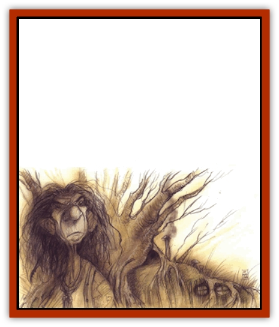

# Fensir

| Statistic | **Fensir** |
| --- | --- |
| **Activity Cycle:** | Night |
| **Alignment:** | Chaotic neutral |
| **Armor Class:** | 7 (4) |
| **Climate/Terrain:** | Ysgard highlands |
| **Damage/Attack:** | 1d4/1d4 or by weapon |
| **Diet:** | Omnivore |
| **Frequency:** | Uncommon |
| **Hit Dice:** | 4 |
| **Intelligence:** | Low to very (5-12) |
| **Magic Resistance:** | Nil |
| **Morale:** | Elite (13-14) |
| **Movement:** | 15 |
| **No. Appearing:** | 2d4 |
| **No. of Attacks:** | 2 or 1 |
| **Organization:** | Family |
| **Size:** | M to L (6-8' tall, or up to 25') |
| **Special Attacks:** | Hurling stones, spells |
| **Special Defenses:** | Nil |
| **THAC0:** | 17 |
| **Treasure:** | B,M,Q,S |
| **XP Value:** | Male: 270 / Female: 175 / Young: 35 / Mage 1-4: 420 / Mage 5-8: 1,400 / Mage 9-12: 2,000 / Rakka: 1,400 |

Also called Ysgardian [[Troll|trolls]], the fensir are creatures peculiar to Ysgard and are completely unrelated to the trolls on the Prime. Fensir are more cultured and intelligent than the prime-material creatures of the same name. They range from hideously ugly, huge, and hulking to nearly human in size and appearance. However, even the normal-seeming trolls are very different from humans, for they live by night and dine on anything remotely edible: roots, grasses, bark, scavenged meat, and even some forms of clay.

The fensir wear the clothes of Ysgard, not crude skins or furs. Helmets, woolen hose and tunics, leather vests, leather boots, and big black rabbit-fur hats are popular among the male fensir. The women wear linen or woolen scales, simple woven dresses, and leather shoes.

Fensir speak the languages of Ysgard, the [[Lillend|lillendi]], and the common tongue.

**Combat:** Fensir fight with the same weapons as the petitioners of Ysgard, preferring battle axes, spears, and broad swords. If caught unarmed, such as while foraging, they fight with their stony fists for 1d4/1d4 points of damage. Male and female fensir use very different forms of combat, described in separate sections below.

All adult fensir are susceptible to sunlight: they turn to stone if caught in daylight for more than a single round. A *sunray* spell allows them a saving throw, and they only turn to stone if they fail. However, even if they retain their form, any exposure to sunlight or a *sunray* spell forces fensir to make an immediate morale check at -4. Once transformed, fensir can only be restored by a complicate extract of mandrake root that the males brew under a new moon. This restorative extract acts as a *stone to flesh* spell on any petrified creature, not just fensir.

**Habitat/Society:** Trolls are not social creatures. Each family lives more or less by itself in difficult terrain. Their homes are found in deep woods, rocky sea-cliffs, high mountains, and deserted heaths. These homes are half sunk into the earth (for warmth in winter) and usually roofed with sod, so they are difficult to spot even for those who know where to look.

Among Ysgardian trolls, each birth results in a litter of 2d4 young, and most litters contain at least one set of identical or fraternal twins (litters without twins are considered very unlucky). The twins stay together until maturity, when they seek out a second set of twins.

Fensir twins are so similar in most respects that a pair of males and a pair of females usually marry each other, rather than finding unrelated mates. Even among untwinned trolls, double weddings of sisters or brothers are common. When two sets or twins mate, the twin-bond is broken and the pair-bond takes its place. Sagas often go on about the twin-bond, but the fensir themselves don't consider it unusual or worth remarking on.

If a twin is killed by violence, magic, or poison while the second fensir still lives, the remaining twin stops at nothing to avenge the death, fighting in a frenzy with double the normal number of attacks and +2 to all damage rolls.

A solitary fensir sometimes seeks out a human mate. Although why the fensir feel such a need is a secret only they know, some believe that a Ysgardian troll without a twin cannot court a mate, and turns to humans as a substitute.

Male and female fensir have little in common and are exceptionally shy around one another. They do their separate tasks, but rarely spend much time together; some would say they lead separate lives in the same household. Again. the Ysgardian trolls don't find this unusual.

**Ecology:** Fensir keep to themselves, rarely interfering in the lives of others and expecting their privacy in return. The only exception to this is their fascination (some would say obsession) with the lillendi. Fensir have been known to kidnap and enslave the snake-women. Though the reason is unclear, some believe the blood of a lillend is required for the restorative potion that returns stone fensir to flesh. Ysgardian trolls are on tolerable terms with the dwarves and elves of Ysgard. They are considered wise elders by the [[Bariaur|bariaur]], who often consult them on questions of herbalism, diagnosis, and treatment.

**Female Fensir and Rakka**

  Female fensir rule their households, and they are the keepers of each family treasure. Fensir woman are brewmasters, responsible for making beer and mead to sell to other trolls, giants, and Ysgardian petitioners. They are also weavers, trading their cloth to the Ysgardian dwarves in exchange for metal goods such as stewpots, spears, arrowheads, tea kettles, and cleavers. They are the providers in fensir families, for the males hunting brings little food to the stewpot. Gathered nuts and roots provide most of the fensir diet, and they consider meat broth a delicacy. Halfling flesh is especially prized for these broths. Females are the primary protectors of the family as well, since they are strong enough to hurl large stones up to 200 yards for 2d6 points of damage.

Female fensir resemble males until they bear their first litter of young. when they become rakka, or devourers. Rakka increase constantly in size and weight, eventually outgrowing their house and requiring a new one. As the rakka reach heights of 20 to 25 feet and weights of more than 6,000 pounds, their children strip the surrounding countryside bare trying to sustain their mother. Rakka have 8 Hit Dice, and their fists can strike for 1d10 points of damage. All rakka die after a few years of this growth, leaving behind a widower and sometimes a second or even third litter of young. If killed in battle, a rakka can use a dying curse to *cause disease* or *madness*, affecting up to seven of her attackers.

**Male Fensir**

  Male fensir are poor hunters, fair craftsmen, and exceptional cooks, preparing and blessing the food that the females and young bring in from their foraging. Slendcr, fast, and adept at magic, fensir men are the spiritual leaders and lawgivers of their family. Their magic includes a vast store of herbalistm.

All male fensir can cast *transmute rock to mud* and *transmute earth to stones* three times per day (the latter changes earth to small, boulder-sized stones, perfect for hurling). About 75% of all males are mages of 1st to 12th level; they gain l additional Hit Die for each 4 levels of ability.

Those males who have no gift for the runes and signs of magic are considered unlucky, and are often abandoned to live solitary lives in the remotest regions. A few of the males are such exceptional herbalists that they stay with their families, brewing potions and making poultices. These herbalists create magical potions and use them to defend their families.

**Fensir Young**

  Young Ysgardian trolls are unaffected by sunlight, which gives them wide freedom to act like hooligans. Packs of young fensir sometimes become a problem, robbing travelers, annoying animals, and vandalizing small settlements. They have 2 Hit Dice and no effective fist attacks.

**The Long Walk**

  When a rakka dies, a family of Ysgardian trolls is seized by a form of wanderlust called the Long Walk. This instinct drives them from their homes into the wastes, where they roam, forage, and sometimes gather with other families. When they do form hordes, the fensir rush out of the wastes to pillage the rich realms of Alfheim, Asgard, the Moon Gates, and Vanaheim. Regardless of whether the fensir gather into a horde, they never return to their original lairs. As a result, abandoned fensir lairs are common throughout Ysgard.

---
## Discovery & Documentation

**Source Publication:** Planes of Chaos (1994)
**Campaign Setting:** Planescape
**Author(s):** Wolfgang Baur, L. W. Smith

### Other Creatures Found in This Source Book
   * [[Asrai|Asrai]]
   * [[Astral_Dreadnought|Astral Dreadnought]]
   * [[Bacchae|Bacchae]]
   * [[Chaos_Beast|Chaos Beast]]
   * [[Abyssal_Lord|Abyssal Lord]]
   * [[Howler|Howler]]
   * [[Imp_Chaos|Imp, Chaos]]
   * [[Lillend|Lillend]]
   * [[Murska|Murska]]
   * [[Oread|Oread]]
   * [[Ratatosk|Ratatosk]]
   * [[Tanar'ri_Greater_Goristro|Tanar'ri, Greater, Goristro]]
   * [[Tanar'ri_Lesser_Armanite|Tanar'ri, Lesser, Armanite]]
   * [[Varrangoin|Varrangoin]]
   * [[Viper_Tree|Viper Tree]]
