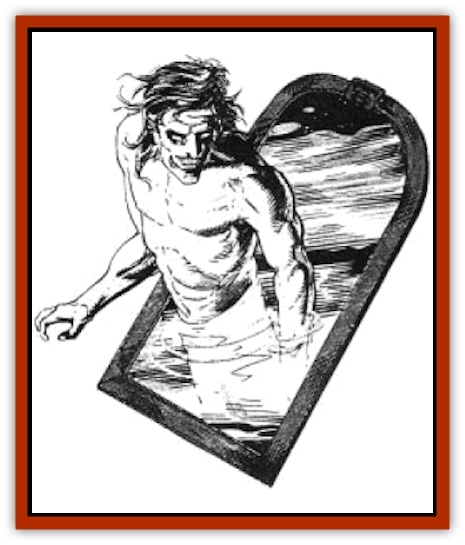

# Fetch

| Statistic | **Fetch** |
| --- | --- |
| **Activity Cycle:** | Any |
| **Alignment:** | Chaotic evil |
| **Armor Class:** | 4 |
| **Climate/Terrain:** | Any |
| **Damage/Attack:** | Special |
| **Diet:** | Special |
| **Frequency:** | Very rare |
| **Hit Dice:** | 9 |
| **Intelligence:** | High (13-14) |
| **Magic Resistance:** | Nil |
| **Morale:** | Very steady (14) |
| **Movement:** | 6 |
| **No. Appearing:** | 1 |
| **No. of Attacks:** | 2 |
| **Organization:** | Solitary |
| **Size:** | M (4-7' tall) |
| **Special Attacks:** | Drains 2 levels per hit |
| **Special Defenses:** | Invisible except to victim |
| **THAC0:** | 11 |
| **Treasure:** | Nil |
| **XP Value:** | 3,000 |

Fetch are harbingers of death. Existing on the fringes of the Abyss, these creatures can only reach into the Prime Material plane through reflective surfaces, such as mirrors or pools of water.

A fetch appears to be a haggard and deathly pale imitation of the person or creature gazing into the reflective surface. If more than one person or creature gazes into the reflective surface at the same time, the fetch assumes the image of the person or creature closest to the reflective surface; if all are equally distant, it chooses randomly. The fetch never assumes the image of a person or creature taller than seven feet or shorter than four feet.

The fetch's eyes are dull and lifeless. It reflexively breaks into an evil grin when its eyes meet those of its intended victim for the first time. Its flesh iS ice cold to the touch. Fetch neither breathe nor speak, although they do engage in limited telepathic communication with evil clerics of 10th level or higher.

**Combat:** Though fetch can gaze into the Prime Material plane through reflective surfaces, they cannot emerge into this plane until they meet the eyes of their victims. Fetch can appear in any type of reflective surface, including a mirror, the surface of a pond, or even a shiny silver tray. However, the surface must be large enough for the fetch's body to fit through. (For instance, assume that a fetch is gazing through a one-foot-diameter mirror hanging on the wall of a room at an inn. An overweight warrior enters the room. The fetch assumes the warrior's image, but the fetch is now too plump to squeeze through the mirror, and the intended victim is sate.)

A fetch is invisible to all but the intended victim, even when attacking. *True seeing* (but not *detect invisibility*) spells reveal the creature. The intended victim can always see the fetch in the reflective surface. The victim suffers penalties of -2 to his attack roll and +2 to his AC. The victim's companions suffer a -4 penalty to their attack rolls and a +2 penalty to their ACs, when attacking the fetch.

A fetch attacks with an exact replica of the weapon of its intended victim; if the victim has more than one weapon, the fetch chooses one of them randomly. If the victim has no weapon, the fetch attacks with its hands. The fetch makes two attacks per round. Each successful attack causes the victim to lose two levels of experience - roll the Hit Dice appropriate to the victim's class two times and subtract that number of hit points from the character's total, also subtracting the victims Constitution bonus for those levels. If a lost level is one in which the character received a fixed number of hit points instead of a die roll, subtract the appropriate number of hit points. These hit points are permanently lost; the adjusted hit point total is now the victim's maximum. All powers, spells, and abilities associated with the lost levels are also lost.

If a victim is reduced to level 0, the fetch pulls him through the reflective surface and into the Abyss. Once into the Abyss, the victim turns into a fetch. If the victim is reduced to level 0, but the fetch is killed or is otherwise prevented from taking victim into the Abyss, the victim, assuming he is still alive, becomes an ordinary person - his adventuring days are over. He can continue his career if a *wish* or *restoration* spell is cast on his behalf. If a level 0 character suffers another successful hit from the fetch, he is slain instantly, regardless of whether he has any hit points remaining. Unlike victims of other energy-draining creatures, a level 0 character slam by a fetch does not return as an undead.

A fetch can pull victims into the Abyss only through the reflective surface from which it originally appeared. If that reflective surface is destroyed, such as by shattering the mirror or draining the pond, the fetch must locate another reflective surface to return itself to the Abyss. If it does not locate a new reflective surface within 24 hours, it begins to lose hit points at the rate of 3d6 per day. If it is reduced to 0 hit points or fewer, it is destroyed.

**Habitat/Society:** Motivated by an obsessive hatred of all intelligent races of good or neutral alignment, fetch spend most of their time in the Abyss searching for portals leading to reflective surfaces in the Prime Material plane. Less than 1% of the discovered portals lead to an accessible reflective surface. New fetch are created only from victims pulled into the Abyss.

**Ecology:** Fetch neither eat nor drink. They occasionally engage in recreational killings of weaker creatures encountered in the Abyss. Fetch are sometimes used as assassins and aides by the gods of evil and by evil wizards.

---
## Discovery & Documentation

**Source Publication:** MC4 Dragonlance Appendix (w/binder #2) (1989)
**Campaign Setting:** Dragonlance
**Author(s):** Rick Swan

### Other Creatures Found in This Source Book
   * [[Anemone_Giant_Sea|Anemone, Giant Sea]]
   * [[Bear_Ice|Bear, Ice]]
   * [[Beast_Undead|Beast, Undead]]
   * [[Bird_Krynn|Bird (Krynn)]]
   * [[Disir|Disir]]
   * [[Draconian_Aurak|Draconian, Aurak]]
   * [[Draconian_Baaz|Draconian, Baaz]]
   * [[Draconian_Bozak|Draconian, Bozak]]
   * [[Draconian_Kapak|Draconian, Kapak]]
   * [[Draconian_General_Information|Draconian, General Information]]
   * [[Draconian_Sivak|Draconian, Sivak]]
   * [[Draconian_Proto-_Traag|Draconian, Proto-, Traag]]
   * [[Dragon_Amphi|Dragon, Amphi]]
   * [[Dragon_Astral|Dragon, Astral]]
   * [[Dragon_Kodragon|Dragon, Kodragon]]
   * [[Dragon_Krynn_Othlorx_General_Information|Dragon (Krynn), Othlorx, General Information]]
   * [[Dragon_Krynn_General_Information|Dragon (Krynn), General Information]]
   * [[Dragon_Sea|Dragon, Sea]]
   * [[Dreamshadow|Dreamshadow]]
   * [[Dreamwraith|Dreamwraith]]
   * [[Dwarf_Daergar|Dwarf, Daergar]]
   * [[Dwarf_Hill_Neidar|Dwarf, Hill, Neidar]]
   * [[Dwarf_Mountain_Hylar|Dwarf, Mountain, Hylar]]
   * [[Dwarf_Theiwar|Dwarf, Theiwar]]
   * [[Dwarf_Zakhar|Dwarf, Zakhar]]
   * [[Elf_Half-|Elf, Half-]]
   * [[Elf_High_Qualinesti|Elf, High, Qualinesti]]
   * [[Elf_High_Silvanesti|Elf, High, Silvanesti]]
   * [[Elf_Sea_Dargonesti|Elf, Sea, Dargonesti]]
   * [[Elf_Sea_Dimernesti|Elf, Sea, Dimernesti]]
   * [[Elf_Wild_Kagonesti|Elf, Wild, Kagonesti]]
   * [[Eyewing|Eyewing]]
   * [[Fire_Minion|Fire Minion]]
   * [[Fireshadow|Fireshadow]]
   * [[Gnome_Tinker|Gnome, Tinker]]
   * [[Gurik_Cha'ahl|Gurik Cha'ahl]]
   * [[Haunt_Knight|Haunt, Knight]]
   * [[Horax|Horax]]
   * [[Human_Krynn|Human (Krynn)]]
   * [[Imp_Blood_Sea|Imp, Blood Sea]]
   * [[Kalothagh|Kalothagh]]
   * [[Kani_Doll|Kani Doll]]
   * [[Kender|Kender]]
   * [[Kyrie|Kyrie]]
   * [[Lizard_Man_Krynn|Lizard Man (Krynn)]]
   * [[Minotaur_Krynn|Minotaur, Krynn]]
   * [[Ogre_High|Ogre, High]]
   * [[Ogre_Krynn|Ogre (Krynn)]]
   * [[Phaethon|Phaethon]]
   * [[Saqualaminoi|Saqualaminoi]]
   * [[Shadowperson|Shadowperson]]
   * [[Shimmerweed|Shimmerweed]]
   * [[Skrit|Skrit]]
   * [[Spectral_Minion|Spectral Minion]]
   * [[Spider_Krynn|Spider (Krynn)]]
   * [[Stag|Stag]]
   * [[Tayling|Tayling]]
   * [[Thanoi|Thanoi]]
   * [[Tylor|Tylor]]
   * [[Wichtlin|Wichtlin]]
   * [[Wyndlass|Wyndlass]]
   * [[Yaggol|Yaggol]]
