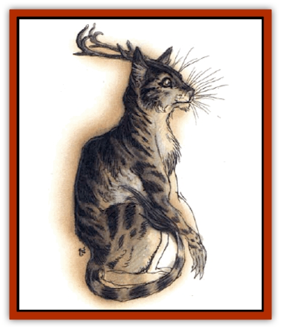

# Feystag

| Statistic | **Feystag** |
| --- | --- |
| **Activity Cycle:** | Any |
| **Alignment:** | Chaotic neutral |
| **Armor Class:** | 7 |
| **Climate/Terrain:** | Temperate, arctic/forest, hill |
| **Damage/Attack:** | 1d4 (&times;2) or by weapon -1 |
| **Diet:** | Omnivore |
| **Frequency:** | Very rare |
| **Hit Dice:** | 2+4 |
| **Intelligence:** | High (13-14) |
| **Magic Resistance:** | 70% |
| **Morale:** | Steady (11-12) |
| **Movement:** | 14 |
| **No. Appearing:** | 1d2 |
| **No. of Attacks:** | 2 or 1 plus special |
| **Organization:** | Solitary (or mated pair) |
| **Size:** | M (4' tall at shoulder) |
| **Special Attacks:** | Control magical items |
| **Special Defenses:** | Nil |
| **THAC0:** | 19 |
| **Treasure:** | V&times;2,X |
| **XP Value:** | 975 |

Feystags are often whispered of in woodcutters' tales, for their mastery over magic makes them fearsome opponents. These creatures can run on all fours or stand erect. Their limbs are clawed, they have coats of dusty brown hair, and antlers rise from their catlike heads.

Feystags can speak numerous languages as well as humans of equal intelligence, particularly those of woodland creatures.

**Combat:** A feystag senses dweomers of enchanted items, and it can often identify the type, specific functions, and even "strength" (number of charges, uses, or spells remaining) of a magical item with a 90% chance of success, modified as follows (choose the greatest applicable debit in any situation; debits are not cumulative):

<ul style="list-style-type:none;"><li>-60% if the feystag is confused or feebleminded</li><li>-40% if the feystag is under psionic attack</li><li>+20% if used on the feystag in the last three turns</li><li>+25% if the feystag has seen an item in use</li></ul>A feystag free of confusion or feeblemindedness automatically senses all dweomers within 60 feet seeing them as auras of differing brightness. A feystag that studies an item for a round makes an Intelligence check to determine if it divines how to activate or control a property of the item. (Some magical items defy identification or have too faint a dweomer for the feystag to learn their powers - DM's call.) Note that the creature can study only one item per round, but it can do so in addition to other physical, mental, and magical activity. A feystag able to handle an item gains a 1-point bonus on its ability check. Feystags can study items from up to 60 feet distant.

If a feystag learns how to operate an item power triggered by force of will, silent mental command, or spoken word, it can make the item function from 20 feet away. Feystags can't control or activate items they haven't identified, and they can activate only one item per round, once, but items that operate continuously for more than a round will do so even after an activating feystag has turned its attention to another item.

The bearer of an item a feystag activates from afar can wrest control back from the creature if the item is controlled by physical means or if the bearer speaks command words. (The bearer's words override the feystag's long-range commands) If the bearer tries to regain control of a power activated by will, his Intelligence and Wisdom must exceed 32. If the total is 29-32, the bearer succeeds, but must successfully save vs. spell or be confused for 1d6 rounds (no one can operate the item during this time if the bearer still holds it). If the total is 28 or less, the bearer can't regain control from the feystag.

The feystag's two clawed forearms can awkwardly wield one-handed weapons (-1 penalty to attack and damage rolls) or rake with its claws. It is immune to all enchantment/charm and greater divination magic, and to psionics which duplicate mind-reading and influencing effects.

**Habitat/Society:** A feystag is usually a solitary forager (except during its mating cycle). It habitually scouts out new territories, discovering springs, caverns, hiding places, and areas where pitfalls and snares can be set - often a feystag lair is surrounded by traps. The creature hoards magical items, delighting in their use and always trying to acquire more.

A few feystags dwell among humans in remote forest communities. They often bargain with or sell information about items brought to them, or they become sages.

**Ecology:** Feystags are preyed upon by all creatures who dine on deer. They are friendly with [[Korred|korred]], [[Centaur|centaurs]], and [[Satyr|satyrs]]. They prefer to eat plants (particularly mint), certain mosses, and mistletoe.

---
## Discovery & Documentation

**Source Publication:** Monstrous Compendium, 1994 Annual, Volume 1 (1995)
**Campaign Setting:** Advanced Dungeons & Dragons 2nd Edition
**Author(s):** David Wise

### Other Creatures Found in This Source Book
   * [[Abyss_Ant|Abyss Ant]]
   * [[Achaierai|Achaierai]]
   * [[Afanc|Afanc]]
   * [[Al-Jahar|Al-Jahar]]
   * [[Baelnorn|Baelnorn]]
   * [[Baneguard|Baneguard]]
   * [[Banelar|Banelar]]
   * [[Bird_Talking|Bird, Talking]]
   * [[Blazing_Bones|Blazing Bones]]
   * [[Campestri|Campestri]]
   * [[Caniquine|Caniquine]]
   * [[Cat_Winged|Cat, Winged]]
   * [[Crypt_Servant|Crypt Servant]]
   * [[Death's_Head_Tree|Death's Head Tree]]
   * [[Dog_Saluqi|Dog, Saluqi]]
   * [[Dragon_Electrum|Dragon, Electrum]]
   * [[Dragon_Fang|Dragon, Fang]]
   * [[Dragon_Linnorm_Corpse_Tearer|Dragon, Linnorm, Corpse Tearer]]
   * [[Dragon_Linnorm_Dread|Dragon, Linnorm, Dread]]
   * [[Dragon_Linnorm_Flame|Dragon, Linnorm, Flame]]
   * [[Dragon_Linnorm_Forest|Dragon, Linnorm, Forest]]
   * [[Dragon_Linnorm_Frost|Dragon, Linnorm, Frost]]
   * [[Dragon_Linnorm_Gray|Dragon, Linnorm, Gray]]
   * [[Dragon_Linnorm_Land|Dragon, Linnorm, Land]]
   * [[Dragon_Linnorm_Midgard|Dragon, Linnorm, Midgard]]
   * [[Dragon_Linnorm_Rain|Dragon, Linnorm, Rain]]
   * [[Dragon_Linnorm_Sea|Dragon, Linnorm, Sea]]
   * [[Dragon_Neutral_Jacinth|Dragon, Neutral, Jacinth]]
   * [[Dragon_Neutral_Jade|Dragon, Neutral, Jade]]
   * [[Dragon_Neutral_Pearl|Dragon, Neutral, Pearl]]
   * [[Dread|Dread]]
   * [[Dragon-kin|Dragon-kin]]
   * [[Elemental_Earth_Kin_Chrysmal|Elemental, Earth Kin, Chrysmal]]
   * [[Elemental_Earth_Kin_Earth_Weird|Elemental, Earth Kin, Earth Weird]]
   * [[Elemental_Fire_Kin_Azer|Elemental, Fire Kin, Azer]]
   * [[Elemental_Sandman|Elemental, Sandman]]
   * [[Elemental_Wind_Walker|Elemental, Wind Walker]]
   * [[Elemental_Vermin|Elemental Vermin]]
   * [[Flame_Skull|Flame Skull]]
   * [[Foulwing|Foulwing]]
   * [[Gambado|Gambado]]
   * [[Garbug|Garbug]]
   * [[Genie_Tasked_Administrator|Genie, Tasked, Administrator]]
   * [[Genie_Tasked_Deceiver|Genie, Tasked, Deceiver]]
   * [[Genie_Tasked_Harim_Servant|Genie, Tasked, Harim Servant]]
   * [[Genie_Tasked_Messenger|Genie, Tasked, Messenger]]
   * [[Genie_Tasked_Miner|Genie, Tasked, Miner]]
   * [[Genie_Tasked_Oathbinder|Genie, Tasked, Oathbinder]]
   * [[Gibbering_Mouther|Gibbering Mouther]]
   * [[Gnasher|Gnasher]]
   * [[Gnasher_Winged|Gnasher, Winged]]
   * [[Golem_Brain|Golem, Brain]]
   * [[Golem_Hammer|Golem, Hammer]]
   * [[Golem_Metagolem|Golem, Metagolem]]
   * [[Golem_Spiderstone|Golem, Spiderstone]]
   * [[Gorynych|Gorynych]]
   * [[Greelox|Greelox]]
   * [[Helmed_Horror|Helmed Horror]]
   * [[Jarbo|Jarbo]]
   * [[Laraken|Laraken]]
   * [[Lich_Psionic|Lich, Psionic]]
   * [[Living_Steel|Living Steel]]
   * [[Lock_Lurker|Lock Lurker]]
   * [[Loxo|Loxo]]
   * [[Lycanthrope_Loup_de_Noir|Lycanthrope, Loup de Noir]]
   * [[Lycanthrope_Werebadger|Lycanthrope, Werebadger]]
   * [[Lycanthrope_Werejaguar|Lycanthrope, Werejaguar]]
   * [[Lythlyx|Lythlyx]]
   * [[Magebane|Magebane]]
   * [[Marrashi|Marrashi]]
   * [[Metalmaster|Metalmaster]]
   * [[Mimic_House_Hunter|Mimic, House Hunter]]
   * [[Naga_Bone|Naga, Bone]]
   * [[Nautilus_Giant|Nautilus, Giant]]
   * [[Nightshade_Toril|Nightshade (Toril)]]
   * [[Nishruu|Nishruu]]
   * [[Noran|Noran]]
   * [[Opinicus|Opinicus]]
   * [[Ormyrr|Ormyrr]]
   * [[Parasite|Parasite]]
   * [[Pasari-Niml|Pasari-Niml]]
   * [[Plant_Vampire_Moss|Plant, Vampire Moss]]
   * [[Pteraman|Pteraman]]
   * [[Rautym|Rautym]]
   * [[Shadeling|Shadeling]]
   * [[Skum|Skum]]
   * [[Snake_Giant_Cobra|Snake, Giant Cobra]]
   * [[Snake_Stone|Snake, Stone]]
   * [[Spectral_Wizard|Spectral Wizard]]
   * [[Spell_Weaver|Spell Weaver]]
   * [[Spider_Brain|Spider, Brain]]
   * [[Suwyze|Suwyze]]
   * [[Tatalla|Tatalla]]
   * [[Tick_Heart|Tick, Heart]]
   * [[Tree_Dark|Tree, Dark]]
   * [[Tree_Singing|Tree, Singing]]
   * [[Tressym|Tressym]]
   * [[Troll_Snow|Troll, Snow]]
   * [[Tuyewera|Tuyewera]]
   * [[Ulitharid|Ulitharid]]
   * [[Undead_Dwarf|Undead Dwarf]]
   * [[Undead_Lake_Monster|Undead Lake Monster]]
   * [[Whipsting|Whipsting]]
   * [[Windghost|Windghost]]
   * [[Wolf_Dread|Wolf, Dread]]
   * [[Wolf_Stone|Wolf, Stone]]
   * [[Wolf_Vampiric|Wolf, Vampiric]]
   * [[Wraith_Shimmering|Wraith, Shimmering]]
   * [[Xantravar|Xantravar]]
   * [[Xaver|Xaver]]
