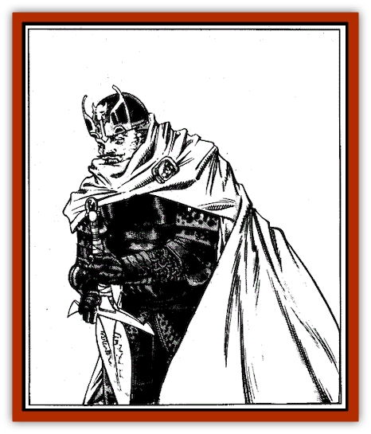
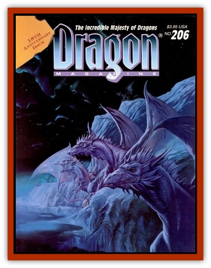

# Fiend Knight

| Statistic | **Fiend Knight** |
| --- | --- |
| **Activity Cycle:** | None |
| **Alignment:** | Varies |
| **Armor Class:** | 12, 24 mounted |
| **Climate/Terrain:** | Any/Aerdi |
| **Damage/Attack:** | Immune to sleep, charm, hold spells and illusion/phantasm spells below fourth level |
| **Diet:** | Very (11-12), rarely higher |
| **Frequency:** |  |
| **Hit Dice:** | Varies |
| **Intelligence:** | Non- (0) |
| **Magic Resistance:** | -20% |
| **Morale:** |  |
| **Movement:** | 4d10 to 10d10 + |
| **No. Appearing:** | 10 (unarmored), see below |
| **No. of Attacks:** | 0 |
| **Organization:** | Constant (do not need rest) |
| **Size:** | Varies |
| **Special Attacks:** | Nil |
| **Special Defenses:** | M (6'+) |
| **THAC0:** | By weapon type +3 or better |
| **Treasure:** | 14 |
| **XP Value:** |  |

The Fiend Knights of Doom are an elite squad of warriors created from normal men by spellcraft on the part of both Ivid V himself, and Xaene, and also using mind-controlling magics crafted from [[Baatezu_General_Information|baatezu]] relics. These servants are utterly, mindlessly loyal to the overking.

**Combat:** Fiend knights have the same number of hit dice as they had levels when mortal fighters. For example, a 5th-level fighter would become a 5-HD fiend knight. Nearly all fiend knights are 10th level or below, with three exceptions - leaders of 11, 12, and 15 HD. These three leaders, and some dozen others, wear *fiend plate mail +3*. Others are 5% per level likely to wear magical plate mail (roll 1d10: 1-8 plate mail +1, 9 plate mail +2, 10 plate mail +3), else nonmagical plate mail. Fiend knights always employ two-handed weapons, usually two-handed swords, and composite long bows. Again, they are 5% per level likely to have magical weapons (use the table above, independently for each weapon type). Leaders are always armed with magical weapons, and the 11 + HD leaders all possess powerful ones: a *two-handed sword of cold +3* and a *two-handed sword +3, giant slayer*.

The fiend knights have high ability scores. All possess Strengths of 18/01 or better, and have minimum Dexterity and Constitution scores of 15. No ability ever has a score below 9.

**Habitat/Society:** The current composition of the fiend knights, in addition to their leaders, is approximately 80 cavalry, 20 of whom ride undead steeds, the other 60 riding normal [[Horse|heavy warhorses]]. Treat the undead steeds as heavy warhorses with immunity to *sleep*, *charm* and *hold* spells. These troops have heavy lances, again with a 5% chance per level for a magical lance, and they employ footman's flails in addition to two-handed weapons.

The 120 heavy infantry each carry a long spear and a variety of polearms in addition to other weaponry. They have a 2% chance per level for a magical polearm.

As currently organized, the fiend knights wear gold visors and bear a heraldic emblem etched on their armor over the heart. For cavalry, the emblem is a tan horse, and for infantry, it is a bronze baboon. The infantry are known as "The Howlers", for when they go into combat they howl and scream, hoping to strike fear into the hearts of their enemies.

**Ecology:** Fiend knights are not undead, and have none of their weaknesses: they cannot be turned, harmed by holy water, and so on. They are simply wholly controlled humans loyal to Ivid, created by a precursor of the malign rituals that brought the [[Animus|animus]] to Oerth. The unfeeling, "programmed" nature of the fiend knights make them feared by all. Even Ivid's other troops hate and fear them, and loathe having to serve with them.

---
## Discovery & Documentation

**Source Publication:** Dragon206 (1994)
**Campaign Setting:** Dragon Magazine
**Author(s):** 

### Other Creatures Found in This Source Book
   * [[Brownie_Dobie|Brownie, Dobie]]
   * [[Faerie_Faerie_Fiddler|Faerie, Faerie Fiddler]]
   * [[Faerie_Petty_Bramble|Faerie, Petty, Bramble]]
