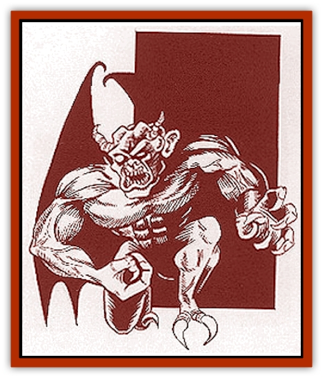

# Fiend - Narvaezan

| Statistic | **Fiend, Narvaezan** |
| --- | --- |
| **Activity Cycle:** | Night |
| **Alignment:** | Chaotic evil |
| **Armor Class:** | 3 |
| **Climate/Terrain:** | Any |
| **Damage/Attack:** | 1d6/1d6/1d6/1d6/2d4 |
| **Diet:** | Special |
| **Frequency:** | Very rare |
| **Hit Dice:** | 6+2 |
| **Intelligence:** | High (13-14) |
| **Magic Resistance:** | 10% |
| **Morale:** | Fanatic (17-18) |
| **Movement:** | Fl 24 (A) |
| **No. Appearing:** | 1 |
| **No. of Attacks:** | 5 |
| **Organization:** | Solitary |
| **Size:** | M (6' tall) |
| **Special Attacks:** | Spells |
| **Special Defenses:** | Hit only by magical weapons |
| **THAC0:** | 15 |
| **Treasure:** | H,S,T |
| **XP Value:** | 4,000 |

This creature of half shadow and half substance intentionally materializes as a being of twisted features, with dark horns and squirming shadows behind it. These shadows alternately appear as a billowing cloak or large bat wings. Its strangely proportioned arms hang almost to its knees, ending in large claws. Its feet also have great, hooking claws that would impede its movement if it did not fly everywhere. The most frightening aspect of this fiend's appearance is its eyes, which burn with an evil black-green intensity always visible unless the creature is hiding in the shadows.

The Narvaezan fiend communicates telepathically but cannot select who it speaks to. It selects a range up to 10 yards, and anyone within that radius can hear what it says. The telepathic connection allows it to speak any language. The creature can choose to sound like an enticing whisper or a raspy screech.

**Combat:** The Narvaezan fiend attacks with stealth, pouncing on a victim from behind, which negates any Dexterity adjustment to the victim's AC. The fiend attacks with all four claws and its bite each round. Once the fiend draws blood, it becomes more corporeal. In this solid state, the fiend cannot simply melt back into shadows; it must remain for two rounds without drawing more blood or try to escape by more conventional methods (such as flight). If the creature chooses to attack by swooping past its victim, it receives only the four claw attacks, but gains a +1 damage bonus (1d6+1) on each successful hit.

The fiend cannot be affected except by magical weapons, spells, and Legacies. Three times per day it can attempt either fear, enthrall, or curse as per priest spells, and once per day it can attempt suggestion as per the wizard spell. The fiend can also cast a cure light wounds spell on itself after three turns of concentrated thought.

This creature moves only by the power of flight. Each round, it can move up to 240 feet in any direction, carrying up to 100 pounds with no penalty. With proper concentration, it can carry a maximum weight of 200 pounds, sacrificing half its speed and dropping to a maneuverability class of B.

The Narvaezan fiend must stay out of the sunlight. During the day, it is confined to the shadows of Narvaezan alleyways and buildings, or it may retreat to its shadow-lair to await nightfall. At night it is free to roam, effectively gaining a 90% chance to hide in shadows as per the thief ability.

**Habitat/Society:** These noncorporeal entities were attracted to Narvaez because of the negative emotions generated by religious persecution. The fiends feed off the fears, paranoia, and destructive thoughts of inquisitors - the Narvaezan priests who are responsible for finding and punishing heretics. The fiends' existence fuels their burning desire to stamp out evil, which to them means rooting out heresy. Wrapped in holy zeal, the inquisitors cause fear and paranoia, utterly delighting the fiends.

To escalate the persecution, fiends use their abilities to tempt the people of Narvaez into compromising situations. They also appear before the inquisitors, tormenting them with lies concerning a secret following the fiends have among loyal Narvaezan people and priests.

**Ecology:** The fiend's major impact is social, tearing apart the normally strong religious underpinnings of Narvaez. The fiends care nothing about the chaos they cause; it is simply their food supply.

Narvaezan fiends create lairs from shadow substance, usually about 1000 square feet in area. The entrance is no more than a dark shadow, which the fiend can move by force of will. If hidden in an alley or other dark place, the door is nearly impossible to find. Even the special elf abilities grant no chance of recognizing the hidden entrance unless the character is actively searching for it. However, *detect magic* or *true sight* would reveal the shadow door.

Inside, the lair is filled with dark mist and shadows that automatically confuse anyone other than the fiend. To determine if the character moves in the intended direction, roll 1d8 every round. On a roll of 1 the character moves in the direction desired. The other numbers indicate that the character moves in a random direction. Distances also seem out of proportion, and all doors are considered secret doors. Inside his shadow-lair, the fiend can manipulate shadow and mist to create illusions as needed. Not incredibly detailed, these illusions appear along the peripheral vision and can be extremely distracting.

If it wishes, the Narvaezan fiend can attempt to pull someone into its lair. It accomplishes this by quietly moving the shadow door behind the intended target. If the victim is surprised and at least two of the fiendzs four claw attacks are successful, the victim is pulled into the lair. No damage is actually inflicted by this attack. If all four attacks succeed, the being does not even make a sound as it is pulled within the lair. The lair cannot be moved if any creature other than a fiend is inside, so companions may search for the entrance and attempt a rescue. As the shadow-lair is considered a null-dimensional space and not of the Prime Material Plane, light, sound, and magic cannot pass through the door.

If the fiend dies, his lair immediately begins to dissipate. Anyone still inside has five rounds to vacate or be spilled out into an alternate plane of existence. The power of confusion dissipates in the first round, allowing easy access to the door. Still, those who lag behind, trying to take too much treasure, are likely to find themselves trapped.

The shadow-lair can be magically enchanted before it dissipates, allowing a wizard to save it. Following the same procedures for the creation of a magical item, including the use of a wish, the lair essentially becomes a large *portable hole*. Dimensions can be altered as long as the total area remains the same.

---
## Discovery & Documentation

**Source Publication:** Monstrous Compendium Savage Coast Appendix (Online Exclusive) (1995)
**Campaign Setting:** Mystara
**Author(s):** Loren L Coleman, Ted James, Thomas Zuvich, Cindi M. Rice

### Other Creatures Found in This Source Book
   * [[Aranea_Savage_Coast|Aranea (Savage Coast)]]
   * [[Arashaeem|Arashaeem]]
   * [[Batracine|Batracine]]
   * [[Cat_Marine|Cat, Marine]]
   * [[Cinnavixen|Cinnavixen]]
   * [[Clockwork_Swordsman|Clockwork Swordsman]]
   * [[Critter_Temple|Critter, Temple]]
   * [[Cursed_One|Cursed One]]
   * [[Deathmare|Deathmare]]
   * [[Dragon_Savage_Coast_Crimson|Dragon (Savage Coast), Crimson]]
   * [[Dragon_Savage_Coast_Red_Hawk|Dragon (Savage Coast), Red Hawk]]
   * [[Echyan|Echyan]]
   * [[Ee'aar|Ee'aar]]
   * [[Enduk|Enduk]]
   * [[Fachan_Savage_Coast|Fachan (Savage Coast)]]
   * [[Feliquine|Feliquine]]
   * [[Frelôn|Frelôn]]
   * [[Ghriest|Ghriest]]
   * [[Glutton_Sea|Glutton, Sea]]
   * [[Goatman|Goatman]]
   * [[Golem_Naâruk|Golem, Naâruk]]
   * [[Golem_Savage_Coast|Golem (Savage Coast)]]
   * [[Grudgling|Grudgling]]
   * [[Heraldic_Servant_I|Heraldic Servant I]]
   * [[Heraldic_Servant_II|Heraldic Servant II]]
   * [[Heraldic_Servant_III|Heraldic Servant III]]
   * [[Heraldic_Servant_IV|Heraldic Servant IV]]
   * [[Heraldic_Servant_V|Heraldic Servant V]]
   * [[Heraldic_Servant_General_Information|Heraldic Servant, General Information]]
   * [[Hermit_Sea|Hermit, Sea]]
   * [[Jorri|Jorri]]
   * [[Juhrion|Juhrion]]
   * [[Kla'a-tah|Kla'a-tah]]
   * [[Leech_Legacy|Leech, Legacy]]
   * [[Lich_Inheritor|Lich, Inheritor]]
   * [[Lizard_Kin_Savage_Coast|Lizard Kin (Savage Coast)]]
   * [[Lupasus|Lupasus]]
   * [[Lupin|Lupin]]
   * [[Lyra_Bird_Saragón|Lyra Bird, Saragón]]
   * [[Malfera|Malfera]]
   * [[Manscorpion_Nimmurian|Manscorpion, Nimmurian]]
   * [[Mythuínn_Folk|Mythuínn Folk]]
   * [[Neshezu|Neshezu]]
   * [[Nikt'oo|Nikt'oo]]
   * [[Nosferatu|Nosferatu]]
   * [[Omm-wa|Omm-wa]]
   * [[Omshirim|Omshirim]]
   * [[Parasite_Savage_Coast|Parasite (Savage Coast)]]
   * [[Phanaton|Phanaton]]
   * [[Plant_Savage_Coast|Plant (Savage Coast)]]
   * [[Pudding_Vermilion|Pudding, Vermilion]]
   * [[Rakasta|Rakasta]]
   * [[Ray_Forest|Ray, Forest]]
   * [[Shedu_Greater_Savage_Coast|Shedu, Greater (Savage Coast)]]
   * [[Shimmerfish|Shimmerfish]]
   * [[Skinwing|Skinwing]]
   * [[Spawn_of_Nimmur|Spawn of Nimmur]]
   * [[Spider-spy|Spider-spy]]
   * [[Spirit_Heroic|Spirit, Heroic]]
   * [[Spirit_Walleran|Spirit, Walleran]]
   * [[Succulus|Succulus]]
   * [[Swampmare|Swampmare]]
   * [[Symbiont_Shadow|Symbiont, Shadow]]
   * [[Tortle|Tortle]]
   * [[Troll_Legacy|Troll, Legacy]]
   * [[Trosip|Trosip]]
   * [[Tyminid|Tyminid]]
   * [[Utukku|Utukku]]
   * [[Voat|Voat]]
   * [[Voat_Herathian|Voat, Herathian]]
   * [[Vulturehound|Vulturehound]]
   * [[Wallara|Wallara]]
   * [[Wurmling|Wurmling]]
   * [[Wynzet|Wynzet]]
   * [[Yeshom|Yeshom]]
   * [[Zombie_Red|Zombie, Red]]
