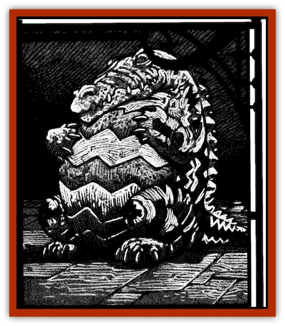

# Figurine - Ceramic

| Statistic | **Figurine, Ceramic** |
| --- | --- |
| **Activity Cycle:** | Any |
| **Alignment:** | Neutral |
| **Armor Class:** | 5 |
| **Climate/Terrain:** | Sri Raji |
| **Damage/Attack:** | 1d4 |
| **Diet:** | Nil |
| **Frequency:** | Very rare |
| **Hit Dice:** | 4 |
| **Intelligence:** | Low (5-7) |
| **Magic Resistance:** | Nil |
| **Morale:** | Fearless (19-20) |
| **Movement:** | 12 |
| **No. Appearing:** | 1 |
| **No. of Attacks:** | 1 |
| **Organization:** | Solitary |
| **Size:** | T (3-15&rdquo; tall) |
| **Special Attacks:** | See below |
| **Special Defenses:** | See below |
| **THAC0:** | 17 |
| **Treasure:** | Nil |
| **XP Value:** | 975 |

A ceramic [[Figurine_General_Information|figurine]] is a brightly painted miniature [[Golem_General_Information|golem]] that might easily be mistaken for a *figurine of wondrous power*. Like other magical automatons, they are often employed as guards by their creators.

Though most often depicting an alligator or other lizard, ceramic figurines shaped like turtles, frogs, and snakes are also known. Whatever form they are given, all have a slightly rounded shape and are hollow inside.

They understand their creator's primary language, but are themselves incapable of speech.

**Combat:** Ceramic figurines follow the orders given to them by their masters, but have a low intelligence that imparts some cunning to them. Thus, they do not usually attack mindlessly as other [[Golem_Ravenloft_General_Information|golems]] do. Instead, they utilize some basic tactics and strategies to defeat intruders or those they have been commanded to slay. They take advantage of cover and their small size to move in close and strike without warning.

Ceramic figurines are hollow and must be crafted with a small hole in their base so they will not explode when fired inside the kiln. The master of such a creature can fill its interior cavity with acid, poison, oil, or any other liquid and then seal the hole in the base. Such a figurine can spray this liquid at a single target within ten feet. The effects of this attack will vary depending upon the nature of the liquid with which the creature was filled. A figurine can hold enough liquid for two spraying attacks.

If a filled figurine is destroyed by a melee attack, crushing blow, or similar sudden shock, it will shatter. Any liquid within it at this point will splash out, requiring all within 10 feet to make a saving throw vs. breath weapon or be affected by it.

Figurines can attack by biting, clawing, or employing some other attack appropriate to their shape. A successful Attack Roll inflicts 1d4 points of damage. Although they are fearless, ceramic figurines will only make melee attacks if they have been commanded to fight to the death. Otherwise. they withdraw to their master once they have used their special attacks.

Ceramic figurines are immune to all fire, cold, and electrical damage. They are vulnerable to *shatter* or *shout* spells, being forced to make a saving throw vs. spell or be destroyed if either of these is used against them.

Despite their delicate appearance, normal weapons cannot harm these creations. Indeed, any weapon of less than +1 enchantment will rebound from them as it would from the wall of a mighty fortress. They are particularly susceptible to attacks from bashing weapons (provided that such arms have the ability to damage them at all) taking double damage from such weapons.

**Habitat/Society:** As artificial constructs under the command of their creators, ceramic figurines have no society or particular habitat. They are used to guard valuable items or places. Within the constraints of their orders, they are able to utilize basic tactics.

Ceramic figurines must be molded from clay that has been gathered from the banks of Lake Veda in the domain of Sri Raji. They must then be covered in slip (a clay and water mixture) and baked in a kiln. A colored glaze is then applied and the figurine is returned to the kiln for a second firing. When cooled, a final coat of paint is applied to bring out all the details. Once completed, the figurine is ready to be imbued with life. The spells needed for this are *animate object* and *raise dead*, or *polymorph any object* and *limited wish*.

The creator must have access to a fully functional pottery shop (kiln, pottery wheel, tools, clays, paints, etc.) in order to undertake the creation of a ceramic golem. The cost for outfitting the shop and constructing a ceramic figurine is 7,500 gp. The work takes one and a half months to complete. Additional figurines may be created for only 4,000 gp each. Any liquids to be held inside the figurine must be created or purchased separately.

**Ecology:** The same mysterious force that imparts a basic cunning and intelligence to the figurines leads them to hate their masters greatly. Free-willed figurines are capable of locating and ingesting the liquids they need to make themselves formidable.

---
## Discovery & Documentation

**Source Publication:** Ravenloft Appendix III (1991)
**Campaign Setting:** Ravenloft
**Author(s):** Kirk Botulla

### Other Creatures Found in This Source Book
   * [[Akikage|Akikage]]
   * [[Animator_Common|Animator, Common]]
   * [[Animator_Greater|Animator, Greater]]
   * [[Animator_Minor|Animator, Minor]]
   * [[Animator_General_Information|Animator, General Information]]
   * [[Bakhna_Rakhna|Bakhna Rakhna]]
   * [[Baobhan_Sith|Baobhan Sith]]
   * [[Beetle_Scarab|Beetle, Scarab]]
   * [[Boneless|Boneless]]
   * [[Boowray|Boowray]]
   * [[Bruja|Bruja]]
   * [[Carrionette|Carrionette]]
   * [[Carrion_Stalker|Carrion Stalker]]
   * [[Cat_Midnight|Cat, Midnight]]
   * [[Cat_Skeletal|Cat, Skeletal]]
   * [[Cloaker_Resplendent|Cloaker, Resplendent]]
   * [[Cloaker_Shadow|Cloaker, Shadow]]
   * [[Cloaker_Undead|Cloaker, Undead]]
   * [[Corpse_Candle|Corpse Candle]]
   * [[Death's_Head_Tree|Death's Head Tree]]
   * [[Doppelganger_Ravenloft|Doppelganger (Ravenloft)]]
   * [[Familiar_Pseudo-|Familiar, Pseudo-]]
   * [[Familiar_Undead|Familiar, Undead]]
   * [[Feathered_Serpent|Feathered Serpent]]
   * [[Fenhound|Fenhound]]
   * [[Figurine_Crystal|Figurine, Crystal]]
   * [[Figurine_Ivory|Figurine, Ivory]]
   * [[Figurine_Obsidian|Figurine, Obsidian]]
   * [[Figurine_Porcelain|Figurine, Porcelain]]
   * [[Figurine_General_Information|Figurine, General Information]]
   * [[Fleas_of_Madness|Fleas of Madness]]
   * [[Furies|Furies]]
   * [[Geist|Geist]]
   * [[Ghost_Animal|Ghost, Animal]]
   * [[Golem_Flesh_Ravenloft|Golem, Flesh (Ravenloft)]]
   * [[Golem_Mist_Ravenloft|Golem, Mist (Ravenloft)]]
   * [[Golem_Wax_Ravenloft|Golem, Wax (Ravenloft)]]
   * [[Gremishka|Gremishka]]
   * [[Hag_Spectral|Hag, Spectral]]
   * [[Head_Hunter|Head Hunter]]
   * [[Hearth_Fiend|Hearth Fiend]]
   * [[Hebi-No-Onna|Hebi-No-Onna]]
   * [[Hound_Phantom|Hound, Phantom]]
   * [[Hound_Skeletal|Hound, Skeletal]]
   * [[Imp_Wishing|Imp, Wishing]]
   * [[Ivy_Crawling|Ivy, Crawling]]
   * [[Jack_Frost|Jack Frost]]
   * [[Jolly_Roger|Jolly Roger]]
   * [[Kizoku|Kizoku]]
   * [[Lashweed|Lashweed]]
   * [[Leech_Magical|Leech, Magical]]
   * [[Leech_Psionic|Leech, Psionic]]
   * [[Lich_Defiler|Lich, Defiler]]
   * [[Lich_Drow|Lich, Drow]]
   * [[Lich_Elemental|Lich, Elemental]]
   * [[Lich_Psionic|Lich, Psionic]]
   * [[Living_Tattoo|Living Tattoo]]
   * [[Lycanthrope_Loup-garou|Lycanthrope, Loup-garou]]
   * [[Lycanthrope_Werejackal|Lycanthrope, Werejackal]]
   * [[Lycanthrope_Werejaguar_Ravenloft|Lycanthrope, Werejaguar (Ravenloft)]]
   * [[Lycanthrope_Wereleopard|Lycanthrope, Wereleopard]]
   * [[Lycanthrope_Wereray|Lycanthrope, Wereray]]
   * [[Mist_Ferryman|Mist Ferryman]]
   * [[Moor_Man|Moor Man]]
   * [[Obedient|Obedient]]
   * [[Odem|Odem]]
   * [[Paka|Paka]]
   * [[Plant_Blood_Rose|Plant, Blood Rose]]
   * [[Plant_Fearweed|Plant, Fearweed]]
   * [[Radiant_Spirit|Radiant Spirit]]
   * [[Recluse|Recluse]]
   * [[Remnant_Aquatic|Remnant, Aquatic]]
   * [[Rushlight|Rushlight]]
   * [[Sea_Spawn_Master|Sea Spawn, Master]]
   * [[Sea_Spawn_Minion|Sea Spawn, Minion]]
   * [[Shadow_Asp|Shadow Asp]]
   * [[Shattered_Brethren|Shattered Brethren]]
   * [[Skeleton_Archer|Skeleton, Archer]]
   * [[Skeleton_Insectoid|Skeleton, Insectoid]]
   * [[Skin_Thief|Skin Thief]]
   * [[Spirit_Psionic|Spirit, Psionic]]
   * [[Strahd_Skeleton|Strahd Skeleton]]
   * [[Strahd_Zombie|Strahd Zombie]]
   * [[Unicorn_Shadow|Unicorn, Shadow]]
   * [[Vampire_Drow|Vampire, Drow]]
   * [[Vampire_Nosferatu|Vampire, Nosferatu]]
   * [[Vampire_Oriental|Vampire, Oriental]]
   * [[Virus_General_Information|Virus, General Information]]
   * [[Virus_I|Virus I]]
   * [[Virus_II|Virus II]]
   * [[Virus_III|Virus III]]
   * [[Vorlog|Vorlog]]
   * [[Will_O'Dawn|Will O'Dawn]]
   * [[Will_O'Deep|Will O'Deep]]
   * [[Will_O'Mist|Will O'Mist]]
   * [[Will_O'Sea|Will O'Sea]]
   * [[Zombie_Cannibal|Zombie, Cannibal]]
   * [[Zombie_Desert|Zombie, Desert]]
   * [[Zombie_Wolf|Zombie Wolf]]
   * [[Zombie_Fog|Zombie Fog]]
