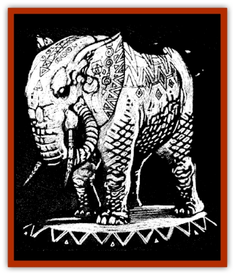

# Figurine - Ivory

| Statistic | **Figurine, Ivory** |
| --- | --- |
| **Activity Cycle:** | Any |
| **Alignment:** | Neutral |
| **Armor Class:** | 6 |
| **Climate/Terrain:** | Sri Raji |
| **Damage/Attack:** | 1d4 or 2d8/2d6 |
| **Diet:** | Nil |
| **Frequency:** | Very rare |
| **Hit Dice:** | 4 |
| **Intelligence:** | Non- (0) |
| **Magic Resistance:** | Nil |
| **Morale:** | Fearless (19-20) |
| **Movement:** | 9 |
| **No. Appearing:** | 1 |
| **No. of Attacks:** | 1 or 2 |
| **Organization:** | Solitary |
| **Size:** | T-L (2&rdquo;-11' tall) |
| **Special Attacks:** | See below |
| **Special Defenses:** | See below |
| **THAC0:** | 17 |
| **Treasure:** | Nil |
| **XP Value:** | 975 |

Ivory [[Figurine_General_Information|figurines]], like their counterparts, are small golems. They are often employed as guardians or assigned simple tasks suited to their diminutive size.

Made from the tusks of elephants and similar creatures, these figurines are almost exclusively shaped as pachyderms. A few ivory hippopotami, mastodons, or similar creatures are rumored to have been created, but these may not actually exist. Ivory figurines are covered with scrimshawlike carvings that impart much of the detail of the figurine.

Ivory figurines are not intelligent and cannot speak. They appear to be able to obey rudimentary instruction from their masters.

**Combat:** When ordered to fight, these figurines attack with their needlelike tusks for 1d4 points of damage. While these are incacable of inflicting anything more than a pinprick to their opponents, they carry a potent enchantment that makes them formidable weapons. Ivory figurines can themselves be hit only by +1 or better weapons.

Three times per day, ivory figurines may use a variant of the *enlarge* spell and grow to a height of 11 feet. The spell lasts for ten rounds but can be cut short with the casting of a *dispel magic* or *reduce* spell. When enlarged, ivory elephants attack with sharp tusks, inflicting 2d8 points of damage. On a natural attack roll of "20" the creature is able to trample its opponent for an additional 2d6 points.

Thrice per day, whether enlarged or at its natural size, an ivory elephant is able to trumpet. This deafens those within 30 feet of the creature for 2d6 rounds and inflicts 2d6 points of damage. A successful saving throw vs. spell negates the deafness and halves the damage inflicted by this attack. Exposed brittle or crystal substances (such as potion bottles and holy water vials) are shattered by this noise unless they make a saving throw vs. crushing blow. AIl deafened creatures suffer a -1 penalty to their Surprise Rolls, and those that cast spells have a 20% chance to miscast them if they require a verbal component.

Although ivory figurines are immune to cold and electrical attacks, fire and acid do normal damage to them.

**Habitat/Society:** More like true [[Golem_General_Information|golems]] than any other of the figurines, ivory figurines are also more easily controlled. Though they have the normal chance to break free of their masters, they usually wander off seeking other victims rather than turning directly against their creators when this happens. Should the creator attempt to stop them, however, they are as savage as any other free-willed [[Golem_Ravenloft_General_Information|golem]].

**Ecology:** Ivory figurines are carved from elephant tusks and meticulously polished. Once the shape is perfect, intricate scrimshaw patterns are etched into the ivory to make the ears, eyes, mouth, and other decorations. Inks are applied to complete the scrimshaw and the following spells are used to animate the figurine: *polymorph any object* or *animate object*, *limited wish* or *raise dead*, *enlarge* or *animal growth*, and *shout*. This takes two months and costs 8,000 gold pieces.

---
## Discovery & Documentation

**Source Publication:** Ravenloft Appendix III (1991)
**Campaign Setting:** Ravenloft
**Author(s):** Kirk Botulla

### Other Creatures Found in This Source Book
   * [[Akikage|Akikage]]
   * [[Animator_Common|Animator, Common]]
   * [[Animator_Greater|Animator, Greater]]
   * [[Animator_Minor|Animator, Minor]]
   * [[Animator_General_Information|Animator, General Information]]
   * [[Bakhna_Rakhna|Bakhna Rakhna]]
   * [[Baobhan_Sith|Baobhan Sith]]
   * [[Beetle_Scarab|Beetle, Scarab]]
   * [[Boneless|Boneless]]
   * [[Boowray|Boowray]]
   * [[Bruja|Bruja]]
   * [[Carrionette|Carrionette]]
   * [[Carrion_Stalker|Carrion Stalker]]
   * [[Cat_Midnight|Cat, Midnight]]
   * [[Cat_Skeletal|Cat, Skeletal]]
   * [[Cloaker_Resplendent|Cloaker, Resplendent]]
   * [[Cloaker_Shadow|Cloaker, Shadow]]
   * [[Cloaker_Undead|Cloaker, Undead]]
   * [[Corpse_Candle|Corpse Candle]]
   * [[Death's_Head_Tree|Death's Head Tree]]
   * [[Doppelganger_Ravenloft|Doppelganger (Ravenloft)]]
   * [[Familiar_Pseudo-|Familiar, Pseudo-]]
   * [[Familiar_Undead|Familiar, Undead]]
   * [[Feathered_Serpent|Feathered Serpent]]
   * [[Fenhound|Fenhound]]
   * [[Figurine_Ceramic|Figurine, Ceramic]]
   * [[Figurine_Crystal|Figurine, Crystal]]
   * [[Figurine_Obsidian|Figurine, Obsidian]]
   * [[Figurine_Porcelain|Figurine, Porcelain]]
   * [[Figurine_General_Information|Figurine, General Information]]
   * [[Fleas_of_Madness|Fleas of Madness]]
   * [[Furies|Furies]]
   * [[Geist|Geist]]
   * [[Ghost_Animal|Ghost, Animal]]
   * [[Golem_Flesh_Ravenloft|Golem, Flesh (Ravenloft)]]
   * [[Golem_Mist_Ravenloft|Golem, Mist (Ravenloft)]]
   * [[Golem_Wax_Ravenloft|Golem, Wax (Ravenloft)]]
   * [[Gremishka|Gremishka]]
   * [[Hag_Spectral|Hag, Spectral]]
   * [[Head_Hunter|Head Hunter]]
   * [[Hearth_Fiend|Hearth Fiend]]
   * [[Hebi-No-Onna|Hebi-No-Onna]]
   * [[Hound_Phantom|Hound, Phantom]]
   * [[Hound_Skeletal|Hound, Skeletal]]
   * [[Imp_Wishing|Imp, Wishing]]
   * [[Ivy_Crawling|Ivy, Crawling]]
   * [[Jack_Frost|Jack Frost]]
   * [[Jolly_Roger|Jolly Roger]]
   * [[Kizoku|Kizoku]]
   * [[Lashweed|Lashweed]]
   * [[Leech_Magical|Leech, Magical]]
   * [[Leech_Psionic|Leech, Psionic]]
   * [[Lich_Defiler|Lich, Defiler]]
   * [[Lich_Drow|Lich, Drow]]
   * [[Lich_Elemental|Lich, Elemental]]
   * [[Lich_Psionic|Lich, Psionic]]
   * [[Living_Tattoo|Living Tattoo]]
   * [[Lycanthrope_Loup-garou|Lycanthrope, Loup-garou]]
   * [[Lycanthrope_Werejackal|Lycanthrope, Werejackal]]
   * [[Lycanthrope_Werejaguar_Ravenloft|Lycanthrope, Werejaguar (Ravenloft)]]
   * [[Lycanthrope_Wereleopard|Lycanthrope, Wereleopard]]
   * [[Lycanthrope_Wereray|Lycanthrope, Wereray]]
   * [[Mist_Ferryman|Mist Ferryman]]
   * [[Moor_Man|Moor Man]]
   * [[Obedient|Obedient]]
   * [[Odem|Odem]]
   * [[Paka|Paka]]
   * [[Plant_Blood_Rose|Plant, Blood Rose]]
   * [[Plant_Fearweed|Plant, Fearweed]]
   * [[Radiant_Spirit|Radiant Spirit]]
   * [[Recluse|Recluse]]
   * [[Remnant_Aquatic|Remnant, Aquatic]]
   * [[Rushlight|Rushlight]]
   * [[Sea_Spawn_Master|Sea Spawn, Master]]
   * [[Sea_Spawn_Minion|Sea Spawn, Minion]]
   * [[Shadow_Asp|Shadow Asp]]
   * [[Shattered_Brethren|Shattered Brethren]]
   * [[Skeleton_Archer|Skeleton, Archer]]
   * [[Skeleton_Insectoid|Skeleton, Insectoid]]
   * [[Skin_Thief|Skin Thief]]
   * [[Spirit_Psionic|Spirit, Psionic]]
   * [[Strahd_Skeleton|Strahd Skeleton]]
   * [[Strahd_Zombie|Strahd Zombie]]
   * [[Unicorn_Shadow|Unicorn, Shadow]]
   * [[Vampire_Drow|Vampire, Drow]]
   * [[Vampire_Nosferatu|Vampire, Nosferatu]]
   * [[Vampire_Oriental|Vampire, Oriental]]
   * [[Virus_General_Information|Virus, General Information]]
   * [[Virus_I|Virus I]]
   * [[Virus_II|Virus II]]
   * [[Virus_III|Virus III]]
   * [[Vorlog|Vorlog]]
   * [[Will_O'Dawn|Will O'Dawn]]
   * [[Will_O'Deep|Will O'Deep]]
   * [[Will_O'Mist|Will O'Mist]]
   * [[Will_O'Sea|Will O'Sea]]
   * [[Zombie_Cannibal|Zombie, Cannibal]]
   * [[Zombie_Desert|Zombie, Desert]]
   * [[Zombie_Wolf|Zombie Wolf]]
   * [[Zombie_Fog|Zombie Fog]]
