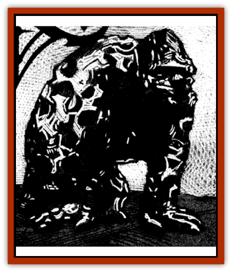

# Figurine - Obsidian

| Statistic | **Figurine, Obsidian** |
| --- | --- |
| **Activity Cycle:** | Any |
| **Alignment:** | Neutral |
| **Armor Class:** | 6 |
| **Climate/Terrain:** | Sri Raji |
| **Damage/Attack:** | 1d8 |
| **Diet:** | Nil |
| **Frequency:** | Very rare |
| **Hit Dice:** | 4 |
| **Intelligence:** | Low (5-7) |
| **Magic Resistance:** | Nil |
| **Morale:** | Fearless (19-20) |
| **Movement:** | 9 |
| **No. Appearing:** | 1 |
| **No. of Attacks:** | 1 |
| **Organization:** | Solitary |
| **Size:** | T (1-12&rdquo; tall) |
| **Special Attacks:** | See below |
| **Special Defenses:** | See below |
| **THAC0:** | 17 |
| **Treasure:** | Nil |
| **XP Value:** | 650 |

Obsidian [[Figurine_General_Information|figurines]], though they are in many ways the weakest of the five types of figurines, are the most surprising.

Fashioned from volcanic glass, these automatons are usually formed as monkeys, gorillas, and other apes, but human figures have been crafted as well. To the untrained eye, these are the most crudely fashioned figurines. Being highly irregular in shape and laced with sharp edges, they often exhibit only an indistinct resemblance to the animal that they are modeled upon.

Obsidian figurines do not speak, although they are able to understand the commands of their master.

**Combat:** Obsidian figurines enter combat only when ordered to do so by their master. When they do attack, however, they can be quite dangerous.

Covered by the sharp points and edges that make obsidian valuable for the crafting of weapons, these figurines attack with a frenzy of slashing blows and kicks. In each round, these combine to inflict 1d8 points of damage to the automaton's chosen target. It is not uncommon for the owners of these creatures to coat them in poison before sending them into battle. When this is done, the victim must make a saving throw vs. poison or the damage from the attack is doubled. Enough poison may be applied to allow for three rounds of combat.

In some cases, these creatures are fashioned with as many as 6 needlelike spines jutting out from their bodies. When someone is wounded by a figurine of this type there is a 10% chance per point of damage done (not collating additional damage for poison) that one of the spikes will break off and become lodged in the wound. When this happens, the victim will feel extreme pain and suffer an additional 1 point of damage each round until the spine is removed. If the golem was poisoned, the damage from the spine is doubled unless a saving throw is made. Extracting the spine must be done by someone else and requires one round of dedicated effort on the part of both parties. Once an obsidian figurine has lost all of its spines, new ones cannot be attached to it.

While the creature is immune to damage from weapons of less than a +1 enchantment, it is vulnerable to harm by any manner of magical attack. Any weapon used against the figurine releases a shower of minute fragments that fills a 10' radius. Anyone in that area must make a saving throw vs. breath weapon or suffer 1d2 points of damage. Attacks based upon magical fire, cold, and electricity all cause the obsidian figurine to fracture in this manner.

**Habitat/Society:** Obsidian figurines have a basic intelligence, but are commanded by their masters and do only as they are told. They do not utilize any other tactics beyond those suggested by their masters, and will attack until slain.

**Ecology:** Obsidian figurines are the cheapest and easiest of these automatons to make. The creator must craft the form from chips of obsidian which are then fused in a forge or kiln. The spells needed to make an obsidian figurine are *enchant an item*, *limited wish*, and *mending*. A figurine takes only three weeks to make and costs but 3,000 gold pieces.

**Smoothed Figurines**

  Some obsidian figurines are smoothed and polished after being crafted, making them unusually receptive to magical vibrations. Such creatures are less dangerous in melee combat, doing but 1d4 points of damage each round and bearing no spikes. Smoothed figurines cannot be poisoned.

However, the master of such a figurine may place within it a single spell of any type or level that he knows. This spell will be retained by the automaton until it is cast, at which point the master must infuse it with another. Placing the spell in the figurine requires the same amount of time as memorizing or praying for it.

---
## Discovery & Documentation

**Source Publication:** Ravenloft Appendix III (1991)
**Campaign Setting:** Ravenloft
**Author(s):** Kirk Botulla

### Other Creatures Found in This Source Book
   * [[Akikage|Akikage]]
   * [[Animator_Common|Animator, Common]]
   * [[Animator_Greater|Animator, Greater]]
   * [[Animator_Minor|Animator, Minor]]
   * [[Animator_General_Information|Animator, General Information]]
   * [[Bakhna_Rakhna|Bakhna Rakhna]]
   * [[Baobhan_Sith|Baobhan Sith]]
   * [[Beetle_Scarab|Beetle, Scarab]]
   * [[Boneless|Boneless]]
   * [[Boowray|Boowray]]
   * [[Bruja|Bruja]]
   * [[Carrionette|Carrionette]]
   * [[Carrion_Stalker|Carrion Stalker]]
   * [[Cat_Midnight|Cat, Midnight]]
   * [[Cat_Skeletal|Cat, Skeletal]]
   * [[Cloaker_Resplendent|Cloaker, Resplendent]]
   * [[Cloaker_Shadow|Cloaker, Shadow]]
   * [[Cloaker_Undead|Cloaker, Undead]]
   * [[Corpse_Candle|Corpse Candle]]
   * [[Death's_Head_Tree|Death's Head Tree]]
   * [[Doppelganger_Ravenloft|Doppelganger (Ravenloft)]]
   * [[Familiar_Pseudo-|Familiar, Pseudo-]]
   * [[Familiar_Undead|Familiar, Undead]]
   * [[Feathered_Serpent|Feathered Serpent]]
   * [[Fenhound|Fenhound]]
   * [[Figurine_Ceramic|Figurine, Ceramic]]
   * [[Figurine_Crystal|Figurine, Crystal]]
   * [[Figurine_Ivory|Figurine, Ivory]]
   * [[Figurine_Porcelain|Figurine, Porcelain]]
   * [[Figurine_General_Information|Figurine, General Information]]
   * [[Fleas_of_Madness|Fleas of Madness]]
   * [[Furies|Furies]]
   * [[Geist|Geist]]
   * [[Ghost_Animal|Ghost, Animal]]
   * [[Golem_Flesh_Ravenloft|Golem, Flesh (Ravenloft)]]
   * [[Golem_Mist_Ravenloft|Golem, Mist (Ravenloft)]]
   * [[Golem_Wax_Ravenloft|Golem, Wax (Ravenloft)]]
   * [[Gremishka|Gremishka]]
   * [[Hag_Spectral|Hag, Spectral]]
   * [[Head_Hunter|Head Hunter]]
   * [[Hearth_Fiend|Hearth Fiend]]
   * [[Hebi-No-Onna|Hebi-No-Onna]]
   * [[Hound_Phantom|Hound, Phantom]]
   * [[Hound_Skeletal|Hound, Skeletal]]
   * [[Imp_Wishing|Imp, Wishing]]
   * [[Ivy_Crawling|Ivy, Crawling]]
   * [[Jack_Frost|Jack Frost]]
   * [[Jolly_Roger|Jolly Roger]]
   * [[Kizoku|Kizoku]]
   * [[Lashweed|Lashweed]]
   * [[Leech_Magical|Leech, Magical]]
   * [[Leech_Psionic|Leech, Psionic]]
   * [[Lich_Defiler|Lich, Defiler]]
   * [[Lich_Drow|Lich, Drow]]
   * [[Lich_Elemental|Lich, Elemental]]
   * [[Lich_Psionic|Lich, Psionic]]
   * [[Living_Tattoo|Living Tattoo]]
   * [[Lycanthrope_Loup-garou|Lycanthrope, Loup-garou]]
   * [[Lycanthrope_Werejackal|Lycanthrope, Werejackal]]
   * [[Lycanthrope_Werejaguar_Ravenloft|Lycanthrope, Werejaguar (Ravenloft)]]
   * [[Lycanthrope_Wereleopard|Lycanthrope, Wereleopard]]
   * [[Lycanthrope_Wereray|Lycanthrope, Wereray]]
   * [[Mist_Ferryman|Mist Ferryman]]
   * [[Moor_Man|Moor Man]]
   * [[Obedient|Obedient]]
   * [[Odem|Odem]]
   * [[Paka|Paka]]
   * [[Plant_Blood_Rose|Plant, Blood Rose]]
   * [[Plant_Fearweed|Plant, Fearweed]]
   * [[Radiant_Spirit|Radiant Spirit]]
   * [[Recluse|Recluse]]
   * [[Remnant_Aquatic|Remnant, Aquatic]]
   * [[Rushlight|Rushlight]]
   * [[Sea_Spawn_Master|Sea Spawn, Master]]
   * [[Sea_Spawn_Minion|Sea Spawn, Minion]]
   * [[Shadow_Asp|Shadow Asp]]
   * [[Shattered_Brethren|Shattered Brethren]]
   * [[Skeleton_Archer|Skeleton, Archer]]
   * [[Skeleton_Insectoid|Skeleton, Insectoid]]
   * [[Skin_Thief|Skin Thief]]
   * [[Spirit_Psionic|Spirit, Psionic]]
   * [[Strahd_Skeleton|Strahd Skeleton]]
   * [[Strahd_Zombie|Strahd Zombie]]
   * [[Unicorn_Shadow|Unicorn, Shadow]]
   * [[Vampire_Drow|Vampire, Drow]]
   * [[Vampire_Nosferatu|Vampire, Nosferatu]]
   * [[Vampire_Oriental|Vampire, Oriental]]
   * [[Virus_General_Information|Virus, General Information]]
   * [[Virus_I|Virus I]]
   * [[Virus_II|Virus II]]
   * [[Virus_III|Virus III]]
   * [[Vorlog|Vorlog]]
   * [[Will_O'Dawn|Will O'Dawn]]
   * [[Will_O'Deep|Will O'Deep]]
   * [[Will_O'Mist|Will O'Mist]]
   * [[Will_O'Sea|Will O'Sea]]
   * [[Zombie_Cannibal|Zombie, Cannibal]]
   * [[Zombie_Desert|Zombie, Desert]]
   * [[Zombie_Wolf|Zombie Wolf]]
   * [[Zombie_Fog|Zombie Fog]]
