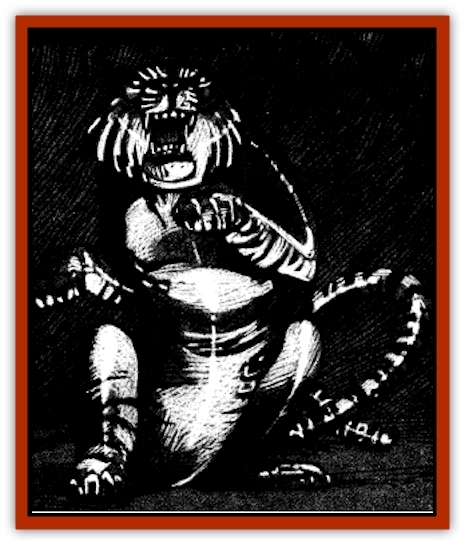

# Figurine - Porcelain

| Statistic | **Figurine, Porcelain** |
| --- | --- |
| **Activity Cycle:** | Any |
| **Alignment:** | Neutral |
| **Armor Class:** | 1 |
| **Climate/Terrain:** | Sri Raji |
| **Damage/Attack:** | 2-5/2-5/1-10 |
| **Diet:** | Nil |
| **Frequency:** | Very rare |
| **Hit Dice:** | 6 |
| **Intelligence:** | Low (5-7) |
| **Magic Resistance:** | Nil |
| **Morale:** | Fearless (19-20) |
| **Movement:** | 12 |
| **No. Appearing:** | 1 |
| **No. of Attacks:** | 3 |
| **Organization:** | Solitary |
| **Size:** | T-L (3&rdquo;-9' long) |
| **Special Attacks:** | See below |
| **Special Defenses:** | See below |
| **THAC0:** | 15 |
| **Treasure:** | Nil |
| **XP Value:** | 3,000 |

Of all the magical [[Figurine_General_Information|figurines]] fashioned in Sri Raji, those crafted of porcelain are by far the strongest and most fearsome. These are the rarest type of figurine, both because porcelain is more difficult to create and because there are rumors that anyone creating one draws the attention of the Dark Powers.

At one time all porcelain figurines depicted tigers. While the vast majority still do, some now portray [[Rakshasa|rakshasa]]. Tiger figurines are painted a lifelike deep orange with black stripes and yellow-green eyes. Those made in other shapes are painted in a fashion suited to their form.

Porcelain figurines, whether shaped like tigers or more humanoid creatures, do not speak. They are quite capable of understanding the orders of their masters, however, and obey them without pause.

**Combat:** While they enter battle only at the behest of their masters, porcelain figurines can be dangerous adversaries. They attack using the small claws and fangs of the creatures they depict. These are not particularly deadly, however, and allow the figurine only a single attack for 1d4 points of damage each round.

When hard pressed or ordered to do so by their masters, porcelain figurines can grow to the size of an adult tiger (roughly 9 feet long). Once enlarged, they may strike twice with their front claws for 1d4+1 points of damage each and bite for 1d10 points of damage.

Porcelain figurines have the excellent senses of their living counterparts as well as several other abilities. For example, their eyesight is so keen that it gives them a natural infravision and enables them to see invisible objects at a range of up to 120 feet.

Three times per day, the figurine may fife a black energy bolt from its eyes that affects its target like an *enervation* spell, though it drains only one level on a successful hit.

These figurines are immune to damage from any weapon that is of less than +2 enchantment. In addition, they are protected by a *glassteel* spell that lowers their Armor Class to 1 and keeps the delicate porcelain from chipping, cracking or breaking during everyday use. Porcelain figurines are immune to magical or mundane fire, but take full damage from cold or electrical attacks.

**Habitat/Society:** Porcelain figurines are used as sentries for important places and things, but also serve as bodyguards for their creators. Having such a creature so close and in such a trusted position is a two-edged sword, as the figurine may escape the control of its creator and turn on him at any time.

**Ecology:** Porcelain figurines can only be made of fine white or gray clay of the highest quality. Though they are crafted in much the same manner as [[Figurine_Ceramic|ceramic figurines]], including the hole in the bottom to prevent their explosion in the kiln. Once the figurine cools, it is coated with a special paint blended from the blood of both a great cat and the master of the miniature [[Golem_General_Information|golem]].

Once formed, the figurine is imbued with life by the casting of a *polymorph any object* or *animate object*, *limited wish* or *raise dead*, *enchant an item*, *infravision*, *detect invisibility*, *enlarge*, *enervation*, *glasteel*, and *audible glamer* spell. The *permanency* spell must then be used to assure that all the spells continue to work correctly.

To successfully manufacture a porcelain figurine, the creator must have access to a kiln, potter's wheel, paints and other tools. The process takes two months and costs 15,000 gp.

---
## Discovery & Documentation

**Source Publication:** Ravenloft Appendix III (1991)
**Campaign Setting:** Ravenloft
**Author(s):** Kirk Botulla

### Other Creatures Found in This Source Book
   * [[Akikage|Akikage]]
   * [[Animator_Common|Animator, Common]]
   * [[Animator_Greater|Animator, Greater]]
   * [[Animator_Minor|Animator, Minor]]
   * [[Animator_General_Information|Animator, General Information]]
   * [[Bakhna_Rakhna|Bakhna Rakhna]]
   * [[Baobhan_Sith|Baobhan Sith]]
   * [[Beetle_Scarab|Beetle, Scarab]]
   * [[Boneless|Boneless]]
   * [[Boowray|Boowray]]
   * [[Bruja|Bruja]]
   * [[Carrionette|Carrionette]]
   * [[Carrion_Stalker|Carrion Stalker]]
   * [[Cat_Midnight|Cat, Midnight]]
   * [[Cat_Skeletal|Cat, Skeletal]]
   * [[Cloaker_Resplendent|Cloaker, Resplendent]]
   * [[Cloaker_Shadow|Cloaker, Shadow]]
   * [[Cloaker_Undead|Cloaker, Undead]]
   * [[Corpse_Candle|Corpse Candle]]
   * [[Death's_Head_Tree|Death's Head Tree]]
   * [[Doppelganger_Ravenloft|Doppelganger (Ravenloft)]]
   * [[Familiar_Pseudo-|Familiar, Pseudo-]]
   * [[Familiar_Undead|Familiar, Undead]]
   * [[Feathered_Serpent|Feathered Serpent]]
   * [[Fenhound|Fenhound]]
   * [[Figurine_Ceramic|Figurine, Ceramic]]
   * [[Figurine_Crystal|Figurine, Crystal]]
   * [[Figurine_Ivory|Figurine, Ivory]]
   * [[Figurine_Obsidian|Figurine, Obsidian]]
   * [[Figurine_General_Information|Figurine, General Information]]
   * [[Fleas_of_Madness|Fleas of Madness]]
   * [[Furies|Furies]]
   * [[Geist|Geist]]
   * [[Ghost_Animal|Ghost, Animal]]
   * [[Golem_Flesh_Ravenloft|Golem, Flesh (Ravenloft)]]
   * [[Golem_Mist_Ravenloft|Golem, Mist (Ravenloft)]]
   * [[Golem_Wax_Ravenloft|Golem, Wax (Ravenloft)]]
   * [[Gremishka|Gremishka]]
   * [[Hag_Spectral|Hag, Spectral]]
   * [[Head_Hunter|Head Hunter]]
   * [[Hearth_Fiend|Hearth Fiend]]
   * [[Hebi-No-Onna|Hebi-No-Onna]]
   * [[Hound_Phantom|Hound, Phantom]]
   * [[Hound_Skeletal|Hound, Skeletal]]
   * [[Imp_Wishing|Imp, Wishing]]
   * [[Ivy_Crawling|Ivy, Crawling]]
   * [[Jack_Frost|Jack Frost]]
   * [[Jolly_Roger|Jolly Roger]]
   * [[Kizoku|Kizoku]]
   * [[Lashweed|Lashweed]]
   * [[Leech_Magical|Leech, Magical]]
   * [[Leech_Psionic|Leech, Psionic]]
   * [[Lich_Defiler|Lich, Defiler]]
   * [[Lich_Drow|Lich, Drow]]
   * [[Lich_Elemental|Lich, Elemental]]
   * [[Lich_Psionic|Lich, Psionic]]
   * [[Living_Tattoo|Living Tattoo]]
   * [[Lycanthrope_Loup-garou|Lycanthrope, Loup-garou]]
   * [[Lycanthrope_Werejackal|Lycanthrope, Werejackal]]
   * [[Lycanthrope_Werejaguar_Ravenloft|Lycanthrope, Werejaguar (Ravenloft)]]
   * [[Lycanthrope_Wereleopard|Lycanthrope, Wereleopard]]
   * [[Lycanthrope_Wereray|Lycanthrope, Wereray]]
   * [[Mist_Ferryman|Mist Ferryman]]
   * [[Moor_Man|Moor Man]]
   * [[Obedient|Obedient]]
   * [[Odem|Odem]]
   * [[Paka|Paka]]
   * [[Plant_Blood_Rose|Plant, Blood Rose]]
   * [[Plant_Fearweed|Plant, Fearweed]]
   * [[Radiant_Spirit|Radiant Spirit]]
   * [[Recluse|Recluse]]
   * [[Remnant_Aquatic|Remnant, Aquatic]]
   * [[Rushlight|Rushlight]]
   * [[Sea_Spawn_Master|Sea Spawn, Master]]
   * [[Sea_Spawn_Minion|Sea Spawn, Minion]]
   * [[Shadow_Asp|Shadow Asp]]
   * [[Shattered_Brethren|Shattered Brethren]]
   * [[Skeleton_Archer|Skeleton, Archer]]
   * [[Skeleton_Insectoid|Skeleton, Insectoid]]
   * [[Skin_Thief|Skin Thief]]
   * [[Spirit_Psionic|Spirit, Psionic]]
   * [[Strahd_Skeleton|Strahd Skeleton]]
   * [[Strahd_Zombie|Strahd Zombie]]
   * [[Unicorn_Shadow|Unicorn, Shadow]]
   * [[Vampire_Drow|Vampire, Drow]]
   * [[Vampire_Nosferatu|Vampire, Nosferatu]]
   * [[Vampire_Oriental|Vampire, Oriental]]
   * [[Virus_General_Information|Virus, General Information]]
   * [[Virus_I|Virus I]]
   * [[Virus_II|Virus II]]
   * [[Virus_III|Virus III]]
   * [[Vorlog|Vorlog]]
   * [[Will_O'Dawn|Will O'Dawn]]
   * [[Will_O'Deep|Will O'Deep]]
   * [[Will_O'Mist|Will O'Mist]]
   * [[Will_O'Sea|Will O'Sea]]
   * [[Zombie_Cannibal|Zombie, Cannibal]]
   * [[Zombie_Desert|Zombie, Desert]]
   * [[Zombie_Wolf|Zombie Wolf]]
   * [[Zombie_Fog|Zombie Fog]]
