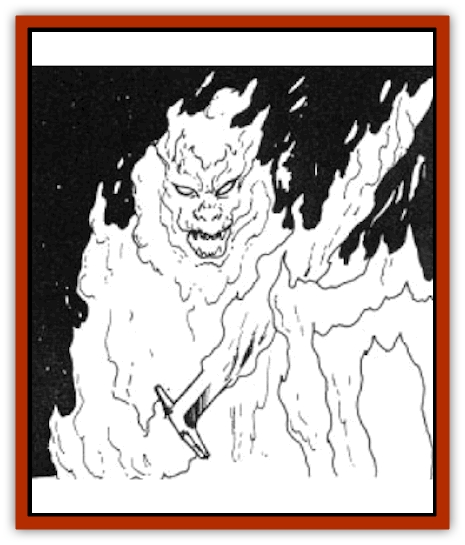

# Fire Minion

| Statistic | **Fire Minion** |
| --- | --- |
| **Activity Cycle:** | Any |
| **Alignment:** | Lawful evil |
| **Armor Class:** | 3 |
| **Climate/Terrain:** | Volcanic, lava |
| **Damage/Attack:** | 2d6 |
| **Diet:** | Special |
| **Frequency:** | Very rare |
| **Hit Dice:** | 6 |
| **Intelligence:** | Average to genius (11-18) |
| **Magic Resistance:** | Nil |
| **Morale:** | Champion (15) |
| **Movement:** | 12 |
| **No. Appearing:** | 1-4 |
| **No. of Attacks:** | 1 |
| **Organization:** | Hierarchial |
| **Size:** | L (7-9') |
| **Special Attacks:** | Fire |
| **Special Defenses:** | Immunity to fire |
| **THAC0:** | 15 |
| **Treasure:** | None |
| **XP Value:** | 975 |

Fire minions are fearsome creatures, apparently from the elemental plane of Fire. Their bodies are composed of living flame, and although they can assume any form they wish, the most common is that of a large humanoid, complete with fangs and homs. Their bodies are the colors of flame and constantly swirl and flicker with the living light.

**Combat:** Fire minions are powerful warriors, fortunately (for their enemies) limited by their environment from spreading and conquering. They attack by rising up out of fire, assuming their form in the process. Since this takes one round, it normally provides sufficient warning to the victim and only allows the normal chance of surprise. However, a fire minion can also return back into the flame (in one round), move to another location and reappear during the next round. While this does not provide any specific combat bonus, it can be unnerving to inexperienced opponents.

Fire minions normally wield large swords. Whatever the weapon used, the creature causes 2d6 points of damage. In addition, the creature has a constant flame aura that causes 1d6 points of damage to all within five feet unless protected from fire in some way. No attack roll is needed to hit and no saving throw is allowed to avoid this aura damage.

Because they are made from living flame, fire minions are completely immune to fire-based attacks. Indeed, magical flames (*fireballs* and dragon fire) restore hit points equal to the damage the attack would normally cause. Although they would seem to be highly vulnerable to water-based attacks, their intense heat protects them somewhat. They suffer 1 extra point of damage per die from water-based attacks. They are extremely vulnerable to cold-based attacks and suffer double the normal damage from these (although saving throws still apply). In addition, any water. or cold-based attack halves the length the time the fire minion can stay out of its fiery home.

**Habitat/Society:** Little is known of the fire minions. lives, simply because their natural environment precludes most observation by outsiders. It is certain they come from the elemental plane of Fire, and are considered free-willed [[Elemental_Fire_Water|fire elementals]]. Their life habits there are unknown.

Fire minions have a limited ability to gate themselves to the Prime Material plane. Such gating can be accomplished only in areas of intense flame-most commonly the cauldrons of volcanoes. Normal fires are not sufficient to allow gating and so fire minions tend to appear only in exotic locales.

Fire, flame, and lava are the natural homes of fire minions, and they dwell within them with no ill effects. They can travel through these materials as easily as walking. However, they have only a limited ability to leave the flames and risk injury or death when they do so. A fire minion will not feel the effects for 1d6 hours. After this time they lose their flame aura ability. In another 1d6 hours, the minion begins to take damage at the rate of 1-2 points per turn. This continues until either the minion returns to the flame (to rest and heal) or dies. Note that magical fires can heal the damage but cannot prolong the ability to move about on land.

**Ecology:** It is hard to know just where the fire minions fit into things, since so little is known of their lives in the plane of Fire. It is believed they eat lava or fire, although this iS not confirmed. When slain, their bodies evaporate in a burst of ash, leaving very little to examine or study.

---
## Discovery & Documentation

**Source Publication:** Time of the Dragon (1989)
**Campaign Setting:** Dragonlance
**Author(s):** David Cook

### Other Creatures Found in This Source Book
   * [[Disir|Disir]]
   * [[Draconian_Proto-_Traag|Draconian, Proto-, Traag]]
   * [[Dragon_Krynn_Othlorx_General_Information|Dragon (Krynn), Othlorx, General Information]]
   * [[Gurik_Cha'ahl|Gurik Cha'ahl]]
   * [[Horax|Horax]]
   * [[Saqualaminoi|Saqualaminoi]]
   * [[Skrit|Skrit]]
   * [[Yaggol|Yaggol]]
