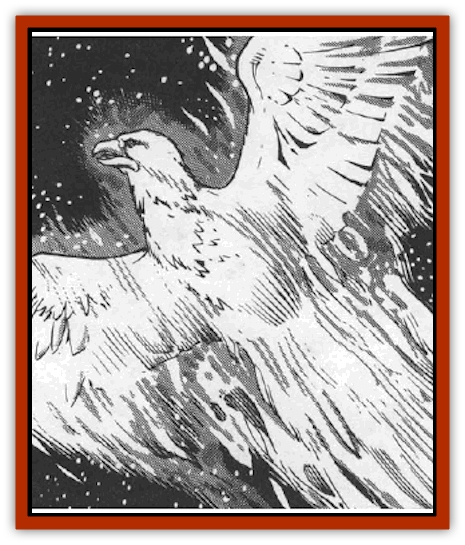

# Firebird

| Statistic | **Firebird** |
| --- | --- |
| **Activity Cycle:** | Any |
| **Alignment:** | Neutral |
| **Armor Class:** | 4 |
| **Climate/Terrain:** | Wildspace |
| **Damage/Attack:** | 1d8/1d8/2d6 |
| **Diet:** | Carnivore |
| **Frequency:** | Uncommon |
| **Hit Dice:** | 5 |
| **Intelligence:** | Low (5-7) |
| **Magic Resistance:** | Nil |
| **Morale:** | Elite (15) |
| **Movement:** | Fl 24 (SR 10) |
| **No. Appearing:** | 1-20 |
| **No. of Attacks:** | 3 |
| **Organization:** | Solitary |
| **Size:** | L (20' wingspan) |
| **Special Attacks:** | Flame lance (1d4 hull points) |
| **Special Defenses:** | Flame sheath (12d6, 10' radius) |
| **THAC0:** | 15 |
| **Treasure:** | Special (magic items only) |
| **XP Value:** | 2,000 |

Firebirds match the description of [[Eagle|giant eagles]] - 10-20' wingspan, large claws, sharp hooked beak - but they are not as intelligent, and a beautiful orange-yellow flame envelops them. Their eyes glow a painfully bright blue-white.

**Combat:** Like its terrestrial cousins the giant eagles, the firebird uses its claws and beak as primary weapons. In a diving attack, its normal 1d8/1d8 damage is doubled, and it adds +6 to its attack roll. A successful hit also inflicts 12d6 burning damage. These giant birds swoop down on unfortunate ships, snatching sailors off decks and igniting the ships' sails. They are particularly fond of gnomish vessels; they use a blowtorch-like tongue of fire to cut their way into the hulls in search of both [[Hamster_Giant_Space|giant space hamsters]] and their [[Gnome|gnomish]] handlers.

The envelope of fire that gives the firebird its name creates a zone of blast-furnace heat in a 10' radius, making melee combat impossible without magical protection. This flame sheath also renders firebirds impervious to normal missiles, since their intense heat instantly vaporizes the objects. Large missile weapons do only half damage to the firebird. Only magical weapons of +1 or better can damage a firebird. The weapons must make a saving throw vs. magical fire or be destroyed. The firebird's fire, generated internally, serves as propulsion (SR 10).

In addition to its flame abilities, the firebird also possesses keen eyesight. Adventurers have only a 5% chance of surprising a firebird. Even in its lair this is true, since mated pairs of firebirds roost in shifts, one keeping watch while the other sleeps.

**Habitat/Society:** Firebirds prefer to nest in asteroids, but are equally at home in the hulks of gnomish spaceships. Using their flame tongue ability, they hollow out the stone or metal, blowing the molten liquid with rapid beats of their wings into fantastic free-form nests. The nests are then lined with the shed feathers of the parents. These feathers glow like burning embers, providing heat for the firebird eggs and hatchlings. In each nest there is a 50% chance that 1-4 eggs are present, and a 25% chance of 1-4 young.

Like eagles, they continually add to their nests until they die. Occasionally, firebirds link their nets into rookeries for mutual defense and care, generally in the vicinity of liveworlds or asteroid reefs where potential prey is plentiful. Any treasure in a firebird nest is magical, since only magical items or devices can stand the birds' extreme heat. There is a 10% chance that 1d4 random magic items have melted into the nest's structure. Due to the magical nature of the firebird's flame, the magic in the items transfers to the structure of the nest. For instance, a *ring of protection* melted into the nest makes it more resistant to damage.

**Ecology:** Firebirds fill an ecological niche similar to that of a hawk or eagle, feeding on small pests. Unfortunately for star travelers, the firebird considers the crews of spelljammers "small pests". The advent of spelljamming humans and demihumans has provided firebirds with tender pre-packaged meals that are fairly easy to catch.

One other firebird attribute attracts adventurers: Their feathers are ingredients of *elixirs of life*. Shed feathers can fetch up to 1,000 gp apiece. An adult firebird has 1d3x10 usable feathers.

---
## Discovery & Documentation

**Source Publication:** MC9 Spelljammer Appendix II (1991)
**Campaign Setting:** Planescape
**Author(s):** Scott Davis, Newton Ewell, John Terra

### Other Creatures Found in This Source Book
   * [[Alchemy_Plant|Alchemy Plant]]
   * [[Allura|Allura]]
   * [[Aperusa|Aperusa]]
   * [[Autognome|Autognome]]
   * [[Bionoid|Bionoid]]
   * [[Bloodsac|Bloodsac]]
   * [[Buzzjewel|Buzzjewel]]
   * [[Constellate|Constellate]]
   * [[Contemplator|Contemplator]]
   * [[Dohwar|Dohwar]]
   * [[Dragon_Moon|Dragon, Moon]]
   * [[Dragon_Stellar|Dragon, Stellar]]
   * [[Dragon_Sun|Dragon, Sun]]
   * [[Dreamslayer|Dreamslayer]]
   * [[Dweomerborn|Dweomerborn]]
   * [[Fal|Fal]]
   * [[Feesu|Feesu]]
   * [[Fire_Bat|Fire Bat]]
   * [[Firelich|Firelich]]
   * [[Flowfiend|Flowfiend]]
   * [[Gadabout|Gadabout]]
   * [[Gammaroid|Gammaroid]]
   * [[Gonn|Gonn]]
   * [[Gossamer|Gossamer]]
   * [[Grav|Grav]]
   * [[Great_Dreamer|Great Dreamer]]
   * [[Greatswan|Greatswan]]
   * [[Grell_Colonial|Grell, Colonial]]
   * [[Gullion|Gullion]]
   * [[Insectare|Insectare]]
   * [[Lhee|Lhee]]
   * [[Mercurial_Slime|Mercurial Slime]]
   * [[Meteorspawn|Meteorspawn]]
   * [[Monitor|Monitor]]
   * [[Owl_Space|Owl, Space]]
   * [[Pristatic|Pristatic]]
   * [[Scro|Scro]]
   * [[Selkie_Star|Selkie, Star]]
   * [[Silatic|Silatic]]
   * [[Skullbird|Skullbird]]
   * [[Sleek|Sleek]]
   * [[Sluk|Sluk]]
   * [[Space_Swine|Space Swine]]
   * [[Sphinx_Astro-|Sphinx, Astro-]]
   * [[Spirit_Warrior|Spirit Warrior]]
   * [[Starfly_Plant|Starfly Plant]]
   * [[Stargazer|Stargazer]]
   * [[Undead_Stellar|Undead, Stellar]]
   * [[Witchlight_Marauder|Witchlight Marauder]]
   * [[Xixchil|Xixchil]]
   * [[Yitsan|Yitsan]]
   * [[Zurchin|Zurchin]]
