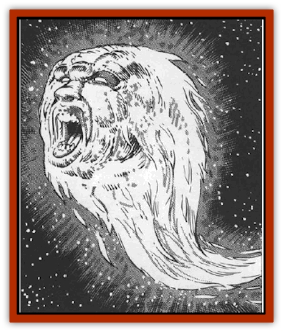

# Firelich

| Statistic | **Firelich** |
| --- | --- |
| **Activity Cycle:** | Any |
| **Alignment:** | Any evil |
| **Armor Class:** | 0 |
| **Climate/Terrain:** | Wildspace |
| **Damage/Attack:** | 16d6 |
| **Diet:** | Nil |
| **Frequency:** | Very rare |
| **Hit Dice:** | 16+ |
| **Intelligence:** | Genius (17+) |
| **Magic Resistance:** | 40% |
| **Morale:** | Fearless (19) |
| **Movement:** | Fl 36 (D), SR 4 |
| **No. Appearing:** | 1 |
| **No. of Attacks:** | 1 |
| **Organization:** | Solitary |
| **Size:** | L (18' long) |
| **Special Attacks:** | Fear |
| **Special Defenses:** | Nil |
| **THAC0:** | 4 |
| **Treasure:** | Nil |
| **XP Value:** | 10,000 |

Firelichs are high-level evil mages whose bodies were prepared for lichdom upon their death. Such mages, either through ignorance (such as in casting fire spells) or spell failure, exploded in the phlogiston. The lich-preparation spells in their bodies turned them into living fireballs of undeath, racing through wildspace, screaming in eternal pain and looking for something to collide with, as a way to extinguish the flames.

A firelich resembles a comet of yellow, orange, and red flames. The "head" of the comet has a skull-like face with a mouth that appears locked in a perpetual scream. The "head" measures 6' in diameter, with a fiery tail 18' long trailing behind it. It has no limbs.

**Combat:** Unlike its [[Lich|groundling brethren]], a firelich goes out of its way to find confrontation. Its blazing eyes always seek spelljamming ships, in the same way that a person on fire would look for water or a blanket.

The first sign that a firelich is in the area is its luminous, fiery appearance, followed by an ear-splitting shriek of pain. Viewers must save vs. spell at -2 (Wisdom bonuses allowed). Those who fail are frightened as though by *fear*. Those who succeed still take -2 to their attacks for the rest of the encounter.

The firelich attacks by plunging headlong into the ship in a screaming dive. It makes an attack roll to hit. Treat the initial impact as a greek fire attack (Concordance of Arcane Space, p. 57).

After the initial damage, the ship's deck must make an item saving throw vs. magical fire. If the deck succeeds, see below. If the deck fails, the firelich has crashed below decks creating a hole 2d6+6 feet in diameter. The firelich flies downward, striking the ship's inner hull. If this hull fails another saving throw vs. spells, the firelich has made another hole and flown clear through the ship, its fire still burning strongly. In frustration, the firelich shrieks and flies off.

Any time a natural 1 is rolled on the ship's saving throw, a *wall of fire* (as the 4th-level wizard spell, cast at 16th level) has sprung up on the affected deck, surrounding the hole made by the firelich. The ship also suffers a Critical Hit (Concordance of Arcane Space, p.59).

If a deck's save succeeds, the firelich fails to penetrate and explodes as a fireball cast at 16th level. On the round after the explosion, the firelich's lite-force recreates its comet-like body outside the ship, and the entity flees frantically through space, screaming in renewed frustration.

Since a firelich is undead, it can be turned. It is considered a Special undead,

Although it is a lich, the firelich cannot cast spells known in its previous existence. It has no limbs for the somatic components of a spell, and it cannot mouth words for the verbal portion.

**Habitat/Society:** It is unknown how the wizard gets from the phlogiston to wildspace. Since the only wizards that can become fireliches are the ones that had made previous preparations for lichdom, some guess that the arcane lich ceremonies tear a temporary hole into wildspace. The energy to create this tear may come from the explosion that created the firelich. If this is true, the hole certainly closes immediately after the firelich enters wildspace.

Fireliches are solitary, shunning even those who share their suffering. Due to their pain and probable madness, fireliches are not communicative, though some observers have managed to coax a few fireliches to reveal their identities.

**Ecology:** Fireliches are an aberration in any healthy ecosystem. If it perishes, only wisps of smoke remain. Its spelljamming ability is innate and cannot be harnessed.

A story has circulated through wildspace about a group of pirates that captured a firelich and tried to connect it to their spelljammer helm. The firelich overloaded and exploded. As the ship burned, the bits of firelich reincorporated and flew off, screaming.

---
## Discovery & Documentation

**Source Publication:** MC9 Spelljammer Appendix II (1991)
**Campaign Setting:** Planescape
**Author(s):** Scott Davis, Newton Ewell, John Terra

### Other Creatures Found in This Source Book
   * [[Alchemy_Plant|Alchemy Plant]]
   * [[Allura|Allura]]
   * [[Aperusa|Aperusa]]
   * [[Autognome|Autognome]]
   * [[Bionoid|Bionoid]]
   * [[Bloodsac|Bloodsac]]
   * [[Buzzjewel|Buzzjewel]]
   * [[Constellate|Constellate]]
   * [[Contemplator|Contemplator]]
   * [[Dohwar|Dohwar]]
   * [[Dragon_Moon|Dragon, Moon]]
   * [[Dragon_Stellar|Dragon, Stellar]]
   * [[Dragon_Sun|Dragon, Sun]]
   * [[Dreamslayer|Dreamslayer]]
   * [[Dweomerborn|Dweomerborn]]
   * [[Fal|Fal]]
   * [[Feesu|Feesu]]
   * [[Fire_Bat|Fire Bat]]
   * [[Firebird|Firebird]]
   * [[Flowfiend|Flowfiend]]
   * [[Gadabout|Gadabout]]
   * [[Gammaroid|Gammaroid]]
   * [[Gonn|Gonn]]
   * [[Gossamer|Gossamer]]
   * [[Grav|Grav]]
   * [[Great_Dreamer|Great Dreamer]]
   * [[Greatswan|Greatswan]]
   * [[Grell_Colonial|Grell, Colonial]]
   * [[Gullion|Gullion]]
   * [[Insectare|Insectare]]
   * [[Lhee|Lhee]]
   * [[Mercurial_Slime|Mercurial Slime]]
   * [[Meteorspawn|Meteorspawn]]
   * [[Monitor|Monitor]]
   * [[Owl_Space|Owl, Space]]
   * [[Pristatic|Pristatic]]
   * [[Scro|Scro]]
   * [[Selkie_Star|Selkie, Star]]
   * [[Silatic|Silatic]]
   * [[Skullbird|Skullbird]]
   * [[Sleek|Sleek]]
   * [[Sluk|Sluk]]
   * [[Space_Swine|Space Swine]]
   * [[Sphinx_Astro-|Sphinx, Astro-]]
   * [[Spirit_Warrior|Spirit Warrior]]
   * [[Starfly_Plant|Starfly Plant]]
   * [[Stargazer|Stargazer]]
   * [[Undead_Stellar|Undead, Stellar]]
   * [[Witchlight_Marauder|Witchlight Marauder]]
   * [[Xixchil|Xixchil]]
   * [[Yitsan|Yitsan]]
   * [[Zurchin|Zurchin]]
