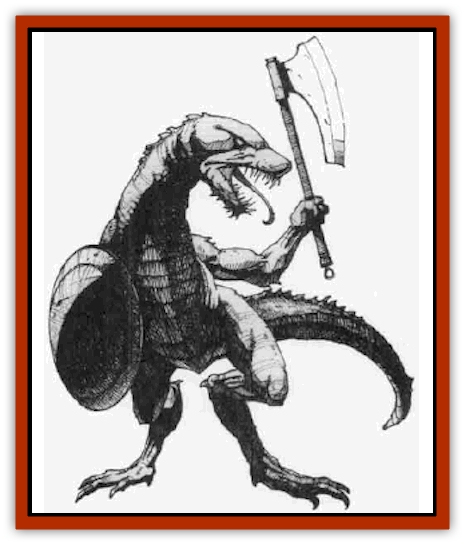

# Firenewt

| Statistic | **Firenewt** |
| --- | --- |
| **Activity Cycle:** | Any |
| **Alignment:** | Neutral evil |
| **Armor Class:** | 5 |
| **Climate/Terrain:** | Hot or volcanic regions |
| **Damage/Attack:** | By weapon |
| **Diet:** | Carnivore |
| **Frequency:** | Rare |
| **Hit Dice:** | 2+2 |
| **Intelligence:** | Low (5-7) |
| **Magic Resistance:** | Nil |
| **Morale:** | Steady (11-12) |
| **Movement:** | 9 |
| **No. Appearing:** | 10-100 |
| **No. of Attacks:** | 1 |
| **Organization:** | Tribal |
| **Size:** | M (5½-6' tall) |
| **Special Attacks:** | Breathe fire |
| **Special Defenses:** | See below |
| **THAC0:** | 19 |
| **Treasure:** | K,M (F) |
| **XP Value:** | 175 / Elite: 270 / Priest: 650 / Overlord: 420 |

Firenewts, also known as *salamen*, are distant relatives of [[Lizard_Man|lizard men]]. They are cruel marauders that roam hot regions.

The firenewt's dry skin is a mottled sepia color, darkest along the spine and fading to near-white on the belly. The smooth flesh and features resemble those of an ee1. The eyes are deep crimson. Females are slightly shorter (5½' tall) and a duller brown. The young are lighter but darken as they mature.

They speak their own language and a dialect of lizard man. Priests, elite warriors, and overlords may speak the common tongue.

**Combat:** Firenewt warriors (the most common variety) are typically armored in chain mail and carry one or two weapons - pike and sword (45%), sword only (25%), pike and lend axe (20%), or battle axe (10%). For every ten warriors encountered, there is one elite warrior with 3+3 Hit Dice and Armor Class 3 (chain mail plus Dexterity bonus). Elite warriors carry battle axes.

For every 30 warriors encountered, there is a priest with 3+3 HD, AC 5, and the following spells, usable once each day: *animal friendship*, *faerie fire*, *predict weather*, *produce flame*, *heat metal*, and *pyrotechnics*. Priests carry maces.

All firenewts have a limited breath weapon. Once a turn they can breathe fire on a foe directly in front of them. This flame has a 5-foot range and inflicts 1d6 points of damage; a successful saving throw vs. breath weapon reduces the damage by half. A firenewt is highly resistant to fire-based attacks and saves with a +3 bonus against them. In addition, all fire-based attacks that do affect it are reduced by 1 point of damage per die of the attack (minimum: 1 point/die). Conversely, a firenewt saves with a -3 penalty against cold-based attacks; such damage is increased by 1 hit point per die of the attack.

Fully 33% of firenewts encountered on the surface, 90% of elite warriors, and all priests are mounted on [[Strider_Giant|giant striders]]. These beasts are highly trained for melee combat and fight even if the rider dismounts.

**Habitat/Society:** Firenewts live in a cruel, martial society dominated by priests. Firenewts encountered outside their lair are members of a hunting or war party. They delight in torturing captives and roasting them alive. Intertribal relations tend toward genocidal warfare. Warriors earn great honor by destroying the hatching ground of an enemy tribe.

Firenewts are carnivorous. They eat anything they can hunt down, even indulging in cannibalism when disposing of captives and eggs from rival firenewt tribes. They find humanoids a delicacy.

The lair is ruled by a fiirenewt overlord (4+4 HD, AC 3) and his retinue of four elite warriors. The overlord controls the firenewts' treasure. Wealth gathered from vanquished foes is brought back to the lair and added to the communal hoard. Individuals are rewarded with a few silver or gold coins, though they have little use for them.

A firenewt lair contains, in addition to the males, females equal to 70% of the number of males, young (at 150%), and eggs (at 200%). The eggs are hidden in a secret, well-guarded hatching ground. The hatching ground is under the control of the priests and guarded by 1d3 young [[Lizard|fire lizards]].

Firenewt females lay two to six eggs twice each year. All eggs are collected by the priests and taken to the hatching ground. The hatching ground is the heart of both the firenewt colony's life and the priests' power. Although eggs and hatchlings are supposedly raused communally without record or regard for bloodline, in thruth the priests maintain secret records for each egg. The priests discreetly eliminate the eggs of their enemies or of those who possess "undesirable" traits. Eggs hatch in six months. The young are divided by sex and assigned to groups of ten that are each raised and taught by two females. Each young firenewt is assigned to an adult who serves as mentor. The priests reward their allies by secretly assigning them their actual offspring.

**Ecology:** The firenewts are vicious marauders that rule the inhospitable regions of volcanoes and unendurable heat. They are hostile toward all outsiders, including firenewts from other tribes. They rarely ally themselves with any but the most powerful of evil beings.

---
## Discovery & Documentation

**Source Publication:** Monstrous Compendium, 1996 Annual, Volume 3 (1995)
**Campaign Setting:** Advanced Dungeons & Dragons 2nd Edition
**Author(s):** Jon Pickens

### Other Creatures Found in This Source Book
   * [[Alaghi|Alaghi]]
   * [[Alhoon|Alhoon]]
   * [[Aranea_Savage_Coast|Aranea (Savage Coast)]]
   * [[Arcane_Head|Arcane Head]]
   * [[Banedead|Banedead]]
   * [[Banelich|Banelich]]
   * [[Bat_Bonebat|Bat, Bonebat]]
   * [[Beetle|Beetle]]
   * [[Belgoi|Belgoi]]
   * [[Bladeling|Bladeling]]
   * [[Braxat|Braxat]]
   * [[Bunyip|Bunyip]]
   * [[Burbur|Burbur]]
   * [[Bvanen|Bvanen]]
   * [[Cat_Great_Snow_Tiger|Cat, Great, Snow Tiger]]
   * [[Chosen_One|Chosen One]]
   * [[Chronovoid|Chronovoid]]
   * [[Cildabrin|Cildabrin]]
   * [[Coffer_Corpse|Coffer Corpse]]
   * [[Disenchanter|Disenchanter]]
   * [[Dog_Temporal|Dog, Temporal]]
   * [[Dragon_Cerilia|Dragon (Cerilia)]]
   * [[Dragon_Ghost|Dragon, Ghost]]
   * [[Dragon_Lesser_Undead|Dragon, Lesser Undead]]
   * [[Dragon_Neutral_Amber|Dragon, Neutral, Amber]]
   * [[Dread_Warrior|Dread Warrior]]
   * [[Dreamweaver|Dreamweaver]]
   * [[Dream_Spawn_Greater_Ennui|Dream Spawn, Greater, Ennui]]
   * [[Dream_Spawn_Lesser_Morph|Dream Spawn, Lesser, Morph]]
   * [[Dwarf_Arctic|Dwarf, Arctic]]
   * [[Dwarf_Urdunnir|Dwarf, Urdunnir]]
   * [[Eel_Giant_Moray|Eel, Giant Moray]]
   * [[Elemental_Fire_Kin_Tome_Guardian|Elemental, Fire Kin, Tome Guardian]]
   * [[Elf_Rockseer|Elf, Rockseer]]
   * [[Ethyk|Ethyk]]
   * [[Faerie_Faerie_Fiddler|Faerie, Faerie Fiddler]]
   * [[Faerie_Petty_Bramble|Faerie, Petty, Bramble]]
   * [[Faerie_Petty_Gorse|Faerie, Petty, Gorse]]
   * [[Faerie_Petty|Faerie, Petty]]
   * [[Formian|Formian]]
   * [[Gargoyle_II|Gargoyle II]]
   * [[Giant_Cerilia|Giant (Cerilia)]]
   * [[Goblin_Cerilia|Goblin (Cerilia)]]
   * [[Golem_Magic|Golem, Magic]]
   * [[Golem_Shaboath|Golem, Shaboath]]
   * [[Hag_Bheur|Hag, Bheur]]
   * [[Hamadryad|Hamadryad]]
   * [[Hound_of_Ill-Omen|Hound of Ill-Omen]]
   * [[Human_Cerilia|Human (Cerilia)]]
   * [[Hybsil|Hybsil]]
   * [[Ibrandlin|Ibrandlin]]
   * [[Imp_Chaos|Imp, Chaos]]
   * [[Ixitxachitl_Ixzan|Ixitxachitl, Ixzan]]
   * [[Jabberwock|Jabberwock]]
   * [[Kyton|Kyton]]
   * [[Kyuss_Son_of|Kyuss, Son of]]
   * [[Lillend|Lillend]]
   * [[Life-Shaped_Creation_Guardian|Life-Shaped Creation, Guardian]]
   * [[Life-Shaped_Creation_Transport|Life-Shaped Creation, Transport]]
   * [[Lycanthrope_Werecrocodile|Lycanthrope, Werecrocodile]]
   * [[Lycanthrope_Werespider|Lycanthrope, Werespider]]
   * [[Magedoom|Magedoom]]
   * [[Manotaur|Manotaur]]
   * [[Mastiff_Shadow|Mastiff, Shadow]]
   * [[Meazel|Meazel]]
   * [[Mist_Scarlet_Dancer|Mist, Scarlet Dancer]]
   * [[Needleman|Needleman]]
   * [[Orc_Neo-Orog|Orc, Neo-Orog]]
   * [[Orc_Ondonti|Orc, Ondonti]]
   * [[Owlbear_II|Owlbear II]]
   * [[Pegataur|Pegataur]]
   * [[Phaerimm|Phaerimm]]
   * [[Reggelid|Reggelid]]
   * [[Render|Render]]
   * [[Saurial|Saurial]]
   * [[Scalamagdrion|Scalamagdrion]]
   * [[Sharn|Sharn]]
   * [[Snake_Messenger|Snake, Messenger]]
   * [[Spirit_Forest_Uthraki|Spirit, Forest, Uthraki]]
   * [[Spirit_Forest_Wood_Man|Spirit, Forest, Wood Man]]
   * [[Spirit_Ice_Orglash|Spirit, Ice, Orglash]]
   * [[Spirit_Rock_Thomil|Spirit, Rock, Thomil]]
   * [[Strider_Giant|Strider, Giant]]
   * [[Tembo|Tembo]]
   * [[Temporal_Glider|Temporal Glider]]
   * [[Temporal_Stalker|Temporal Stalker]]
   * [[Tether_Beast|Tether Beast]]
   * [[Thessalmonster|Thessalmonster]]
   * [[Time_Dimensional|Time Dimensional]]
   * [[Tomb_Tapper|Tomb Tapper]]
   * [[Undead_Dragon_Slayer|Undead Dragon Slayer]]
   * [[Unicorn_Black_Toril|Unicorn, Black (Toril)]]
   * [[Vaath|Vaath]]
   * [[Vortex_Spider|Vortex Spider]]
   * [[Weredragon|Weredragon]]
   * [[Zhentarim_Spirit|Zhentarim Spirit]]
