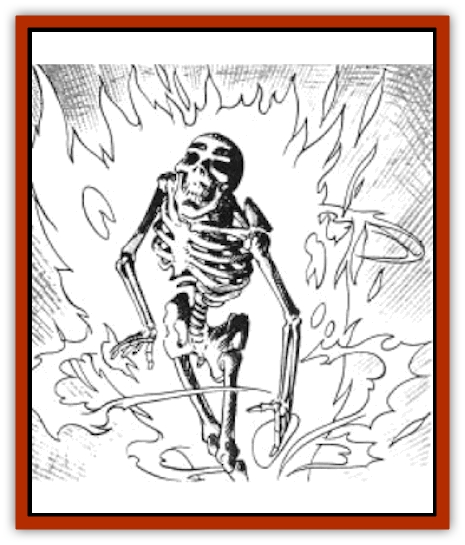

# Fireshadow

| Statistic | **Fireshadow** |
| --- | --- |
| **Activity Cycle:** | Any |
| **Alignment:** | Chaotic evil |
| **Armor Class:** | 0 |
| **Climate/Terrain:** | Any |
| **Damage/Attack:** | 1-6/1-6/3-18 or 2-40 |
| **Diet:** | Special |
| **Frequency:** | Very rare |
| **Hit Dice:** | 13+3 |
| **Intelligence:** | Genius (17.18) |
| **Magic Resistance:** | 50% |
| **Morale:** | Champion (16) |
| **Movement:** | 6 |
| **No. Appearing:** | 1 |
| **No. of Attacks:** | 3 or 1 |
| **Organization:** | Solitary |
| **Size:** | G (30' tall) |
| **Special Attacks:** | See below |
| **Special Defenses:** | Hit only by magical weapons |
| **THAC0:** | 7 |
| **Treasure:** | Nil |
| **XP Value:** | 11,000 |

The fireshadow is a creature from the Abyss that can be summoned to the Prime Material plane by an 8th-level or higher evil cleric, but only if the cleric's deity approves and aids the summoning.

The fireshadow is made of cold, green flame. It can assume whatever shape the summoner specifies, but it must appear at its full height of 30 feet. It might appear as a wraith-like [[Dragon_General_Information|dragon]], a towering human, or an immense [[Skeleton|skeleton]]. Regardless of its form, the fireshadow is always surrounded by an aura of pale, green fire. Though it cannot speak, the fireshadow communicates telepathically with its summoner.

Fireshadows relish death and destruction and are willing partners in campaigns of evil. They are particularly useful as assassins and guardians.

**Combat:** A fireshadow can make three melee strikes per round. Opponents who are not resistant to fire also suffer 1d6 points of damage each round if within ten feet of the fireshadow's aura of green fire.

A victim who comes in contact with a fireshadow must roll a successful saving throw vs. spell, or his flesh begins to turn to green fire. A contacted victim's flesh turns to flame at the rate of 1d8 points per round. The spread of the flame can be stopped by a *cure* spell, which works normally, or by a dose of holy water, which cures 1d6+1 points of damage per round. Unless all of the flame is eliminated, however, it continues to inflict 1d8 points per round.

Nothing short of a *wish* spell can restore a victim to normal once he has been completely converted to green fire. If a victim is completely converted, the fireshadow can control the victim as a smaller fireshadow with the same HD as the victim had before death; the victim no longer has a will of his own and must obey all telepathic orders of the fireshadow. The fireshadow can also absorb a converted victim. Absorbed victims restore 1d20 points of damage to the fireshadow.

The fireshadow has a special attack form called the *ray of oblivion*. This is an invisible cone of energy five feet wide and 130 feet long, flashed from the fireshadow's mouth. Once per turn, the fireshadow can use its *ray of oblivion* to inflict 4d4 points of damage every other round upon all opponents within its area of effect. A successful saving throw vs. breath weapon reduces this damage by half. An opponent reduced to 0 or fewer hit points by the *ray of oblivion* is instantly disintegrated.

The fireshadow is immune to fire-based and mental attacks, as well as attacks from all nonmagical melee weapons. Magical weapons inflict normal damage. It cannot be turned by a priest, but a blow from a *mace of disruption* has a 50% chance of utterly destroying it. If not destroyed outright, the fireshadow suffers double damage with each successful strike from a mace of disruption, plus twice any applicable damage bonuses.

The fireshadow can also be destroyed by; a successful hit from the *hammer of Kharas*, a mighty artifact that, according to legend, is the only hammer that can forge a *dragonlance*. The *hammer of Kharas* is twice the size of a normal war hammer and gives its wielder a +2 bonus to his attack rolls. It inflicts 2d4+2 points of damage on a normal hit and cannot be lifted by a character with a Strength of less than 12; anyone with a Strength of less than 18/50 suffers a -2 penalty to his attack roll, effectively cancelling out the + 2 bonus. It acts as a *mace of disruption* against undead and creatures from the Abyss, turning undead as a 12th-level priest. It is intelligent (Int 11 and Ego 11) and controls anyone who touches it, if the character's Intelligence and Wisdom scores total 21 or less.

The *hammer of Kharas* has the following special abilities at the 20th level of magic use, activated at the hammer's discretion: *detects evil* as a paladin; gives wielder immunity to fear, both normal and magical; wielder unaffected by 1st-4th level spells; casts *prayer* once per day; acts as a *potion of fire giant strength* once per day; casts *cure serious wounds* once per day; inspires magical *awe* in all dwarves, stunning them into inaction until the wielder disappears from sight.

**Habitat/Society:** Fireshadows have no permanent lairs, freely roaming the skies of the Abyss looking for victims until summoned to the Prime Material plane Every 200 years, a fireshadow splits in half to form an identical copy. When a fireshadow reaches the age of 500, it turns to ash.

**Ecology:** Fireshadows can consume any creature by turning it to flame, though they prefer intelligent victims.

---
## Discovery & Documentation

**Source Publication:** MC4 Dragonlance Appendix (w/binder #2) (1989)
**Campaign Setting:** Dragonlance
**Author(s):** Rick Swan

### Other Creatures Found in This Source Book
   * [[Anemone_Giant_Sea|Anemone, Giant Sea]]
   * [[Bear_Ice|Bear, Ice]]
   * [[Beast_Undead|Beast, Undead]]
   * [[Bird_Krynn|Bird (Krynn)]]
   * [[Disir|Disir]]
   * [[Draconian_Aurak|Draconian, Aurak]]
   * [[Draconian_Baaz|Draconian, Baaz]]
   * [[Draconian_Bozak|Draconian, Bozak]]
   * [[Draconian_Kapak|Draconian, Kapak]]
   * [[Draconian_General_Information|Draconian, General Information]]
   * [[Draconian_Sivak|Draconian, Sivak]]
   * [[Draconian_Proto-_Traag|Draconian, Proto-, Traag]]
   * [[Dragon_Amphi|Dragon, Amphi]]
   * [[Dragon_Astral|Dragon, Astral]]
   * [[Dragon_Kodragon|Dragon, Kodragon]]
   * [[Dragon_Krynn_Othlorx_General_Information|Dragon (Krynn), Othlorx, General Information]]
   * [[Dragon_Krynn_General_Information|Dragon (Krynn), General Information]]
   * [[Dragon_Sea|Dragon, Sea]]
   * [[Dreamshadow|Dreamshadow]]
   * [[Dreamwraith|Dreamwraith]]
   * [[Dwarf_Daergar|Dwarf, Daergar]]
   * [[Dwarf_Hill_Neidar|Dwarf, Hill, Neidar]]
   * [[Dwarf_Mountain_Hylar|Dwarf, Mountain, Hylar]]
   * [[Dwarf_Theiwar|Dwarf, Theiwar]]
   * [[Dwarf_Zakhar|Dwarf, Zakhar]]
   * [[Elf_Half-|Elf, Half-]]
   * [[Elf_High_Qualinesti|Elf, High, Qualinesti]]
   * [[Elf_High_Silvanesti|Elf, High, Silvanesti]]
   * [[Elf_Sea_Dargonesti|Elf, Sea, Dargonesti]]
   * [[Elf_Sea_Dimernesti|Elf, Sea, Dimernesti]]
   * [[Elf_Wild_Kagonesti|Elf, Wild, Kagonesti]]
   * [[Eyewing|Eyewing]]
   * [[Fetch|Fetch]]
   * [[Fire_Minion|Fire Minion]]
   * [[Gnome_Tinker|Gnome, Tinker]]
   * [[Gurik_Cha'ahl|Gurik Cha'ahl]]
   * [[Haunt_Knight|Haunt, Knight]]
   * [[Horax|Horax]]
   * [[Human_Krynn|Human (Krynn)]]
   * [[Imp_Blood_Sea|Imp, Blood Sea]]
   * [[Kalothagh|Kalothagh]]
   * [[Kani_Doll|Kani Doll]]
   * [[Kender|Kender]]
   * [[Kyrie|Kyrie]]
   * [[Lizard_Man_Krynn|Lizard Man (Krynn)]]
   * [[Minotaur_Krynn|Minotaur, Krynn]]
   * [[Ogre_High|Ogre, High]]
   * [[Ogre_Krynn|Ogre (Krynn)]]
   * [[Phaethon|Phaethon]]
   * [[Saqualaminoi|Saqualaminoi]]
   * [[Shadowperson|Shadowperson]]
   * [[Shimmerweed|Shimmerweed]]
   * [[Skrit|Skrit]]
   * [[Spectral_Minion|Spectral Minion]]
   * [[Spider_Krynn|Spider (Krynn)]]
   * [[Stag|Stag]]
   * [[Tayling|Tayling]]
   * [[Thanoi|Thanoi]]
   * [[Tylor|Tylor]]
   * [[Wichtlin|Wichtlin]]
   * [[Wyndlass|Wyndlass]]
   * [[Yaggol|Yaggol]]
