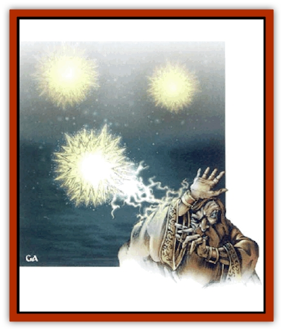

# Firestar

| Statistic | **Firestar** |
| --- | --- |
| **Activity Cycle:** | Night |
| **Alignment:** | Neutral |
| **Armor Class:** | 2 |
| **Climate/Terrain:** | Temperate forests, hills |
| **Damage/Attack:** | See below |
| **Diet:** | Thermosynthesis |
| **Frequency:** | Uncommon |
| **Hit Dice:** | 2+2 |
| **Intelligence:** | High (13-14) |
| **Magic Resistance:** | Nil |
| **Morale:** | Steady (11-12) |
| **Movement:** | Fl 15 (A) |
| **No. Appearing:** | 1-12 |
| **No. of Attacks:** | See below |
| **Organization:** | Pack |
| **Size:** | T (3-6&rdquo; diameter) |
| **Special Attacks:** | Electricity |
| **Special Defenses:** | Immune to magic; heat and electrical absorption; invisibility |
| **THAC0:** | 19 |
| **Treasure:** | Nil |
| **XP Value:** | 2,000 |

Firestars, also known as the *moon dancers*, are tiny glowing beings that roam forests and hills, and generally ignore travelers. They appear as silent, floating fist-sized motes of light, and are frequently mistaken for [[Will_O'Wisp|will o'wisps]] or torches.

Firestars can consciously control their illumination level, from bright torchlight to total darkness. During a blackout, they are effectively invisible. The light fails completely when the firestar dies.

The firestars' language consists of intricate patterns of flashing lights, accompanied by fluctuations in their light level. They understand some humanoid gestures, movements, and languages.

**Combat:** A firestar never initiates combat. If attacked, it defends itself with an electrical jolt similar to a miniature lightning bolt that inflicts 2d6 points of damage with no saving throw. This bolts have a range of 30 feet, are conducted through metal, and can be released five times each day.

A firestar can absorb energy from normal or magical flames; it gains as additional hit points the amount of damage the flames would have inflicted on another creature. For example, a 12 hit point firestar attacked by a fireball that would normally cause 18 points of damage would gain the 18 points as additional hit points, for a new total of 30 hit points.

A firestar can attain a maximum hit point total of four times its original amount. These added hit points are lost after 1d4+1 hours, leaving the firestar with its original amount. Any extra hit points are not absorbed, but harmlessly dissipated. Firestars can absorb the damage done by a *flametongue sword* at a rate of 1 hit point per sword strike. Firestars are immune to electrical attacks.

Firestars can drain energy from a normal campfire at a rate of 2d6 hit points per round or from torches at a rate of 1d6 points per round. It can extinguish a fire by absorbing all its energy at once, gaining 5d6 hit points in the process; to do this, the firestar must remain motionless and take no other actions. Firestars automatically attract sparks within 20 feet; these are harmlessly absorbed but may betray a blacked-out firestar's position.

Firestars are immune to most magical spells. Detection and communication spells, *magic missile*, and cold-based spells have normal effects on the firestar. A firestar can be hit by normal weapons. Flaming weapons both injure and heal the firestar simultaneously.

 If a firestar is slain, the light fades, revealing its actual body, a two-inch-long, egg-shaped body covered in a black spiderweb of nerves. The nerves intersect in a number of nodes and eyes.

**Habitat/Society:** The firestar is normally found floating among the hills or trees, dancing intricate patterns with its companions. It is a completely alien being that shows some curiosity toward its surroundings, but otherwise ignores animals and adventurers alike. Attracted by artificial lights and magic, it investigates campfires and magical lights within two miles and magic use within 200 yards.

Most encounters with firestars occur when adventurers mistake them for torches or will o'wisps. Adventurers may attack the peaceful firestars, which then defend themselves with their powers. An injured firestar may initiate an encounter by seeking out and draining an adventurer's campfire to heal itself.

During the day, firestars rest. They land in high, inaccessible spots, retract their glowing nerves, and spend the day absorbing the sun's light and heat. They may be mistaken for exotic or ornamented eggs; adventurers may accidentally collect these "eggs" with the idea of later reselling them. When night falls, the firestars reveal their true selves and seek to escape.

Firestars are intelligent but reclusive. They only communicate with creatures that employ telepathy or *speak with monsters* spells. Firestars are also secretive about their life span and reproduction. It is suspected that firestars reproduce asexually by budding.

**Ecology:** The firestar's body contains several organs that are useful as spell components or ingredients in magical concoctions. It contains a distinctive organ that can be used in a *dancing lights* spell. Any of its organs can be used to prepare the magical inks for *affect normal fires*, *dancing lights*, and *detect magic* scrolls. These organs are worth 1 to 5 gp.

---
## Discovery & Documentation

**Source Publication:** MC2 Volume II (1993)
**Campaign Setting:** Advanced Dungeons & Dragons 2nd Edition
**Author(s):** Jay Batista, Scott Bennie, Grant Boucher, William W. Connors, Steve Gilbert, Heike Kubasch, James Lowder, David Edward Martin, Bruce Nesmith, Jean Rabe, Rick Swan, John J. Terra, Gary L. Thomas

### Other Creatures Found in This Source Book
   * [[Ant|Ant]]
   * [[Ant_Lion_Giant|Ant Lion, Giant]]
   * [[Ape_Carnivorous|Ape, Carnivorous]]
   * [[Baboon|Baboon]]
   * [[Badger|Badger]]
   * [[Barracuda|Barracuda]]
   * [[Beetle_Giant|Beetle, Giant]]
   * [[Bulette|Bulette]]
   * [[Bullywug|Bullywug]]
   * [[Dwarf_Duergar|Dwarf, Duergar]]
   * [[Dwarf_Gully|Dwarf, Gully]]
   * [[Eagle|Eagle]]
   * [[Eel|Eel]]
   * [[Elemental_Air_Kin|Elemental, Air Kin]]
   * [[Elemental_Water_Kin|Elemental, Water Kin]]
   * [[Elemental_Water_Kin_Water_Weird|Elemental, Water Kin, Water Weird]]
   * [[Firetail|Firetail]]
   * [[Fish_Giant|Fish, Giant]]
   * [[Frog|Frog]]
   * [[Gorgon|Gorgon]]
   * [[Hawk|Hawk]]
   * [[Heucuva|Heucuva]]
   * [[Hippocampus|Hippocampus]]
   * [[Hippogriff|Hippogriff]]
   * [[Kelpie|Kelpie]]
   * [[Kenku|Kenku]]
   * [[Killmoulis|Killmoulis]]
   * [[Kuo-Toa|Kuo-Toa]]
   * [[Lamia|Lamia]]
   * [[Lammasu|Lammasu]]
   * [[Lamprey|Lamprey]]
   * [[Leech|Leech]]
   * [[Leprechaun|Leprechaun]]
   * [[Leucrotta|Leucrotta]]
   * [[Locathah|Locathah]]
   * [[Lycanthrope_Wereboar|Lycanthrope, Wereboar]]
   * [[Lycanthrope_Werefox|Lycanthrope, Werefox]]
   * [[Mammal_Minimal|Mammal, Minimal]]
   * [[Mammal_Small|Mammal, Small]]
   * [[Mimic|Mimic]]
   * [[Morkoth|Morkoth]]
   * [[Muckdweller|Muckdweller]]
   * [[Myconid|Myconid]]
   * [[Naga|Naga]]
   * [[Obliviax|Obliviax]]
   * [[Octopus_Giant|Octopus, Giant]]
   * [[Otyugh|Otyugh]]
   * [[Piranha|Piranha]]
   * [[Plant_Dangerous_I|Plant, Dangerous I]]
   * [[Plant_Intelligent|Plant, Intelligent]]
   * [[Poltergeist|Poltergeist]]
   * [[Porcupine|Porcupine]]
   * [[Rat_Osquip|Rat, Osquip]]
   * [[Roc|Roc]]
   * [[Roper|Roper]]
   * [[Rot_Grub|Rot Grub]]
   * [[Rust_Monster|Rust Monster]]
   * [[Sahuagin|Sahuagin]]
   * [[Sea_Lion|Sea Lion]]
   * [[Sea_Horse_Giant|Sea Horse, Giant]]
   * [[Shambling_Mound|Shambling Mound]]
   * [[Shark|Shark]]
   * [[Sphinx|Sphinx]]
   * [[Squid_Giant|Squid, Giant]]
   * [[Stirge|Stirge]]
   * [[Swanmay|Swanmay]]
   * [[Tarrasque|Tarrasque]]
   * [[Tasloi|Tasloi]]
   * [[Triton|Triton]]
   * [[Troglodyte|Troglodyte]]
   * [[Urchin|Urchin]]
   * [[Urd|Urd]]
   * [[Weasel|Weasel]]
   * [[Wolverine|Wolverine]]
   * [[Yellow_Musk_Creeper|Yellow Musk Creeper]]
