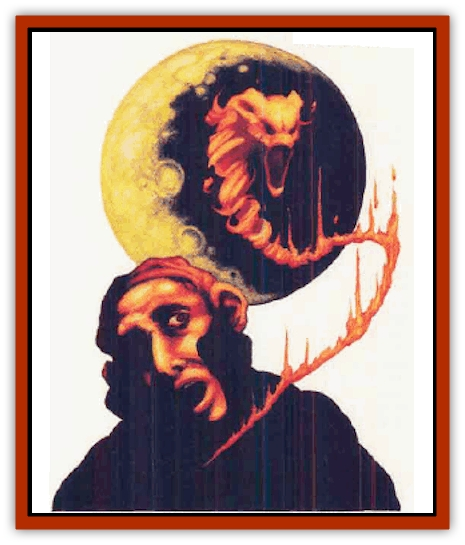

# Firetail

| Statistic | **Lesser** | **Tshala** |
| --- | --- | --- |
| **Activity Cycle:** | Any | Any |
| **Alignment:** | Chaotic neutral | Chaotic neutral |
| **Armor Class:** | 6 | 2 |
| **Climate/Terrain:** | Any but cold | Any but cold |
| **Damage/Attack:** | 1-6/1-6 | 1-12/1-12/1-12/1-12 |
| **Diet:** | See below | See below |
| **Frequency:** | Rare | Very rare |
| **Hit Dice:** | 4+4 | 9+9 |
| **Intelligence:** | Average (8-10) | Genius (17-18) |
| **Magic Resistance:** | 40% | 90% |
| **Morale:** | Steady (12) | Champion (15) |
| **Movement:** | Fl 15 (B) | Fl 21 (B) |
| **No. Appearing:** | 1-6 | 1-2 |
| **No. of Attacks:** | 2 | 4 |
| **Organization:** | Flock/solitary | Solitary/flock |
| **Size:** | S (2' long) | S (4' long) |
| **Special Attacks:** | Heat | Heat, magic use |
| **Special Defenses:** | Nil | +1 weapon to hit |
| **THAC0:** | 17 | 12 |
| **Treasure:** | Nil | Gems only (25%) |
| **XP Value:** | 1,400 | 6,000 |

The nature of this creature has made it a being of awe and legend in the Realms. The firetail appears as a frolicsome fey creature of living flame, that loops and darts dazzlingly in the air, bewitching those who gaze upon it. Although it is reputed to employ magic, only the greater firetail, or tshala, actually casts spells. The two species are outwardly identical. Adventurers who have encountered both types may be able to recognize the tshala by its superior flight capabilities.

**Combat:** Firetails tend to take sides in conflicts, and may wreak havoc or do much good. They hate [[Elemental_Fire_Kin|salamanders]] and attack them on sight. Firetails and [[Elemental_Fire_Water|fire elementals]] tend to ignore each other, for neither race has done anything to deserve the enmity of the other.

Tshala can use the following spells, cast as though they were spell casters of the 14th level: *plane shift*, *remove curse*, *heal*, *feeblemind*, *maze*, *fire trap* (each once per day), and *fireball* (once per turn). When spell casting, they can take no other action, for their entire being is focused upon the spell effects.

Firetails take no damage from heat- and fire-based attacks, but suffer additional damage from water- and cold-based attacks at the rate of +3 per die. Sudden strong winds such as the magical gust of wind can disturb their fiery bodies and prevent them from spell-casting. Firetails communicate by changing their blaze from fiery orange to blue-white, and varying the intensity, hue, temperature, and pattern of coloration. Their flames cause 1-6 or 1-12 points of damage, depending upon their type, upon contact, and also ignite flammable materials such as parchment and cloth.

Once every three rounds a firetail may blaze intensely for a few segments so that one of its attacks in that round causes an additional 1-12 points of damage. Its great heat damages everything within 5 feet that fails a saving throw. If they repeat this action five times in a day, they must sacrifice one of their spells for the day.

**Habitat/Society:** The firetail originated on the Elemental Plane of Fire, where it is uncommon (tshala are rare), but some have been transported elsewhere by diverse means, and some have traveled to other planes of their own whim, for tshala may plane shift themselves and 1-6 lesser firetails in a group, once per day.

Such groups are short-lived, for firetails are creatures of whim and independence. Unfortunately for the lesser firetails, they are often stranded wherever the tshala abandons them.

Usually solitary, they prefer the company of their own kind to that of other creatures. Occasionally they may take a companion, which may be almost any sort of creature. Firetails have accompanied others of their own kind, [[Pegasus|pegasi]], [[Elemental_Air_Kin|sylphs]], [[Elf|elves]], and even humans. Although they never forget friends, firetails may suddenly ignore a familiar being, depart for a time, and return without good reason. They never allow a friend to be harmed if they are present. Likewise, they never forget an enemy, and if they encounter one, do all in their power to ensure that their rival goes down in flames. Because of their independence and flighty nature, most other creatures cannot depend on a firetail in times of need.

**Ecology:** Although no one knows when or how the first firetail appeared, their lifestyle and method of reproduction have since been well-documented by sages and researchers.

Very few firetails actually begin their existence as tshala. Only 1 in 10 start out to be greater firetails, although through age and experience, a lesser firetail may be promoted to the rank of tshala.

If a lesser firetail reaches the age of 200 years, it secludes itself from all other races, and seeks out a source of intense flame and heat, such as a lava pool or dormant volcano. Once there, it absorbs tremendous quantities of heat, often draining the nearby area entirely. This continues for a week, at which point the firetail emerges from the fire as a tshala, with full command of its abilities.

At some point soon after they reach ancient age (around 400 years), firetails begin accumulating large piles of flammable material for their caves. When they have gathered enough to make 1-4 piles burn for several hours, the firetail bursts, setting each heap afire with intense flame. After an hour has passed, each mound generates one firetail, with a 10% chance of it being a tshala.

---
## Discovery & Documentation

**Source Publication:** MC2 Volume II (1993)
**Campaign Setting:** Advanced Dungeons & Dragons 2nd Edition
**Author(s):** Jay Batista, Scott Bennie, Grant Boucher, William W. Connors, Steve Gilbert, Heike Kubasch, James Lowder, David Edward Martin, Bruce Nesmith, Jean Rabe, Rick Swan, John J. Terra, Gary L. Thomas

### Other Creatures Found in This Source Book
   * [[Ant|Ant]]
   * [[Ant_Lion_Giant|Ant Lion, Giant]]
   * [[Ape_Carnivorous|Ape, Carnivorous]]
   * [[Baboon|Baboon]]
   * [[Badger|Badger]]
   * [[Barracuda|Barracuda]]
   * [[Beetle_Giant|Beetle, Giant]]
   * [[Bulette|Bulette]]
   * [[Bullywug|Bullywug]]
   * [[Dwarf_Duergar|Dwarf, Duergar]]
   * [[Dwarf_Gully|Dwarf, Gully]]
   * [[Eagle|Eagle]]
   * [[Eel|Eel]]
   * [[Elemental_Air_Kin|Elemental, Air Kin]]
   * [[Elemental_Water_Kin|Elemental, Water Kin]]
   * [[Elemental_Water_Kin_Water_Weird|Elemental, Water Kin, Water Weird]]
   * [[Firestar|Firestar]]
   * [[Fish_Giant|Fish, Giant]]
   * [[Frog|Frog]]
   * [[Gorgon|Gorgon]]
   * [[Hawk|Hawk]]
   * [[Heucuva|Heucuva]]
   * [[Hippocampus|Hippocampus]]
   * [[Hippogriff|Hippogriff]]
   * [[Kelpie|Kelpie]]
   * [[Kenku|Kenku]]
   * [[Killmoulis|Killmoulis]]
   * [[Kuo-Toa|Kuo-Toa]]
   * [[Lamia|Lamia]]
   * [[Lammasu|Lammasu]]
   * [[Lamprey|Lamprey]]
   * [[Leech|Leech]]
   * [[Leprechaun|Leprechaun]]
   * [[Leucrotta|Leucrotta]]
   * [[Locathah|Locathah]]
   * [[Lycanthrope_Wereboar|Lycanthrope, Wereboar]]
   * [[Lycanthrope_Werefox|Lycanthrope, Werefox]]
   * [[Mammal_Minimal|Mammal, Minimal]]
   * [[Mammal_Small|Mammal, Small]]
   * [[Mimic|Mimic]]
   * [[Morkoth|Morkoth]]
   * [[Muckdweller|Muckdweller]]
   * [[Myconid|Myconid]]
   * [[Naga|Naga]]
   * [[Obliviax|Obliviax]]
   * [[Octopus_Giant|Octopus, Giant]]
   * [[Otyugh|Otyugh]]
   * [[Piranha|Piranha]]
   * [[Plant_Dangerous_I|Plant, Dangerous I]]
   * [[Plant_Intelligent|Plant, Intelligent]]
   * [[Poltergeist|Poltergeist]]
   * [[Porcupine|Porcupine]]
   * [[Rat_Osquip|Rat, Osquip]]
   * [[Roc|Roc]]
   * [[Roper|Roper]]
   * [[Rot_Grub|Rot Grub]]
   * [[Rust_Monster|Rust Monster]]
   * [[Sahuagin|Sahuagin]]
   * [[Sea_Lion|Sea Lion]]
   * [[Sea_Horse_Giant|Sea Horse, Giant]]
   * [[Shambling_Mound|Shambling Mound]]
   * [[Shark|Shark]]
   * [[Sphinx|Sphinx]]
   * [[Squid_Giant|Squid, Giant]]
   * [[Stirge|Stirge]]
   * [[Swanmay|Swanmay]]
   * [[Tarrasque|Tarrasque]]
   * [[Tasloi|Tasloi]]
   * [[Triton|Triton]]
   * [[Troglodyte|Troglodyte]]
   * [[Urchin|Urchin]]
   * [[Urd|Urd]]
   * [[Weasel|Weasel]]
   * [[Wolverine|Wolverine]]
   * [[Yellow_Musk_Creeper|Yellow Musk Creeper]]
