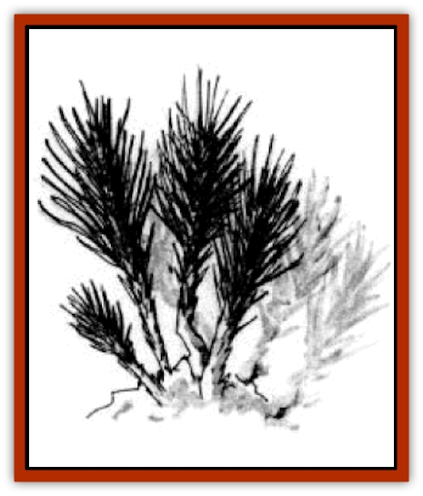

# Fireweed

| Statistic | **Fireweed** |
| --- | --- |
| **Activity Cycle:** | Any |
| **Alignment:** | Neutral |
| **Armor Class:** | 7 |
| **Climate/Terrain:** | Any Underdark or tropical |
| **Damage/Attack:** | Absorb fire |
| **Diet:** | Heat |
| **Frequency:** | Rare |
| **Hit Dice:** | 1 to 9 |
| **Intelligence:** | Non- (0) |
| **Magic Resistance:** | n/a |
| **Morale:** |  |
| **Movement:** | 0 |
| **No. Appearing:** | 1 |
| **No. of Attacks:** | None |
| **Organization:** | None |
| **Size:** | n/a |
| **Special Attacks:** | Standard |
| **Special Defenses:** | S to L (1-8' tall) |
| **THAC0:** | 1-4 |
| **Treasure:** | Nil |
| **XP Value:** |  |

This strange, heat-absorbing plant grows in sections of the Underdark that even [[Fungus|fungi]] find too harsh to survive. While it is not a threat to most adventuring parties, it can change the terrain, making volcanic regions survivable. It can also turn the normally lifeless stretches of the underdark into relatively fertile regions, simply by converting heat into food.

Fireweed is a black, spongy plant, without leaves but with constant branches; its overall structure resembles a gigantic Spanish moss. Its sap is a purplish-red.

**Combat:** Because fireweed thrives on heat of all kinds, it cannot be destroyed by fire, even magical fire; instead, fire makes it grow at an astounding, even magical rate, filling entire corridors or caverns if the heat is great enough. For each die of heat damage that fireweed absorbs, it grows another foot; constant sources of heat can quickly lead to the weed overrunning every bit of space for miles, creating a dark wooden jungle.

**Habitat/Society:** Fireweed grows in stands, much like scrub weeds and saplings on the surface. These stands are almost always a single genetic organism, reproducing by cloning into many hundreds or thousands of copies of the founding fire-weed plant.

**Ecology:** The semi-magical strength of fireweed converts heat into food and foul toxins into breathable air. Its value to the creatures of the deep underdark is immense, and they treat it with the respect it deserves. Surface-dwellers who hack down stands of the useful plant are often punished by Underdark dwellers who witness the crime.

---
## Discovery & Documentation

**Source Publication:** Dragon227 (1996)
**Campaign Setting:** Dragon Magazine
**Author(s):** 

### Other Creatures Found in This Source Book
   * [[Beetle_Scarab_Giant|Beetle, Scarab, Giant]]
   * [[Elemental_Darkness|Elemental, Darkness]]
   * [[Glouras|Glouras]]
   * [[Octopus_Blue-Ring|Octopus, Blue-Ring]]
