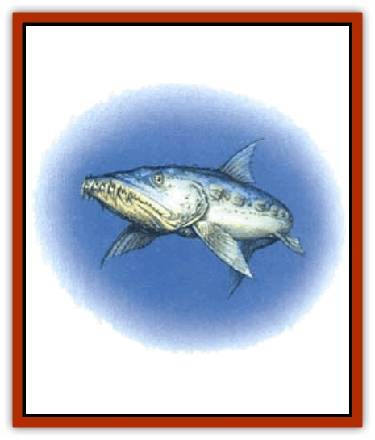

# Fish - Ascallion

| Statistic | **Adult Female** | **Adult Male (Shadow)** | **Young** |
| --- | --- | --- | --- |
| **Activity Cycle:** | Any | Any | Any |
| **Alignment:** | Neutral | Neutral | Neutral |
| **Armor Class:** | 6 | 5 | 3 |
| **Climate/Terrain:** | Salt water | Salt water | Salt water |
| **Damage/Attack:** | 6d8 | 5d4 | 2d4 |
| **Diet:** | Carnivore | Carnivore | Carnivore |
| **Frequency:** | Rare | Very rare | Rare |
| **Hit Dice:** | 6+6 | 5+5 | 1+1 |
| **Intelligence:** | Average (8-10) | Average (8-10) | Average (8-10) |
| **Magic Resistance:** | Nil | Nil | Nil |
| **Morale:** | Steady (12) | Steady (12) | Steady (12) |
| **Movement:** | Sw 18 | Sw 24 | Sw 21 |
| **No. Appearing:** | 1 | 1 | 2-12 |
| **No. of Attacks:** | 1 bite | 1 bite | 1 bite |
| **Organization:** | School | Solitary | School |
| **Size:** | H (18' long) | L (8' long) | T (1' long) |
| **Special Attacks:** | Nil | Nil | Nil |
| **Special Defenses:** | Immunity to mental attack and paralysis | Immunity to mental attack and paralysis | Immunity to mental attack and paralysis |
| **THAC0:** | 13 | 15 | 19 |
| **Treasure:** | Nil | Nil | Nil |
| **XP Value:** | 1,400 | 975 | 65 |

Sometimes known as *scallions*, the ascallions are fearsome predators that inhabit the oceans of Faer�n. Coastal and aquatic communities that find themselves contending with ascallions quickly learn to respect their powerful bight and lightning speed. The most unusual feature of ascallions is the manner in which the female and her young hunt.

Adult female ascallions are much larger than their male counterparts, averaging 18 feet in length. The female ascallion is dark gray along her dorsal surface, shading to light gray on her underside. Like the male, the female has some semblance to a [[Shark|shark]].

Ascallion young are small and fairly harmless-looking, averaging just over one foot in length. As a rule, they are light gray with occasional individuals being a dark gray or black. They normally dwell inside the gaping maw of their mother and are seen only when she releases them to attack her prey.

**Combat:** Female ascallions usually attack their prey in conjunction with their young. When a victim is spotted, the female remains at a save distance and opens its jaws wide. Instantly, 2d6 young dart forth from within her mouth and tear at the prey with their razor-sharp teeth. After they have eaten their fill, the mother moves forward and consumes what remains. In the event that the young are unable to contend with the chosen victim, the mother can rush forward and come to their aid.

The female ascallion's powerful jaws have been known to splinter the hulls of small boats and make short work of most opponents. Small craft must make an item saving throw vs. crushing blow if attacked in this way, or be destroyed. (If the hull point system from *Ships and the Sea* is used, the jaws of the female ascallion deliver 3d4 points of hull damage.)

All types of ascallions have an unusual nervous system that is far less centralized than that of most other creatures. The result is that, while the creature has virtually no sense of touch or pain, it is utterly immune to all forms of mental attack and paralysis.

**Habitat/Society:** Ascallions are nomadic creatures that roam throughout temperate and tropical seas. Although they cannot live in fresh water, the females have been known to venture up wide rivers in search of prey for brief periods of time.

Ascallions spawn only rarely, with each mother giving birth to 2d6 young. These young are protected by the mothrer, living safely inside her mouth and coming out only to hunt and feed, for roughly three years. When the young reach maturity, they turn on their mother and eat their way out of her body, killing her in the process. Mature young are treated as adults of the species, but have half the hit points that they will have when full grown.

Once the young ascallions have slain their mother, they disperse and leave the company of their siblings forever. If the mother is slain before they reach maturity, then they will generally remain together until they are old enough to strike out on their own.

Because of the singular nature of the ascallion nervous system, these creatures are unable to hunt by sensing vibrations in the water, as many ocean predators do. Instead, they are forced to seek their prey by sight and smell alone.

**Ecology:** The ascallion regards all other forms of aquatic life as potential prey. Even sharks, which often stay near other predators to share in their kills, do not remain in an area occupied by an ascallion.

Ascallions are deadly enemies of octopi and like creatures. They attack these on sight, abandoning whatever else they may be doing at the time.

**Shadow (Male Ascallion)**

  Male ascallions, commonly called shadows, range in color from black to charcoal gray. They greatly resemble sharks, and average around eight feet in length at adulthood.

Adult male ascallions attack with their powerful jaws and sharp teeth. Although their bite is not nearly as powerful as that of female ascallions, the males can hold their own against creatures as deadly as the [[Shark|giant shark]].

---
## Discovery & Documentation

**Source Publication:** MC3 Volume III Forgotten Realms Appendix I (1989)
**Campaign Setting:** Forgotten Realms
**Author(s):** William Connors, David Martin, Rick Swan, Gary Thomas

### Other Creatures Found in This Source Book
   * [[Asperii|Asperii]]
   * [[Belabra|Belabra]]
   * [[Berbalang|Berbalang]]
   * [[Bhaergala|Bhaergala]]
   * [[Bichir|Bichir]]
   * [[Bunyip|Bunyip]]
   * [[Burbur|Burbur]]
   * [[Cloaker|Cloaker]]
   * [[Crawling_Claw|Crawling Claw]]
   * [[Darkenbeast|Darkenbeast]]
   * [[Dracolich|Dracolich]]
   * [[Dragon_Oriental_Carp_Yu_Lung|Dragon, Oriental, Carp (Yu Lung)]]
   * [[Dragon_Oriental_Celestial_T'ien_Lung|Dragon, Oriental, Celestial (T'ien Lung)]]
   * [[Dragon_Oriental_Coiled_Pan_Lung|Dragon, Oriental, Coiled (Pan Lung)]]
   * [[Dragon_Oriental_Earth_Li_Lung|Dragon, Oriental, Earth (Li Lung)]]
   * [[Dragon_Oriental_Lung_General_Information|Dragon, Oriental (Lung), General Information]]
   * [[Dragon_Oriental_River_Chiang_Lung|Dragon, Oriental, River (Chiang Lung)]]
   * [[Dragon_Oriental_Sea_Lung_Wang|Dragon, Oriental, Sea (Lung Wang)]]
   * [[Dragon_Oriental_Spirit_Shen_Lung|Dragon, Oriental, Spirit (Shen Lung)]]
   * [[Dragon_Oriental_Typhoon_Tun_Mi_Lung|Dragon, Oriental, Typhoon (Tun Mi Lung)]]
   * [[Dragonet_Faerie_Dragon|Dragonet, Faerie Dragon]]
   * [[Firenewt|Firenewt]]
   * [[Firestar|Firestar]]
   * [[Fish_Vurgens|Fish, Vurgens]]
   * [[Meazel|Meazel]]
   * [[Medusa_Maedar|Medusa, Maedar]]
   * [[Mist_Crimson_Death|Mist, Crimson Death]]
   * [[Revenant|Revenant]]
   * [[Rhaumbusun|Rhaumbusun]]
   * [[Strider_Giant|Strider, Giant]]
   * [[Thessalmonster|Thessalmonster]]
   * [[Web_Living|Web, Living]]
   * [[Wemic|Wemic]]
