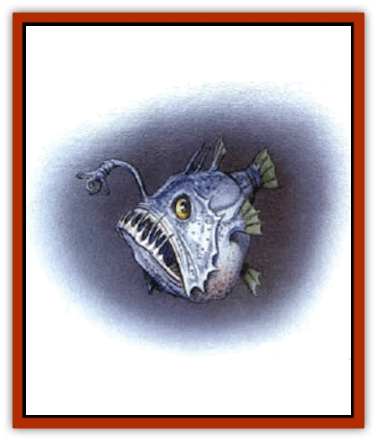
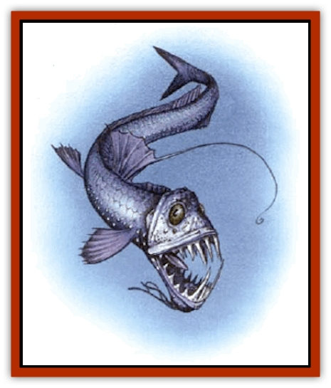

# Fish - Deep Ocean

| Statistic | **Angler Fish** | **Death Minnow** | **Gulper** | **Viperfish** |
| --- | --- | --- | --- | --- |
| **Activity Cycle:** | Any | Any | Any | Any |
| **Alignment:** | Neutral | Neutral | Neutral | Neutral |
| **Armor Class:** | 8 | 10 | 9 | 7 |
| **Climate/Terrain:** | Ocean depths | Ocean depths | Ocean depths | Ocean depths |
| **Damage/Attack:** | 2d8 (some species 1d4) | Special | 2d8 (some species 1d8) | 1d20 |
| **Diet:** | Carnivore | Carnivore | Carnivore | Carnivore |
| **Frequency:** | Uncommon | Very rare | Uncommon | Uncommon |
| **Hit Dice:** | 8 | 6 | 9 | 10 |
| **Intelligence:** | Animal (1) | Animal (1) | Animal (1) | Animal (1) |
| **Magic Resistance:** | Nil | Nil | Nil | Nil |
| **Morale:** | Elite (13) | Elite (13) | Elite (13) | Fearless (20) |
| **Movement:** | Sw 12 | Sw 9 (12) | Sw 15 | Sw 18 |
| **No. Appearing:** | 1 | 1-2 | 1 | 1-2 |
| **No. of Attacks:** | 1 | 1 | 1 | 1 |
| **Organization:** | Solitary | Solitary | Solitary | Solitary |
| **Size:** | L (8' long) | T or L (2&rdquo; or 8') | L (12' long) | H (20' long) |
| **Special Attacks:** | Swallows whole | Swallows whole, <i>enlarge</i> | Constriction, swallows whole | Swallow whole (some: constriction) |
| **Special Defenses:** | Nil | <i>Shrink</i> | Nil | Nil |
| **THAC0:** | 13 | 15 | 11 | 11 |
| **Treasure:** | Nil | Nil | Nil | Nil |
| **XP Value:** | 1,400 | 2,000 | 3,000 | 5,000 |

**

Angler Fish**

  The [[Angler_Fish|angler fish]] is, as its name implies, a [[Fish|fish]] that hunts the lightless depths by means of a natural "fishing line", sometimes even with a hook (not in the real-world creatures). These bloated looking things are clumsy swimmers, relying on their lures to cause prey to come to them. Surface-dwellers have an illicium (the "fishing line", actually the modified first ray of the dorsal fin) that looks like a worm or similar creature; with deep-sea anglers, the illicium is luminous. Some anglers don't have an illicium, relying instead on a luminous growth protruding from the roof or palate of the mouth. These growths, in some fantastic species, might resemble anything from mounds of sunken treasure to a beautiful mermaid, both lying in a "cavern" chock full of "stalactites" and "stalagmites". Most anglers are no bigger than a man's fist, though one surface-dwelling type is large enough to swallow ducks and geese and does so.

Combat for the angler fish generally consists of decoying the victim close enough to be attacked, with the teeth getting in one good bite (2d8 damage) and then simply holding the victim in place to be digested (1d8 damage per round). Some anglers actually have one or more hooks at the end of the illicium. With some fantastic species of these fish, these hooks are functional and can be used to snare prey (1d4 points of damage), drawing it down to the mouth to be bitten automatically in the same round. The angler fish's poor Armour Class allows stabbing weapons to penetrate it relatively easily. A swallowed prey takes as much damage from the attack as the fish. The fish's teeth curve inward, so it can't even think about letting go, no matter how much opponents with tridents and daggers might make it wish it could. Swallowing prey is the ultimate act of commitment.

In most species of angler fish, only the females do the hunting. The male, only a fraction of the female's size, clings like a [[Lamprey|lamprey]] to her body, living off her as a parasite. This works well for the angler fish; despite the darkness of the ocean depths and the fact that angler fish are few and far between, this system ensures that every fish always has a mate on hand when breeding season comes around. What happens to the young is not known.

The angler fish is a typical predator, like nearly all hunters of the deep. Its flesh is edible, though not a gourmet's delight by human standards.

**

Death Minnow**

  The [[Death_Minnow|death minnow]] is a bright orange fish only 2 inches long. It is a magical creature, created by powerful, but unknown, undersea sorcerers ([[Aboleth|aboleths]]? [[Sahuagin|sahuagin]]?) A potent guardian of dark undersea lairs and treasure troves, this creature relies on pressure-sensitive lateral lines to detect its prey.

The death minnow's creators incorporated into the fish an innate magical ability similar to the reversible spell *enlarge/reduce*. Simply put, this little fish can swim up to a creature, looking as innocuous as can be, suddenly enlarge itself to the size of a giant angler fish, swallow the surprised victim with a single gulp, and then reduce both itself and the victim to minute size again. If no one else is loking in the victim's direction at the time (remember, there is apparently nothing large enough to be a threat in the vicinity), then the target will seem to have simply disappeared without a trace.

The act of swallowing itself causes no damage, as the victim is drawn into the fish's mouth by suction. Once inside, however, the prey suffers 1d6 points of damage from the death minnow's digestive juices until rescue or death. Weapons inflict full damage on the swallowed creature as well as the death minnow. However, even bloated with prey, the tiny death minnow can easily dodge most blows. Once the fish is slain (an ingrained instinct prevents it from releasing its prey under any circumstances), the victim instantly returns to normal size. Casting *dispel magic* on a tiny death minnow causes it to grow to its monster size of 8 feet, making it a far easier target.

There are no known "wild" populations of death minnows. These are magical guard beasts. As they are created magically, they do not need to breed. In fact, it is uncertain if they even have male and female sexes.

As a magical guardian beast, the death minnow ensures that the immediate vicinity it is set to guard remains free of such dangerous predators as adventurers. If the party can kill one, its blood might be used as an ingredient in the ink used for penning *enlarge* or *shrink* on spell scrolls. If, instead, someone wants to return the swallowing favor by eating it, it tastes remarkably like kippered herring.

**

Gulper**

  The [[Gulper|gulper]] is little more than a huge mouth, followed by a trailing tail that seems to stretch on forever. The mouth is huge; it can swallow prey several times larger than the gulper itself. Gulpers ean grow to a length of 12 feet. This creature has small eyes set on top of its head to catch the least bit of sunlight that filters down from the surface; however, it relies almost solely on its lateral lines (a pressure-sensitive line that runs along each side of its body) to feel the approach of prey. Some species have a bioelectric light at the tip of the tail, to attract potential victims. The giant eel, [[Fish_Vurgens|vurgens]], found in the Forgotten Realms setting, is a giant species of gulper that hunts in shallower water.

The gulper's bite, causing 2d8 points of damage, is inflicted only once on any prey. The next round, the victim is swallowed whole, and the creature's teeth are now reduced to a supportive role, holding the prey in place so it can't get away. Further damage is caused by the gulper's digestive juices, which inflict 1d8 points of damage per turn until the prey is either digested or released. Release can be tricky, though, as cutting though the gulper's soft flesh inflicts an equal amount of damage on the trapped prey.

A gulper might use its tail for a constriction attack, inflicting 1d6 points of damage per round upon the hapless victim. Any creature smaller than size G can be constricted by a 12-foot gulper.

Gulpers are solitary. Their reproductive cycle is unknown, but it is possible that one parent may shelter the newborn young in its mouth for a time. In this case, "survival of the fittest" means knowing enough to leave home before hunger overrides parental urges.

Gulpers eat anything. They are edible in tum, with delicate flesh. An enterprising magical artificer might use their skin in the construction of - what else - a *bag of holding*.

**

Viperfish**

  The viperfish is among the most vicious inhabitants of the deepest ocean depths. It is an active cruiser after prey rather than a mere passive toothed trap waiting for a meal to come within reach. The creature has lights for vision as well as for attracting prey, and often has a double row of lights along its torso like portholes on an ocean liner. Prey lures include luminous patches directly inside the creature's mouth. From a viperfish's chin protrudes one or more branches - or whiplike growths. In all species, this is an extension of the lateral line senses, serving as a type of antenna to detect movement in the water. Some fantastic species, however, might also use it as a weapon (see below). The smallest natural viperfish is about an inch and a half long, while the largest can grow to 6 feet. Monstrous viperfish might grow to a length of 20 feet or more.

Like many other fish of the depths, a viperfish gets in one good bite at the start of the attack (1d20 points of damage) and then swallows its prey whole, its teeth serving as no more than bars in a cage to keep the prey from escaping. They also keep the viperfish from letting its prey go if it realizes it is too much for it, as they slantbackwards. If the viperfish takes too big a mouthful, then that's just too bad for it, as well as for its prey. Some specimens have a whiplike chin growth that acts as a tentacle causing 1d8 points of constriction damage. Swallowed prey takes 1d8 points of damage per round from the viperfish's stomach acids until rescued or dead. Slashing or piercing damage inflicted on the viperfish is inflicted on the trapped prey as well.

Viperfish are solitary creatures, only coming together briefly for the mating season. They abandon their young as soon as the eggs are laid.

As active hunters, viperfish have more of an impact on the deep-sea ecology than those predators that simply sit around waiting for prey to come to them. They also have edible, if nontasty, flesh

---
## Discovery & Documentation

**Source Publication:** Monstrous Compendium, 1997 Annual, Volume 4 (1995)
**Campaign Setting:** Advanced Dungeons & Dragons 2nd Edition
**Author(s):** Jon Pickens

### Other Creatures Found in This Source Book
   * [[Anemone_Giant_Sea|Anemone, Giant Sea]]
   * [[Asperii|Asperii]]
   * [[Bainligor|Bainligor]]
   * [[Beast_of_Chaos|Beast of Chaos]]
   * [[Blindheim|Blindheim]]
   * [[Bloodsipper_Far_Realm|Bloodsipper (Far Realm)]]
   * [[Bulette_Gohlbrorn|Bulette, Gohlbrorn]]
   * [[Child_of_the_Sea|Child of the Sea]]
   * [[Clockwork_Horror|Clockwork Horror]]
   * [[Clockwork_Swordsman|Clockwork Swordsman]]
   * [[Coral|Coral]]
   * [[Darklore|Darklore]]
   * [[Dharculus|Dharculus]]
   * [[Dolphin_Athas|Dolphin (Athas)]]
   * [[Dragon_Neutral_Moonstone|Dragon, Neutral, Moonstone]]
   * [[Dragon_Prismatic|Dragon, Prismatic]]
   * [[Dream_Stalker|Dream Stalker]]
   * [[Dragon-kin_Albino_Wyrm|Dragon-kin, Albino Wyrm]]
   * [[Echyan|Echyan]]
   * [[Firestar|Firestar]]
   * [[Firetail|Firetail]]
   * [[Fish_Ascallion|Fish, Ascallion]]
   * [[Fish_Tropical|Fish, Tropical]]
   * [[Fish_Vurgens|Fish, Vurgens]]
   * [[Fogwarden|Fogwarden]]
   * [[Fraal|Fraal]]
   * [[Giant_Crag|Giant, Crag]]
   * [[Gibberling_Brood|Gibberling, Brood]]
   * [[Glutton_Sea|Glutton, Sea]]
   * [[Golden_Ammonite|Golden Ammonite]]
   * [[Golem_Brass_Minotaur|Golem, Brass Minotaur]]
   * [[Golem_Gemstone|Golem, Gemstone]]
   * [[Golem_Maggot|Golem, Maggot]]
   * [[Groundling|Groundling]]
   * [[Hermit_Sea|Hermit, Sea]]
   * [[Hound_of_Law|Hound of Law]]
   * [[Human_Amazon|Human, Amazon]]
   * [[Human_Pygmy|Human, Pygmy]]
   * [[Inquisitor|Inquisitor]]
   * [[Kercpa|Kercpa]]
   * [[Kreel|Kreel]]
   * [[Lycanthrope_Lythari|Lycanthrope, Lythari]]
   * [[Mercurial|Mercurial]]
   * [[Mold_Chromatic|Mold, Chromatic]]
   * [[Mummy_Bog|Mummy, Bog]]
   * [[Neh-thalggu|Neh-thalggu]]
   * [[Nymph_Grain|Nymph, Grain]]
   * [[Nymph_Unseelie|Nymph, Unseelie]]
   * [[Octopus_Octo-Jelly|Octopus, Octo-Jelly]]
   * [[Puddingfish|Puddingfish]]
   * [[Sea_Demon|Sea Demon]]
   * [[Shade|Shade]]
   * [[Shadowrath|Shadowrath]]
   * [[Shark_Athas|Shark (Athas)]]
   * [[Siren_Ravenloft|Siren (Ravenloft)]]
   * [[Skeleton_Variant|Skeleton, Variant]]
   * [[Skyfish|Skyfish]]
   * [[Spectral_Scion|Spectral Scion]]
   * [[Spyder_Fiend|Spyder Fiend]]
   * [[Squid_Squark|Squid, Squark]]
   * [[Tanar'ri_Lesser_Uridezu|Tanar'ri, Lesser, Uridezu]]
   * [[Troll_Mutate|Troll Mutate]]
   * [[Vaati|Vaati]]
   * [[Vampire_Cerebral|Vampire, Cerebral]]
   * [[Varkha|Varkha]]
   * [[Wizshade|Wizshade]]
   * [[Worm_Lukhorn|Worm, Lukhorn]]
   * [[Wyste|Wyste]]
   * [[Yugoloth_Lesser_Gacholoth|Yugoloth, Lesser, Gacholoth]]
   * [[Zombie_Mud|Zombie, Mud]]
