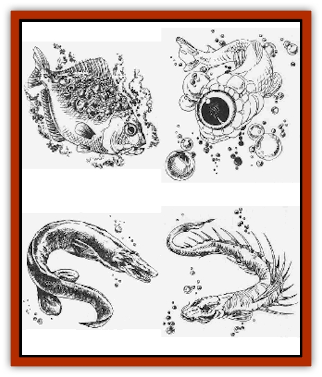
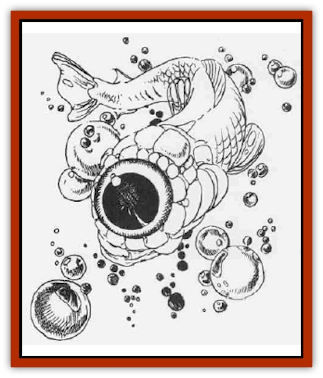
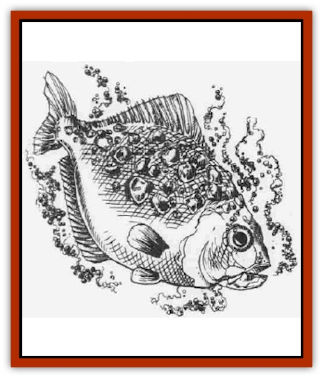
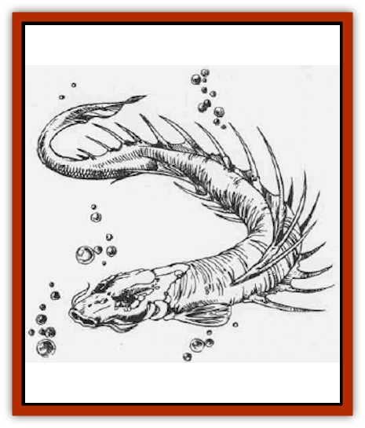
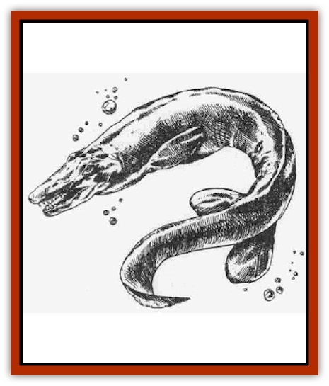

# Fish - Toril

| Statistic | **Floating Eye** | **Hetfish** | **Masher** | **Verme** |
| --- | --- | --- | --- | --- |
| **Activity Cycle:** | Any | Any | Night | Any |
| **Alignment:** | Neutral | Neutral | Neutral | Neutral |
| **Armor Class:** | 9 | 5 | 7 | 3 (head)/8 (body) |
| **Climate/Terrain:** | Any ocean | Any water | Tropical coral reef | Any/Large rivers |
| **Damage/Attack:** | Nil | 1 | 5d4 | 7-28 |
| **Diet:** | Carnivore | Omnivore | Carnivore | Carnivore |
| **Frequency:** | Rare | Uncommon | Uncommon | Very rare |
| **Hit Dice:** | 1-4 hp | 1-3 | 8 | 18+18 |
| **Intelligence:** | Non- (0) | Low (5) | Non- (0) | Animal (1) |
| **Magic Resistance:** | Nil | Nil | Nil | Nil |
| **Morale:** | Unsteady (5) | Unsteady (7) | Average (10) | Champion (15) |
| **Movement:** | Sw 30 | Sw 12 | Sw 9 | 3, Sw 18 |
| **No. Appearing:** | 1-12 | 20-70 | 24 | 1 |
| **No. of Attacks:** | Special only | 1 | 1 | 1 |
| **Organization:** | School | Den | School | Solitary |
| **Size:** | S (1' long) | S (1-3' long) | H (12-15' long) | G (50-80' long) |
| **Special Attacks:** | Hypnotism | Heat | Nil | Swallow whole |
| **Special Defenses:** | Nil | Nil | Poison spines | See below |
| **THAC0:** | 20 | 1-2 HD: 19 / 3 HD: 17 | 13 | 5 |
| **Treasure:** | Nil | Nil (Q&times;3) | Nil | See below |
| **XP Value:** | 35 | Varies | 1,400 | 14,000 |

## 

Floating Eye

Floating eyes are one of the undersea wonders, a salt-water fish of very unusual nature. The floating eye has a transparent body, practically invisible in the water, with a single large eye of about three inches in diameter (about the only thing that is readily visible of the fish). The eye is mostly milky white, with a large black pupil. If the pupil is gazed upon, tiny bolts of light appear to streak out from the center every few seconds.

**Combat:** The floating eye is a poor combatant, but it has a significant effect on its surroundings. Any creature that is within 30 feet and stares into the eye must make a successful saving throw vs. paralyzation or hang immobile in the water, hypnotized. This is a useful defense for the floating eye. Another good defense is the floating eye's speed, as it is one of the fastest underwater creatures.

Predatory marine animals, such as [[Piranha|piranhas]], [[Shark|sharks]], or [[Ray|manta rays]], have learned to keep close to floating eyes, while avoiding their hypnotic effects. These fish then attack any large prey that is immobilized by the school of floating eyes. The eyes feed upon the scraps that remain.

**Habitat/Society:** Floating eyes silently patrol their oceans, looking for small creatures they can hypnotize and eat. They are mild and non-aggressive, keeping in schools of a dozen or fewer. They abandon their young at birth and if lacking food they will eat the small floating eyes.

**Ecology:** The floating eye does not have a significantly damaging attack. If it was alone with man-sized prey, it might be able to cause 1 point of damage every ten rounds or so. On the whole, it prefers brine and plankton. However, the symbiotic relationship mentioned above works well, and virtually every pack of floating eyes has a following of predator fish.

Some adventurers have tried to imitate the predators' trick by capturing and carrying floating eyes. But the floating eye loses its magical powers immediately upon death, and there are difficulties with carrying fishbowls lnto perilous situations.

Alchemists have for many years sought floating eyes. Most are certain that the eye is useful as an ingredient in some potion or scroll mk, but as yet no specific use has been found.

## 

Hetfish

The hetfish, or hotfish as some sailors know it, is another wonder of the undersea world. It is a small (one to three feet long) silver-and-orange fish, whose skin is covered by unseemly bumps and boils. It is found in both fresh and salt water, from arctic climes to boiling hot springs. Its basic body shape resembles that of a [[Piranha|piranha]], although it has neither the piranha's teeth nor its distinctive underbite.

**Combat:** Hetfish have super-heated bodies whose temperatures exceed 350 degrees Fahrenheit. This effectively turns the water within several inches of them to steam.

When their den is disturbed, these fish swarm en masse to meet the intruder. Each hetfish has as many Hit Dice as feet in length (one to three), and the entire den bumps or rams the intruders, doing 1 point of damage per fish. Hetfish have been known to continue these attacks indefinitely, long after the target has been boiled to bone.

Even if a victim cannot be touched directly, he can be injured by merely remaining in the vicinity of hetfish for too long. Every round a creature swims within 20 feet of a den of hetfish, it suffers 2 points of damage from the hot water.

Hetfish are possessed of a simple intelligence; they are attracted to bright, shiny things, particularly gemstones. A hetfish coral den, when broken open, contains one gemstone for each fish, with a base value of 10 gp. Some hetfish communities have learned that ships often carry such pretty things, and they try to ram ships and sink them for treasure. Wooden ships sustain 1 point of hull damage per 15 Hit Dice of hetfish attacking, per round.

**Habitat/Society:** Hetfish live in large communal dens. They are about as intelligent as bright [[Dog|dogs]], or particularly dull [[Gnoll|gnolls]]. They have nothing resembling a language. They seem content to swim about and patrol a territory that is 50 feet in radius per hetfish in the den. Any creature entering this area is considered fair prey by the fish, regardless of its size or ferocity There are very few creatures that can endure 30-40 points of damage each round, and thus there are very few creatures that live in the hetfish's territory.

**Ecology:** It seems that the hetfish requires a steam environment for respiration, as it is unable to breathe water. How it continues to buoy itself up in the water is just one of the hetfish's mysteries. However, because of its heat-producing powers, the hetfish's greatest threats are civilized races. Underwater races, such as the [[Triton|tritons]], hunt hetfish ruthlessly, as the super-heated fish are an environmental hazard in any but the hottest natural springs. Surface dwellers hunt hetfish as well, not merely for the gemstones the fish collect or to guard against hetfish sinking more boats. Alive, the animals are worth 10d10 gp apiece to alchemists and sages, for no one has yet learned the secret of the hetfish's strange properties, which resemble those of the [[Remorhaz|remorharz]].

## 

Masher

The masher, or coral masher, still another wonder of the undersea world, is a large, worm-like fish that moves slowly along coral reefs, crushing and digesting the coral. A masher is longer than most humanoid races are tall, and it is colored a rusty red with two bright blue dorsal ridges.

The coral masher is not an aggressive creature, but it is easily surprised. If it feels threatened, it attacks in self-defense.

Each of its dorsal ridges carries two to four spines, each four feet long or longer, and each able to secrete a virulent poison. When threatened, the masher flares these ridges, keeping enemies at bay. Any attacker must either use a weapon with a thrusting tip at least six feet from the hand, or be struck with a spine (requiring a successful saving throw vs. poison to prevent death after one turn; a successful saving throw indicates no damage)

Some adventurers have spread rumors that the coral masher can be successfully attacked by positioning oneself directly in front of or beneath the creature. This is poor advice; the masher can maneuver much faster than humanoid attackers, and it can twist or roll to injure its attackers.

The coral masher's poison is very complex; no known antidote exists, save such spells as *neutralize poison*. For this reason, the coral masher is harassed now and again for its venom.

## 

Verme

The verme is the largest of fish, yet another wonder of the undersea world. It resembles a [[Fish_Giant|giant catfish]], except that it has large, thick, slime-covered scales and hundreds of long, needle-like teeth. It is yellow along its belly, with its flanks dark brown shading to a mottled green-and-brown back.

Although the verme is gigantically long, it is flattish along its belly, and wider than it is high. This enables it to lurk on the bottom and swim in reasonably shallow rivers.

The verme is a voracious carnivore, eating two tons of meat each day to sustain itself. Should a character attempt *speak with animals* spell on a verme, the fish will express no surprise that it is being spoken to. Indeed, it will only grow irritated that someone is keeping it from eating its fill.

**Combat:** A verme's head is covered with a thick bone plate, giving it an AC of 3. The body is AC 8.

A verme swallows any opponent under 12 feet tall should it score a hit. It tries to swallow those characters who are attacking its head before maneuvering to reach those beating on its sides. The victim suffers 3d8+4 points of damage upon being swallowed, and an additional 2d8 points each round thereafter. No matter how many points of damage a creature inside a verme has suffered, it dies in six rounds and dissolve. On the bright side, a verme is AC 10 when attacked from the inside.

The monster fish is able to upset almost any boat and ships of up to small galley size when hungry and seeking food.

Its thick, slime-covered scales make edged weapons almost useless. Such attacks inflict only 1 point of damage each blow. Fire-based attacks inflict half damage to the verme, unless an attack strikes the inside of the mouth or somewhere internally. In the latter case, the damage is enhanced, gaining a +1 bonus per die of damage.

**Habitat/Society:** Verme usually inhabit great rivers, but sometimes venture into saltwater. Regardless of the locale, it prefers warm water with an abundance of food, such as fish, reptiles, cattle, humans, or virtually anything else.

Because verme can swallow prey whole, even animals the size of water buffaloes, their stomachs can contain metallic or other indigestible material.

**Ecology:** A verme spells ecological disaster for whatever area it settles in. It can scour rivers clean of fish, or rid swamps of all water-borne life. Verme have destroyed the economies of entire city-states, just by roaming the waters upriver. A verme appearing in a city�s waterways is a frightening prospect.

Adventuring parties occasionally hunt verme for their dorsal scales, which can be powdered and used as one ingredient in the ink for a *shield* spell. The scales from one verme can supply enough material for several dozen spells.

---
## Discovery & Documentation

**Source Publication:** Monstrous Compendium, 1995 Annual, Volume 2 (1995)
**Campaign Setting:** Advanced Dungeons & Dragons 2nd Edition
**Author(s):** Jon Pickens

### Other Creatures Found in This Source Book
   * [[Aboleth_Savant|Aboleth, Savant]]
   * [[Addazahr|Addazahr]]
   * [[Amiq_Rasol|Amiq Rasol]]
   * [[Arch-Shadow|Arch-Shadow]]
   * [[Automaton_Scaladar|Automaton, Scaladar]]
   * [[Automaton_Trobriand's|Automaton, Trobriand's]]
   * [[Bat_Sporebat|Bat, Sporebat]]
   * [[Beetle_Dragon|Beetle, Dragon]]
   * [[Bi-nou|Bi-nou]]
   * [[Boggle|Boggle]]
   * [[Brownie_Dobie|Brownie, Dobie]]
   * [[Brownie_Quickling|Brownie, Quickling]]
   * [[Cat_Crypt|Cat, Crypt]]
   * [[Cat_Great_Cath_Shee|Cat, Great, Cath Shee]]
   * [[Centaur-kin_Dorvesh|Centaur-kin, Dorvesh]]
   * [[Centaur-kin_Gnoat|Centaur-kin, Gnoat]]
   * [[Centaur-kin_Ha'pony|Centaur-kin, Ha'pony]]
   * [[Centaur-kin_Zebranaur|Centaur-kin, Zebranaur]]
   * [[Chronolily|Chronolily]]
   * [[Curst|Curst]]
   * [[Darktentacles|Darktentacles]]
   * [[Dinosaur_Aquatic|Dinosaur, Aquatic]]
   * [[Dinosaur_II|Dinosaur II]]
   * [[Dinosaur_III|Dinosaur III]]
   * [[Doppelganger_Greater|Doppelganger, Greater]]
   * [[Dragon_Brine|Dragon, Brine]]
   * [[Dragon_Half-|Dragon, Half-]]
   * [[Dragon-kin_Sea_Wyrm|Dragon-kin, Sea Wyrm]]
   * [[Dwarf_Wild|Dwarf, Wild]]
   * [[Ekimmu|Ekimmu]]
   * [[Elemental_Nature|Elemental, Nature]]
   * [[Elf_Winged|Elf, Winged]]
   * [[Fish_Great_Glacier|Fish (Great Glacier)]]
   * [[Fish_Subterranean|Fish, Subterranean]]
   * [[Flareater|Flareater]]
   * [[Flumph|Flumph]]
   * [[Froghemoth|Froghemoth]]
   * [[Ghost_Casurua|Ghost, Casurua]]
   * [[Ghost_Ker|Ghost, Ker]]
   * [[Ghul|Ghul]]
   * [[Ghul-Kin|Ghul-Kin]]
   * [[Giant_Half-giant|Giant, Half-giant]]
   * [[Golem_Burning_Man|Golem, Burning Man]]
   * [[Golem_Phantom_Flyer|Golem, Phantom Flyer]]
   * [[Gulguthhydra|Gulguthhydra]]
   * [[Hakeashar|Hakeashar]]
   * [[Horse_Moon-|Horse, Moon-]]
   * [[Human_Dragonslayer|Human, Dragonslayer]]
   * [[Human_Vistana|Human, Vistana]]
   * [[Jellyfish_Giant|Jellyfish, Giant]]
   * [[Kalin|Kalin]]
   * [[Kholiathra|Kholiathra]]
   * [[Laerti|Laerti]]
   * [[Leucrotta_Greater|Leucrotta, Greater]]
   * [[Lich_Suel|Lich, Suel]]
   * [[Lurker_Shadow|Lurker, Shadow]]
   * [[Lycanthrope_Werepanther|Lycanthrope, Werepanther]]
   * [[Lycanthrope_Wereshark|Lycanthrope, Wereshark]]
   * [[Mammal_Herd_II|Mammal, Herd II]]
   * [[Marl|Marl]]
   * [[Meenlock|Meenlock]]
   * [[Mimic_Greater|Mimic, Greater]]
   * [[Mold_II|Mold II]]
   * [[Mummy_Creature|Mummy, Creature]]
   * [[Nyth|Nyth]]
   * [[Ooze_Slime_Jelly_Ghaunadan|Ooze/Slime/Jelly, Ghaunadan]]
   * [[Palimpsest|Palimpsest]]
   * [[Peltast|Peltast]]
   * [[Plant_Dangerous_II|Plant, Dangerous II]]
   * [[Pleistocene_Animal|Pleistocene Animal]]
   * [[Pudding_Subterranean|Pudding, Subterranean]]
   * [[Raggamoffyn|Raggamoffyn]]
   * [[Snake_Serpent|Snake, Serpent]]
   * [[Snake_Serpent_Vine|Snake, Serpent Vine]]
   * [[Sphinx_Draco-|Sphinx, Draco-]]
   * [[Sprite_Seelie_Faerie|Sprite, Seelie Faerie]]
   * [[Sprite_Unseelie_Faerie|Sprite, Unseelie Faerie]]
   * [[Squealer|Squealer]]
   * [[Turtle_Giant|Turtle, Giant]]
   * [[Umpleby|Umpleby]]
   * [[Vizier's_Turban|Vizier's Turban]]
   * [[Wall_Walker|Wall Walker]]
   * [[Webbird|Webbird]]
   * [[Yak-Man|Yak-Man]]
   * [[Zorbo|Zorbo]]
